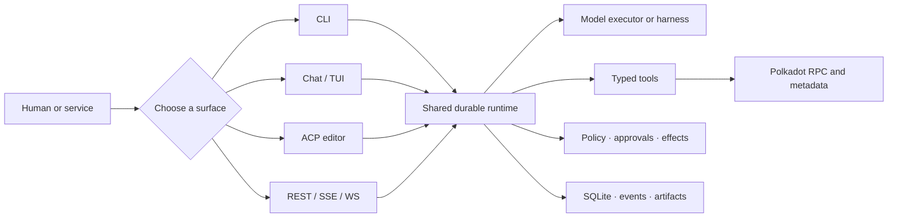
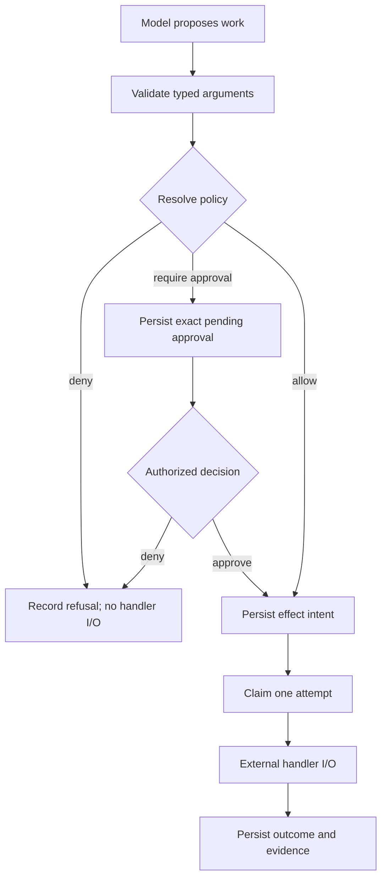
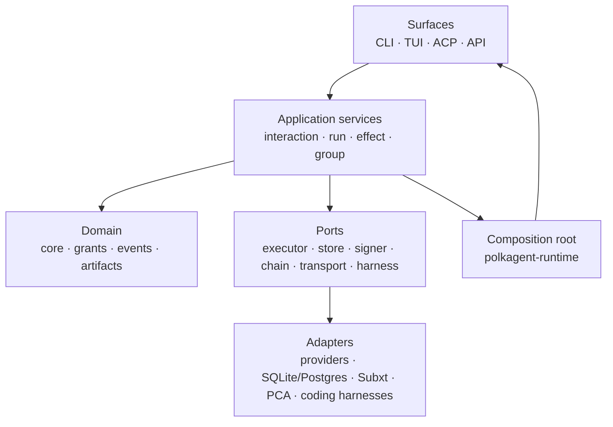

<div align="center">

# Polkagent

**Build durable AI agents. Understand Polkadot. Keep consequential actions accountable.**

[](https://github.com/nicovince/polkagent/actions/workflows/ci.yml)
[](LICENSE)
[](https://www.rust-lang.org/)
[](openapi.yaml)

A Rust-first agent platform with persistent conversations, typed tools,
policy-gated effects, human approvals, replayable events, and Polkadot-native
chain concepts.

[Get started](docs/getting-started.md) · [Run a demo](docs/demo.md) ·
[Browse the docs](docs/README.md) · [See current maturity](prd/STATUS.md)

</div>

> [!IMPORTANT]
> Polkagent is under active development. Local one-shot runs, durable chat, the
> monitoring TUI, ACP stdio, a durable HTTP slice, and local package management
> are executable today. Real value-moving chain actions, shared remote approval
> identity, multi-tenant production deployment, and several broader subsystems
> are not yet proven end to end. Read [Current maturity](#current-maturity)
> before relying on a feature claim.

## What is Polkagent?

Most agent frameworks treat a blockchain as one more HTTP API. Polkagent makes
Polkadot concepts part of the domain model: chain profiles, runtime metadata,
governance tracks, encoded calls, finality observations, signer boundaries, and
cross-chain routes.

At the same time, it treats model output as a proposal—not authorization.
External work passes through typed tool schemas, policy evaluation, durable
effect records, and, when required, an exact human approval.



## Why it is different

### Polkadot is a first-class domain

Polkagent includes typed components for Substrate RPC, metadata, call
encoding/decoding, identity, governance, treasury, staking, XCM-oriented data,
signing, and finality. This makes chain semantics visible at the same layer as
agent execution instead of hiding them inside arbitrary prompts.

### Evidence matters more than a confident answer

A consequential workflow should preserve what was requested, what policy
decided, which exact effect was approved, what bytes or arguments reached a
handler, which attempt ran, and what outcome was observed. Polkagent's run,
effect, event, artifact, and audit-oriented types are designed around that
evidence trail.

### Human control is explicit

Policies resolve typed inputs to **allow**, **deny**, or **require approval**.
Approval decisions use exact durable identities. The model does not grant
itself access, and the default runtime does not invent a human principal.

### Recovery is part of the model

Polkagent persists an effect intent before external I/O. If the process stops
at an uncertain boundary, recovery preserves “unknown” instead of silently
claiming success or repeating irreversible work.

## Five-minute local tour

You can validate the complete local CLI path without an API key. In that mode,
Polkagent uses a deterministic simulated model response.

### 1. Install

```bash
git clone https://github.com/nicovince/polkagent.git
cd polkagent
cargo install --path crates/polkagent-cli
polkagent version
```

The minimum supported Rust version is 1.89.

### 2. Create an isolated demo project

```bash
demo_dir="$(mktemp -d /tmp/polkagent-demo.XXXXXX)"
cd "$demo_dir"
polkagent init .
export POLKAGENT_DATABASE_SQLITE_PATH="$demo_dir/polkagent.db"
```

The explicit database path keeps the demo separate from the normal user data
directory.

### 3. Create and run an agent

```bash
polkagent agent create researcher \
  --model anthropic/claude-sonnet-4-6 \
  --description "Governance research assistant"

polkagent run \
  --agent-id researcher \
  --prompt "Reply with a one-line hello" \
  --no-harness \
  --timeout 15 \
  --json \
  --wait
```

You should see a durable run ID and the notice that simulated responses are in
use. Continue with the [full offline demo](docs/demo.md#demo-1-offline-cli-tour)
or connect a real provider:

```bash
export ANTHROPIC_API_KEY="<YOUR_KEY>"

polkagent run \
  --agent-id researcher \
  --no-harness \
  --prompt "Explain Polkadot OpenGov tracks in three bullets" \
  --timeout 60
```

Never store API keys, seed phrases, or signing material in config files or
prompts.

## Pick the right surface

| Surface | Start command | Best for |
|---|---|---|
| One-shot CLI | `polkagent run -a researcher -p "…"` | Shell workflows and bounded requests |
| Durable chat | `polkagent chat --agent researcher` | Multi-turn terminal conversations that survive restart |
| Monitoring TUI | `polkagent tui --tab console` | Operators who want dashboards and an interactive Console |
| ACP server | `polkagent acp --agent researcher` | Zed and other ACP editor clients |
| HTTP service | `polkagent serve --host 127.0.0.1 --port 9090` | Service-to-service integration, replay, and streaming |

All five surfaces share core runtime concepts, but they do not expose every
control equally. Unsupported operations fail explicitly. Learn the vocabulary
in [Core concepts](docs/concepts.md).

## What you can explore

### Durable conversations

Terminal chat, TUI Console, HTTP interactions, and ACP map prompts to durable
turns and runs. Supported agent/model selections and transcripts survive a
process restart.

```bash
polkagent chat --agent researcher --title "OpenGov review"

# Later:
polkagent chat --agent researcher --resume <CONVERSATION_ID>
```

Shared slash commands include truthful help/status, agent selection, model
selection, run listing/inspection, new/resume guidance, and cancellation where
the surface supports them. See [Durable chat](docs/chat.md).

### ROSEDUST terminal UI

The TUI combines nine tabs with a durable multi-activity Console:

| Key | View | Purpose |
|---|---|---|
| F1 | Dashboard | Agent, run, and system overview |
| F2 | Agents | Agent list and detail |
| F3 | Runs | State, timing, usage, and run detail |
| F4 | System | Health, configuration, chain, and balances |
| F5 | Timeline | Ordered events for a selected run |
| F6 | Approvals | Exact pending approvals for the selected Console conversation |
| F7 | Memory | Search and inspect memory |
| F8 | Audit | Filtered audit view |
| F9 | Console | Durable prompts, transcripts, commands, and cancellation |

Run the synthetic visual demo:

```bash
./scripts/demo.sh
```

The script writes only to `~/.polkagent-demo/` and labels the data as demo
content. Read [the TUI demo](docs/demo.md#demo-3-explore-the-tui-with-sample-data)
before using its reset option.

### Polkadot-aware tools and types

The workspace contains governance, treasury, chain, metadata, identity,
signing, action-card, and XCM-oriented components. The normal composed tool loop
supports a bounded allowlisted path, while grant-bearing and write-oriented
paths have stricter surface and evidence requirements.

Example research prompt:

```bash
polkagent run --agent-id researcher --no-harness \
  --prompt "Summarize referendum 1234. Separate observed chain facts, model interpretation, and anything that needs independent verification."
```

Read [Tools and skills](docs/tools-and-skills.md) for the actual registered-tool
boundary and [Chain integration](docs/chain.md) for network/metadata details.

### REST, SSE, and WebSockets

The OpenAPI 3.1 API covers agents, runs, effects, artifacts, events, providers,
models, tools, skills, memory, payments, interactions, and diagnostics.

```bash
polkagent serve --host 127.0.0.1 --port 9090

curl --fail http://127.0.0.1:9090/health/ready
curl --fail http://127.0.0.1:9090/openapi.json
```

Durable interactions accept caller correlation for idempotent prompt retries
and expose checkpointed SSE. The run event and command WebSockets have separate
durable cursor contracts. Follow the [HTTP demo](docs/demo.md#demo-4-call-polkagent-over-http)
and use [`openapi.yaml`](openapi.yaml) as the request/response schema source.

### Model providers and harnesses

Executor adapters exist for Anthropic, OpenAI-compatible services, Gemini,
OpenRouter, Perplexity, Cerebras, local/Ollama-style use, and fake testing.
Downstream coding harness adapters cover Claude Code, Codex, ACP-oriented
clients, Copilot, Goose, Kiro, OpenCode, Cursor, and a bridge transport.

Adapter presence does not guarantee equal production composition or external
conformance. See [Providers](docs/providers.md) and [Harnesses](docs/harnesses.md).

### Memory, evals, and extensions

- **Memory:** episodic, semantic, and procedural entries; SQLite FTS5; optional
  vector/hybrid retrieval; admission and retention controls.
- **Evals:** JSON suites, assertions, optional model judging, saved reports,
  and baseline comparison.
- **Skills:** TOML manifests combining prompts, tool requirements, grants, and
  config.
- **Packages:** durable local install, history, update, rollback, and uninstall
  for plugins and product kits.

Installed packages are not yet automatically activated in runs. The package
trust/sandbox/federation story is incomplete.

## Safety model



Four invariants shape the implementation:

1. **Signer isolation:** a model never handles private keys or chooses the final
   bytes accepted by a signer.
2. **Intent before I/O:** the runtime persists the proposed external effect
   before attempting it.
3. **No silent duplicates:** recovery does not quietly repeat irreversible
   work.
4. **Unknown stays unknown:** indeterminate external outcomes remain visible
   until independently resolved.

See [Safety](docs/safety.md) and [Run lifecycle](docs/run-lifecycle.md) for the
precise state machines and current implementation boundary.

## Current maturity

This summary describes the current `main` branch. “Crate exists” is not used as
a synonym for “product is production-ready.”

| Area | State | Important boundary |
|---|---|---|
| CLI run, durable chat, monitoring TUI | **Explorable** | Real providers or deterministic simulation; broader external-tool proof remains |
| ACP stdio server | **Explorable** | Official SDK tests exist; full manual Zed behavior remains incomplete |
| REST/SSE/WebSocket API | **Partial** | Durable core is composed; optional and authority-bound routes may return `501` |
| Policy and local approvals | **Partial** | Explicit local chat/TUI/ACP authority exists; shared remote identity does not |
| Polkadot reads | **Partial** | Components are substantial; live external validation is incomplete |
| Polkadot writes/signing/finality | **Building blocks** | No end-to-end real value-moving proof |
| Memory API | **Partial** | Durable typed API operations exist; general prompt-context assembly remains incomplete |
| Groups, feeds, payments, cloud | **Building blocks** | Libraries/tests exist; complete product callers do not |
| Local packages | **Explorable lifecycle** | No automatic runtime activation or complete cryptographic trust pipeline |
| Docker + SQLite | **Partial** | Single-instance boot/restart/cold restore covered; no HA or production Postgres proof |

The detailed matrix, exact tests, gaps, and evidence rules are in
[`prd/STATUS.md`](prd/STATUS.md). Active worktrees may contain newer experiments;
unless merged into `main`, they are not part of this table or the quick start.

## Architecture at a glance

Polkagent uses ports and adapters. Domain/application crates depend on narrow
traits; executor, store, signer, chain, transport, and harness adapters
implement those traits; surfaces compose them through the shared runtime.



Read [Architecture](docs/architecture.md) for crate families and dependency
rules, then [Runtime/API composition](docs/runtime-api-composition.md) for what
the production builder actually wires.

## Common use cases

| Goal | Recommended starting point |
|---|---|
| Research governance or treasury state | [Governance research use case](docs/use-cases.md#governance-research-assistant) |
| Run a durable terminal assistant | [Durable assistant use case](docs/use-cases.md#durable-team-or-personal-assistant) |
| Embed an agent in Zed | [ACP and Zed guide](docs/acp-zed.md) |
| Integrate a control-plane API | [Agent API use case](docs/use-cases.md#agent-control-plane-api) |
| Test prompt/tool/policy regressions | [Eval demo](docs/demo.md#demo-5-run-and-compare-eval-suites) |
| Build a local extension | [Package demo](docs/demo.md#demo-6-inspect-local-package-history) |

The [full use-case guide](docs/use-cases.md) also lists poor fits today,
including autonomous value movement and multi-tenant HA deployment.

## Development

Fast checks:

```bash
cargo check --workspace
cargo test --workspace --no-fail-fast
cargo clippy --workspace --all-targets --all-features -- -D warnings
RUSTDOCFLAGS='-D warnings' cargo doc --workspace --all-features --no-deps
```

Run the single-instance container smoke flow:

```bash
./scripts/container-smoke.sh
```

See [Contributing](CONTRIBUTING.md) for repository conventions and the
[implementation status](prd/STATUS.md) for the recorded verification baseline.

## Documentation

The [documentation home](docs/README.md) is organized by reader goal. Good
first pages are:

- [Getting started](docs/getting-started.md)
- [Demos](docs/demo.md)
- [Core concepts](docs/concepts.md)
- [Use cases](docs/use-cases.md)
- [Examples and cookbook](docs/examples.md)
- [Troubleshooting](docs/troubleshooting.md)
- [CLI reference](docs/cli.md)
- [API reference](docs/api.md)
- [Configuration reference](docs/configuration.md)

## Contributing, security, and license

Contributions are welcome; start with [CONTRIBUTING.md](CONTRIBUTING.md).

Report vulnerabilities privately by following [SECURITY.md](SECURITY.md).
Never include keys, seed phrases, production endpoints, or sensitive run data
in a public issue.

Licensed under the [Apache License 2.0](LICENSE).
