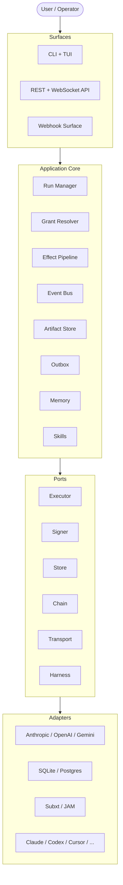
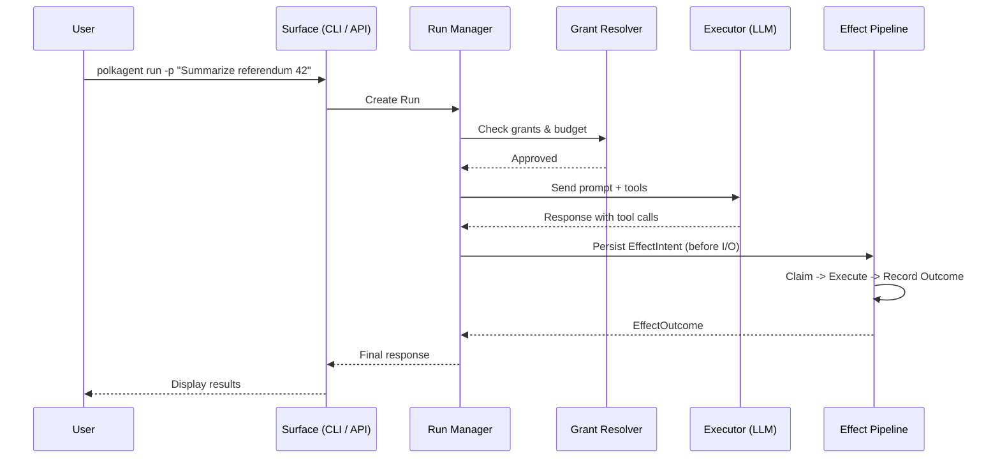

<div align="center">

# Polkagent

**Build AI agents. Act on Polkadot. Reach across chains.**

[](https://github.com/nicovince/polkagent/actions/workflows/ci.yml)
[](LICENSE)
[](https://www.rust-lang.org)
[](Cargo.toml)
[](#testing)
[](#testing)

A Rust-first, Polkadot-native platform for building, running, and operating AI agents that understand on-chain governance, treasury, and staking &mdash; with evidence-bearing safety, configurable autonomy, and crash-safe execution.

> **Implementation readiness:** Polkagent has broad component coverage and
> bounded executable slices for one-shot/TUI/ACP runs, local packages, PCA TCP,
> and single-instance containers. Shared durable runtime composition, real
> tool/effect/policy execution, API recovery, and complete Zed support remain
> active work. See [the evidence-backed status](prd/STATUS.md) before relying on
> a production-readiness claim.

[Quick Start](#quick-start) &bull; [Features](#features) &bull; [Documentation](#documentation) &bull; [Architecture](#architecture) &bull; [Contributing](#contributing)

</div>

---

## Why Polkagent?

Most AI agent frameworks treat blockchains as just another API. Polkagent is different: **Polkadot is a first-class citizen.** Chain profiles, runtime metadata, XCM routes, governance tracks, and finality semantics are native domain types &mdash; not afterthoughts.

**Evidence over assertions.** Every on-chain action carries decoded calldata, policy evaluation results, simulation output, signing records, finality observation, and receipts. Your agents don't just say they did something &mdash; they prove it.

**Configurable autonomy.** Go from read-only shadow mode to fully autonomous policy-bounded execution, with four graduated autonomy levels and grant-based access control at every boundary.

**Crash-safe by design.** The effect pipeline persists intent before I/O, uses lease-based claiming to prevent duplicates, and classifies indeterminate outcomes for safe recovery. Interrupted runs resume exactly where they left off.

---

## Quick Start

```bash
# Install from source
cargo install --path crates/polkagent-cli

# Initialize a project directory
polkagent init

# Set a provider API key (auto-detected)
export ANTHROPIC_API_KEY="sk-ant-..."

# Create your first agent
polkagent agent create my-agent \
  --model anthropic/claude-sonnet-4-6 \
  -d "Governance researcher"

# Run a query
polkagent run -a my-agent -p "Summarize referendum 1234 and list the top 10 voters"

# Or start a durable line-oriented terminal session
polkagent chat --agent my-agent

# Or launch the interactive TUI directly in its Console
polkagent tui --tab console
# Press p to compose for an active agent; Enter starts; x cancels.

# Or expose Polkagent to an ACP editor such as Zed
polkagent acp --agent my-agent
```

See [durable terminal chat](docs/chat.md) for resume, slash-command, stream,
model-selection, cancellation, and explicit local approval-authority setup.
Executor-backed follow-ups include the newest 32 completed user/assistant pairs
from the latest 1,000 prior turn records; contextual harness history remains
unsupported.

### Docker

```bash
# Default single-instance SQLite deployment
docker compose up --detach --build --wait
curl --fail http://127.0.0.1:8080/health/ready

# Development (with hot-reload and cargo caching)
docker compose -f docker-compose.dev.yml up

# Reproduce the CI boot/health smoke test
./scripts/container-smoke.sh
```

### Multi-Provider Setup

Polkagent auto-detects providers from environment variables &mdash; no configuration files needed:

```bash
export ANTHROPIC_API_KEY="sk-ant-..."   # -> claude-sonnet-4-6
export OPENAI_API_KEY="sk-..."          # -> gpt-4o
export GEMINI_API_KEY="AI..."           # -> gemini-2.5-flash
export OPENROUTER_API_KEY="sk-or-..."   # -> claude-sonnet-4-6 via OpenRouter
export PERPLEXITY_API_KEY="pplx-..."    # -> sonar
export CEREBRAS_API_KEY="csk-..."       # -> llama-4-scout

# Agents can use different providers
polkagent agent create fast --model openai/gpt-4o -d "Quick lookups"
polkagent agent create deep --model anthropic/claude-opus-4-6 -d "Deep analysis"

# Override at runtime
polkagent run -a fast -p "Treasury balance?" --model gemini/gemini-2.5-pro
```

---

## Features

### On-Chain Intelligence

Polkagent ships with 10 purpose-built governance and treasury tools that query live chain state:

| Category | Tool | What It Does |
|----------|------|-------------|
| **Governance** | `referendum_lookup` | Look up OpenGov referenda with tally and timeline |
| | `track_info` | List governance tracks, decision periods, approval curves |
| | `voter_history` | Query voting history with conviction and balance info |
| | `delegation_info` | Inspect incoming/outgoing delegations |
| | `treasury_overview` | Treasury balance, pending proposals, spend periods |
| **Treasury** | `balance_query` | Account balance breakdown (free, reserved, frozen) |
| | `staking_info` | Staking status, active stake, unbonding, nominations |
| | `portfolio_summary` | Aggregated view of all asset positions |
| | `transfer_history` | Recent transfers with block numbers and timestamps |
| | `vesting_schedule` | Vesting schedules with lock/unlock info |
| **Workbench** | `migration_rehearsal` | Simulate storage migrations with structured diff |
| | `metadata_comparison` | Compare runtime metadata versions for breaking changes |

### Multi-Provider AI

Connect to any major LLM provider through a unified interface with automatic fallback:

| Provider | Models | Environment Variable |
|----------|--------|---------------------|
| **Anthropic** | Claude Opus 4.6, Sonnet 4.6, Haiku 4.5 | `ANTHROPIC_API_KEY` |
| **OpenAI** | GPT-5.5, GPT-5.4 Mini, o3, o4-mini, GPT-4o, Codex Mini | `OPENAI_API_KEY` |
| **Google Gemini** | Gemini 2.5 Pro, Gemini 2.5 Flash | `GEMINI_API_KEY` |
| **OpenRouter** | 100+ models via routing | `OPENROUTER_API_KEY` |
| **Perplexity** | Sonar models | `PERPLEXITY_API_KEY` |
| **Cerebras** | Llama 4 Scout | `CEREBRAS_API_KEY` |
| **Ollama** | Any local model | No key needed |
| **AWS Bedrock** | Bedrock-hosted models (planned) | AWS credentials |
| **Azure** | Azure-hosted OpenAI models (planned) | Azure credentials |

Automatic fallback chains: if one provider fails, the next one picks up transparently.

### Safety & Crash Recovery

Four invariants enforced at every boundary:

| Invariant | Guarantee |
|-----------|-----------|
| **Signer Isolation** | Keys never enter model context; only isolated signers receive canonical payloads |
| **Intent-Before-I/O** | Every effect intent is persisted to durable storage *before* any external I/O |
| **No Silent Duplicates** | BLAKE3 idempotency keys prevent duplicate execution across crashes |
| **Unknown Stays Unknown** | Indeterminate outcomes are preserved as-is, never silently promoted to success |

**Four autonomy levels** give you graduated control:

```
Fully Supervised ──> Supervised (default) ──> Assisted Autonomous ──> Fully Autonomous
  every effect         reads: auto              routine: auto           all: auto
  needs approval       writes: approval         high-risk: approval     (grants + budget)
```

Grant policies use deny-by-default, deny-overrides-allow ABAC with budget enforcement. The model cannot influence authorization decisions &mdash; only typed Rust values participate in policy evaluation.

### ROSEDUST Terminal UI

An interactive dashboard with 9 tabs for monitoring and a durable actionable
multi-turn Console:

| Key | Tab | Description |
|-----|-----|-------------|
| `F1` | **Dashboard** | Agent/run overview with system health (responsive 3-breakpoint layout) |
| `F2` | **Agents** | Agent list with detail panel |
| `F3` | **Runs** | Run list with state, duration, token usage, and detail panel |
| `F4` | **System** | Health checks, stats, config, chain status, balance display |
| `F5` | **Timeline** | Chronological events for a selected run |
| `F6` | **Approvals** | Selected-conversation durable approval queue with exact detail and approve/deny confirmation |
| `F7` | **Memory** | Full-text memory browser with search and delete |
| `F8` | **Audit** | System audit log with severity filtering |
| `F9` | **Console** | Select an active agent, keep durable session/transcript history, stream typed updates, and cancel the active turn |

Navigation: `j`/`k` scrolls, `Enter` drills down, `Esc` goes back, `/` searches memory, and `q` quits. In F9, `p` opens the composer, `s` opens the bounded same-agent durable session selector, `Enter` submits a durable prompt or supported command, and `x` cancels the exact active turn and linked run. Follow-up prompts share the selected durable session, and transcript/composer history reloads after restart. Executor-backed follow-ups use the newest 32 completed user/assistant pairs found in the latest 1,000 prior turn records; contextual harness history remains unsupported. `/help`, `/status`, `/agents`, `/agent <name-or-id>`, `/new [title]`, `/resume <conversation-id>`, `/runs`, `/inspect <run-id>`, and `/model [model-id]` execute through the shared command service and render structured results. Provider/harness/autonomy, approval slash commands, and group commands remain unavailable in the Console prompt path.

F6 uses the durable Console conversation selected in F9. It asynchronously
shows the first 100 pending approvals returned by `InteractionService`, with
exact approval/effect/run/tool identities and bounded, redacted service detail.
Press `a` or `d` twice to confirm an exact full conversation/approval identity;
the TUI never writes approval rows directly. Default `RuntimeFactory`
composition remains authority-unbound, so F6 truthfully shows unavailable
guidance. An explicit `polkagent tui` command may opt in with the all-or-none
`--approval-tenant`/`--approval-workspace`/`--approval-principal` tuple; bare
`polkagent` remains unbound. `x` and normal TUI shutdown route exact pending
turns through the coordinator-backed cancellation CAS, so a human decision or
cancellation has one durable winner and a cancellation winner performs no tool
I/O. See the [CLI guide](docs/cli.md#tui) for the local-process trust boundary.

### Coding Harness Integrations

Use downstream coding harnesses from Polkagent:

| Harness | Protocol | Status |
|---------|----------|--------|
| **Claude Code** | JSON Lines over stdio | Tier-1 |
| **Codex CLI** | JSON-RPC 2.0 with approval flows | Tier-1 |
| **Cursor** | ACP (JSON-RPC 2.0 over stdio) | Tier-1 |
| **Goose** | ACP | Tier-1 |
| **Kiro** | ACP | Tier-1 |
| **OpenCode** | ACP | Tier-1 |
| **GitHub Copilot** | One-shot CLI | Tier-2 |
| **Bridge** | HTTP/WebSocket (any remote agent) | Tier-1 |

All harnesses share 11 canonical tools (read, write, edit, glob, grep, bash, web_fetch, web_search, task, notebook_edit, apply_patch) mapped to each backend's native format.

### ACP Editor Integration

`polkagent acp` is the separate inbound ACP v1 stdio adapter for Zed and other
ACP clients. The executable protocol slice supports session creation, prompts,
cancellation, agent/model selection, and `/help`, `/status`, `/agents`,
`/agent`, `/model`, and `/cancel`.
The official SDK subprocess test proves handshake, command discovery, and one
real `AppService` run. Durable session load/resume and native structured
effect-backed tool updates are implemented. APR-07 provides native
allow-once/reject-once permissions under an explicit all-or-none
`--approval-tenant`/`--approval-workspace`/`--approval-principal` tuple; the
default remains authority-unbound and fail-closed. This is a single-principal
local stdio process trust boundary, not remote or multi-principal
authentication, and secrets must not be placed in Zed JSON. Manual Zed
interoperability (including permission/restart validation), MCP passthrough,
and rich editor UX remain open.
See [ACP and Zed setup](docs/acp-zed.md).

### Agent Memory

Three-tier memory system backed by SQLite with FTS5 full-text search:

- **Episodic** &mdash; Conversation transcripts and interaction history
- **Semantic** &mdash; Extracted facts, knowledge, and learned relationships
- **Procedural** &mdash; Discovered skills, workflows, and action patterns

Quality control through admission gates (novelty, relevance, confidence filtering) and a three-phase retention sweeper that prevents unbounded growth. Optional vector search via hybrid retrieval with Reciprocal Rank Fusion.

```bash
polkagent memory search "governance delegation patterns"
polkagent memory stats
polkagent memory export <AGENT_ID> backup.json
polkagent memory sweep --dry-run
```

### REST API & WebSocket Surface

The HTTP schema at `/api/v1alpha1` defines routes for agents, runs, effects,
artifacts, events, providers, skills, tools, payments, memory, audit,
conversations, and registry. The current `serve` composition uses the shared
runtime and durable SQLite-backed core stores rather than in-memory agent/run
substitutes. Nine optional skill-mutation, audit, and registry routes remain
explicit `501 Not Implemented` boundaries, and principal-bound approval routes
remain unavailable in the ordinary production factory.

```bash
# Start the API server
polkagent serve --port 9090

# Create an agent
curl -X POST http://localhost:9090/api/v1alpha1/agents \
  -H "Content-Type: application/json" \
  -d '{"name": "api-agent", "model": "anthropic/claude-sonnet-4-6"}'

# Start a run
curl -X POST http://localhost:9090/api/v1alpha1/runs \
  -H "Content-Type: application/json" \
  -d '{"agent_id": "api-agent", "prompt": "Summarize referendum 42"}'

# Stream events via WebSocket
websocat ws://localhost:9090/api/v1alpha1/events/stream?run_id=<RUN_ID>
```

The run-event socket replays and follows durable events from
`after_sequence=<global-sequence>`. The separate command socket at
`/ws/v1alpha1` supports a versioned `v1:<global-sequence>` reconnect cursor,
initial run/agent subscriptions, and a `ready` replay barrier; both paths have
bounded replay, reconnect, lag-recovery, filtering, deduplication, and
fail-closed recovery tests. Diagnostic and ephemeral frames remain best-effort,
and automatic client/SDK reconnect is separate open work.

Health checks (`/health/{live,ready,startup}`) and cursor-based pagination are
included. Production rate-limit policy/provenance remains an operational gap.

### Skills & Marketplace

Extend agents with reusable skills defined in TOML manifests:

```toml
[skill]
name = "governance-analyst"
version = "1.0.0"
description = "Deep governance analysis with delegation tracking"

[capabilities]
required_grants = ["chain.query"]
tools = ["referendum_lookup", "voter_history", "delegation_info"]

[prompts]
system = "You are a governance analyst specializing in OpenGov..."

[dependencies]
chain-basics = ">=0.2.0"
```

```bash
polkagent skill install ./skills/governance-analyst/
polkagent skill list
polkagent skill show governance-analyst
```

`polkagent package` provides a durable local lifecycle for plugin and product-kit
packages. Local install/list/get/update/rollback/uninstall works; runtime/API
activation, a real sandbox boundary, cryptographic verification, federation,
and commercial registry behavior remain open.

### Multi-Agent Groups

Coordinate multiple agents with group execution modes:

| Mode | Behavior |
|------|----------|
| **Sequential** | Agents run one after another, each seeing prior results |
| **Parallel** | All agents run simultaneously |
| **Pipeline** | Output of one agent feeds into the next |
| **Consensus** | Agents vote on outcomes using quorum policies |

Quorum policies: Unanimous, Majority, Threshold, Leader-Only. Three-level budget control (total, per-member, per-run) with atomic spend tracking.

### Evaluation Framework

Regression-test agent behavior with structured eval suites:

```bash
# Run the built-in safety suite
polkagent eval run safety

# Compare against a baseline
polkagent eval compare results-v1.json results-v2.json
```

25 built-in test cases across 3 categories (Safety, Tool Use, Chain Explanation). Includes model-as-judge evaluation with configurable criteria and regression detection with delta thresholds.

### Production Operations

| Capability | Crate | What It Does |
|------------|-------|-------------|
| **Circuit Breaker** | `polkagent-retry` | Three-state pattern (Closed/Open/Half-Open) for external calls |
| **Rate Limiting** | `polkagent-rate-limit` | Token bucket, sliding window, leaky bucket with keyed/composite modes |
| **Caching** | `polkagent-cache` | LRU with per-entry TTL, cache-aside pattern, BLAKE3 key hashing |
| **Scheduling** | `polkagent-scheduler` | Cron expressions, intervals, one-shot deferred tasks |
| **Batch Processing** | `polkagent-batch` | Configurable error policies with parallel dispatch |
| **Audit Logging** | `polkagent-audit` | Tamper-evident BLAKE3 integrity chain with rich queries |
| **Health Checks** | `polkagent-health` | Liveness, readiness, and dependency probes |
| **Fault Injection** | `polkagent-fault` | Controlled crashes, timeouts, corruption for testing |
| **Telemetry** | `polkagent-telemetry` | OpenTelemetry tracing, Prometheus metrics, JSONL event logging |

### Cloud and Operations Scaffolding

The following crates/components exist, but they are not yet composed into a
production cloud deployment:

- **Control Plane** &mdash; Priority-based job queue with capability-aware worker assignment and Cedar-style data residency policies
- **Worker Nodes** &mdash; Register, heartbeat, poll-and-execute, graceful drain lifecycle
- **PostgreSQL** &mdash; Multi-tenant store with row-level security, replacing SQLite for production
- **Billing** &mdash; Per-run cost tracking with provider pricing tables and CSV export
- **Docker** &mdash; Multi-stage builds (~130 MB images) with health checks

The verified deployment boundary is the single-instance SQLite image/Compose
lifecycle documented in [STATUS](prd/STATUS.md); durable API/run recovery,
Postgres conformance, tenant isolation, backup/restore, auth, release, and HA
remain unproven.

---

## Example Workflows

### Research a governance proposal

```bash
polkagent init
export ANTHROPIC_API_KEY="sk-ant-..."

polkagent agent create researcher \
  --model anthropic/claude-opus-4-6 \
  -d "Governance analyst"

# Research a referendum
polkagent run -a researcher \
  -p "Summarize referendum 1234: what does it propose, who voted, and what track is it on?"

# Follow up
polkagent run -a researcher \
  -p "Show the delegation network for the top 5 voters on referendum 1234"

# Explore interactively
polkagent tui
```

### Monitor treasury health

```bash
polkagent agent create treasurer \
  --model anthropic/claude-sonnet-4-6 \
  -d "Treasury monitor"

polkagent run -a treasurer \
  -p "Give me a full portfolio summary: balances, staking positions, vesting schedules, and recent transfers"
```

### Deploy as an API service

```bash
# Start the server
polkagent serve --port 9090

# Health check
curl http://localhost:9090/health/ready

# Create agent + run via API
AGENT=$(curl -s -X POST http://localhost:9090/api/v1alpha1/agents \
  -H "Content-Type: application/json" \
  -d '{"name": "api-agent", "model": "anthropic/claude-sonnet-4-6"}' \
  | jq -r '.id')

curl -X POST http://localhost:9090/api/v1alpha1/runs \
  -H "Content-Type: application/json" \
  -d "{\"agent_id\": \"$AGENT\", \"prompt\": \"What is the current treasury balance?\"}"
```

---

## CLI Reference

| Command | Description |
|---------|-------------|
| `init` | Initialize `.polkagent/` project directory |
| `run` | Execute a prompt against an agent |
| `agent` | Create, list, show, delete, start, stop, pause, resume agents |
| `skill` | Install, update, remove, list, show skills |
| `kit` | Manage skill bundles |
| `tui` | Launch the ROSEDUST interactive terminal |
| `acp` | Start the ACP v1 stdio agent server for editor integrations |
| `serve` | Start the REST + WebSocket API server |
| `package` | Install, inspect, update, roll back, and uninstall local packages |
| `inbox` | List, approve, deny pending effects |
| `inspect` | Inspect runs, effects, artifacts, agents, policies, database |
| `export` | Export runs, effects, artifacts, events, config (JSON/CSV/JSONL) |
| `memory` | Search, list, forget, stats, export, import, sweep |
| `eval` | Run evaluation suites, list, report, compare baselines |
| `chain` | Chain status, metadata, decode, balance queries |
| `explain` | Decode and preview a hex extrinsic |
| `auth` | Login, logout, whoami, status |
| `network` | Network endpoint status and metadata |
| `config` | Show or validate configuration |
| `doctor` | Run system health checks |
| `status` | Agent count, active runs, effect queue depth |
| `logs` | Tail the event log |
| `completions` | Shell completions (bash/zsh/fish/powershell/elvish) |
| `version` | Print version |

See [docs/cli.md](docs/cli.md) for the full reference with all flags and subcommands.

---

## Architecture

Polkagent is an 88-crate Cargo workspace following hexagonal (ports and adapters) architecture. Domain logic lives in pure crates with no I/O. External systems are accessed through trait-based ports with swappable adapters.



### Run Lifecycle



Today this direct loop is enabled only for exact `AgentSpec.tools` entries that
have a registered handler and no `required_grant`. The parent turn and
normalized tool step, intent, claim, attempt, and outcome are durable around
handler I/O; unknown, unallowlisted, malformed, and grant-bearing calls produce
typed errors rather than synthetic success. Grant-bearing approval/resume and
post-crash outcome consumption are still explicit follow-up work. See
[Tools and Skills](docs/tools-and-skills.md#current-registered-tool-execution-boundary).

### Effect Pipeline State Machine

```
Created ─> Pending ─> Claimed ─> Executing ─> Resolved
                          │                       │
                          └─── lease expired ──> Retrying
                                                  │
                                              Superseded
```

Lease-based claiming with configurable durations (30s reads, 60s standard, 120s signing). Expired leases are classified by retry policy: idempotent (safe), check-before-retry, or no-auto-retry.

---

## Configuration

Configuration loads from two locations with environment variable overrides:

```
~/.config/polkagent/polkagent.toml     # Global defaults
.polkagent/polkagent.toml              # Project-local (takes precedence)
POLKAGENT_*                            # Environment overrides (highest priority)
```

See [docs/configuration.md](docs/configuration.md) for the full schema.

---

## Testing

```bash
make test       # cargo test --workspace (7,400+ tests)
make lint       # cargo clippy --workspace
make fmt-check  # Format validation
```

- **7,400+ unit and integration tests** across 91 crates
- **205 security tests** covering injection resistance, replay safety, red team exploits, supply chain attacks
- **623 integration tests** for cross-crate E2E flows
- **10 fuzz targets** (API requests, config parsing, policy eval, skill manifests, and more)
- **Nightly CI** runs cargo-audit, cargo-deny, and all fuzz targets

---

## Documentation

### Getting Started
- [Getting Started](docs/getting-started.md) &mdash; Installation, first agent, initial configuration
- [Configuration](docs/configuration.md) &mdash; TOML schema, environment variables, precedence rules
- [CLI Reference](docs/cli.md) &mdash; Every command, flag, and subcommand
- [Architecture](docs/architecture.md) &mdash; Hexagonal design, crate map, dependency rules

### Platform
- [Run Lifecycle](docs/run-lifecycle.md) &mdash; Execution model, state machine, budget enforcement
- [Safety](docs/safety.md) &mdash; Four invariants, grant policies, crash recovery
- [Tools & Skills](docs/tools-and-skills.md) &mdash; Built-in tools, TOML manifests, custom skills
- [Providers](docs/providers.md) &mdash; LLM providers, model catalog, auto-detection
- [Harnesses](docs/harnesses.md) &mdash; Claude Code, Codex, Cursor, Copilot, and others
- [Memory](docs/memory.md) &mdash; Episodic, semantic, and procedural memory

### Polkadot
- [Chain Integration](docs/chain.md) &mdash; Blockchain interaction, metadata, identity types
- [Identity & Security](docs/identity-security.md) &mdash; Signing stack, signer isolation, policy evaluation
- [Payments & Autonomy](docs/payments.md) &mdash; Payment intents, budget enforcement, autonomy levels

### Operations
- [API Reference](docs/api.md) &mdash; REST endpoints, WebSocket streaming, authentication
- [Deployment](docs/deployment.md) &mdash; Production setup, Docker, reverse proxy
- [Resilience](docs/resilience.md) &mdash; Circuit breakers, cache-aside, rate limiting
- [Groups](docs/groups.md) &mdash; Multi-agent groups, quorum policies, execution modes
- [Telemetry](docs/telemetry.md) &mdash; OpenTelemetry, Prometheus metrics, tracing

### Ecosystem
- [Plugins](docs/plugins.md) &mdash; Plugin architecture, load lifecycle
- [Evals](docs/evals.md) &mdash; Evaluation framework, suites, regression detection
- [Examples](docs/examples.md) &mdash; Practical workflows, policy templates, API cookbook

---

## Contributing

See [CONTRIBUTING.md](CONTRIBUTING.md) for development setup, coding standards, and contribution guidelines.

## Security

See [SECURITY.md](SECURITY.md) for reporting vulnerabilities.

## License

Licensed under [Apache-2.0](LICENSE).
