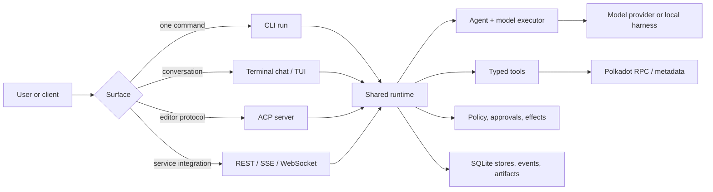

# Polkagent documentation

Welcome to Polkagent. This is the best place to begin if you have not seen the
project before.

Polkagent is a Rust-first platform for running durable AI-agent workflows with
Polkadot-aware tools, explicit policy boundaries, human approvals, persistent
conversations, and several user surfaces: a command-line interface, terminal
UI, HTTP API, and ACP editor adapter.

> [!IMPORTANT]
> Polkagent is under active development. A component being present in the
> workspace does not mean it is wired into every executable surface. Start with
> [Current maturity](#current-maturity) and consult the
> [evidence-backed status](../prd/STATUS.md) before production use.

## Choose your path

| I want to… | Start here | Then read |
|---|---|---|
| See Polkagent work without buying an API key | [Run the five-minute local demo](demo.md#demo-1-offline-cli-tour) | [Core concepts](concepts.md) |
| Install it and talk to a real model | [Getting started](getting-started.md) | [Providers](providers.md), [durable chat](chat.md) |
| Explore the terminal dashboard | [TUI demo](demo.md#demo-3-explore-the-tui-with-sample-data) | [CLI: `tui`](cli.md#tui) |
| Integrate a service over HTTP | [API demo](demo.md#demo-4-call-polkagent-over-http) | [API reference](api.md), [OpenAPI](../openapi.yaml) |
| Use Polkagent from Zed | [ACP and Zed setup](acp-zed.md) | [Harnesses](harnesses.md) |
| Evaluate whether it fits my problem | [Use cases](use-cases.md) | [Architecture](architecture.md), [current status](../prd/STATUS.md) |
| Operate or deploy it | [Deployment](deployment.md) | [Telemetry](telemetry.md), [storage](storage.md), [resilience](resilience.md) |
| Contribute code | [Contributing](../CONTRIBUTING.md) | [Architecture](architecture.md), [PRD index](../prd/README.md) |

## The project in one picture

The key idea is that the user surfaces share durable runtime services. A prompt
becomes a run; a run can contain turns, steps, tool calls, and effects; durable
events let clients reconnect without pretending that missed work never
happened. See [Core concepts](concepts.md) for the vocabulary.

## Current maturity

The labels below describe the current `main` branch, not an eventual roadmap.

| Label | Meaning |
|---|---|
| **Explorable** | There is an executable, tested path suitable for local evaluation. |
| **Partial** | A real path exists, but important integration or operational gaps remain. |
| **Building blocks** | Libraries and tests exist; there is no complete user-facing workflow yet. |

| Area | Maturity | Practical reading |
|---|---|---|
| One-shot CLI, durable terminal chat, monitoring TUI | **Explorable** | Shared SQLite runtime; real providers or deterministic simulated responses. |
| ACP stdio server | **Explorable** | Official-SDK coverage exists; full manual Zed interoperability remains open. |
| REST API, SSE, run-event and command WebSockets | **Partial** | Durable core routes are composed; some optional and authority-bound routes deliberately return `501`. |
| Read-only Polkadot tooling | **Partial** | RPC, metadata, codec, governance, and treasury components exist; live-network validation is still incomplete. |
| Policy-gated approvals | **Partial** | Explicit local chat/TUI/ACP authority is supported; shared remote principal composition is not. |
| Polkadot writes and signing | **Building blocks** | Do not treat the project as an end-to-end proven value-moving system. |
| Multi-agent groups, payments, cloud control plane | **Building blocks** | Significant libraries exist, but production callers and operational proof are incomplete. |
| Local extension package lifecycle | **Explorable** | Install/update/rollback works locally; package activation and cryptographic trust are not complete. |
| Single-instance Docker + SQLite | **Partial** | Boot, health, authentication boundary, restart, and cold restore have smoke coverage; HA and production Postgres do not. |

The authoritative, evidence-linked version of this table is
[`prd/STATUS.md`](../prd/STATUS.md). The PRDs describe intent and remaining
work; they are not user guarantees.

## Documentation map

### Learn and evaluate

| Guide | What it answers |
|---|---|
| [Getting started](getting-started.md) | How do I install Polkagent and complete a first real run? |
| [Core concepts](concepts.md) | What do “agent,” “interaction,” “run,” “tool,” “effect,” and “approval” mean? |
| [Use cases](use-cases.md) | Which problems fit Polkagent today, and what are the caveats? |
| [Demos](demo.md) | What can I copy, paste, and observe locally? |
| [Examples and cookbook](examples.md) | How do I adapt the CLI, policies, skills, API, and evals? |
| [Troubleshooting](troubleshooting.md) | What should I check when setup or execution fails? |

### Use the product

| Guide | Scope |
|---|---|
| [CLI reference](cli.md) | Commands, subcommands, global flags, and output modes |
| [Durable chat](chat.md) | Interactive and piped terminal conversations |
| [ACP and Zed](acp-zed.md) | Running Polkagent as an ACP stdio agent server |
| [API reference](api.md) | REST resources, durable interactions, SSE, and WebSockets |
| [Configuration](configuration.md) | Source precedence, TOML keys, and environment overrides |
| [Providers](providers.md) | Model-provider configuration and selection |

### Build agent capabilities

| Guide | Scope |
|---|---|
| [Tools and skills](tools-and-skills.md) | Built-in tools, grants, skill manifests, and execution boundary |
| [Plugins](plugins.md) | Local packages and extension lifecycle |
| [Memory](memory.md) | Memory types, search, retention, CLI, and API |
| [Groups](groups.md) | Multi-agent coordination domain and current surface gap |
| [Evals](evals.md) | Evaluation suites, scoring, and report comparison |
| [Harnesses](harnesses.md) | Downstream coding-harness adapters |

### Understand the internals

| Guide | Scope |
|---|---|
| [Architecture](architecture.md) | Ports and adapters, crate families, composition, and invariants |
| [Run lifecycle](run-lifecycle.md) | Run/turn/step/effect state machines |
| [Safety](safety.md) | Signer isolation, intent-before-I/O, duplicate prevention, unknown outcomes |
| [Outbox and events](outbox-events.md) | Durable events, replay, cursors, and artifact provenance |
| [Runtime/API composition](runtime-api-composition.md) | What the production composition root actually wires |
| [ADRs](adr/) | Narrow architectural decisions and their consequences |

### Operate it

| Guide | Scope |
|---|---|
| [Deployment](deployment.md) | Local, Docker, health probes, backup, and known limits |
| [Storage](storage.md) | SQLite, Postgres boundary, schemas, and retention |
| [Telemetry](telemetry.md) | Logs, metrics, traces, and operational event flow |
| [API diagnostics](api-diagnostics.md) | Health, metrics, audit, and event diagnostics |
| [Resilience](resilience.md) | Retry, circuit breaker, cache, rate limit, timeout, and fault injection libraries |
| [Security](identity-security.md) | Identity, signing boundaries, grants, and key handling |

### Polkadot-specific behavior

| Guide | Scope |
|---|---|
| [Chain integration](chain.md) | Networks, metadata, calls, XCM types, decoding, and CLI commands |
| [Payments and autonomy](payments.md) | Payment domain, budgets, settlement intent, and current gaps |

## Documentation conventions

- Commands assume the repository root unless a guide says otherwise.
- `<LIKE_THIS>` means “replace this placeholder.” Do not type the angle
  brackets.
- Names such as `researcher` are friendly agent names. API paths documented as
  UUIDs require the returned `id`, not the friendly name.
- Examples that can move value use obviously fake addresses or fixtures. Never
  paste a seed phrase or private key into a prompt, config file, shell history,
  log, or editor JSON.
- Mermaid diagrams render on GitHub. The text around each diagram contains the
  same essential information for readers using a plain Markdown viewer.
- “Implemented” means present in code. “Composed” means connected to a product
  entry point. “Verified” means backed by the evidence named in
  [`prd/STATUS.md`](../prd/STATUS.md).

## Keep reading

If you are new, continue with [Getting started](getting-started.md). If you are
deciding whether Polkagent fits a project, go to [Use cases](use-cases.md).
