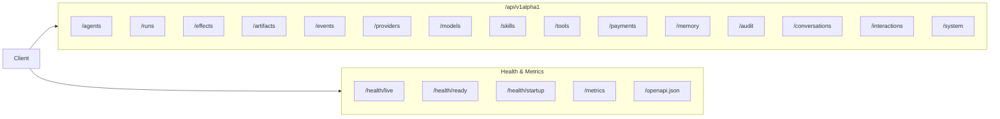
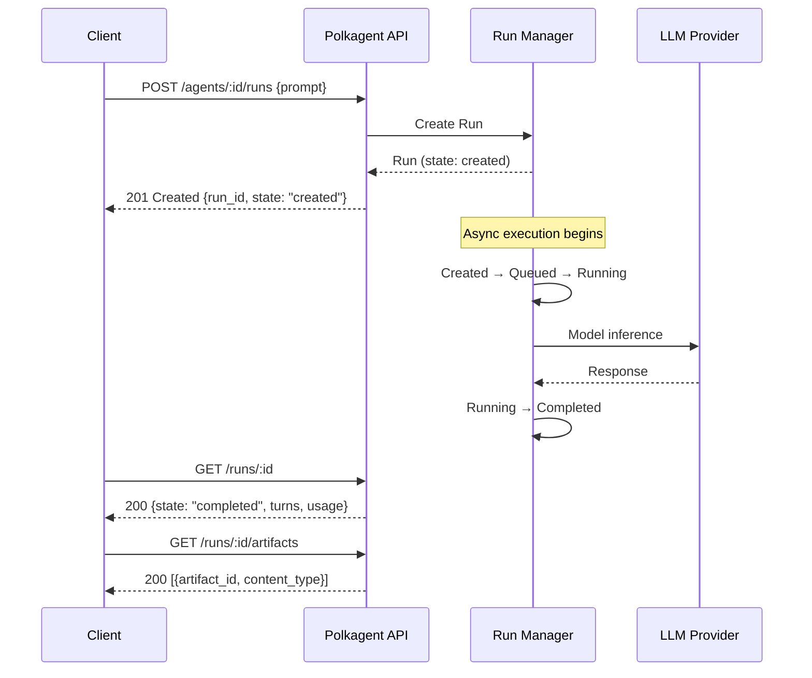
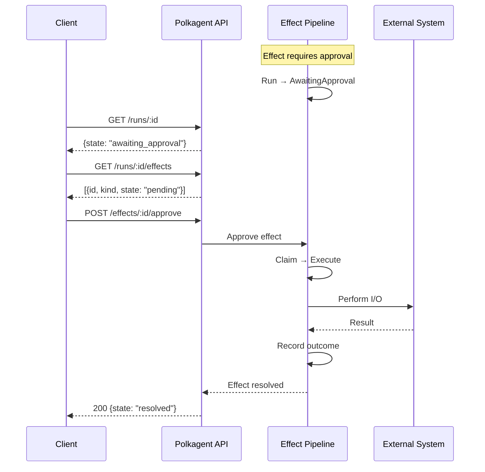
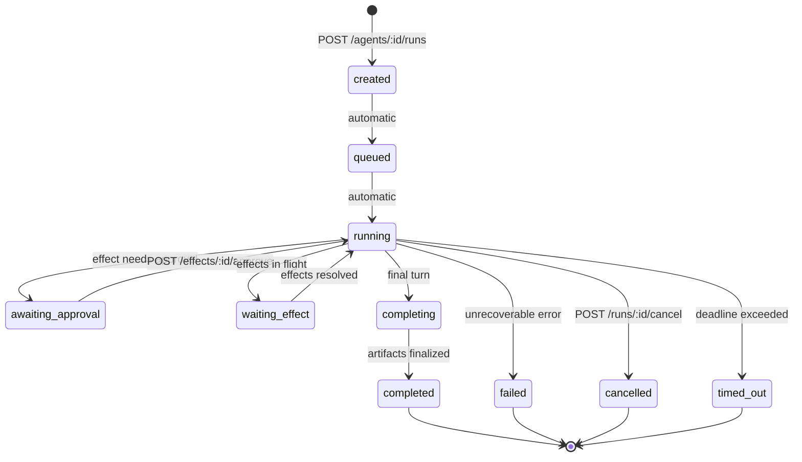

# API Reference

Polkagent exposes a REST and WebSocket API under the `/api/v1alpha1` prefix.

## Starting the server

```bash
polkagent serve --port 9090 --host 127.0.0.1
```

**Body limits:** 1 MiB for standard requests, 10 MiB for artifact content.



---

## Endpoints

### Agents

| Method | Path | Description |
|--------|------|-------------|
| `POST` | `/api/v1alpha1/agents` | Create an agent |
| `GET` | `/api/v1alpha1/agents` | List agents |
| `GET` | `/api/v1alpha1/agents/:id` | Get agent by ID |
| `DELETE` | `/api/v1alpha1/agents/:id` | Delete an agent |
| `POST` | `/api/v1alpha1/agents/:id/start` | Start an agent |
| `POST` | `/api/v1alpha1/agents/:id/stop` | Stop an agent |
| `POST` | `/api/v1alpha1/agents/:id/pause` | Pause an agent |
| `POST` | `/api/v1alpha1/agents/:id/resume` | Resume an agent |

### Runs

| Method | Path | Description |
|--------|------|-------------|
| `POST` | `/api/v1alpha1/agents/:agent_id/runs` | Create a run for an agent |
| `GET` | `/api/v1alpha1/runs` | List runs |
| `GET` | `/api/v1alpha1/runs/:id` | Get run by ID |
| `POST` | `/api/v1alpha1/runs/:id/cancel` | Cancel a run |
| `GET` | `/api/v1alpha1/runs/:id/turns` | Get turns for a run |
| `GET` | `/api/v1alpha1/runs/:id/events` | Get events for a run |
| `GET` | `/api/v1alpha1/runs/:id/artifacts` | Get artifacts for a run |
| `GET` | `/api/v1alpha1/runs/:id/effects` | Get effects for a run |
| `POST` | `/api/v1alpha1/runs/:id/resume` | Resume a run |



### Effects

| Method | Path | Description |
|--------|------|-------------|
| `GET` | `/api/v1alpha1/effects/:id` | Get effect by ID |
| `POST` | `/api/v1alpha1/effects/:id/approve` | Approve a pending effect |
| `POST` | `/api/v1alpha1/effects/:id/deny` | Deny a pending effect |



### Artifacts

| Method | Path | Description |
|--------|------|-------------|
| `GET` | `/api/v1alpha1/artifacts/:id` | Get artifact metadata |
| `GET` | `/api/v1alpha1/artifacts/:id/content` | Download artifact content (10 MiB limit) |
| `GET` | `/api/v1alpha1/artifacts/:id/provenance` | Get artifact provenance chain |

### Events

| Method | Path | Description |
|--------|------|-------------|
| `GET` | `/api/v1alpha1/events` | List events |
| `GET` | `/api/v1alpha1/events/:id` | Get event by ID |
| `GET` | `/api/v1alpha1/events/stream` | WebSocket event stream |

### Providers

| Method | Path | Description |
|--------|------|-------------|
| `GET` | `/api/v1alpha1/providers` | List providers |
| `GET` | `/api/v1alpha1/providers/:id` | Get provider details |
| `GET` | `/api/v1alpha1/providers/:provider_id/models` | List models for a provider |

### Models

| Method | Path | Description |
|--------|------|-------------|
| `GET` | `/api/v1alpha1/models` | List all models |
| `GET` | `/api/v1alpha1/models/:model_id` | Get model details |

### Skills

| Method | Path | Description |
|--------|------|-------------|
| `GET` | `/api/v1alpha1/skills` | List skills |
| `GET` | `/api/v1alpha1/skills/:skill_id` | Get skill details |
| `POST` | `/api/v1alpha1/skills/install` | Install a skill |
| `POST` | `/api/v1alpha1/skills/:skill_id/uninstall` | Uninstall a skill |
| `PUT` | `/api/v1alpha1/skills/:skill_id/config` | Update skill config |

Runtime-composed servers expose `GET /skills` and `GET /skills/:skill_id` as
read-only views over the validated definitions loaded with the process-wide
skill runner. Lists are deterministic and are empty when skill loading is
disabled. Install, uninstall, and configuration mutation remain explicit
`501 Not Implemented` until package trust, activation, and durable mutation
semantics are composed.

### Tools

| Method | Path | Description |
|--------|------|-------------|
| `GET` | `/api/v1alpha1/tools` | List available tools |
| `GET` | `/api/v1alpha1/tools/:tool_id` | Get tool details |
| `GET` | `/api/v1alpha1/tools/:tool_id/grants` | Get tool's required grants |

### Payments

| Method | Path | Description |
|--------|------|-------------|
| `GET` | `/api/v1alpha1/payments/balance` | Get payment balance |
| `GET` | `/api/v1alpha1/payments/usage` | Get usage summary |
| `GET` | `/api/v1alpha1/payments/receipts` | List receipts |
| `GET` | `/api/v1alpha1/payments/receipts/:receipt_id` | Get receipt |

### Memory

| Method | Path | Description |
|--------|------|-------------|
| `POST` | `/api/v1alpha1/memory/query` | Search memories |
| `GET` | `/api/v1alpha1/memory/stats` | Memory statistics |
| `POST` | `/api/v1alpha1/memory/forget` | Forget a memory |
| `GET` | `/api/v1alpha1/memory/entries/:entry_id` | Get memory entry |

Runtime-composed servers query the exact durable SQLite memory store already
owned by `AppService`; they do not open a second store. Query namespaces are
the canonical memory types (`episodic`, `semantic`, and `procedural`). Exact
entry lookup uses a non-mutating port, so it does not update access timestamps
or counters. Statistics are equally non-mutating: `total_bytes` is the sum of
UTF-8 content bytes and `namespaces` counts the distinct canonical memory types
currently stored. Batch deletion accepts one to 1,000 UUIDs, validates the
whole request before mutation, commits atomically, and treats unknown or
duplicate IDs idempotently. When memory is disabled, queries return an empty
list, exact lookups return `404`, statistics return zero values, and deletion
returns `deleted: 0`. Query and deletion are `POST` operations, so server-wide
read-only mode rejects them with `405`; statistics and exact-entry lookup
remain available as authenticated `GET` operations. Custom API composition
without any memory store still returns `501 Not Implemented`.

### Audit

| Method | Path | Description |
|--------|------|-------------|
| `GET` | `/api/v1alpha1/audit` | List audit entries |
| `GET` | `/api/v1alpha1/audit/verify` | Verify audit integrity |
| `GET` | `/api/v1alpha1/audit/:id` | Get audit entry |

### Conversations

| Method | Path | Description |
|--------|------|-------------|
| `POST` | `/api/v1alpha1/conversations` | Create conversation |
| `GET` | `/api/v1alpha1/conversations` | List conversations |
| `GET` | `/api/v1alpha1/conversations/:id` | Get conversation |
| `POST` | `/api/v1alpha1/conversations/:id/messages` | Append a transcript record without executing an agent |
| `DELETE` | `/api/v1alpha1/conversations/:id` | Delete conversation |

The conversation routes are a low-level transcript compatibility API. Use the
interaction routes below when a prompt must initiate agent work.

### Durable interactions

| Method | Path | Description |
|--------|------|-------------|
| `POST` | `/api/v1alpha1/interactions` | Create an agent interaction |
| `GET` | `/api/v1alpha1/interactions` | List interactions |
| `GET` | `/api/v1alpha1/interactions/:id` | Get an interaction |
| `DELETE` | `/api/v1alpha1/interactions/:id` | Archive a terminal interaction |
| `GET` | `/api/v1alpha1/interactions/:id/turns` | List durable turns |
| `POST` | `/api/v1alpha1/interactions/:id/prompt` | Start an idempotent prompt turn |
| `POST` | `/api/v1alpha1/interactions/:id/turns/:turn_id/cancel` | Cancel a turn |
| `GET` | `/api/v1alpha1/interactions/:id/config` | Read supported durable configuration |
| `PUT` | `/api/v1alpha1/interactions/:id/config` | Atomically change the target or model |
| `PUT` | `/api/v1alpha1/interactions/:id/target` | Deprecated target-only compatibility delegate |
| `GET` | `/api/v1alpha1/interactions/:id/events` | Replay events after a durable sequence |
| `GET` | `/api/v1alpha1/interactions/:id/events/stream` | Replay and follow typed events over SSE |

Callers may supply `turn_id` when prompting. A retry with identical input
returns the original handle, while reuse with different input returns `409`.
The configuration route accepts exactly one tagged target or model update,
for example `{"option":"model","value":"claude-sonnet-4-6"}`. A `null`
model value clears the override and restores agent-model inheritance. Target
and model changes are validated before one durable write; invalid values do
not create a run or turn and do not partially change the session. Provider,
harness, autonomy, maximum-turn, and budget mutation are not supported by this
HTTP route and unknown option tags are rejected.

For replay, send `after_sequence` and persist the returned
`checkpoint.next_after_sequence`; optional `turn_id` and `limit` parameters
filter and page the ordered durable history.

The SSE route accepts the same `after_sequence` and optional `turn_id` model.
On browser or client reconnect, a valid `Last-Event-ID` header takes precedence
over `after_sequence`. Each `interaction_event` has an `id` equal to its
durable interaction-wide sequence and a JSON `data` field containing the typed
event envelope. Comment-only keepalives carry no application data. On bounded
receiver lag, the server replays after the last event it emitted, avoiding
duplicates and gaps; terminal turn events do not close the session stream.

The underlying interaction service attaches its bounded live receiver first,
then loads durable replay lazily in bounded pages as the client consumes the
stream. Reconnecting from an old checkpoint therefore does not materialize the
full backlog, and disconnecting early stops further replay reads.

### System

| Method | Path | Description |
|--------|------|-------------|
| `GET` | `/api/v1alpha1/system/info` | System information |

### Health and metrics

These endpoints are served without the `/api/v1alpha1` prefix.

| Method | Path | Description |
|--------|------|-------------|
| `GET` | `/health/live` | Liveness probe |
| `GET` | `/health/ready` | Readiness probe |
| `GET` | `/health/startup` | Startup probe |
| `GET` | `/metrics` | Prometheus metrics |
| `GET` | `/openapi.json` | OpenAPI specification |

---

## WebSocket event streaming

Connect to `/api/v1alpha1/events/stream` to replay and then follow run events.
The server attaches the bounded live receiver before reading the authoritative
`EventStore`, so commits that race with replay are delivered exactly once.
Replay uses bounded 256-record pages and an optional non-negative
`after_sequence` global checkpoint. `run_id` and comma-separated `kinds`
filters advance across hidden durable records instead of stopping at the first
page.

Durable frames preserve every existing `RunEvent` field and add
`global_sequence`. Persist that value and reconnect with
`?after_sequence=<global_sequence>`. Live diagnostic and ephemeral frames keep
the existing shape and omit `global_sequence` because they are best-effort and
cannot be replayed. A broadcast lag triggers durable replay after the last
consumed global checkpoint; replay/live overlap is deduplicated by that
checkpoint. Missing durable storage rejects the upgrade with `501`. A replay
or recovery backend failure closes an accepted socket with WebSocket status
`1011` and a generic reason; backend details are not sent to clients.

Replay can only reproduce fields retained by the configured `EventStore`.
The current SQLite run-event schema retains event/run IDs, kind payload,
per-run/global sequences, and timestamp, but not every optional correlation or
causation field; absent replay metadata uses the typed `RunEvent` defaults.
Persisting that remaining correlation metadata is still an OBS-01 schema gap.

The WebSocket upgrade endpoints `/api/v1alpha1/events/stream` and
`/ws/v1alpha1` are intentionally excluded from `openapi.yaml`. OpenAPI can
describe their HTTP upgrade handshakes but not their bidirectional frame
protocols, so a handshake-only operation would be an incomplete contract.
This section and the protocol-specific documentation are authoritative for
those transports.

This WebSocket remains a run-event protocol and is not reused for durable
interaction delivery. Interaction clients use the separate checkpointed SSE
route documented above, or finite JSON replay when streaming is unsuitable.
The distinct `/ws/v1alpha1` command socket is not an alias for this checkpoint
protocol.



---

## Authentication

When authentication is enabled, protected routes accept either `X-API-Key`
or `Authorization: Bearer <key>`. Configure hashed keys in `polkagent.toml`:

```toml
[auth]
enabled = true
api_keys = ["hashed-key-digest"]
session_timeout_secs = 3600
```

The operational access boundary is exact-path based:

| Access | Endpoints | Rate limit |
|--------|-----------|------------|
| Public | `/openapi.json`, `/health/live`, `/health/ready`, `/health/startup`, `/v1/compat/pca/health` | Bypassed |
| Protected | `/metrics`, `/v1/compat/pca/inbound` and its write routes, `/api/v1alpha1/*` | Applied when enabled |

Public paths are limited to this explicit list; a new route does not become
public by sharing a prefix. Read-only mode is independent: it rejects
mutating methods but does not affect these `GET` endpoints.

Manage credentials with the `auth` subcommand:

```bash
polkagent auth login --provider anthropic
polkagent auth status
polkagent auth whoami
```

---

## Server configuration

```toml
[server]
bind_address = "127.0.0.1:9090"
cors_origins = ["*"]

[server.rate_limit]
enabled = true
requests_per_second = 100
burst = 200

[server.tls]
cert_path = "/path/to/cert.pem"
key_path = "/path/to/key.pem"
```

### Read-only mode

Start the server in read-only mode to reject all mutating requests (`POST`, `PUT`, `DELETE`):

```bash
polkagent serve --read-only
```

---

> For a hands-on API cookbook with curl examples, see [Examples: API Cookbook](examples.md#api-cookbook).
