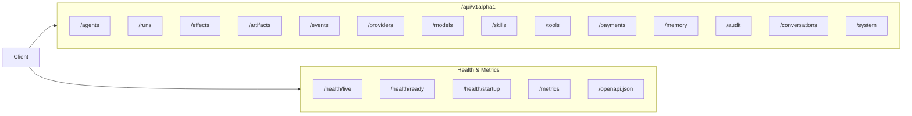
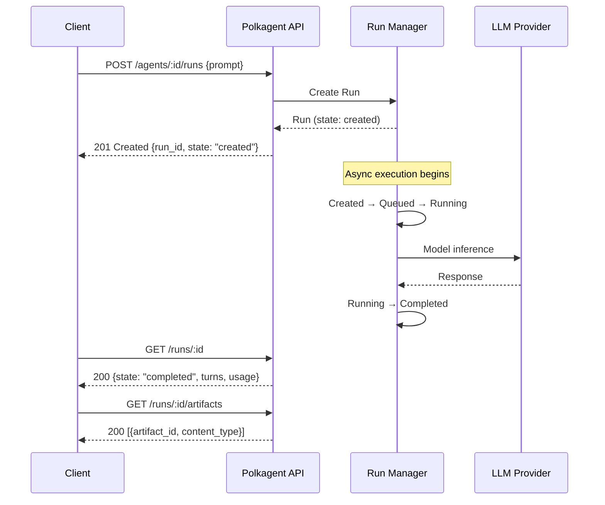
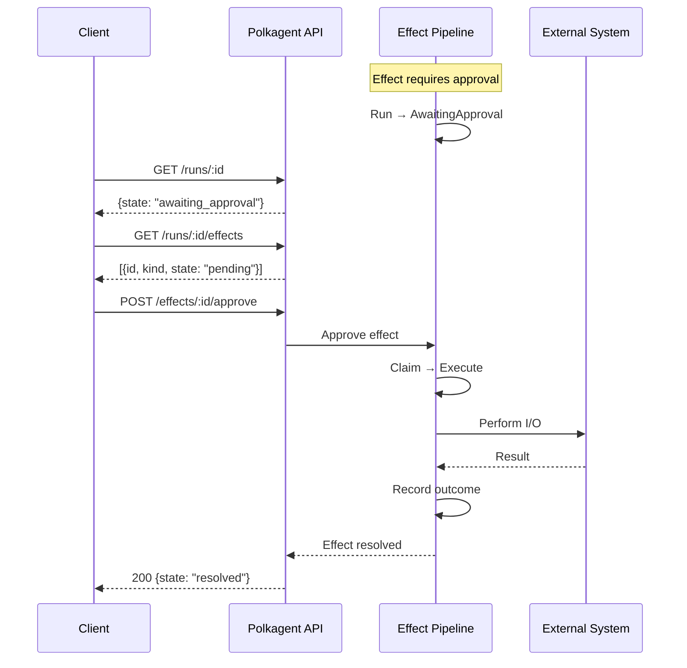
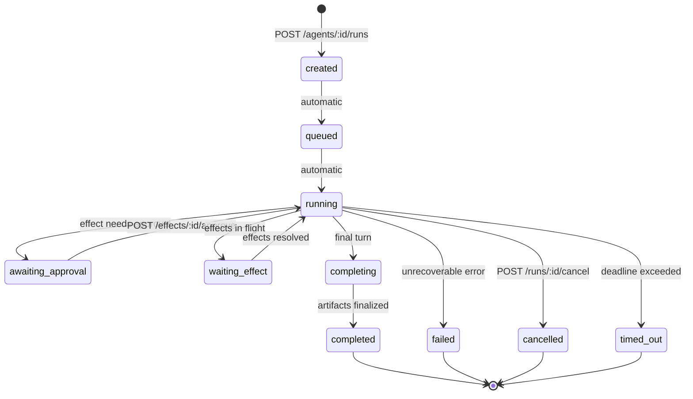

# API Reference

Polkagent exposes a REST and WebSocket API under the `/api/v1alpha1` prefix.

## Starting the server

```bash
polkagent serve --port 9090 --host 127.0.0.1
```

**Body limits:** 1 MiB for standard requests, 10 MiB for artifact content.



---

## Endpoints

### Agents

| Method | Path | Description |
|--------|------|-------------|
| `POST` | `/api/v1alpha1/agents` | Create an agent |
| `GET` | `/api/v1alpha1/agents` | List agents |
| `GET` | `/api/v1alpha1/agents/:id` | Get agent by ID |
| `DELETE` | `/api/v1alpha1/agents/:id` | Delete an agent |
| `POST` | `/api/v1alpha1/agents/:id/start` | Start an agent |
| `POST` | `/api/v1alpha1/agents/:id/stop` | Stop an agent |
| `POST` | `/api/v1alpha1/agents/:id/pause` | Pause an agent |
| `POST` | `/api/v1alpha1/agents/:id/resume` | Resume an agent |

### Runs

| Method | Path | Description |
|--------|------|-------------|
| `POST` | `/api/v1alpha1/agents/:agent_id/runs` | Create a run for an agent |
| `GET` | `/api/v1alpha1/runs` | List runs |
| `GET` | `/api/v1alpha1/runs/:id` | Get run by ID |
| `POST` | `/api/v1alpha1/runs/:id/cancel` | Cancel a run |
| `GET` | `/api/v1alpha1/runs/:id/turns` | Get turns for a run |
| `GET` | `/api/v1alpha1/runs/:id/events` | Get events for a run |
| `GET` | `/api/v1alpha1/runs/:id/artifacts` | Get artifacts for a run |
| `GET` | `/api/v1alpha1/runs/:id/effects` | Get effects for a run |
| `POST` | `/api/v1alpha1/runs/:id/resume` | Resume a run |



### Effects

| Method | Path | Description |
|--------|------|-------------|
| `GET` | `/api/v1alpha1/effects/:id` | Get effect by ID |
| `POST` | `/api/v1alpha1/effects/:id/approve` | Approve a pending effect |
| `POST` | `/api/v1alpha1/effects/:id/deny` | Deny a pending effect |



### Artifacts

| Method | Path | Description |
|--------|------|-------------|
| `GET` | `/api/v1alpha1/artifacts/:id` | Get artifact metadata |
| `GET` | `/api/v1alpha1/artifacts/:id/content` | Download artifact content (10 MiB limit) |
| `GET` | `/api/v1alpha1/artifacts/:id/provenance` | Get artifact provenance chain |

### Events

| Method | Path | Description |
|--------|------|-------------|
| `GET` | `/api/v1alpha1/events` | List events |
| `GET` | `/api/v1alpha1/events/:id` | Get event by ID |
| `GET` | `/api/v1alpha1/events/stream` | WebSocket event stream |

### Providers

| Method | Path | Description |
|--------|------|-------------|
| `GET` | `/api/v1alpha1/providers` | List providers |
| `GET` | `/api/v1alpha1/providers/:id` | Get provider details |
| `GET` | `/api/v1alpha1/providers/:provider_id/models` | List models for a provider |

### Models

| Method | Path | Description |
|--------|------|-------------|
| `GET` | `/api/v1alpha1/models` | List all models |
| `GET` | `/api/v1alpha1/models/:model_id` | Get model details |

### Skills

| Method | Path | Description |
|--------|------|-------------|
| `GET` | `/api/v1alpha1/skills` | List skills |
| `GET` | `/api/v1alpha1/skills/:skill_id` | Get skill details |
| `POST` | `/api/v1alpha1/skills/install` | Install a skill |
| `POST` | `/api/v1alpha1/skills/:skill_id/uninstall` | Uninstall a skill |
| `PUT` | `/api/v1alpha1/skills/:skill_id/config` | Update skill config |

### Tools

| Method | Path | Description |
|--------|------|-------------|
| `GET` | `/api/v1alpha1/tools` | List available tools |
| `GET` | `/api/v1alpha1/tools/:tool_id` | Get tool details |
| `GET` | `/api/v1alpha1/tools/:tool_id/grants` | Get tool's required grants |

### Payments

| Method | Path | Description |
|--------|------|-------------|
| `GET` | `/api/v1alpha1/payments/balance` | Get payment balance |
| `GET` | `/api/v1alpha1/payments/usage` | Get usage summary |
| `GET` | `/api/v1alpha1/payments/receipts` | List receipts |
| `GET` | `/api/v1alpha1/payments/receipts/:receipt_id` | Get receipt |

### Memory

| Method | Path | Description |
|--------|------|-------------|
| `POST` | `/api/v1alpha1/memory/query` | Search memories |
| `GET` | `/api/v1alpha1/memory/stats` | Memory statistics |
| `POST` | `/api/v1alpha1/memory/forget` | Forget a memory |
| `GET` | `/api/v1alpha1/memory/entries/:entry_id` | Get memory entry |

### Audit

| Method | Path | Description |
|--------|------|-------------|
| `GET` | `/api/v1alpha1/audit` | List audit entries |
| `GET` | `/api/v1alpha1/audit/verify` | Verify audit integrity |
| `GET` | `/api/v1alpha1/audit/:id` | Get audit entry |

### Conversations

| Method | Path | Description |
|--------|------|-------------|
| `POST` | `/api/v1alpha1/conversations` | Create conversation |
| `GET` | `/api/v1alpha1/conversations` | List conversations |
| `GET` | `/api/v1alpha1/conversations/:id` | Get conversation |
| `POST` | `/api/v1alpha1/conversations/:id/messages` | Add message |
| `DELETE` | `/api/v1alpha1/conversations/:id` | Delete conversation |

### System

| Method | Path | Description |
|--------|------|-------------|
| `GET` | `/api/v1alpha1/system/info` | System information |

### Health and metrics

These endpoints are served without the `/api/v1alpha1` prefix.

| Method | Path | Description |
|--------|------|-------------|
| `GET` | `/health/live` | Liveness probe |
| `GET` | `/health/ready` | Readiness probe |
| `GET` | `/health/startup` | Startup probe |
| `GET` | `/metrics` | Prometheus metrics |
| `GET` | `/openapi.json` | OpenAPI specification |

---

## WebSocket event streaming

Connect to `/api/v1alpha1/events/stream` to receive real-time events. The stream delivers run lifecycle events including `RunStarted`, `TurnCompleted`, `EffectResolved`, `TokensStreamed`, and others.



---

## Authentication

When authentication is enabled, configure it in `polkagent.toml`:

```toml
[auth]
enabled = true
api_keys = ["hashed-key-digest"]
session_timeout_secs = 3600
```

Manage credentials with the `auth` subcommand:

```bash
polkagent auth login --provider anthropic
polkagent auth status
polkagent auth whoami
```

---

## Server configuration

```toml
[server]
bind_address = "127.0.0.1:9090"
cors_origins = ["*"]

[server.rate_limit]
enabled = true
requests_per_second = 100
burst = 200

[server.tls]
cert_path = "/path/to/cert.pem"
key_path = "/path/to/key.pem"
```

### Read-only mode

Start the server in read-only mode to reject all mutating requests (`POST`, `PUT`, `DELETE`):

```bash
polkagent serve --read-only
```

---

> For a hands-on API cookbook with curl examples, see [Examples: API Cookbook](examples.md#api-cookbook).
