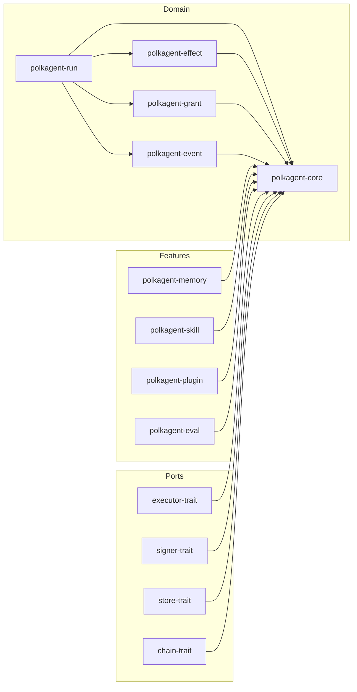
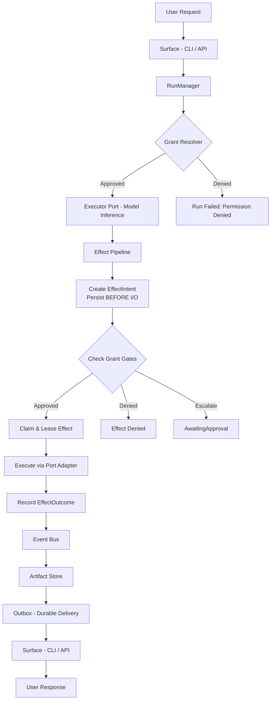
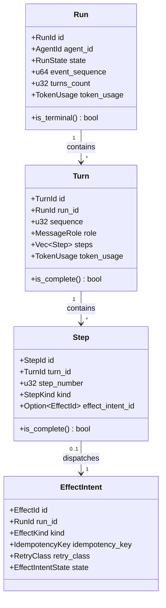

# Polkagent Architecture

This document expands on the overview in [ARCHITECTURE.md](../ARCHITECTURE.md) at the repository root.

## Hexagonal Architecture

Polkagent uses a hexagonal (ports and adapters) architecture. Domain logic lives in pure crates with no I/O dependencies. External systems are accessed through narrow trait-based ports, with concrete adapters provided separately.

**Strict dependency rules:**

- Domain crates depend only on other domain crates and general-purpose libraries (serde, uuid, chrono). They never depend on adapters or I/O libraries.
- Port crates define async trait interfaces. Each ships contract test suites that any adapter must pass.
- Adapter crates implement ports against real or fake external systems.
- Surface crates wire domain logic to user-facing interfaces.

## System Overview

```mermaid
graph TB
    subgraph Surfaces["🔷 Surfaces"]
        CLI["polkagent-cli<br/>CLI + TUI"]
        API["polkagent-api<br/>REST + WS"]
        WH["polkagent-surface-webhook"]
    end

    subgraph Core["🔶 Application Core"]
        RC["polkagent-core<br/>Domain Types"]
        RUN["polkagent-run<br/>Run Manager"]
        EFF["polkagent-effect<br/>Effect Pipeline"]
        GR["polkagent-grant<br/>Policy Engine"]
        EVT["polkagent-event<br/>Event Bus"]
        ART["polkagent-artifact<br/>Artifact Store"]
        OUT["polkagent-outbox<br/>Durable Delivery"]
        CFG["polkagent-config<br/>Config Loader"]
    end

    subgraph Ports["🔷 Ports (Traits)"]
        PE["executor-trait"]
        PS["signer-trait"]
        PT["store-trait"]
        PC["chain-trait"]
        PX["transport-trait"]
        PH["harness-trait"]
    end

    subgraph Adapters["🔶 Adapters"]
        EA["executor-anthropic"]
        EO["executor-openai"]
        EG["executor-gemini"]
        EL["executor-local"]
        ER["executor-openrouter"]
        SS["store-sqlite"]
        CS["chain-subxt"]
        SE["signer-external"]
    end

    Surfaces --> Core
    Core --> Ports
    Ports --> Adapters
```

## Crate Map

### Domain Crates

| Crate | Purpose |
|---|---|
| `polkagent-core` | Core types and domain logic |
| `polkagent-run` | Run/Turn state machine |
| `polkagent-effect` | Effect pipeline (intent → claim → execute → outcome) |
| `polkagent-grant` | Permission/grant resolution |
| `polkagent-event` | Event bus and lifecycle events |
| `polkagent-artifact` | Content-addressed artifact storage (BLAKE3) |
| `polkagent-outbox` | Durable ordered effect delivery |
| `polkagent-card` | Action card rendering |
| `polkagent-config` | TOML config loader with env overrides |

### Port Crates (Trait Definitions)

| Crate | Purpose |
|---|---|
| `polkagent-store-trait` | Persistence |
| `polkagent-executor-trait` | LLM inference |
| `polkagent-signer-trait` | Transaction signing |
| `polkagent-chain-trait` | Blockchain interaction |
| `polkagent-transport-trait` | External communication |
| `polkagent-harness-trait` | Coding agent harness abstraction |

### Adapter Crates

**Executors:** `polkagent-executor-anthropic`, `polkagent-executor-openai`, `polkagent-executor-gemini`, `polkagent-executor-local`, `polkagent-executor-openrouter`, `polkagent-executor-fake`

**Signers:** `polkagent-signer-fake`, `polkagent-signer-external`

**Stores:** `polkagent-store-sqlite`, `polkagent-store-sqlite-feed`, `polkagent-store-sqlite-group`

**Chain:** `polkagent-chain-fake`, `polkagent-chain-subxt`

**Transport:** `polkagent-transport-fake`, `polkagent-transport-pca`

**Harnesses:** `polkagent-harness-claude`, `polkagent-harness-codex`, `polkagent-harness-acp`, `polkagent-harness-cursor`, `polkagent-harness-copilot`, `polkagent-harness-goose`, `polkagent-harness-kiro`

### Surface Crates

| Crate | Purpose |
|---|---|
| `polkagent-cli` | CLI and TUI |
| `polkagent-api` | REST + WebSocket API |
| `polkagent-surface-webhook` | Webhook delivery |

### Tool Crates

| Crate | Purpose |
|---|---|
| `polkagent-tool` | Built-in tools (file.read, file.write, list_dir, shell, search_memory) |
| `polkagent-tool-governance` | Governance tools (referendum, track, voter, delegation, treasury overview) |
| `polkagent-tool-treasury` | Treasury tools (balance, staking, portfolio, transfer history, vesting) |

### Feature Crates

`polkagent-memory`, `polkagent-skill`, `polkagent-conversation`, `polkagent-context`, `polkagent-identity`, `polkagent-payment`, `polkagent-secret`, `polkagent-group`, `polkagent-feed`, `polkagent-service`, `polkagent-plugin`, `polkagent-codec`, `polkagent-eval`, `polkagent-audit`, `polkagent-batch`, `polkagent-cache`, `polkagent-fault`, `polkagent-health`, `polkagent-migration`, `polkagent-rate-limit`, `polkagent-retry`, `polkagent-scheduler`, `polkagent-telemetry`, `polkagent-metadata`

### Test Crates

| Crate | Purpose |
|---|---|
| `polkagent-test-fixtures` | Shared builders and factory functions |
| `polkagent-integration-tests` | Cross-crate integration tests |
| `polkagent-security-tests` | Security test suite |

### Crate Dependency Graph

## Key Invariants

### INV-01: Signer Isolation

The signer never sees model-modified data. Only user-approved, integrity-checked bytes reach the signing boundary. The model may explain, annotate, or summarize, but the canonical payload entering the signer is constructed from verified chain data. This prevents a compromised or hallucinating model from altering transaction semantics.

### INV-02: Effect Intent Before I/O

An `EffectIntent` is durably persisted BEFORE any corresponding I/O is attempted. If the process crashes between persisting the intent and completing the I/O, recovery detects the incomplete intent and decides whether to retry or mark as unknown — but never silently skips or duplicates.

### INV-03: No Silent Duplicate Effects

A crash never silently repeats an irreversible external action. Uses idempotency keys, claim/lease semantics, and outcome recording to ensure each effect is attempted at most once per attempt record. Mid-flight crashes result in `Unknown` outcome requiring explicit resolution.

### INV-04: Unknown Stays Unknown

`EffectOutcome::Unknown` is never automatically collapsed to Success or Failure. Remains visibly unknown in all projections, APIs, and UIs until explicit resolution.

## Data Flow

## Run / Turn / Step / Effect Hierarchy

## Testing Strategy

- Unit tests in each crate for domain logic
- Property-based tests (proptest) for invariant verification
- Port contract tests shipped with each `-trait` crate
- Integration tests in `polkagent-integration-tests`

See [CONTRIBUTING.md](../CONTRIBUTING.md) for running tests.
