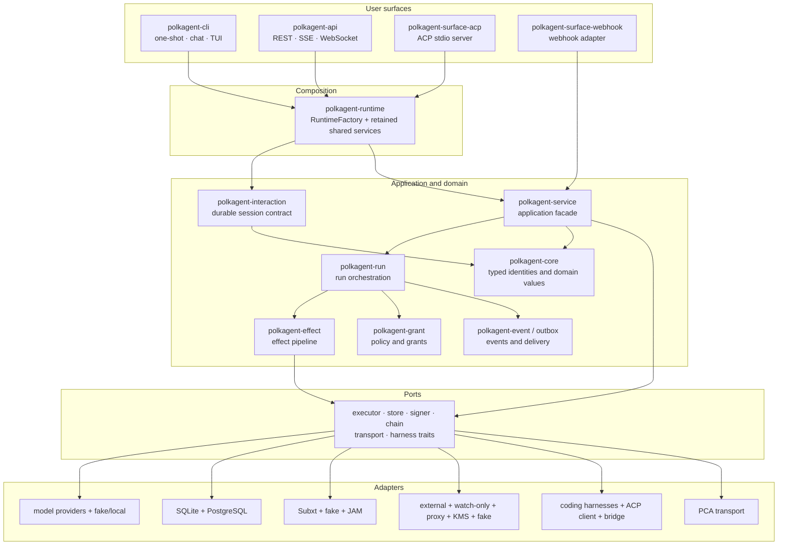
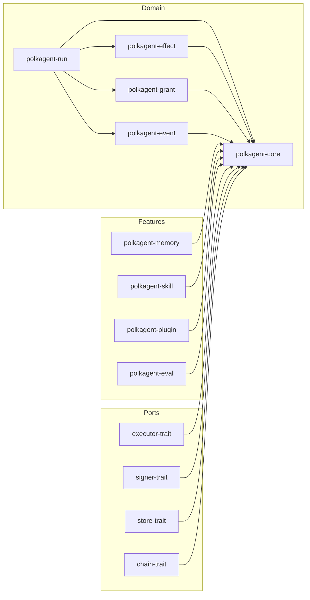
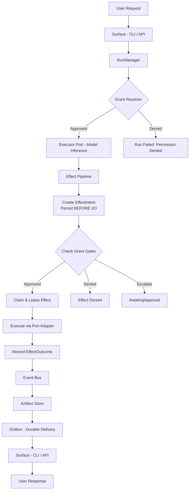
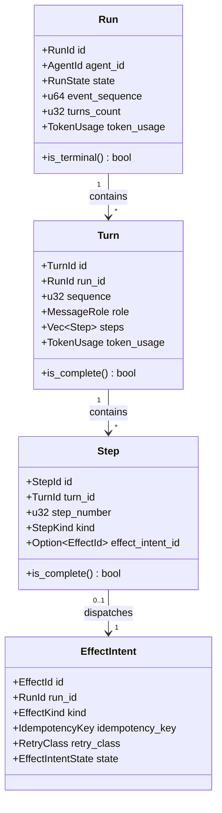

# Polkagent Architecture

This document expands on the high-level picture in the
[repository README](../README.md#architecture-at-a-glance). If this is your
first architecture page, read [Core concepts](concepts.md) first.

> [!NOTE]
> This page maps crates and dependency direction. It does not imply that every
> listed adapter is wired into every product surface. For the executable
> composition boundary, read [Runtime/API composition](runtime-api-composition.md)
> and the [implementation status](../prd/STATUS.md).

## Hexagonal Architecture

Polkagent uses a hexagonal (ports and adapters) architecture. Domain logic lives in pure crates with no I/O dependencies. External systems are accessed through narrow trait-based ports, with concrete adapters provided separately.

**Strict dependency rules:**

- Domain crates depend only on other domain crates and general-purpose libraries (serde, uuid, chrono). They never depend on adapters or I/O libraries.
- Port crates define async trait interfaces. Each ships contract test suites that any adapter must pass.
- Adapter crates implement ports against real or fake external systems.
- Surface crates wire domain logic to user-facing interfaces.

## System overview

Arrows show runtime collaboration rather than every Cargo dependency. The
workspace enforces dependency direction through crate boundaries and
workspace-wide lint/test gates.

## Composition root

`polkagent-runtime` is the production composition root. `RuntimeFactory`
resolves configuration and builds the shared SQLite-backed stores, provider or
harness executors, chain/tool registry, event bus, `AppService`, and durable
interaction service used by CLI run, chat, TUI, ACP, and the ordinary HTTP
server.

That distinction prevents each surface from opening a private second database
or inventing its own semantics. It also makes missing composition visible: an
adapter can exist and pass focused tests while still being unavailable in the
ordinary product builder.

For the route-by-route production boundary, read
[Runtime/API composition](runtime-api-composition.md).

## Crate map

### Domain Crates

| Crate | Purpose |
|---|---|
| `polkagent-core` | Core types and domain logic |
| `polkagent-run` | Run/Turn state machine |
| `polkagent-effect` | Effect pipeline (intent → claim → execute → outcome) |
| `polkagent-grant` | Permission/grant resolution |
| `polkagent-event` | Event bus and lifecycle events |
| `polkagent-artifact` | Content-addressed artifact storage (BLAKE3) |
| `polkagent-outbox` | Durable ordered effect delivery |
| `polkagent-card` | Action card rendering |
| `polkagent-config` | TOML config loader with env overrides |
| `polkagent-interaction` | Surface-neutral durable session, turn, event, and command contracts |

### Port Crates (Trait Definitions)

| Crate | Purpose |
|---|---|
| `polkagent-store-trait` | Persistence |
| `polkagent-executor-trait` | LLM inference |
| `polkagent-signer-trait` | Transaction signing |
| `polkagent-chain-trait` | Blockchain interaction |
| `polkagent-transport-trait` | External communication |
| `polkagent-harness-trait` | Coding agent harness abstraction |

### Adapter crates

**Executors:** `polkagent-executor-anthropic`, `polkagent-executor-openai`,
`polkagent-executor-gemini`, `polkagent-executor-local`,
`polkagent-executor-openrouter`, `polkagent-executor-fake`.

**Signers:** `polkagent-signer-fake`, `polkagent-signer-external`,
`polkagent-signer-watchonly`, `polkagent-signer-proxy`,
`polkagent-signer-kms`.

**Stores:** `polkagent-store-sqlite`, `polkagent-store-postgres`,
`polkagent-store-sqlite-feed`, `polkagent-store-sqlite-group`.

**Chain:** `polkagent-chain-fake`, `polkagent-chain-subxt`,
`polkagent-chain-jam`.

**Transport:** `polkagent-transport-fake`, `polkagent-transport-pca`.

**Harnesses:** `polkagent-harness-claude`, `polkagent-harness-codex`,
`polkagent-harness-acp`, `polkagent-harness-cursor`,
`polkagent-harness-copilot`, `polkagent-harness-goose`,
`polkagent-harness-kiro`, `polkagent-harness-opencode`, and
`polkagent-harness-bridge`.

`polkagent-harness-acp` is a client adapter for downstream ACP harnesses.
`polkagent-surface-acp` is the separate inbound ACP agent server used by Zed.

### Surface Crates

| Crate | Purpose |
|---|---|
| `polkagent-cli` | CLI and TUI |
| `polkagent-api` | REST + WebSocket API |
| `polkagent-surface-acp` | Inbound ACP v1 stdio agent server |
| `polkagent-surface-webhook` | Webhook delivery |

The CLI and API use `polkagent-runtime`; a surface crate's presence alone does
not imply that all adapters are enabled by the ordinary builder.

### Tool Crates

| Crate | Purpose |
|---|---|
| `polkagent-tool` | Built-in tools (file.read, file.write, list_dir, shell, search_memory) |
| `polkagent-tool-governance` | Governance tools (referendum, track, voter, delegation, treasury overview) |
| `polkagent-tool-treasury` | Treasury tools (balance, staking, portfolio, transfer history, vesting) |

### Feature crates

Major feature families include:

| Family | Crates |
|---|---|
| Runtime/application | `polkagent-runtime`, `polkagent-service`, `polkagent-interaction`, `polkagent-conversation`, `polkagent-context` |
| Knowledge/extensions | `polkagent-memory`, `polkagent-skill`, `polkagent-plugin`, `polkagent-kit`, `polkagent-marketplace` |
| Polkadot/actions | `polkagent-metadata`, `polkagent-codec`, `polkagent-identity`, `polkagent-action-sign`, `polkagent-action-governance`, `polkagent-action-transfer` |
| Coordination/value | `polkagent-group`, `polkagent-feed`, `polkagent-payment`, `polkagent-billing` |
| Operations | `polkagent-audit`, `polkagent-health`, `polkagent-telemetry`, `polkagent-vitality`, `polkagent-migration` |
| Reliability | `polkagent-retry`, `polkagent-rate-limit`, `polkagent-cache`, `polkagent-fault`, `polkagent-batch`, `polkagent-scheduler` |
| Cloud building blocks | `polkagent-cloud-control`, `polkagent-cloud-worker` |

These families have different maturity. Consult the
[implementation status](../prd/STATUS.md) rather than deriving product support
from this inventory.

### Test Crates

| Crate | Purpose |
|---|---|
| `polkagent-test-fixtures` | Shared builders and factory functions |
| `polkagent-integration-tests` | Cross-crate integration tests |
| `polkagent-security-tests` | Security test suite |

### Crate Dependency Graph

## Key Invariants

### INV-01: Signer Isolation

The signer never sees model-modified data. Only user-approved, integrity-checked bytes reach the signing boundary. The model may explain, annotate, or summarize, but the canonical payload entering the signer is constructed from verified chain data. This prevents a compromised or hallucinating model from altering transaction semantics.

### INV-02: Effect Intent Before I/O

An `EffectIntent` is durably persisted BEFORE any corresponding I/O is attempted. If the process crashes between persisting the intent and completing the I/O, recovery detects the incomplete intent and decides whether to retry or mark as unknown — but never silently skips or duplicates.

### INV-03: No Silent Duplicate Effects

A crash never silently repeats an irreversible external action. Uses idempotency keys, claim/lease semantics, and outcome recording to ensure each effect is attempted at most once per attempt record. Mid-flight crashes result in `Unknown` outcome requiring explicit resolution.

### INV-04: Unknown Stays Unknown

`EffectOutcome::Unknown` is never automatically collapsed to Success or Failure. Remains visibly unknown in all projections, APIs, and UIs until explicit resolution.

## Data Flow

## Run / Turn / Step / Effect Hierarchy

## Testing Strategy

- Unit tests in each crate for domain logic
- Property-based tests (proptest) for invariant verification
- Port contract tests shipped with each `-trait` crate
- Integration tests in `polkagent-integration-tests`

See [CONTRIBUTING.md](../CONTRIBUTING.md) for running tests.
