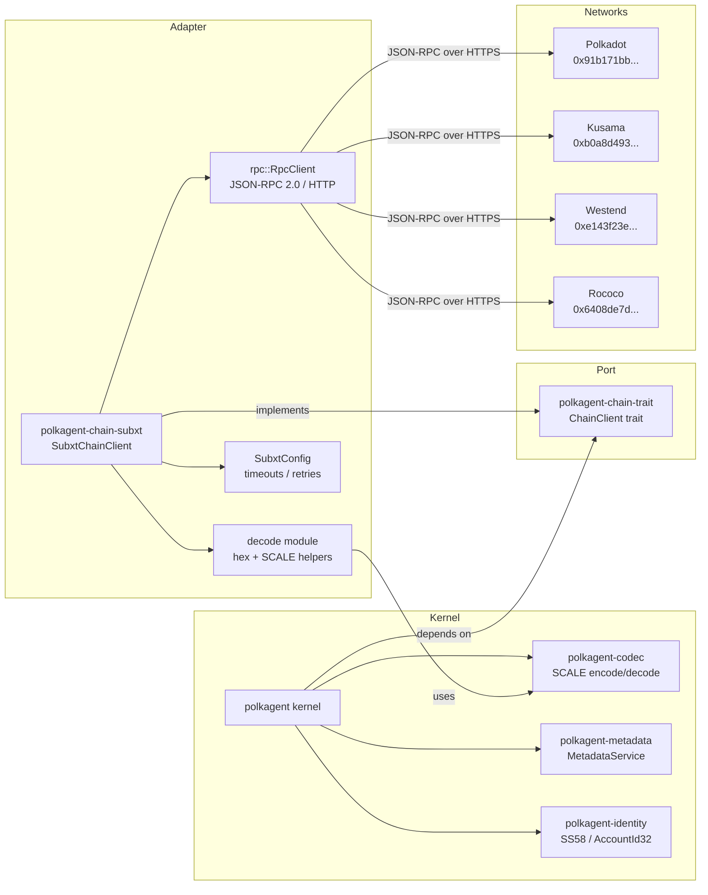
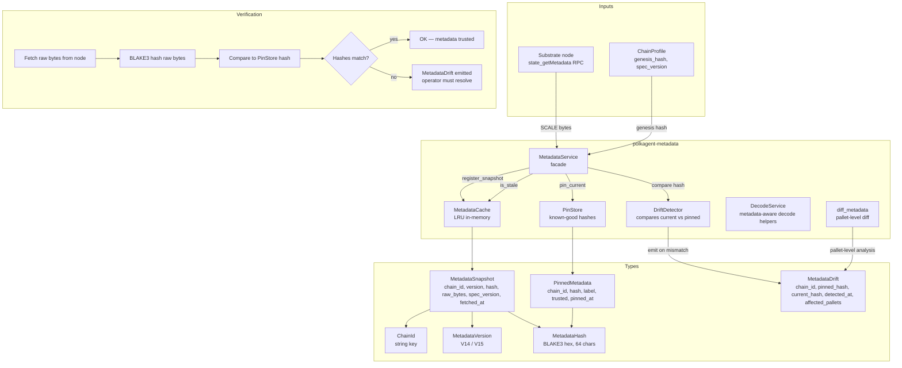
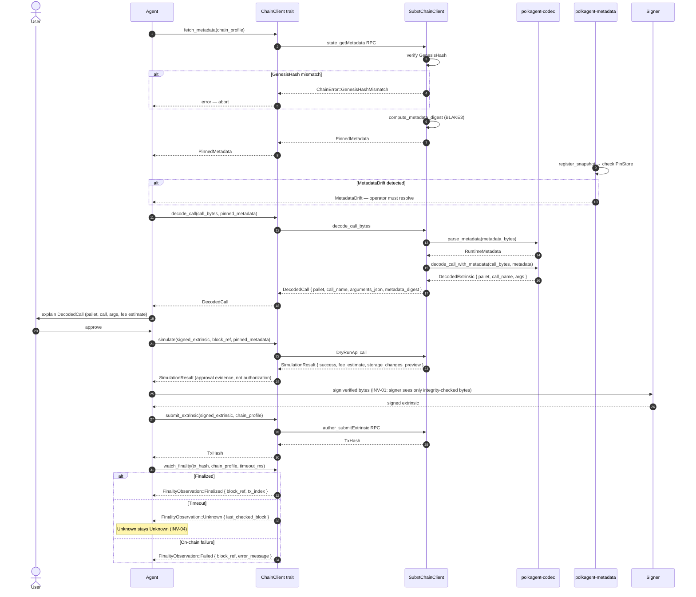

# Chain Integrations (PRD-05)

This document describes how polkagent connects to Polkadot-family networks:
the port/adapter architecture, metadata management, extrinsic encoding and
decoding, identity primitives, and the CLI commands that expose these
capabilities to operators.

Cross-references:
- Signer isolation and the effect pipeline: [safety.md](safety.md)
- Governance and treasury tools that use chain reads: [tools-and-skills.md](tools-and-skills.md)
- CLI chain commands: [cli.md](cli.md#chain)

---

## Overview

Polkagent connects to Polkadot, Kusama, Westend, and Rococo (and any
compatible Substrate network) through a narrow, versioned adapter boundary.
The kernel never speaks directly to a node; it depends only on the
`ChainClient` trait defined in `polkagent-chain-trait`. The concrete adapter
(`polkagent-chain-subxt`) issues JSON-RPC 2.0 calls over HTTP using `reqwest`
and translates responses into kernel-facing types.

This design means:
- The kernel can be tested against a mock without a running node.
- A future light-client or WebSocket adapter can be swapped in with no kernel
  changes.
- SCALE encoding and decoding (`polkagent-codec`) is completely independent
  of `subxt` or the Polkadot SDK.

Before polkagent can submit or explain any extrinsic it must:

1. Verify the node's genesis hash against the configured `ChainProfile`.
2. Fetch and pin runtime metadata (`PinnedMetadata`), recording the `MetadataDigest`.
3. Decode the SCALE-encoded call bytes using only that pinned metadata (no
   additional RPC calls).
4. Present the decoded `DecodedCall` to the agent for user explanation.
5. Simulate the signed extrinsic (`SimulationResult`) as additional approval
   evidence.
6. Submit the user-approved, signer-produced extrinsic and watch for finality.

---

## Diagram 1: Chain Integration Stack



---

## Chain Trait and Adapters

### `polkagent-chain-trait`

Crate path: `crates/polkagent-chain-trait/src/lib.rs`

Defines the `ChainClient` trait, all supporting domain types, and the
`ChainError` enum. The kernel depends only on this crate — never on a concrete
adapter.

**Trait contract (key invariants):**

| Method | Invariant |
|---|---|
| `fetch_metadata` | Must verify genesis hash before returning; returns `ChainError::GenesisHashMismatch` on mismatch |
| `decode_call` | Must use only the supplied `PinnedMetadata`; no additional RPC calls allowed |
| `simulate` | Result is approval evidence, not authorization |
| `submit_extrinsic` | Returns `TxHash` immediately; does not wait for inclusion |
| `watch_finality` | Returns `FinalityObservation::Unknown` on timeout; never returns `Finalized` without verified on-chain evidence |

**Supporting types:**

| Type | Purpose |
|---|---|
| `ChainProfileId` | String key identifying a configured network profile |
| `GenesisHash` | Hex-encoded genesis hash; used to verify network identity |
| `MetadataDigest` | BLAKE3 hex digest of pinned metadata bytes |
| `TxHash` | Hex-encoded transaction hash returned after submission |
| `BlockRef` | Block number + hex hash pair |
| `ChainProfile` | Named, pinned configuration: genesis hash, spec version, RPC endpoints, `NetworkType` |
| `NetworkType` | `Production` / `Testnet` / `Development` / `Local` |
| `PinnedMetadata` | Fetched metadata snapshot: bytes, digest, spec version, block ref, timestamp |
| `DecodedCall` | Decoded extrinsic: pallet name, call name, JSON arguments, metadata digest |
| `SimulationResult` | Dry-run result: fee estimate, storage changes preview, block ref |
| `DryRunResult` | `DryRunApi` result: execution ok flag, events, optional destination fee |
| `FinalityObservation` | `Finalized` / `Failed` / `Unknown` — with strict semantics |
| `ExtrinsicStatus` | `Broadcast` / `InBestBlock` / `Finalized` / `Dropped` |
| `StorageChange` | Single storage slot change: key prefix, `StorageChangeType` |

**`ChainError` variants:**

| Variant | Retryable |
|---|---|
| `ProfileNotFound` | No |
| `Rpc { retryable: true, .. }` | Yes |
| `GenesisHashMismatch` | No |
| `MetadataFetch` | No |
| `SimulationFailed` | No |
| `DecodeFailed` | No |
| `FinalityTimeout` | No (treat as `Unknown`) |
| `ExtrinsicRejected` | No |
| `Unsupported` | No |
| `Internal` | No |

### `polkagent-chain-subxt`

Crate path: `crates/polkagent-chain-subxt/src/lib.rs`

The production adapter. Implements `ChainClient` by issuing raw JSON-RPC 2.0
requests to Substrate nodes via HTTP (`reqwest`). SCALE decoding is delegated
to `polkagent-codec`.

**Internal modules:**

| Module | Contents |
|---|---|
| `rpc` | `RpcClient`, `JsonRpcRequest`, `JsonRpcResponse`, `NodeHealth`; typed wrappers for `state_getMetadata`, `state_getStorage`, `author_submitExtrinsic`, `chain_getBlockHash`, `chain_getFinalizedHead`, `chain_getHeader`, `system_health`, `system_version`, `state_call` |
| `decode` | `hex_to_bytes`, `bytes_to_hex`, `parse_runtime_metadata`, `compute_metadata_digest`, `decode_call_bytes`, `decode_call_with_runtime_metadata`, `parse_block_number_hex` |
| `config` | `SubxtConfig`, `SubxtConfigBuilder` |
| `error` | `SubxtError` |

**Builder pattern:**

```rust
let client = SubxtChainClientBuilder::new()
    .add_profile(ChainProfile {
        id: ChainProfileId::new("polkadot"),
        name: "Polkadot".into(),
        genesis_hash: GenesisHash::new(
            "0x91b171bb158e2d3848fa23a9f1c25182fb8e20313b2c1eb49219da7a70ce90c3",
        ),
        spec_version: Some(1_003_000),
        rpc_endpoints: vec!["https://rpc.polkadot.io".into()],
        network_type: NetworkType::Production,
    })
    .build()?;
```

**`SubxtConfig` defaults:**

| Setting | Default |
|---|---|
| `request_timeout` | 30 s |
| `connect_timeout` | 10 s |
| `max_retries` | 3 |
| `retry_base_delay` | 500 ms |
| `retry_max_delay` | 10 s |
| `max_connections_per_endpoint` | 4 |

Retry uses exponential backoff: `base_delay * 2^attempt`, capped at
`retry_max_delay`. Only `SubxtError::Transport { retryable: true }` triggers
a retry.

### XCM support

XCM (Cross-Consensus Messaging) domain types and route resolution live in
`polkagent-chain-trait::xcm`. The `ChainClient` trait includes XCM-specific
methods:

| Method | Purpose |
|---|---|
| `xcm_query_acceptable_payment_assets` | Assets accepted for XCM fee payment at a given version |
| `xcm_query_delivery_fee` | Delivery fee in planck units for sending a message to `dest` |
| `is_trusted_teleporter` | Whether `dest` accepts teleport for an asset |
| `is_reserve_transfer_supported` | Whether reserve-backed transfer is supported to `dest` |

Types: `XcmMechanism` (`Teleport` / `ReserveTransfer`), `XcmHop`, `XcmRoute`,
`XcmPlan`, `FeeEstimate`, `XcmVersionCompat`, `XcmError`.

---

## Supported Networks

| Network | Type | SS58 Prefix | Genesis Hash |
|---|---|---|---|
| Polkadot | `Production` | 0 | `0x91b171bb158e2d3848fa23a9f1c25182fb8e20313b2c1eb49219da7a70ce90c3` |
| Kusama | `Production` | 2 | `0xb0a8d493285c2df73290dfb7e61f870f17b41801197a149ca93654499ea3dafe` |
| Westend | `Testnet` | 42 | `0xe143f23803ac50e8f6f8e62695d1ce9e4e1d68aa36c1cd2cfd15340213f3423e` |
| Rococo | `Testnet` | 42 | `0x6408de7737c59c238890533af25896a2c20608d8b380bb01029acb392781063e` |

Each network is registered as a `ChainProfile` in the polkagent configuration.
The adapter verifies the node's genesis hash on every `fetch_metadata` call
and returns `ChainError::GenesisHashMismatch` if it differs from the profile.

---

## Extrinsic Encoding and Decoding

### `polkagent-codec`

Crate path: `crates/polkagent-codec/src/lib.rs`

Pure-Rust SCALE implementation with no dependency on `parity-scale-codec`,
`subxt`, or any Polkadot SDK crate.

**Modules:**

| Module | Purpose |
|---|---|
| `scale` | `ScaleDecoder`, `ScaleEncoder` — core SCALE primitives |
| `metadata` | `RuntimeMetadata`, `PalletMetadata`, `CallMetadata`, `FieldMetadata`, `TypeRegistry`, `TypeDef`, `PrimitiveType`, `ConstantMetadata`, `EventMetadata`, `StorageMetadata`, `VariantDef`; `parse_metadata`, `parse_metadata_v14`, `parse_metadata_v15` |
| `decode` | `decode_extrinsic`, `decode_call_with_metadata`, `DecodedExtrinsic`, `DecodedField`, `FieldValue` |
| `call` | `decode_batch_call`, `decode_proxy_call`, `extract_transfer_amount`, `is_batch_call`, `is_proxy_call`, `is_transfer_call` |
| `error` | `CodecError`, `Result` |

**`FieldValue` variants:**

`U8`, `U16`, `U32`, `U64`, `U128`, `Bool`, `String`, `Bytes`, `AccountId`,
`Compact`, `Sequence`, `Composite`, `Variant { index, name, fields }`.

Large integers (`U128`, `Compact`) are rendered as strings in JSON output to
avoid JavaScript precision loss.

**Decoding pipeline in `polkagent-chain-subxt::decode`:**

1. `hex_to_bytes` strips `0x` prefix and decodes hex.
2. `parse_runtime_metadata` parses the raw SCALE bytes using
   `polkagent_codec::parse_metadata`.
3. `compute_metadata_digest` computes a BLAKE3 hash of the raw bytes and
   wraps it as `MetadataDigest("0x{hash}")`.
4. `decode_call_bytes` calls `decode_call_with_metadata` from `polkagent-codec`
   and maps results to `DecodedCall { pallet, call_name, arguments_json, metadata_digest }`.

---

## Diagram 2: Metadata Management



### Metadata lifecycle

1. `SubxtChainClient::fetch_metadata` calls `state_getMetadata` on the node
   for the pinned block hash.
2. `compute_metadata_digest` hashes the raw bytes with BLAKE3 to produce a
   `MetadataDigest`.
3. The result is returned as `PinnedMetadata` (from `polkagent-chain-trait`).
4. In `polkagent-metadata`, `MetadataService::register_snapshot` stores the
   snapshot in `MetadataCache` and compares its `MetadataHash` against the
   `PinStore`.
5. If the hash differs from any trusted pin, `DriftDetector` emits a
   `MetadataDrift` record listing `affected_pallets`.
6. `diff_metadata` can produce a structured `MetadataDiff` / `PalletDiff`
   for operator review.
7. `validate_network` checks the network-level configuration before any
   operation is allowed.

**Staleness check:** `MetadataService::is_stale(chain_id, ttl)` returns `true`
if the most recent snapshot in the cache was fetched longer ago than `ttl`.

**Metadata versions:** `polkagent-codec` supports both V14 (`parse_metadata_v14`)
and V15 (`parse_metadata_v15`) runtime metadata formats, selectable via
`MetadataVersion::V14` / `MetadataVersion::V15`.

---

## Diagram 3: Transaction Decode and Verify Sequence



**Safety notes (see [safety.md](safety.md)):**

- Step 13 reflects **INV-01 (Signer Isolation)**: the signer receives only
  bytes verified by `decode_call` against pinned metadata. The model cannot
  alter the payload that reaches the signing boundary.
- `FinalityObservation::Unknown` on timeout reflects **INV-04**: unknown
  outcomes are never automatically resolved to success or failure.
- `simulate` produces evidence for the approval flow; a successful simulation
  is not authorization to submit (INV-01 / INV-02).

---

## Runtime Metadata

### `polkagent-metadata`

Crate path: `crates/polkagent-metadata/src/lib.rs`

Provides metadata fetching, caching, pinning, and drift detection as a
standalone service with no dependency on concrete runtimes or `subxt`.

**Public API:**

| Export | Type | Purpose |
|---|---|---|
| `MetadataService` | struct | Facade composing cache, pin store, drift detector |
| `MetadataCache` | struct | LRU in-memory cache of `MetadataSnapshot`s |
| `PinStore` | struct | Stores `MetadataHash`es of known-good metadata |
| `DriftDetector` | struct | Compares current snapshot hash to pinned hash |
| `DecodeService` | struct | Metadata-aware decode helpers |
| `CachedMetadataService` | struct | Feature-gated `cached` variant |
| `diff_metadata` | fn | Returns `MetadataDiff` between two `RuntimeMetadata` values |
| `generate_impact_brief` | fn | Human-readable summary of a `MetadataDiff` |
| `is_breaking` | fn | Whether a `MetadataDiff` is a breaking change |
| `MetadataDiff` | struct | Structured diff: added/removed/changed pallets |
| `PalletDiff` | struct | Per-pallet change record |
| `validate_network` | fn | Pre-flight network configuration check |

**Key types (from `polkagent-metadata::types`):**

| Type | Fields |
|---|---|
| `ChainId` | `String` — primary key for all cache/pin operations |
| `MetadataVersion` | `u32`; constants `V14`, `V15` |
| `MetadataHash` | BLAKE3 hex string, 64 chars; computed via `MetadataHash::from_bytes` |
| `MetadataSnapshot` | `chain_id`, `version`, `hash`, `raw_bytes`, `fetched_at`, `spec_version` |
| `PinnedMetadata` | `chain_id`, `hash`, `pinned_at`, `label`, `trusted` |
| `MetadataDrift` | `chain_id`, `pinned_hash`, `current_hash`, `detected_at`, `affected_pallets` |
| `PalletInfo` | `name`, `index`, `calls`, `events`, `storage_entries`, `constants` |
| `CallInfo` | `pallet`, `name`, `index`, `args: Vec<(String, String)>` |

Note: `PinnedMetadata` in `polkagent-metadata::types` differs from
`PinnedMetadata` in `polkagent-chain-trait`. The chain-trait version carries
the full `metadata_bytes` and `block_ref` for active in-flight use; the
metadata-service version carries only the hash, label, and trust flag for
long-term pinning records.

---

## Identity and Addressing

### `polkagent-identity`

Crate path: `crates/polkagent-identity/src/lib.rs`

Provides all account and address primitives for Substrate-based chains.
No dependency on `subxt` or Polkadot SDK crates.

**Modules:**

| Module | Contents |
|---|---|
| `types` | `AccountId32`, `NetworkId`, `SS58Address`, `ChainAccount` |
| `ss58` | `encode_ss58`, `decode_ss58` — low-level SS58 encoding/decoding |
| `agent_identity` | `AgentIdentity`, `AgentCard` |
| `resolver` | `IdentityResolver`, `CachedIdentityResolver`, `IdentityField`, `IdentityResolution`, `JudgmentLevel`, `RegistrarJudgment`, `SubIdentity` |
| `error` | `IdentityError` |

---

## Diagram 4: Identity Types

```mermaid
classDiagram
    class AccountId32 {
        +[u8; 32] bytes
        +from_bytes(bytes: [u8; 32]) AccountId32
        +from_hex(hex: &str) Result~AccountId32~
        +to_bytes() [u8; 32]
        +display: "0x{64 hex chars}"
    }

    class NetworkId {
        <<enumeration>>
        Polkadot
        Kusama
        Westend
        Generic(u16)
        +prefix() u16
        +name() &str
        +from_prefix(u16) NetworkId
    }

    class SS58Address {
        +String inner
        +encode(account: &AccountId32, network: NetworkId) SS58Address
        +decode(address: &str) Result~(AccountId32, NetworkId)~
        +as_str() &str
    }

    class ChainAccount {
        +AccountId32 account
        +NetworkId network
        +Option~String~ label
        +new(account, network) ChainAccount
        +with_label(label) ChainAccount
        +ss58_address() SS58Address
    }

    class AgentIdentity {
        +AgentId agent_id
        +String display_name
        +Vec~ChainAccount~ accounts
        +DateTime~Utc~ created_at
        +HashMap~String,String~ metadata
        +new(agent_id, display_name) AgentIdentity
        +with_account(ChainAccount) AgentIdentity
    }

    class AgentCard {
        +AgentIdentity identity
        +Vec~String~ capabilities
    }

    class IdentityResolver {
        <<trait>>
        +resolve(account: &AccountId32) IdentityResolution
    }

    class CachedIdentityResolver {
        +resolve(account: &AccountId32) IdentityResolution
    }

    class IdentityResolution {
        +AccountId32 account
        +Option~String~ display
        +Vec~IdentityField~ fields
        +Vec~RegistrarJudgment~ judgments
        +Vec~SubIdentity~ sub_identities
    }

    class RegistrarJudgment {
        +u32 registrar_index
        +JudgmentLevel level
    }

    class JudgmentLevel {
        <<enumeration>>
        Unknown
        FeePaid
        Reasonable
        KnownGood
        OutOfDate
        LowQuality
        Erroneous
    }

    AccountId32 --> SS58Address : encoded by
    NetworkId --> SS58Address : prefix used in
    AccountId32 *-- ChainAccount : has
    NetworkId *-- ChainAccount : has
    ChainAccount *-- AgentIdentity : owns many
    AgentIdentity *-- AgentCard : wrapped by
    CachedIdentityResolver ..|> IdentityResolver : implements
    IdentityResolver --> IdentityResolution : produces
    IdentityResolution *-- RegistrarJudgment : contains
    RegistrarJudgment --> JudgmentLevel : uses
```

**SS58 address prefixes by network:**

| Network | `NetworkId` variant | Prefix |
|---|---|---|
| Polkadot | `NetworkId::Polkadot` | 0 |
| Kusama | `NetworkId::Kusama` | 2 |
| Westend | `NetworkId::Westend` | 42 |
| Other | `NetworkId::Generic(n)` | `n` |

`SS58Address::encode` and `decode` use the `ss58` module which applies Blake3
for checksums (simplified implementation; see crate docs for production
interoperability note).

The same `AccountId32` encodes to a different `SS58Address` on each network
because the prefix byte(s) differ. `SS58Address::decode` recovers both the
`AccountId32` and the `NetworkId` from the encoded string.

---

## CLI Chain Commands

The `polkagent chain` sub-command group exposes chain operations to operators.
Full reference: [cli.md](cli.md#chain).

```
polkagent chain <SUBCOMMAND> [--chain <CHAIN>]
```

| Subcommand | Description |
|---|---|
| `chain status` | Show connection status for the configured chain profile, including genesis hash verification and node health (`system_health` RPC) |
| `chain metadata` | Fetch and display runtime metadata for the chain: spec version, `MetadataHash`, pallet count, `MetadataVersion` |
| `chain decode <HEX>` | Decode a hex-encoded extrinsic or call using pinned metadata; prints `DecodedCall` (pallet, call name, arguments as JSON) |
| `chain balance <ADDRESS>` | Query the free balance for an SS58 address using `state_getStorage` |

The `polkagent explain <EXTRINSIC_HEX>` top-level command is a higher-level
variant that decodes, simulates, and presents an agent-generated natural
language explanation of a hex extrinsic.

**Common flag:**

```
--chain <CHAIN>    Chain profile ID (e.g. "polkadot", "kusama", "westend")
```

---

## Cross-References

| Topic | Document |
|---|---|
| Signer isolation (INV-01) and the effect pipeline that wraps `submit_extrinsic` | [safety.md — INV-01: Signer Isolation](safety.md#inv-01-signer-isolation) |
| `FinalityObservation::Unknown` and INV-04 | [safety.md — INV-04: Unknown Stays Unknown](safety.md#inv-04-unknown-stays-unknown) |
| `SignatureRequest` effect kind (NoAutoRetry, 1 attempt) | [safety.md — Effect Kinds table](safety.md#effect-kinds) |
| Governance tools using `chain.query` grant and chain reads | [tools-and-skills.md — Governance Tools](tools-and-skills.md#governance-tools) |
| Treasury tools using `chain.query` grant | [tools-and-skills.md — Treasury Tools](tools-and-skills.md#treasury-tools) |
| Full CLI reference including all `chain` subcommands | [cli.md — chain](cli.md#chain) |
| `polkagent explain` command | [cli.md — explain](cli.md#explain-extrinsic_hex) |
