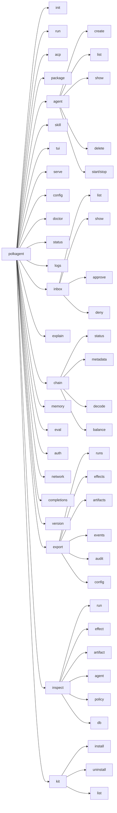
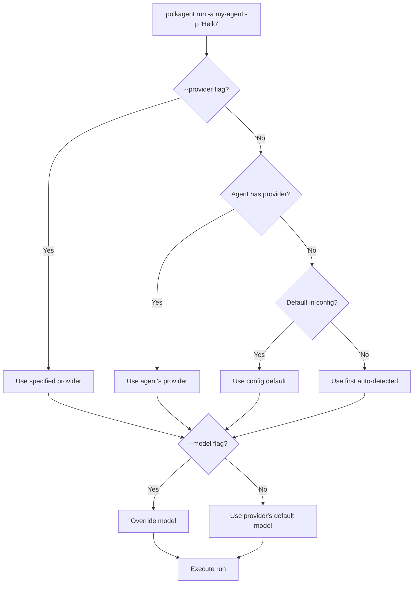

# CLI Reference



## Global Flags

These flags are available on all commands.

| Flag | Description |
|------|-------------|
| `--no-color` | Disable colours and TUI effects |
| `-c, --config <PATH>` | Override config file path |
| `-v, --verbose` | Increase verbosity (`-v` = debug, `-vv` = trace) |
| `--format <FORMAT>` | Output format: `human`, `json`, `json-pretty`, `table` (default: `human`) |
| `--dry-run` | No writes |
| `--yes` | Skip approval prompts |
| `--log-file <PATH>` | Override log file; use `-` for stderr only |

---

## Commands

### `init [DIR]`

Initialize a `.polkagent/` project directory.

```
polkagent init [DIR]
```

| Flag | Description |
|------|-------------|
| `--force` | Overwrite existing project directory |

**Examples:**

```bash
polkagent init
polkagent init ./my-project
```

---

### `run`

Execute a run against an agent.

```
polkagent run -a <AGENT> -p <TEXT> [FLAGS]
```

| Flag | Description |
|------|-------------|
| `-a, --agent-id <AGENT>` | Agent name or UUID (required) |
| `-p, --prompt <TEXT>` | Prompt text (required) |
| `--json` | JSON output |
| `--stream / --no-stream` | Stream live token output (default: stream) |
| `--provider <PROVIDER>` | Override provider |
| `-m, --model <MODEL>` | Override model (e.g. `anthropic/claude-opus-4-6`) |
| `--harness <HARNESS>` | Override harness |
| `--timeout <SECS>` | Cancel after N seconds (default: 300) |

**Examples:**

```bash
polkagent run -a my-agent -p "Summarize referendum 1234"
polkagent run -a my-agent -p "Query balance" --json --no-stream
polkagent run -a my-agent -p "Research" --model gpt-4o --timeout 120
```

#### Output

By default, `run` produces styled inline output using the ROSEDUST design
system. A startup banner identifies the agent, model, and run ID; events are
rendered with colored Unicode glyphs; and a summary card reports the outcome.

```
 ┌───────────────────────────────────────────────┐
 │  POLKAGENT RUN                      v0.1.0    │
 │  Agent: my-agent  Model: claude-opus-4-6      │
 │  Run:   ab12cd34                              │
 └───────────────────────────────────────────────┘
  ▶ Running

 ── Turn 1 ──
  ◉ read_file
  ✓ read_file (0.3s)

 ┌───────────────────────────────────────────────┐
 │  ✓ Run completed                    4.2s      │
 │  Turns: 1   Tools: 1   Effects: 0            │
 └───────────────────────────────────────────────┘
```

Styling is disabled automatically when output is piped or when `NO_COLOR` is
set. `--json` mode bypasses all styled output entirely.

Internal tracing logs are written to stderr. Use `-v` or `-vv` for debug/trace
verbosity.

---

### `acp`

Start an ACP v1 stdio server for editor integrations such as Zed.

```text
polkagent acp [--agent <AGENT>] [--provider <PROVIDER>] [--model <MODEL>] [--timeout <SECS>]
```

Stdout is reserved for ACP JSON-RPC traffic. When `--agent` is omitted, use
`/agents` and `/agent <name-or-id>` from the editor session. See
[ACP and Zed integration](acp-zed.md) for setup, verified behavior, and current
gaps.

---

### `package`

Manage durable local plugin and product-kit packages.

```text
polkagent package [--store <PATH>] [--trust-policy <POLICY>] <COMMAND>
```

| Command | Purpose |
|---------|---------|
| `install <PATH>` | Install a local plugin or product kit |
| `list` | List installed packages |
| `get <NAME>` | Show the active package and retained history |
| `update <PATH>` | Install and select a newer local version |
| `rollback <NAME> [--to <VERSION>]` | Select a retained version |
| `uninstall <NAME>` | Remove a package and retained content |

`--store` overrides `POLKAGENT_PACKAGE_STORE` and config-derived defaults.
Global `--format json`/`json-pretty`, `--dry-run`, and `--yes` are supported.
Strict trust is the default and currently rejects unsigned packages or
signature claims that have not been cryptographically verified. Development
trust is an explicit local-risk opt-in that retains integrity checks and emits
warnings:

```bash
polkagent package --trust-policy development install ./local-plugin
polkagent package list
polkagent package get local-plugin
polkagent package --trust-policy development update ./local-plugin-v2
polkagent package rollback local-plugin --to 1.0.0
polkagent --yes package uninstall local-plugin
```

Package management is durable across restarts, but installed content is not
yet activated by `run` or the API and no OS/WASM sandbox or cryptographic trust
pipeline is connected.

---

### `agent`

Agent CRUD and lifecycle management.

#### `agent create <NAME>`

Create a new agent.

```
polkagent agent create <NAME> [FLAGS]
```

| Flag | Description |
|------|-------------|
| `-m, --model <MODEL>` | Model ID (default: `anthropic/claude-sonnet-4-6`) |
| `-d, --description <TEXT>` | Agent description |
| `--capability <CAP>` | Capability to assign (repeatable) |
| `--max-turns <N>` | Maximum turns per run |
| `--preferred-model <MODEL_ID>` | Preferred model ID |
| `--timeout <SECS>` | Default timeout in seconds |
| `--max-tokens-per-turn <N>` | Maximum tokens per turn |
| `--json` | JSON output |

**Example:**

```bash
polkagent agent create researcher --model anthropic/claude-opus-4-6 -d "Governance researcher"
```

#### `agent list`

List all agents.

```bash
polkagent agent list
```

#### `agent show <ID>`

Show details for an agent.

```bash
polkagent agent show <ID>
```

#### `agent delete <ID>`

Delete an agent.

```bash
polkagent agent delete <ID>
```

#### `agent start <ID>`

Start an agent.

```bash
polkagent agent start <ID>
```

#### `agent stop <ID>`

Stop a running agent.

```bash
polkagent agent stop <ID>
```

#### `agent pause <ID>`

Pause an agent.

```bash
polkagent agent pause <ID>
```

#### `agent resume <ID>`

Resume a paused agent.

```bash
polkagent agent resume <ID>
```

---

### `skill`

Skill management.

#### `skill list`

List installed skills.

```bash
polkagent skill list
```

#### `skill install <PATH>`

Install a skill from a path.

```bash
polkagent skill install <PATH>
```

#### `skill update <NAME>`

Update a skill.

```bash
polkagent skill update <NAME>
```

#### `skill remove <NAME>`

Remove a skill.

```bash
polkagent skill remove <NAME>
```

#### `skill show <NAME>`

Show details for a skill.

```bash
polkagent skill show <NAME>
```

---

### `tui`

Launch the interactive ROSEDUST terminal UI.

```bash
polkagent tui
polkagent tui --tab console
```

Running `polkagent` with no subcommand also opens the TUI when stdout is an
interactive terminal. The actionable Console is intentionally a bounded
single-run surface:

| Key | Action |
|-----|--------|
| `F9` or `9` | Open Console |
| `p` | Select the highlighted/first active agent and compose a prompt |
| `Enter` | Submit the prompt and start a durable run |
| `x` | Request cancellation of the active Console run |
| `F3` | Inspect the selected durable run |
| `F5` | Inspect its timeline |

The Console projects live text, lifecycle/tool progress, errors, and final
usage. It currently supports one single-line prompt/run at a time; durable
multi-turn conversations, history, slash commands, simultaneous orchestration,
restart resume, and service-routed approvals remain open. A root `--config`
path is used consistently for the TUI database and its run/provider settings.

---

### `serve`

Start the HTTP API and WebSocket server.

```
polkagent serve [FLAGS]
```

| Flag | Description |
|------|-------------|
| `-p, --port <PORT>` | Port to listen on (default: `8080`) |
| `--host <HOST>` | Host to bind to (default: `0.0.0.0`) |
| `--cors-origin <ORIGIN>` | Allowed CORS origin (repeatable) |
| `--read-only` | Reject all mutating requests |

> **Note:** The project config (`polkagent.toml`) distinguishes between two server sections: `[api]` (REST API, default `127.0.0.1:4840`) and `[server]` (agent-facing gRPC/HTTP, default `127.0.0.1:9090`). The `serve` CLI flag `--port` overrides the bind port for the HTTP API started by this command and defaults to `8080` when no config file entry is present.

**Examples:**

```bash
# Start with default port (8080)
polkagent serve

# Bind to a specific interface and port
polkagent serve --port 9090 --host 127.0.0.1
```

---

### `config`

Configuration management.

#### `config show`

Show the resolved configuration.

```
polkagent config show [--toml | --json]
```

#### `config validate [PATH]`

Validate a config file.

```bash
polkagent config validate
polkagent config validate ./my-config.toml
```

---

### `doctor`

Run system health checks. Verifies provider connectivity and database status.

```bash
polkagent doctor
```

---

### `status`

Show agent count, active runs, effect queue depth, and memory usage.

```bash
polkagent status
```

---

### `logs`

Tail the event log.

```bash
polkagent logs
```

---

### `inbox`

Manage pending effects awaiting approval.

#### `inbox list`

List pending effects.

```bash
polkagent inbox list
```

#### `inbox show <EFFECT_ID>`

Show details for a pending effect.

```bash
polkagent inbox show <EFFECT_ID>
```

#### `inbox approve <EFFECT_ID>`

Approve a pending effect.

```bash
polkagent inbox approve <EFFECT_ID>
```

#### `inbox deny <EFFECT_ID>`

Deny a pending effect.

```
polkagent inbox deny <EFFECT_ID> [--reason <TEXT>]
```

#### `inbox history`

Show effect history.

```
polkagent inbox history [--limit N]
```

---

### `explain <EXTRINSIC_HEX>`

Decode and preview a hex-encoded extrinsic.

```bash
polkagent explain <EXTRINSIC_HEX>
```

**Example:**

```bash
polkagent explain 0x2804...
```

---

### `chain`

Chain interaction and inspection.

#### `chain status`

Show chain connection status.

```
polkagent chain status [--chain <CHAIN>]
```

#### `chain metadata`

Show chain metadata.

```
polkagent chain metadata [--chain <CHAIN>]
```

#### `chain decode <HEX>`

Decode hex data.

```
polkagent chain decode <HEX> [--chain <CHAIN>]
```

#### `chain balance <ADDRESS>`

Query balance for an address.

```
polkagent chain balance <ADDRESS> [--chain <CHAIN>]
```

---

### `memory`

Agent memory management.

#### `memory search <QUERY>`

Search memories.

```bash
polkagent memory search <QUERY>
```

#### `memory list`

List memory entries.

```bash
polkagent memory list
```

#### `memory forget <ID>`

Delete a memory entry.

```bash
polkagent memory forget <ID>
```

#### `memory stats`

Show memory statistics.

```bash
polkagent memory stats
```

#### `memory export <AGENT_ID> <OUTPUT_PATH>`

Export memories for an agent to a file.

```bash
polkagent memory export <AGENT_ID> <OUTPUT_PATH>
```

#### `memory import <INPUT_PATH>`

Import memories from a file.

```bash
polkagent memory import <INPUT_PATH>
```

#### `memory sweep <AGENT_ID>`

Clean old memories for an agent.

```
polkagent memory sweep <AGENT_ID> [FLAGS]
```

| Flag | Description |
|------|-------------|
| `--dry-run` | Preview without deleting |
| `--max-age-days <N>` | Delete memories older than N days |
| `--min-relevance <FLOAT>` | Minimum relevance score to retain |
| `--max-entries <N>` | Maximum number of entries to retain |

---

### `eval`

Evaluation suites.

#### `eval run <SUITE_PATH>`

Run an evaluation suite.

```bash
polkagent eval run <SUITE_PATH>
```

#### `eval list [DIR]`

List available evaluation suites.

```bash
polkagent eval list
polkagent eval list ./suites
```

#### `eval report <REPORT_PATH>`

View an evaluation report.

```bash
polkagent eval report <REPORT_PATH>
```

#### `eval compare <BASELINE> <CURRENT>`

Compare two evaluation reports.

```bash
polkagent eval compare <BASELINE> <CURRENT>
```

---

### `export`

Export data from the Polkagent database. Output is streamed so arbitrarily large result sets are never fully buffered in memory.

All `export` subcommands (except `config`) share a common set of filter flags:

| Flag | Description |
|------|-------------|
| `--format <FORMAT>` | Output format: `json`, `csv`, `jsonl` (default: `json`) |
| `--output <PATH>` | Write to a file instead of stdout |
| `--since <DATETIME>` | Include only records at or after this ISO-8601 datetime |
| `--until <DATETIME>` | Include only records at or before this ISO-8601 datetime |
| `--agent-id <ID>` | Filter by agent ID |
| `--run-id <ID>` | Filter by run ID |
| `--limit <N>` | Maximum number of records to export |

#### `export runs`

Export run history.

```
polkagent export runs [FLAGS]
```

**Examples:**

```bash
polkagent export runs
polkagent export runs --format csv --output runs.csv
polkagent export runs --since 2024-01-01T00:00:00Z --agent-id my-agent
```

#### `export effects`

Export the effect log.

```
polkagent export effects [FLAGS]
```

**Example:**

```bash
polkagent export effects --run-id <RUN_ID> --format jsonl
```

#### `export artifacts`

Export artifact metadata.

```
polkagent export artifacts [FLAGS]
```

| Flag | Description |
|------|-------------|
| `--include-bodies` | Include artifact bodies in the output (may be large) |

**Example:**

```bash
polkagent export artifacts --include-bodies --output artifacts.json
```

#### `export events`

Export the event log.

```
polkagent export events [FLAGS]
```

**Example:**

```bash
polkagent export events --format jsonl --output events.jsonl
```

#### `export audit`

Export the audit trail.

```
polkagent export audit [FLAGS]
```

**Example:**

```bash
polkagent export audit --since 2024-06-01T00:00:00Z --format csv
```

#### `export config`

Export the current resolved configuration as canonical TOML.

```
polkagent export config [--output <PATH>]
```

**Example:**

```bash
polkagent export config
polkagent export config --output polkagent-resolved.toml
```

---

### `inspect`

Read-only diagnostic inspection of individual entities stored in the local SQLite database or on disk. Each subcommand fetches a single entity by ID or path and formats it for human consumption.

#### `inspect run <RUN_ID>`

Show run details: status, agent, turns, steps, timing, and effects.

```
polkagent inspect run <RUN_ID> [--json]
```

**Example:**

```bash
polkagent inspect run ab12cd34-...
polkagent inspect run ab12cd34-... --json
```

#### `inspect effect <EFFECT_ID>`

Show effect details: intent, attempts, outcome, and timing.

```
polkagent inspect effect <EFFECT_ID> [--json]
```

**Example:**

```bash
polkagent inspect effect ef56gh78-...
```

#### `inspect artifact <ARTIFACT_ID>`

Show artifact metadata: kind, digest, size, and lineage.

```
polkagent inspect artifact <ARTIFACT_ID> [--json]
```

**Example:**

```bash
polkagent inspect artifact 9a3f...
```

#### `inspect agent <AGENT_ID>`

Show agent spec: model, tools, policies, autonomy level, and capabilities.

```
polkagent inspect agent <AGENT_ID> [--json]
```

**Example:**

```bash
polkagent inspect agent my-agent
polkagent inspect agent my-agent --json
```

#### `inspect policy <PATH>`

Parse and display a TOML policy file with its resolved rules.

```
polkagent inspect policy <PATH> [--json]
```

**Example:**

```bash
polkagent inspect policy .polkagent/policies/governance.toml
```

#### `inspect db`

Show database statistics: table row counts, database size, WAL size, and migration version.

```
polkagent inspect db [--json]
```

**Example:**

```bash
polkagent inspect db
polkagent inspect db --json
```

---

### `kit`

Manage product kits — bundles of agents, skills, and configuration that can be installed as a unit.

#### `kit install <PATH>`

Install a product kit from a local path.

```
polkagent kit install <PATH> [--json]
```

| Flag | Description |
|------|-------------|
| `--json` | JSON output |

**Example:**

```bash
polkagent kit install ./kits/governance-kit
polkagent kit install ./kits/governance-kit/kit.toml
```

#### `kit uninstall <NAME>`

Uninstall a product kit by name.

```
polkagent kit uninstall <NAME> [-y]
```

| Flag | Description |
|------|-------------|
| `-y, --yes` | Skip confirmation prompt |

**Example:**

```bash
polkagent kit uninstall governance-kit
```

#### `kit list`

List all installed product kits.

```bash
polkagent kit list [--json]
```

**Example:**

```bash
polkagent kit list
```

---

### `auth`

API key and credential management.

#### `auth login`

Log in to a provider.

```
polkagent auth login [--provider <PROVIDER>] [--dry-run]
```

#### `auth logout`

Log out.

```
polkagent auth logout [--dry-run]
```

#### `auth whoami`

Show the current authenticated identity.

```bash
polkagent auth whoami
```

#### `auth status`

Show authentication status.

```bash
polkagent auth status
```

---

### `network`

Network endpoint status and control.

#### `network status`

Show network connection status.

```bash
polkagent network status
```

#### `network metadata`

Show network metadata.

```bash
polkagent network metadata
```

#### `network start`

Start network connections.

```bash
polkagent network start
```

#### `network stop`

Stop network connections.

```bash
polkagent network stop
```

---

### `completions <SHELL>`

Generate shell completion scripts.

```bash
polkagent completions <SHELL>
```

Supported shells: `bash`, `zsh`, `fish`, `powershell`.

**Example:**

```bash
polkagent completions bash > ~/.bash_completion.d/polkagent
```

---

### `version`

Print version information and exit.

```bash
polkagent version
```

---

## Provider Resolution


