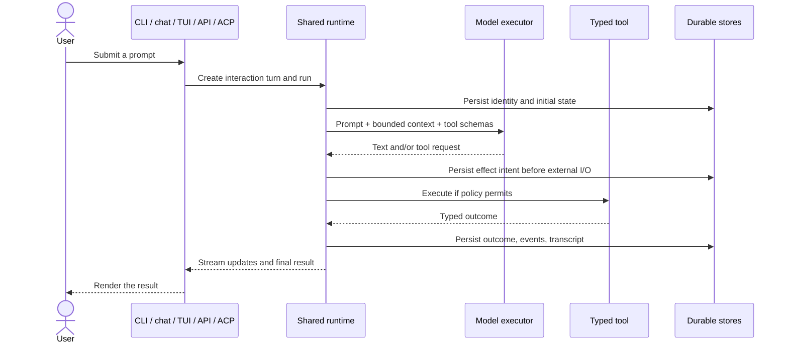
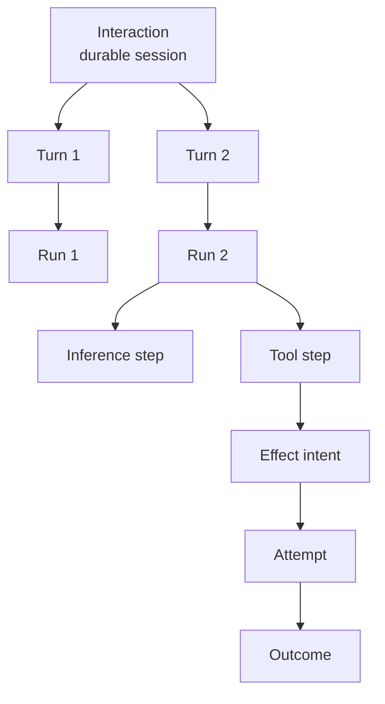
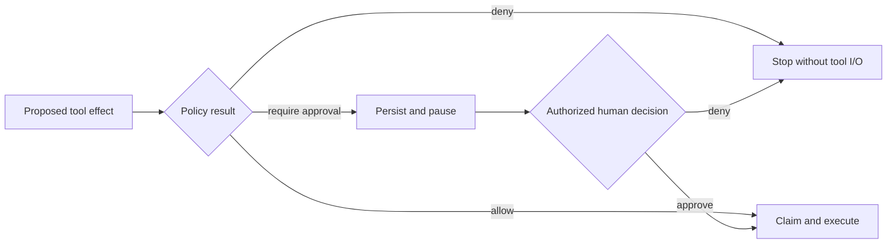
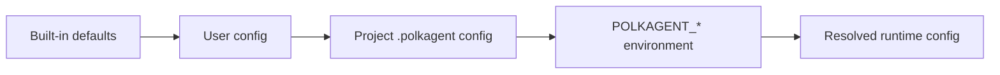

# Core concepts

This guide supplies the mental model used by the rest of the documentation. It
assumes no prior knowledge of Polkagent or agent frameworks.

## A request from beginning to end



Not every prompt calls a tool. When it does, Polkagent separates what the model
*asked for* from what the runtime is *authorized to perform*.

## The essential vocabulary

### Agent

An **agent** is a durable specification: a name, model, description, declared
capabilities, and execution limits. It is not a continuously running process.
The same agent can participate in many runs or durable interactions.

```bash
polkagent agent create researcher \
  --model anthropic/claude-sonnet-4-6 \
  --description "Summarizes governance information"
```

The CLI accepts an agent name or UUID in many places. HTTP resource paths
normally use the returned UUID.

### Provider, model, executor, and harness

These terms are related but not interchangeable:

| Term | Meaning | Example |
|---|---|---|
| **Provider** | A service or local backend that exposes models | Anthropic, OpenAI, Gemini, OpenRouter, Ollama |
| **Model** | The inference target selected for a run | `anthropic/claude-sonnet-4-6` |
| **Executor** | Polkagent's typed adapter around model inference | `polkagent-executor-anthropic` |
| **Harness** | An external agent program Polkagent can drive | Claude Code, Codex, an ACP-compatible tool |

Use `--no-harness` when you specifically want direct model-executor behavior.
Without a configured provider or local model, the CLI uses a deterministic
simulated executor. That mode is useful for setup validation, not quality
evaluation.

### Interaction and conversation

An **interaction** is a durable multi-turn session. Terminal chat, the TUI
Console, the HTTP interaction routes, and the ACP server share this concept.
The CLI currently calls its identifier a `CONVERSATION_ID` in some commands;
the two words refer to the same user-facing durable session boundary.

An interaction owns:

- its selected agent and supported per-session configuration;
- an ordered transcript;
- links from each user turn to its run;
- a checkpointed event stream used for replay and reconnection;
- lifecycle state such as active or archived.

### Run, turn, step, and effect



| Object | Purpose | Typical lifetime |
|---|---|---|
| **Interaction** | Groups a restart-resumable conversation | Many prompts |
| **Turn** | One user request and its terminal assistant result | One prompt |
| **Run** | Tracks execution state, usage, and correlated events | One execution attempt for a turn |
| **Step** | Records a unit such as inference, policy evaluation, or tool work | Part of a run |
| **Effect intent** | Durable declaration that external I/O may occur | Before I/O through resolution |
| **Attempt** | One claimed execution try | One handler invocation |
| **Outcome** | Success, failure, cancellation, or genuinely unknown result | Durable terminal evidence |

The hierarchy matters during recovery. After a crash, Polkagent can distinguish
“the user message was saved” from “the external operation may have happened.”

### Tool, skill, plugin, and product kit

| Extension | What it is | What it is not |
|---|---|---|
| **Tool** | A typed callable operation with a JSON schema and grant requirements | A prompt template |
| **Skill** | A manifest that packages prompts, required grants, tools, and config | An isolation boundary |
| **Plugin** | A versioned extension package managed by the local package lifecycle | Automatically activated code |
| **Product kit** | A packaged higher-level product definition | A completed runtime deployment |

Local package install, history, update, rollback, and uninstall are available.
Installed packages are not yet automatically activated in an agent run. See
[Tools and skills](tools-and-skills.md) and [Plugins](plugins.md).

### Policy, grant, approval, and authority



- A **grant** describes permission to perform a class of action on a resource.
- A **policy** resolves typed inputs to allow, deny, or require approval.
- An **approval** is a durable human decision about one exact pending request.
- **Approval authority** identifies the tenant, workspace, principal, and
  surface allowed to make that decision.

Policies are deny-by-default and deny takes precedence. The language model does
not grant itself access. Approval-enabled local chat, TUI, and ACP processes
require an explicit all-or-none authority tuple. That tuple asserts the owner
of a local process; it is not shared remote authentication.

### Event, artifact, and outbox

An **event** describes something that happened, such as a run transition or
tool lifecycle update. Durable event classes are persisted and replayable;
diagnostic or ephemeral classes can be best-effort.

An **artifact** is content produced or retained by a run, addressed by digest
and accompanied by provenance.

An **outbox** stores work that must be delivered after the corresponding state
change commits. It avoids the failure mode where a database update succeeds
but the follow-up notification disappears.

## The four safety invariants

| Invariant | Plain-language meaning |
|---|---|
| **Signer isolation** | Models never receive or control signing keys, and only verified canonical bytes cross the signing boundary. |
| **Intent before I/O** | Polkagent saves what it is about to do before it contacts an external system. |
| **No silent duplicate effects** | Recovery never quietly repeats irreversible work as if it were harmless. |
| **Unknown stays unknown** | If external success cannot be proved after interruption, Polkagent does not invent a success or failure. |

The full contracts and state machines are in [Safety](safety.md) and
[Run lifecycle](run-lifecycle.md).

## Where state lives

By default, project configuration is discovered in `.polkagent/`, while the
SQLite data path in the generated configuration is user-global. This means two
project directories can intentionally see the same agents unless you override
the database path.



For an isolated demo:

```bash
export POLKAGENT_DATABASE_SQLITE_PATH="$(pwd)/.polkagent/demo.db"
```

Secrets belong in provider environment variables or a secret manager, never
in TOML. See [Configuration](configuration.md) for precedence and exact keys.

## The user surfaces

| Surface | Best for | Persistence model |
|---|---|---|
| `polkagent run` | One prompt in a shell or script | Durable run |
| `polkagent chat` | Line-oriented multi-turn terminal work | Durable interaction and transcript |
| `polkagent tui` | Monitoring plus an interactive Console | Durable interaction with in-memory UI state |
| `polkagent acp` | Editor integration such as Zed | ACP session mapped to a durable interaction |
| `polkagent serve` | Service-to-service integration | Durable REST resources, SSE, and WebSockets |

The surfaces share runtime concepts but do not all expose every control. A
missing control should fail explicitly instead of silently changing a model
turn.

## Component maturity versus product maturity

When reading architecture or PRD material, use this sequence:

1. **Present** — the type or crate exists.
2. **Tested** — focused tests exercise its contract.
3. **Composed** — a real executable entry point wires it.
4. **Verified** — relevant happy and failure paths have evidence.
5. **Operationally ready** — deployment, identity, recovery, monitoring, and
   external-system behavior meet the intended production bar.

Polkagent has broad component coverage, but several areas have not reached the
last two stages. The [implementation status](../prd/STATUS.md) is intentionally
more conservative than a crate inventory.

## Next steps

- Run a guided flow in [Demos](demo.md).
- Match Polkagent to a problem in [Use cases](use-cases.md).
- Learn the execution details in [Run lifecycle](run-lifecycle.md).
- Understand authorization in [Safety](safety.md).
