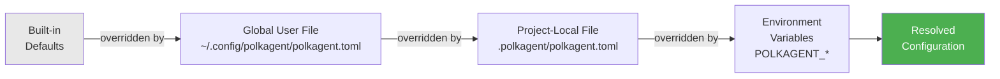

# Configuration Reference

polkagent uses TOML for configuration. Multiple configuration sources are merged, with later sources taking precedence.

## Configuration Sources and Precedence

Sources are applied in order; later sources override earlier ones:

1. Built-in defaults
2. Global user file:
   - Linux: `~/.config/polkagent/polkagent.toml`
   - macOS: `~/Library/Application Support/polkagent/polkagent.toml`
3. Project-local file: `.polkagent/polkagent.toml` (searched by walking up from the current working directory)
4. Environment variables

**Merge semantics:** TOML tables merge key-by-key. Arrays replace entirely — there is no append behavior.



## CLI Options

Override the config file path at runtime:

```
polkagent --config /path/to/custom.toml
```

Validate the resolved configuration:

```
polkagent config validate
```

Show the resolved configuration (all sources merged):

```
polkagent config show
polkagent config show --toml
polkagent config show --json
```

## Full Configuration Reference

All keys and their defaults are shown below.

```toml
[meta]
api_version = "polkagent.dev/v1alpha1"
schema_version = 1

[log]
level = "info"          # trace | debug | info | warn | error
format = "pretty"       # pretty | json

[database]
backend = "sqlite"      # sqlite | postgres

[database.sqlite]
path = "~/.local/share/polkagent/polkagent.db"
wal_mode = true
busy_timeout_ms = 5000
checkpoint_on_startup = false

[database.postgres]
url = ""                # Set via POLKAGENT_DATABASE_POSTGRES_URL
max_connections = 20
ssl_mode = "require"

[execution]
max_concurrent_runs = 10
default_timeout_secs = 600

[execution.budget]
max_usd_per_run = 5.00
max_usd_per_day = 50.00
warn_threshold_percent = 80

[[providers]]
id = "anthropic"
provider_type = "anthropic"
api_key_env = "ANTHROPIC_API_KEY"
base_url = "https://api.anthropic.com"
default_model = "claude-sonnet-4-6"
timeout_secs = 120
max_retries = 3
ttft_timeout_secs = 15
connect_timeout_secs = 5
max_concurrent = 10

[policy]
policy_dir = "~/.config/polkagent/policies"
default_policy = "default"

[memory]
enabled = false
backend = "sqlite"

[api]
enabled = true
bind_address = "127.0.0.1:4840"
cors_origins = ["http://localhost:*"]
read_only = false

[tui]
theme = "dark"                # dark | no_color | high_contrast
atmospheric_effects = true

[server]
bind_address = "127.0.0.1:9090"
cors_origins = ["*"]

[server.rate_limit]
enabled = true
requests_per_second = 100
burst = 200

[server.tls]
# cert_path = "/path/to/cert.pem"
# key_path = "/path/to/key.pem"
# ca_path = "/path/to/ca.pem"

[auth]
enabled = false
api_keys = []               # Hashed digests only
# jwt_secret_env = "POLKAGENT_JWT_SECRET"
session_timeout_secs = 3600

[security]
sandbox_enabled = false
max_file_size_bytes = 10485760  # 10 MiB
allowed_paths = []
denied_paths = ["/etc/shadow", "/etc/passwd", "/etc/sudoers", "/root", "/proc", "/sys"]
max_memory_mb = 512
max_cpu_seconds = 300

[skills]
directories = []
auto_load = true
# registry_url = "https://..."
# cache_dir = "~/.cache/polkagent/skills"

[harness]
harness_type = "claude"
timeout_secs = 300
max_concurrent = 1

[artifacts]
max_size_bytes = 104857600  # 100 MiB
retention_days = 90
compression_enabled = true

[observability]
# otlp_endpoint = "http://localhost:4317"
otlp_protocol = "grpc"
metrics_enabled = true
traces_enabled = true
service_name = "polkagent"
```

## Environment Variables

All configuration keys can be overridden via environment variables. Environment variables are applied last and take the highest precedence.

| Variable | Config Path | Notes |
|---|---|---|
| `POLKAGENT_LOG_LEVEL` | `log.level` | |
| `POLKAGENT_LOG_FORMAT` | `log.format` | pretty or json |
| `POLKAGENT_DATABASE_BACKEND` | `database.backend` | sqlite or postgres |
| `POLKAGENT_DATABASE_SQLITE_PATH` | `database.sqlite.path` | |
| `POLKAGENT_DATABASE_POSTGRES_URL` | `database.postgres.url` | |
| `POLKAGENT_DATABASE_POSTGRES_MAX_CONNECTIONS` | `database.postgres.max_connections` | |
| `POLKAGENT_EXECUTION_MAX_CONCURRENT_RUNS` | `execution.max_concurrent_runs` | |
| `POLKAGENT_EXECUTION_DEFAULT_TIMEOUT_SECS` | `execution.default_timeout_secs` | |
| `POLKAGENT_EXECUTION_BUDGET_MAX_USD_PER_RUN` | `execution.budget.max_usd_per_run` | |
| `POLKAGENT_EXECUTION_BUDGET_MAX_USD_PER_DAY` | `execution.budget.max_usd_per_day` | |
| `POLKAGENT_EXECUTION_BUDGET_WARN_THRESHOLD_PERCENT` | `execution.budget.warn_threshold_percent` | |
| `POLKAGENT_API_BIND` | `api.bind_address` | |
| `POLKAGENT_API_ENABLED` | `api.enabled` | |
| `POLKAGENT_TUI_THEME` | `tui.theme` | dark, no_color, high_contrast |
| `POLKAGENT_TUI_ATMOSPHERIC_EFFECTS` | `tui.atmospheric_effects` | |
| `POLKAGENT_MEMORY_ENABLED` | `memory.enabled` | |
| `POLKAGENT_MEMORY_BACKEND` | `memory.backend` | |
| `POLKAGENT_POLICY_DIR` | `policy.policy_dir` | |
| `POLKAGENT_POLICY_DEFAULT` | `policy.default_policy` | |
| `POLKAGENT_SERVER_BIND` | `server.bind_address` | |
| `POLKAGENT_SERVER_RATE_LIMIT_RPS` | `server.rate_limit.requests_per_second` | |
| `POLKAGENT_SERVER_RATE_LIMIT_BURST` | `server.rate_limit.burst` | |
| `POLKAGENT_AUTH_ENABLED` | `auth.enabled` | |
| `POLKAGENT_AUTH_JWT_SECRET_ENV` | `auth.jwt_secret_env` | |
| `POLKAGENT_AUTH_SESSION_TIMEOUT_SECS` | `auth.session_timeout_secs` | |
| `POLKAGENT_SECURITY_SANDBOX` | `security.sandbox_enabled` | |
| `POLKAGENT_SECURITY_MAX_FILE_SIZE_BYTES` | `security.max_file_size_bytes` | |
| `POLKAGENT_SECURITY_MAX_MEMORY_MB` | `security.max_memory_mb` | |
| `POLKAGENT_SECURITY_MAX_CPU_SECONDS` | `security.max_cpu_seconds` | |
| `POLKAGENT_SKILLS_DIR` | `skills.directories` | Replaces list |
| `POLKAGENT_SKILLS_AUTO_LOAD` | `skills.auto_load` | |
| `POLKAGENT_SKILLS_REGISTRY_URL` | `skills.registry_url` | |
| `POLKAGENT_HARNESS_TYPE` | `harness.harness_type` | |
| `POLKAGENT_HARNESS_TIMEOUT_SECS` | `harness.timeout_secs` | |
| `POLKAGENT_HARNESS_MAX_CONCURRENT` | `harness.max_concurrent` | |
| `POLKAGENT_ARTIFACTS_MAX_SIZE_BYTES` | `artifacts.max_size_bytes` | |
| `POLKAGENT_ARTIFACTS_RETENTION_DAYS` | `artifacts.retention_days` | |
| `POLKAGENT_ARTIFACTS_COMPRESSION_ENABLED` | `artifacts.compression_enabled` | |
| `POLKAGENT_OTLP_ENDPOINT` | `observability.otlp_endpoint` | |
| `POLKAGENT_OTLP_PROTOCOL` | `observability.otlp_protocol` | |
| `POLKAGENT_OBSERVABILITY_METRICS_ENABLED` | `observability.metrics_enabled` | |
| `POLKAGENT_OBSERVABILITY_TRACES_ENABLED` | `observability.traces_enabled` | |
| `POLKAGENT_OBSERVABILITY_SERVICE_NAME` | `observability.service_name` | |

```mermaid
graph TB
    subgraph Global["Global Config (~/.config/polkagent/)"]
        GC["polkagent.toml"]
        GP["policies/"]
        GS["skills/"]
    end

    subgraph Project["Project Config (.polkagent/)"]
        PC["polkagent.toml"]
        PP["policies/"]
        PS["skills/"]
        PD["polkagent.db"]
    end

    subgraph Env["Environment Variables"]
        E1["POLKAGENT_LOG_LEVEL"]
        E2["POLKAGENT_DATABASE_BACKEND"]
        E3["ANTHROPIC_API_KEY"]
        E4["POLKAGENT_*"]
    end

    Global -->|"merged with"| MERGE["Config Merger"]
    Project -->|"takes precedence"| MERGE
    Env -->|"highest precedence"| MERGE
    MERGE --> RESOLVED["Resolved Config"]
```



### Provider API Keys

Provider API keys are not stored in the config file. Set them as environment variables. When a recognized key is present, polkagent automatically creates the corresponding provider with defaults.

| Variable | Effect |
|---|---|
| `ANTHROPIC_API_KEY` | Auto-creates Anthropic provider |
| `OPENAI_API_KEY` | Auto-creates OpenAI provider |
| `GEMINI_API_KEY` | Auto-creates Gemini provider |
| `OPENROUTER_API_KEY` | Auto-creates OpenRouter provider |
| `PERPLEXITY_API_KEY` | Auto-creates Perplexity provider |
| `CEREBRAS_API_KEY` | Auto-creates Cerebras provider |

## Example Configurations

### Minimal (Anthropic only)

The simplest explicit configuration:

```toml
[[providers]]
id = "anthropic"
provider_type = "anthropic"
api_key_env = "ANTHROPIC_API_KEY"
base_url = "https://api.anthropic.com"
default_model = "claude-sonnet-4-6"
```

Note: even this is optional. Set `ANTHROPIC_API_KEY` and polkagent auto-creates the Anthropic provider with no config file required.

### Multi-Provider

```toml
[[providers]]
id = "anthropic"
provider_type = "anthropic"
api_key_env = "ANTHROPIC_API_KEY"
base_url = "https://api.anthropic.com"
default_model = "claude-sonnet-4-6"
timeout_secs = 120
max_retries = 3

[[providers]]
id = "openai"
provider_type = "openai"
api_key_env = "OPENAI_API_KEY"
base_url = "https://api.openai.com"
default_model = "gpt-4o"
timeout_secs = 120
max_retries = 3

[[providers]]
id = "gemini"
provider_type = "gemini"
api_key_env = "GEMINI_API_KEY"
base_url = "https://generativelanguage.googleapis.com"
default_model = "gemini-2.5-pro"
timeout_secs = 120
max_retries = 3
```

### Custom Model

Register a custom model slug mapped to a specific provider and capability profile:

```toml
[[models]]
slug = "my-custom-model"
provider = "openai"
context_window = 128000
max_output = 16384
supports_tools = true
```
