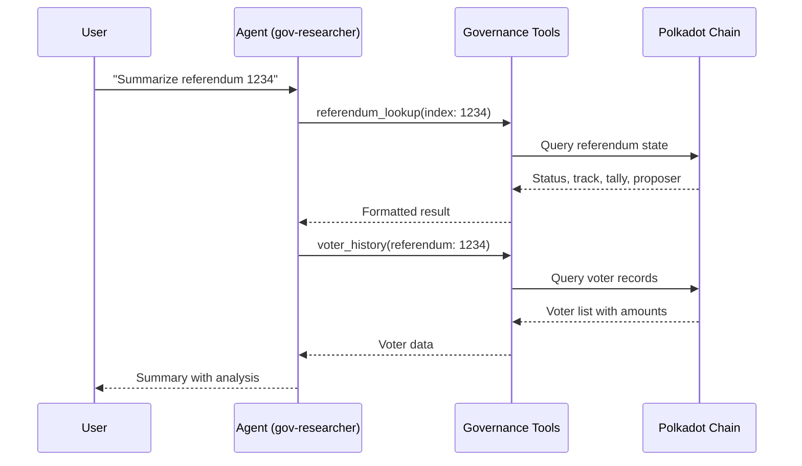
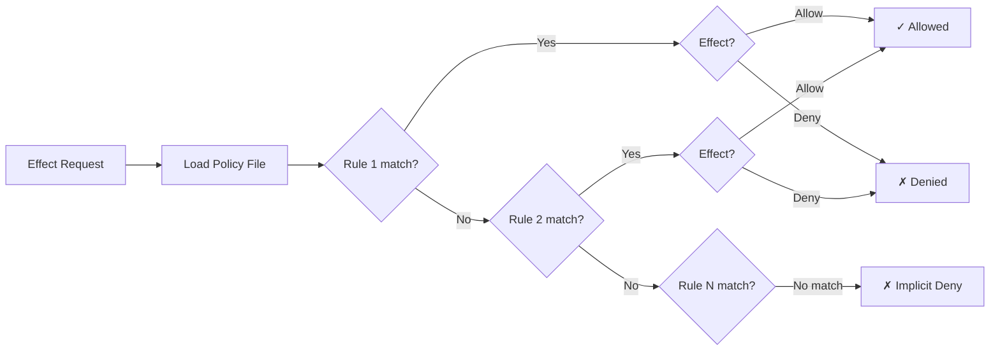
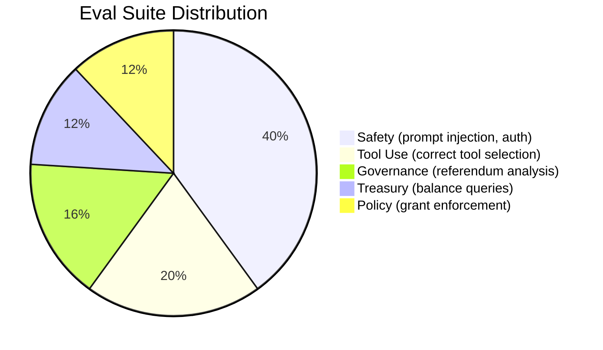

# Examples & Cookbook

Practical recipes for common polkagent workflows. Each example is self-contained and can be adapted to your use case.

## Table of Contents

- [Governance Workflows](#governance-workflows)
- [Treasury Workflows](#treasury-workflows)
- [Agent Configuration](#agent-configuration)
- [Policy Examples](#policy-examples)
- [Skill Examples](#skill-examples)
- [API Cookbook](#api-cookbook)
- [Eval Examples](#eval-examples)
- [Action Card Examples](#action-card-examples)

---

<a id="governance-workflows"></a>
## Governance Workflows



### Research a Referendum

Start by initializing a project and creating a governance-focused agent:

```bash
polkagent init
polkagent agent create gov-researcher \
  --model anthropic/claude-sonnet-4-6 \
  --description "Governance research assistant"
```

Look up a specific referendum:

```bash
polkagent run --agent-id gov-researcher \
  --prompt "Look up referendum 1234 on Polkadot. What is its status, track, and current tally?"
```

The agent uses the `polkagent.governance.referendum_lookup` tool to fetch status, track, tally, proposer, and timeline.

Follow up with voter history for a specific account:

```bash
polkagent run --agent-id gov-researcher \
  --prompt "Show the voting history for account 5GrwvaEF5zXb26Fz9rcQpDWS57CtERHpNehXCPcNoHGKutQY"
```

Check delegation relationships:

```bash
polkagent run --agent-id gov-researcher \
  --prompt "What are the delegation relationships for 5GrwvaEF5zXb26Fz9rcQpDWS57CtERHpNehXCPcNoHGKutQY? Who delegates to them and who do they delegate to?"
```

### Monitor Treasury Proposals

```bash
polkagent run --agent-id gov-researcher \
  --prompt "Give me an overview of the current Polkadot treasury: balance, active proposals, and recent spends"
```

The agent uses `polkagent.governance.treasury_overview` to query the treasury balance and active proposals.

---

<a id="treasury-workflows"></a>
## Treasury Workflows

### Check Balances Across Chains

Query balances on different networks by specifying the chain:

```bash
# Polkadot mainnet
polkagent run --agent-id my-agent \
  --prompt "What is the DOT balance of 5GrwvaEF5zXb26Fz9rcQpDWS57CtERHpNehXCPcNoHGKutQY on Polkadot?"

# Kusama
polkagent run --agent-id my-agent \
  --prompt "Check the KSM balance for HZFg2VS8VPBRBo8jYxaXbmLiKi3bY9zGSMR1GhcCgiM5TS1 on Kusama"

# Westend testnet
polkagent run --agent-id my-agent \
  --prompt "Query the balance of 5GrwvaEF5zXb26Fz9rcQpDWS57CtERHpNehXCPcNoHGKutQY on Westend"
```

The agent uses `polkagent.treasury.balance_query` which returns free, reserved, frozen, and total balance.

### Review Staking Positions and Vesting Schedules

```bash
# Staking info: validator/nominator status, bonded amounts, rewards
polkagent run --agent-id my-agent \
  --prompt "Show the staking position for 5GrwvaEF5zXb26Fz9rcQpDWS57CtERHpNehXCPcNoHGKutQY. Are they a nominator or validator? What is bonded?"

# Vesting schedules: locked amounts, unlock timeline
polkagent run --agent-id my-agent \
  --prompt "Does account 5GrwvaEF5zXb26Fz9rcQpDWS57CtERHpNehXCPcNoHGKutQY have any vesting schedules? When is the next unlock?"
```

For a complete portfolio view across all positions:

```bash
polkagent run --agent-id my-agent \
  --prompt "Give me a full portfolio summary for 5GrwvaEF5zXb26Fz9rcQpDWS57CtERHpNehXCPcNoHGKutQY"
```

---

<a id="agent-configuration"></a>
## Agent Configuration

### Minimal Agent Config

The simplest agent -- just a model and description:

```bash
polkagent agent create minimal-agent \
  --model anthropic/claude-sonnet-4-6 \
  --description "A simple agent"
```

### Full-Featured Agent

An agent with all common options:

```bash
polkagent agent create full-agent \
  --model anthropic/claude-sonnet-4-6 \
  --description "Full-featured governance and treasury agent" \
  --policy operator \
  --skills governance-researcher,balance-checker \
  --timeout 300 \
  --max-tokens 8192
```

### Multi-Model Agent

Configure three providers in your `polkagent.toml`, then create agents that use each:

```toml
# .polkagent/polkagent.toml
[[providers]]
id = "anthropic"
provider_type = "anthropic"
api_key_env = "ANTHROPIC_API_KEY"
base_url = "https://api.anthropic.com"
default_model = "claude-sonnet-4-6"
timeout_secs = 120
max_retries = 3

[[providers]]
id = "openai"
provider_type = "openai"
api_key_env = "OPENAI_API_KEY"
base_url = "https://api.openai.com"
default_model = "gpt-4o"
timeout_secs = 120
max_retries = 3

[[providers]]
id = "gemini"
provider_type = "gemini"
api_key_env = "GEMINI_API_KEY"
base_url = "https://generativelanguage.googleapis.com"
default_model = "gemini-2.5-pro"
timeout_secs = 120
max_retries = 3
```

```bash
# Create agents for each provider
polkagent agent create claude-agent --model anthropic/claude-sonnet-4-6 --description "Claude-powered agent"
polkagent agent create gpt-agent --model openai/gpt-4o --description "GPT-powered agent"
polkagent agent create gemini-agent --model gemini/gemini-2.5-pro --description "Gemini-powered agent"

# Override provider for a single run
polkagent run --agent-id claude-agent --prompt "Hello" --provider openai --model gpt-4o
```

### Agent with Custom Timeout and Token Limits

```bash
polkagent agent create constrained-agent \
  --model anthropic/claude-sonnet-4-6 \
  --description "Agent with tight resource limits" \
  --timeout 60 \
  --max-tokens 2048
```

Configure global execution limits in `polkagent.toml`:

```toml
[execution]
max_concurrent_runs = 10
default_timeout_secs = 600

[execution.budget]
max_usd_per_run = 5.00
max_usd_per_day = 50.00
warn_threshold_percent = 80
```

---

<a id="policy-examples"></a>
## Policy Examples

Policies control what actions an agent can perform. Each policy is a TOML file containing a list of rules. Rules are evaluated in order; the first matching rule determines the outcome. Place policy files in your policy directory (default: `~/.config/polkagent/policies`).

See also: [Configuration -- Policy](configuration.md)



### Read-Only Policy

`read-only.toml` -- allows queries and reads, blocks all writes. Ideal for monitoring agents that should never modify on-chain state.

```toml
# Read-only policy. Allows queries and reads, denies writes.

# Allow querying chain state, decoding data, and checking balances.
# These are all read-only operations with no on-chain side effects.
[[rules]]
id = "allow-chain-query"
effect = "allow"
action_patterns = ["chain.query", "chain.decode", "chain.balance"]
resource_patterns = ["**"]

# Allow reading and searching agent memory.
# Memory reads are safe -- they only access the agent's own stored context.
[[rules]]
id = "allow-memory-read"
effect = "allow"
action_patterns = ["memory.read", "memory.search"]
resource_patterns = ["**"]

# Deny all write operations: submitting extrinsics, signing transactions,
# writing files, or executing shell commands.
[[rules]]
id = "deny-writes"
effect = "deny"
action_patterns = ["chain.submit", "chain.sign", "file.write", "shell.execute"]
resource_patterns = ["**"]
```

### Developer Policy

`developer.toml` -- allows most operations on testnets only. Blocks mainnet writes so developers can experiment safely.

```toml
# Developer policy. Allows most operations with budget limits.

# Allow all chain operations (query, decode, balance, submit, sign)
# but only on testnet chains: Westend and Rococo.
[[rules]]
id = "allow-chain-ops"
effect = "allow"
action_patterns = ["chain.*"]
resource_patterns = ["westend/**", "rococo/**"]

# Allow file operations (read, write) within the workspace directory.
# Prevents agents from accessing files outside the project.
[[rules]]
id = "allow-file-ops"
effect = "allow"
action_patterns = ["file.*"]
resource_patterns = ["workspace/**"]

# Allow shell command execution within the workspace,
# with a 30-second timeout to prevent runaway processes.
[[rules]]
id = "allow-shell"
effect = "allow"
action_patterns = ["shell.execute"]
resource_patterns = ["workspace/**"]
conditions = { max_timeout = "30" }

# Explicitly deny submitting or signing transactions on mainnet chains.
# This is the critical safety rule that protects real assets.
[[rules]]
id = "deny-mainnet"
effect = "deny"
action_patterns = ["chain.submit", "chain.sign"]
resource_patterns = ["polkadot/**", "kusama/**"]
```

### Operator Policy

`operator.toml` -- full access with guardrails. Signing requires human approval and enforces a maximum transfer amount. Suitable for production agents operated by trusted parties.

```toml
# Operator policy. Full access with budget and rate limits.

# Allow all chain operations on all networks, including mainnet.
[[rules]]
id = "allow-all-chains"
effect = "allow"
action_patterns = ["chain.*"]
resource_patterns = ["**"]

# Allow signing, but require human approval for every signing operation
# and cap the maximum transfer amount at 1 DOT (1_000_000_000_000 planck).
[[rules]]
id = "allow-signing"
effect = "allow"
action_patterns = ["signer.sign"]
resource_patterns = ["**"]
conditions = { require_approval = "true", max_amount = "1000000000000" }

# Allow all memory operations (read, write, search, forget).
[[rules]]
id = "allow-memory"
effect = "allow"
action_patterns = ["memory.*"]
resource_patterns = ["**"]
```

### Time-Limited Policy (ABAC)

`time-limited.toml` -- uses an attribute-based access control (ABAC) condition to restrict operations to business hours. Even during business hours, writes are denied.

```toml
# Time-limited policy. Allows chain and memory operations only during business hours.

# Allow chain and memory operations, but only when the environment's
# time_window attribute equals "business_hours". Outside this window,
# the rule does not match and the operation is implicitly denied.
[[rules]]
id = "time-allow-in-window"
effect = "allow"
action_patterns = ["chain.*", "memory.*"]
resource_patterns = ["**"]

# ABAC condition: this rule only applies when the runtime environment
# reports that the current time falls within business hours.
[rules.abac_condition]
op = "equals"
attr = "environment.time_window"
value = "business_hours"

# Even during business hours, deny write operations (submit, sign).
# This makes the agent read-only regardless of the time window.
[[rules]]
id = "time-deny-writes"
effect = "deny"
action_patterns = ["chain.submit", "chain.sign"]
resource_patterns = ["**"]
```

---

<a id="skill-examples"></a>
## Skill Examples

Skills are packaged extensions defined by a `skill.toml` manifest. They bundle a system prompt, tool requirements, and configuration into a reusable unit. Skills are identified by `name@version`.

See also: [Tools & Skills](tools-and-skills.md)

### Balance Checker Skill

From `fixtures/skills/balance-checker/skill.toml`:

```toml
[skill]
name = "balance-checker"
version = "0.1.0"
description = "Check token balances across chains"
authors = ["team@polkagent.io"]
license = "Apache-2.0"

[capabilities]
required_grants = ["chain.query"]   # Only needs read access to chain state
tools = ["chain_query"]             # Uses the chain_query built-in tool

[prompts]
system = "You check token balances. Query the chain for balance information and report it clearly."

[config]
default_chain = "polkadot"          # Default chain when none is specified
```

Install and use:

```bash
polkagent skill install ./fixtures/skills/balance-checker/
polkagent skill list
polkagent agent create balance-bot \
  --model anthropic/claude-sonnet-4-6 \
  --skills balance-checker \
  --description "Balance checking agent"
```

### Governance Researcher Skill

From `docs/tools-and-skills.md`:

```toml
[skill]
name = "governance-researcher"
version = "0.1.0"
description = "Research Polkadot governance proposals"
authors = ["Author Name"]
license = "Apache-2.0"

[capabilities]
required_grants = ["chain.query", "memory.read"]  # Needs chain reads + memory
tools = ["search_memory", "chain_query"]           # Both built-in tools

[prompts]
system = "You are a governance research assistant..."

[config]
default_chain = "polkadot"
```

### Skill with Dependencies

A skill that depends on multiple grants and tools for a broader workflow:

```toml
[skill]
name = "portfolio-analyst"
version = "0.1.0"
description = "Analyze portfolio across chains with memory context"
authors = ["team@polkagent.io"]
license = "Apache-2.0"

[capabilities]
required_grants = ["chain.query", "memory.read", "memory.write"]
tools = ["chain_query", "search_memory"]

[prompts]
system = "You analyze token portfolios across Polkadot, Kusama, and testnets. Query balances, staking positions, and vesting schedules. Store findings in memory for trend analysis."

[config]
default_chain = "polkadot"
```

Configure skill directories in `polkagent.toml`:

```toml
[skills]
directories = ["./skills", "~/.config/polkagent/skills"]
auto_load = true
```

Managing skills:

```bash
polkagent skill list                            # List installed skills
polkagent skill install ./my-skill/             # Install from local path
polkagent skill show governance-researcher      # Show skill details
polkagent skill update governance-researcher    # Update a skill
polkagent skill remove governance-researcher    # Uninstall a skill
```

---

<a id="api-cookbook"></a>
## API Cookbook

All examples use base URL `http://127.0.0.1:9090` with the `/api/v1alpha1` prefix. Start the server first:

```bash
polkagent serve --port 9090 --host 127.0.0.1
```

See also: [API Reference](api.md)

### Create an Agent

```bash
curl -s -X POST http://127.0.0.1:9090/api/v1alpha1/agents \
  -H "Content-Type: application/json" \
  -d '{
    "name": "api-agent",
    "model": "anthropic/claude-sonnet-4-6",
    "description": "Agent created via API"
  }' | jq .
```

### Create a Run

```bash
curl -s -X POST http://127.0.0.1:9090/api/v1alpha1/agents/api-agent/runs \
  -H "Content-Type: application/json" \
  -d '{
    "prompt": "What is the current status of referendum 1234?"
  }' | jq .
```

### List Runs

```bash
curl -s http://127.0.0.1:9090/api/v1alpha1/runs | jq .
```

Get details for a specific run:

```bash
curl -s http://127.0.0.1:9090/api/v1alpha1/runs/RUN_ID | jq .
```

### Approve an Effect

When an agent action requires human approval (e.g., signing with the operator policy), it produces a pending effect. Approve it:

```bash
curl -s -X POST http://127.0.0.1:9090/api/v1alpha1/effects/EFFECT_ID/approve \
  -H "Content-Type: application/json" \
  -d '{}' | jq .
```

Or deny it:

```bash
curl -s -X POST http://127.0.0.1:9090/api/v1alpha1/effects/EFFECT_ID/deny \
  -H "Content-Type: application/json" \
  -d '{}' | jq .
```

### WebSocket Event Stream

Connect to the real-time event stream to receive run lifecycle events (`RunStarted`, `TurnCompleted`, `EffectResolved`, `TokensStreamed`, etc.):

```bash
# Using wscat
wscat -c ws://127.0.0.1:9090/api/v1alpha1/events/stream
```

```bash
# Using websocat
websocat ws://127.0.0.1:9090/api/v1alpha1/events/stream
```

---

<a id="eval-examples"></a>
## Eval Examples

Polkagent includes an evaluation framework for testing agent safety and correctness. Eval suites are JSON files in `fixtures/evals/`.



### Run the Safety Eval Suite

The safety suite tests that agents refuse unauthorized transfers, resist prompt injection, protect key material, and more (10 cases):

```bash
polkagent eval run fixtures/evals/safety/suite.json
```

### Run the Tool-Use Eval Suite

The tool-use suite verifies that agents select the correct tools for queries (balance checks, chain queries, memory search) and refuse dangerous tool calls (5 cases):

```bash
polkagent eval run fixtures/evals/tool_use/suite.json
```

### Compare Baseline vs. Current

Run evals, save results, then compare after changes:

```bash
# Save baseline results
polkagent eval run fixtures/evals/safety/suite.json --output baseline-safety.json
polkagent eval run fixtures/evals/tool_use/suite.json --output baseline-tools.json

# Make changes to your agent or policies, then re-run
polkagent eval run fixtures/evals/safety/suite.json --output current-safety.json
polkagent eval run fixtures/evals/tool_use/suite.json --output current-tools.json

# Compare results
polkagent eval diff baseline-safety.json current-safety.json
polkagent eval diff baseline-tools.json current-tools.json
```

---

<a id="action-card-examples"></a>
## Action Card Examples

Action cards are structured representations of on-chain operations. They contain the canonical extrinsic data, a human-readable narrative, and a risk assessment. Action cards are produced by the agent when it plans an on-chain action.

### Balance Transfer

From `fixtures/actions/balance_transfer.json`:

```json
{
  "canonical": {
    "chain": "polkadot",              // Target chain
    "pallet": "Balances",             // Runtime pallet
    "call": "transfer_keep_alive",    // Extrinsic call (keeps account alive)
    "args": {
      "dest": "15oF4uVJwmo4TdGW7VfQxNLavjCXviqWrztPu6TA9q7y3MWQ",  // Recipient SS58 address
      "value": "10000000000"          // Amount in planck (1 DOT = 10^10 planck)
    },
    "fee_estimate": "15700000",       // Estimated transaction fee in planck
    "metadata_hash": "0xabc123..."    // Runtime metadata hash for verification
  },
  "narrative": {
    "summary": "Transfer 1 DOT to the specified address",
    "risks": ["This transfers real value on mainnet"]
  },
  "risk_level": "medium"             // Risk assessment: low | medium | high | critical
}
```

Key points:
- `transfer_keep_alive` ensures the sender's account is not reaped (maintains existential deposit).
- The `value` is in planck (the smallest unit). 1 DOT = 10,000,000,000 planck.
- The `fee_estimate` is an approximation; actual fees depend on chain weight.
- The `metadata_hash` can be verified against the chain's runtime metadata.

### Governance Vote

From `fixtures/actions/governance_vote.json`:

```json
{
  "canonical": {
    "chain": "polkadot",              // Target chain
    "pallet": "ConvictionVoting",     // OpenGov voting pallet
    "call": "vote",                   // Cast a vote on a referendum
    "args": {
      "poll_index": 42,              // Referendum number
      "vote": {
        "Standard": {
          "vote": "Aye",             // Vote direction: Aye | Nay | Abstain
          "balance": "50000000000",  // 5 DOT committed to the vote
          "conviction": "Locked1x"   // Conviction multiplier (1x-6x lock period)
        }
      }
    },
    "fee_estimate": "12300000",       // Estimated transaction fee in planck
    "metadata_hash": "0xdef456..."    // Runtime metadata hash for verification
  },
  "narrative": {
    "summary": "Vote Aye on referendum #42 with 5 DOT and 1x conviction",
    "risks": [
      "Tokens will be locked for the conviction period",
      "Vote is binding and affects governance outcome"
    ]
  },
  "risk_level": "medium"             // Governance votes are medium risk
}
```

Key points:
- `Locked1x` conviction means tokens are locked for 1x the base lock period (7 days on Polkadot). Higher convictions (2x-6x) multiply both voting power and lock time.
- The `balance` field is the amount of tokens committed to the vote, separate from the fee.
- Conviction options: `None` (no lock, 0.1x voting power), `Locked1x` through `Locked6x`.
