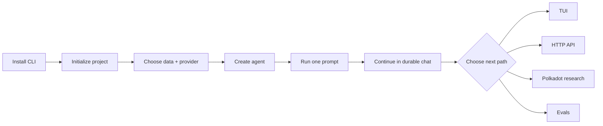
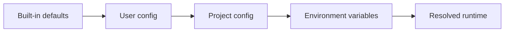
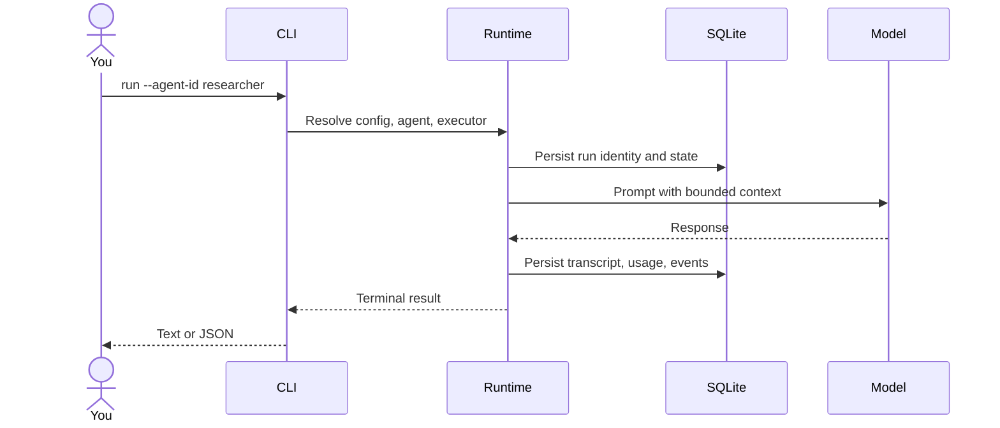
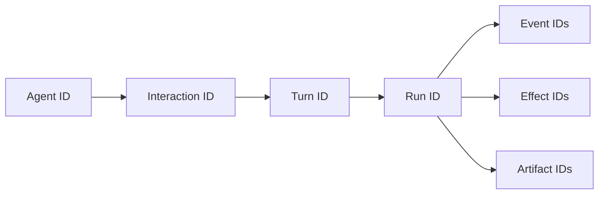

# Getting started

This tutorial takes you from a fresh checkout to a successful agent run, a
restart-resumable conversation, and a clear next step. No prior Polkagent or
Polkadot knowledge is required.

If you only want to look around without a provider account, use the
[offline demo](demo.md#demo-1-offline-cli-tour).

## What you will build



By the end, you will understand where configuration and data live, how to tell
simulated output from a real provider response, and how the persisted IDs relate
to one another.

## 1. Install prerequisites

Required:

- Rust 1.89 or newer;
- Git;
- a supported OS and terminal.

Useful but optional:

- Docker and Docker Compose for container demos;
- `curl` and `jq` for API examples;
- `sqlite3` for the seeded TUI demo and database inspection;
- `websocat` or `wscat` for WebSocket exploration.

Check Rust:

```bash
rustc --version
cargo --version
```

Install or update Rust through [rustup](https://rustup.rs/) if necessary.

## 2. Install Polkagent

Clone and install the workspace CLI:

```bash
git clone https://github.com/nicovince/polkagent.git
cd polkagent
cargo install --path crates/polkagent-cli
```

Verify both the binary and available commands:

```bash
polkagent version
polkagent --help
```

During source development, you can run the current checkout without installing:

```bash
cargo run -p polkagent-cli -- --help
```

## 3. Initialize a project

In the directory where you want project-local configuration:

```bash
polkagent init
```

This creates:

```text
.polkagent/
├── polkagent.toml   # project-local configuration
└── .gitignore       # ignores local database-style files
```

It does not put provider secrets into the file.

### Understand the default data location

The generated TOML points SQLite at a user-level data path. That lets agents be
shared across project directories, but an isolated tutorial should use its own
database:

```bash
export POLKAGENT_DATABASE_SQLITE_PATH="$(pwd)/.polkagent/polkagent.db"
```

Set this in every shell/process that should use the same tutorial data. Before
continuing, confirm the resolved paths:

```bash
polkagent config path
polkagent config get database.sqlite.path
polkagent config validate
```

Configuration precedence is:



Later sources override earlier sources. See [Configuration](configuration.md)
for the complete contract.

## 4. Choose simulated or real model output

### Option A: simulated output

Do not set a provider key. When no API key or local model is configured,
Polkagent reports:

```text
No API key or local model configured. Using simulated responses.
```

This validates the runtime and persistence path. It does not evaluate model
quality or provider networking.

### Option B: a real provider

Export exactly the key you intend to use:

```bash
export ANTHROPIC_API_KEY="<YOUR_KEY>"
# export OPENAI_API_KEY="<YOUR_KEY>"
# export GEMINI_API_KEY="<YOUR_KEY>"
# export OPENROUTER_API_KEY="<YOUR_KEY>"
```

Then check readiness:

```bash
polkagent doctor
```

> [!WARNING]
> Never put API keys, seed phrases, private keys, or signing material into
> `polkagent.toml`, prompts, logs, Zed JSON, shell scripts, or commits.

Provider/model catalogs and resolution details are in [Providers](providers.md).

## 5. Create your first agent

An agent is a durable specification, not a permanently running process. Create
one with a friendly name:

```bash
polkagent agent create researcher \
  --model anthropic/claude-sonnet-4-6 \
  --description "Explains Polkadot governance for a new reader" \
  --max-turns 8 \
  --timeout 120
```

Expected human-readable output includes the agent UUID, name, model, and active
state.

List and inspect it:

```bash
polkagent agent list
polkagent agent show researcher
polkagent inspect agent researcher
```

### Agent name versus UUID

Most CLI commands accept either `researcher` or the returned UUID. HTTP paths
documented with `{agent_id}` require the UUID. Names are convenient input;
UUIDs are durable correlation identities.

## 6. Run a first prompt

For a deterministic setup check:

```bash
polkagent run \
  --agent-id researcher \
  --prompt "Reply with a one-line hello" \
  --no-harness \
  --timeout 30 \
  --wait
```

For a real provider and a more useful prompt:

```bash
polkagent run \
  --agent-id researcher \
  --provider anthropic \
  --model anthropic/claude-sonnet-4-6 \
  --no-harness \
  --prompt "Explain Polkadot OpenGov tracks in three bullets. Separate facts from interpretation." \
  --timeout 60
```

Change provider/model to match your configured key.

### Machine-readable output

```bash
polkagent run \
  --agent-id researcher \
  --prompt "Reply with a one-line hello" \
  --no-harness \
  --json \
  --no-stream \
  --wait
```

JSON mode is the better choice for scripts. Human mode is the better choice
for terminal work.

### What just happened?



The run ID is the durable execution identity. If this prompt were part of a
multi-turn interaction, the interaction turn would link to the run.

## 7. Continue in durable chat

Start a conversation:

```bash
polkagent chat --agent researcher --title "First OpenGov session"
```

Try these inputs one at a time:

```text
/help
What is the difference between a referendum and a governance track?
Give me a concrete example.
/runs
/status
```

Chat writes assistant text to stdout and lifecycle/correlation information to
stderr. It prints the durable conversation ID. Exit with Ctrl-D, then resume:

```bash
polkagent chat --agent researcher --resume <CONVERSATION_ID>
```

Executor-backed follow-ups include a bounded window of completed typed
user/assistant pairs. Contextual history for string-only harnesses is not
silently flattened; it is currently unsupported. See [Durable chat](chat.md).

## 8. Inspect runtime state

```bash
polkagent status
polkagent inspect db
polkagent memory stats
```

Useful IDs form this relationship:



Keep these IDs when diagnosing a failure. Do not expose them publicly if their
metadata is sensitive.

## 9. Explore the TUI

Launch directly into the Console:

```bash
polkagent tui --tab console
```

Core controls:

| Key | Action |
|---|---|
| F1–F9 | Switch views |
| `j` / `k` | Move or scroll |
| Enter | Open/select/submit, depending on context |
| Esc | Go back or close an overlay |
| `p` | Open the Console composer |
| `s` | Open the same-agent durable session selector |
| `x` | Cancel the exact selected active turn |
| `q` | Quit |

F6 approvals are scoped to the durable conversation selected in F9. A normal
TUI start is intentionally authority-unbound, so approval-required work can
show unavailable guidance rather than inventing a user identity. When an
explicit local authority is configured and the F6 projection contains a real
pending request, F9 also exposes exact `/approve <approval-id>` and
`/deny <approval-id> [reason]` commands through the same service boundary.

For a visual tour with synthetic records:

```bash
./scripts/demo.sh
```

Read [the demo guide](demo.md#demo-3-explore-the-tui-with-sample-data) before
using the reset option.

## 10. Optional: start the HTTP API

```bash
polkagent serve --host 127.0.0.1 --port 9090
```

From another terminal:

```bash
curl --fail http://127.0.0.1:9090/health/live
curl --fail http://127.0.0.1:9090/health/ready
curl --fail http://127.0.0.1:9090/openapi.json | jq '.info'
```

Use the [HTTP demo](demo.md#demo-4-call-polkagent-over-http) for agent/run
requests. Use [`openapi.yaml`](../openapi.yaml) as the exact schema. Some
optional or authority-bound routes deliberately return `501` in the ordinary
runtime composition; see [API reference](api.md).

## Choose your next path

### Research Polkadot governance or treasury

Read:

- [Governance research use case](use-cases.md#governance-research-assistant)
- [Chain integration](chain.md)
- [Tools and skills](tools-and-skills.md)
- [Examples: governance workflows](examples.md#governance-workflows)

### Build a terminal or editor assistant

Read:

- [Durable chat](chat.md)
- [TUI CLI guide](cli.md#tui)
- [ACP and Zed](acp-zed.md)
- [Core concepts](concepts.md)

### Integrate over HTTP

Read:

- [HTTP demo](demo.md#demo-4-call-polkagent-over-http)
- [API reference](api.md)
- [OpenAPI 3.1 schema](../openapi.yaml)
- [Outbox and events](outbox-events.md)

### Develop or operate Polkagent

Read:

- [Contributing](../CONTRIBUTING.md)
- [Architecture](architecture.md)
- [Deployment](deployment.md)
- [Telemetry](telemetry.md)
- [Implementation status](../prd/STATUS.md)

## Common first-run problems

### I see simulated output

No provider key or local model was resolved. This is correct for the offline
path. Export a supported key and run `polkagent doctor` for real inference.

### I see agents I did not create here

You are probably using the user-global SQLite path from the generated config.
Set `POLKAGENT_DATABASE_SQLITE_PATH` to an explicit project file.

### A command rejects a copied flag

Check the generated help for the installed binary:

```bash
polkagent <COMMAND> --help
```

Your binary may be older than the checkout. During development, compare with
`cargo run -p polkagent-cli -- <COMMAND> --help`.

### The database is locked

Another Polkagent process may be writing to the same SQLite file. Confirm the
resolved path and stop unrelated writers or use an isolated database. Do not
delete SQLite WAL files from a live database.

### The API returns `501`

The route is intentionally unavailable in the current composition. Check
[Runtime/API composition](runtime-api-composition.md) before assuming the
handler is broken.

For more, see [Troubleshooting](troubleshooting.md).

## What this tutorial did not prove

A successful tutorial does not prove:

- that a model answer is factually correct;
- that a live chain query used the network/block you expected;
- that real on-chain signing and submission are production-ready;
- that local approval authority is suitable for multiple remote users;
- that the Docker/Postgres/cloud path meets your availability requirements.

Review [Use cases](use-cases.md) and the
[evidence-backed implementation status](../prd/STATUS.md) before designing a
consequential deployment.
