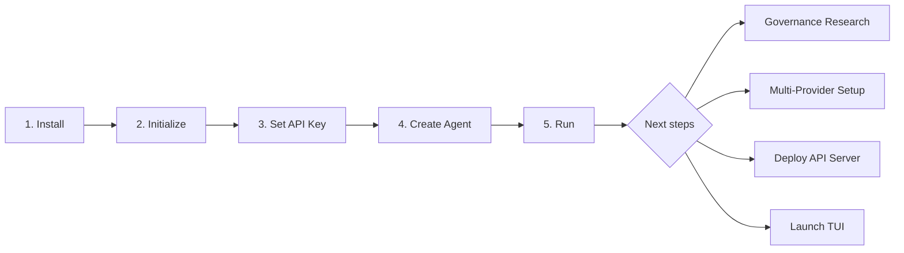
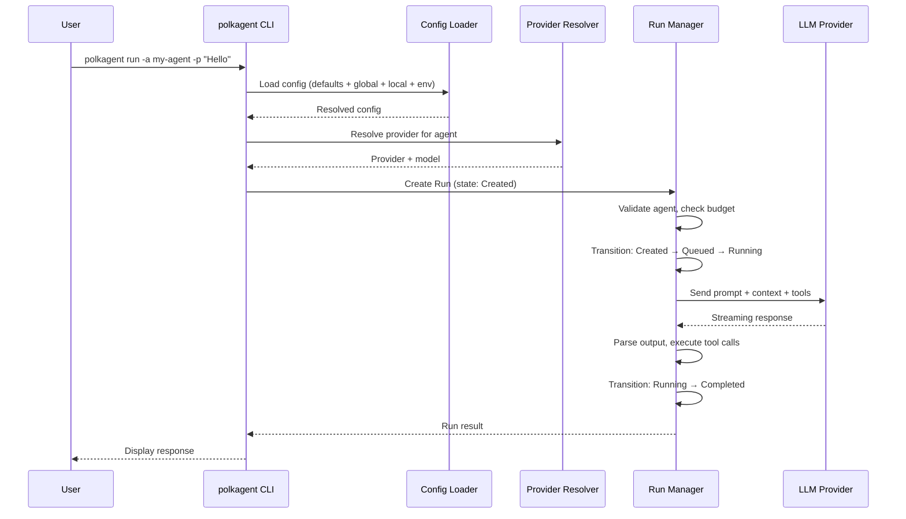

# Getting Started

## Prerequisites

- Rust 1.89+ (MSRV)
- Optional: Docker (for containerized deployment)



## Installation from Source

```bash
git clone https://github.com/nicovince/polkagent.git
cd polkagent
cargo install --path crates/polkagent-cli
```

Verify the installation:

```bash
polkagent version
```

## Initialize a Project

Run the following in your project directory:

```bash
polkagent init
```

This creates a `.polkagent/` directory with a default configuration file at `.polkagent/polkagent.toml`. To overwrite an existing configuration, pass `--force`.

## Setting Up Provider API Keys

Polkagent auto-detects providers from environment variables. Set one of the following:

```bash
# Anthropic (recommended)
export ANTHROPIC_API_KEY="sk-ant-..."

# OpenAI
export OPENAI_API_KEY="sk-..."

# Google Gemini
export GEMINI_API_KEY="..."

# OpenRouter
export OPENROUTER_API_KEY="..."
```

When polkagent detects an API key environment variable, it automatically creates a provider configuration with sensible defaults. No config file editing is required.

For explicit provider configuration, see [Configuration](configuration.md).

## Creating Your First Agent

```bash
polkagent agent create my-agent \
  --model anthropic/claude-sonnet-4-6 \
  --description "My first polkagent"
```

List all agents:

```bash
polkagent agent list
```

Show details for a specific agent:

```bash
polkagent agent show my-agent
```

## Running Your Agent

```bash
# Interactive run
polkagent run --agent-id my-agent --prompt "What is referendum 1234?"

# JSON output
polkagent run --agent-id my-agent --prompt "Query my balance" --json

# Override provider or model for a single run
polkagent run --agent-id my-agent --prompt "Hello" --provider openai --model gpt-4o

# Set a timeout (in seconds)
polkagent run --agent-id my-agent --prompt "Research topic" --timeout 120
```



## Launching the TUI

```bash
polkagent tui
```

The TUI is built on ratatui using the ROSEDUST design system. Configure the theme and effects in your config file:

```toml
[tui]
theme = "dark"              # dark | no_color | high_contrast
atmospheric_effects = true
```

Use F9 to select an active agent, create or resume a durable conversation, and
prompt it without leaving the TUI. F6 is scoped to that selected conversation:
it asynchronously lists up to 100 pending durable approvals and uses `a`/`d`
confirmation with the full conversation and approval identities. Approval
decisions go through the shared interaction service, not direct database
writes. Production startup does not yet bind an authenticated approval
authority, so an ordinary install may show explicit unavailable guidance in F6.

## Running Health Checks

```bash
polkagent doctor
```

This verifies provider connectivity, database status, and overall system health.

## What Next?

Now that you have a running agent, here are three paths to explore:

- **Research your first governance proposal** — Use the built-in governance tools to look up an OpenGov referendum, check voting history, or explore delegation graphs. See [Examples: Governance Workflows](examples.md#governance-workflows).
- **Set up multiple AI providers** — Configure fallback providers or use different models for different tasks. See [Examples: Agent Configuration](examples.md#agent-configuration).
- **Deploy the API server** — Expose polkagent as a REST API for integration with other services. See [Examples: API Cookbook](examples.md#api-cookbook).

Further reading:

- [CLI Reference](cli.md) — full command documentation
- [Configuration](configuration.md) — all configuration options
- [Providers](providers.md) — provider setup details
- [Tools & Skills](tools-and-skills.md) — available tools and how to extend them

## Troubleshooting

**Missing API key** — `Error: no providers configured`
Set at least one provider API key environment variable (e.g., `export ANTHROPIC_API_KEY="sk-ant-..."`). See [Setting Up Provider API Keys](#setting-up-provider-api-keys) above.

**Port already in use** — `Address already in use` when running `polkagent serve`
Use the `--port` flag to choose a different port (`polkagent serve --port 9091`), or find and kill the existing process using that port.

**Build errors** — compilation failures during `cargo install`
Ensure Rust 1.89+ is installed. Run `rustup update` to get the latest toolchain, then verify with `rustc --version`.

**Database locked** — agent commands hang or return lock errors
Increase `busy_timeout_ms` in your configuration, or ensure no other polkagent process is running against the same data directory.
