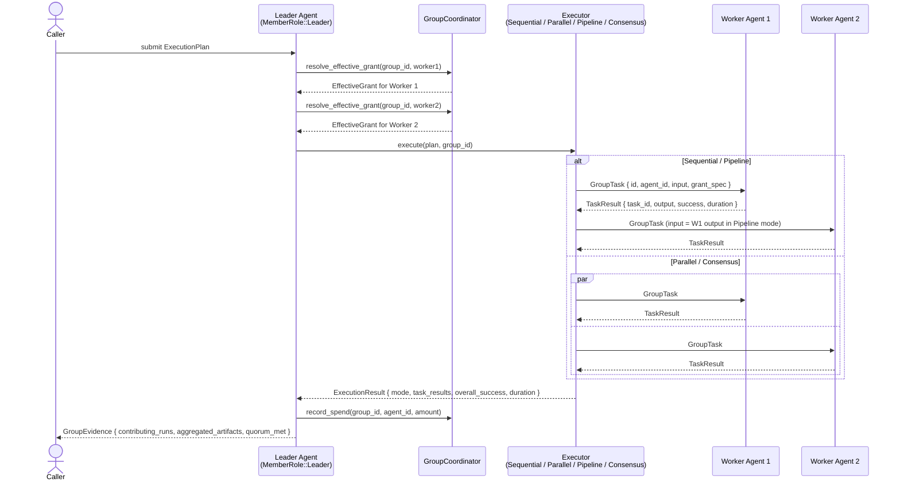
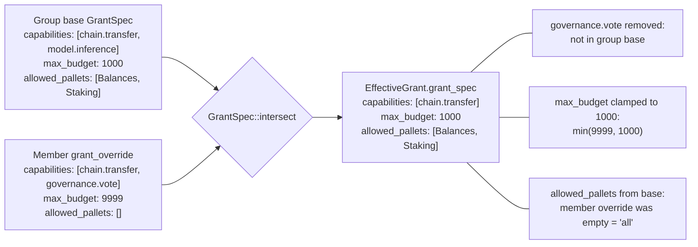
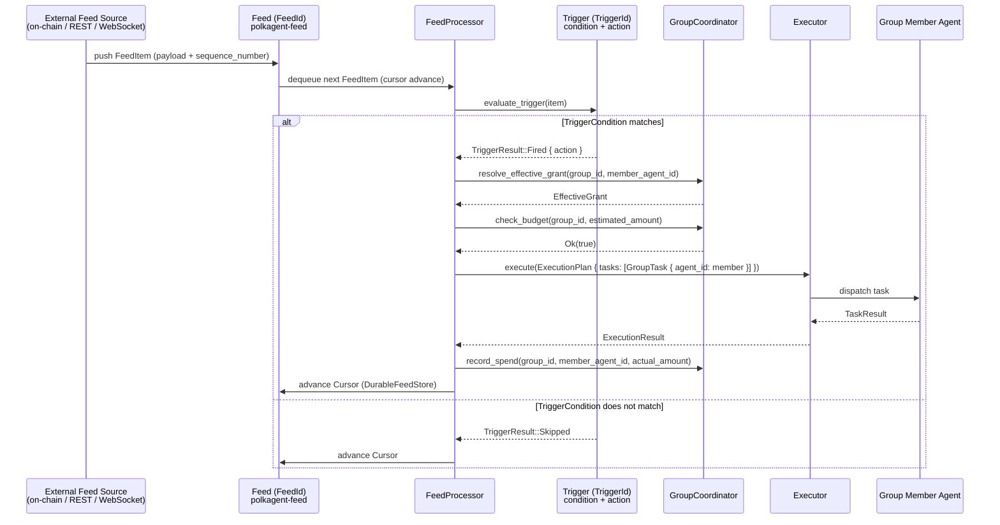

# Groups (PRD-09)

Multi-agent groups allow one or more Polkagent agents to coordinate under a
shared identity, shared budget, and a common quorum policy. The implementation
lives in two crates:

| Crate | Purpose |
|---|---|
| `polkagent-group` | Core types, coordinator, quorum, execution, propagation |
| `polkagent-store-sqlite-group` | SQLite-backed `GroupStore` implementation |

---

## Overview

A `Group` is a named collection of `GroupMember` records, each carrying a
`MemberRole` (`Leader`, `Worker`, or `Observer`) and an optional
`GrantSpec` override. The group itself holds a base `GrantSpec` that acts as
a ceiling: no member can ever acquire capabilities that the group does not
permit. Groups enforce aggregate spend through `GroupBudget` and gate
high-value decisions through `QuorumPolicy`.

The `GroupCoordinator` is the primary mutable entry point for group state.
For production use it is wrapped in `Arc<tokio::sync::RwLock<GroupCoordinator>>`
so it can be shared across async tasks. Persistence is handled by any type
that implements the `GroupStore` async trait; the canonical implementation is
`SqliteGroupStore` from `polkagent-store-sqlite-group`.

---

## Group Architecture

```mermaid
graph TB
    subgraph Group["Group (GroupId)"]
        direction TB
        GName["name / description"]
        Owner["owner_agent_id (AgentId)"]
        QP["QuorumPolicy\nMajority | Unanimous | Threshold | LeaderOnly"]
        GB["GroupBudget\nmax_total / max_per_member / max_per_run / spent"]
        BaseGrant["base GrantSpec\ncapabilities / max_budget / allowed_pallets"]

        subgraph Members["GroupMember records"]
            Leader["MemberRole::Leader\ngrant_override: Option<GrantSpec>"]
            Worker1["MemberRole::Worker\ngrant_override: Option<GrantSpec>"]
            Worker2["MemberRole::Worker\ngrant_override: None"]
            Observer["MemberRole::Observer\n(no vote, no action)"]
        end
    end

    subgraph EffectiveGrants["Resolved EffectiveGrant per member"]
        EG_Leader["EffectiveGrant\ngroup_id + agent_id + grant_spec"]
        EG_W1["EffectiveGrant\ngroup_id + agent_id + grant_spec"]
        EG_W2["EffectiveGrant\ngroup_id + agent_id + grant_spec"]
    end

    Leader -->|"intersect(base, override)"| EG_Leader
    Worker1 -->|"intersect(base, override)"| EG_W1
    Worker2 -->|"inherits base"| EG_W2

    BaseGrant --> Leader
    BaseGrant --> Worker1
    BaseGrant --> Worker2

    GroupCoordinator["GroupCoordinator\ncreate_group / add_member /\nresolve_effective_grant / record_spend"]
    GroupStore["GroupStore (trait)\ncreate_group / get_group /\nupdate_group / list_members"]
    SqliteGroupStore["SqliteGroupStore\n(polkagent-store-sqlite-group)"]

    Group --> GroupCoordinator
    GroupCoordinator --> GroupStore
    GroupStore <|-- SqliteGroupStore
```

Key relationships:

- `Group.owner_agent_id` is always a `Leader` and cannot be removed.
- The base `GrantSpec` on the group bounds every member's effective grant.
- `GroupCoordinator` manages in-memory state; `GroupStore` persists it.
- `SqliteGroupStore` is isolated in its own crate to avoid rustc
  trait-solver recursion issues caused by `GroupBudget`'s
  `Arc<Mutex<u64>>` field.

---

## Parent/Child Coordination

A parent agent (playing `MemberRole::Leader`) spawns child agents as
`Worker` members and delegates tasks through an `ExecutionPlan`. Results are
gathered back as `TaskResult` records and aggregated into an `ExecutionResult`
and, eventually, a `GroupEvidence`.



The four `ExecutionMode` variants drive different executor types:

| Mode | Executor | Behaviour |
|---|---|---|
| `Sequential` | `SequentialExecutor` | Tasks run in declaration order; each output feeds the next input |
| `Parallel` | `ParallelExecutor` | All tasks run concurrently; all results collected |
| `Pipeline` | `PipelineExecutor` | Strict chain — output of task N is input of task N+1 |
| `Consensus` | `ConsensusExecutor` | Same task on multiple agents; majority vote selects the result |

An `ExecutionPlan` also carries an explicit dependency map (`dependencies:
HashMap<TaskId, Vec<TaskId>>`): a task cannot start until all tasks it
depends on have completed successfully.

---

## Grant Inheritance and Intersection

The central security invariant is: **a member can never exceed the permissions
of its group**. This is enforced at every call to
`GroupCoordinator::resolve_effective_grant` (or
`resolve_effective_grant_with_base`) via `GrantSpec::intersect`.



Intersection rules in `GrantSpec::intersect`:

1. **Capabilities** — set intersection: only capabilities present in *both*
   the group base and the member override survive.
2. **Budget** — `min(group_base.max_budget, member_override.max_budget)`.
   If only one side specifies a limit, that limit applies.
3. **Allowed pallets** — set intersection when both sides are non-empty. An
   empty list on either side means "allow all", so the other side's list is
   used as-is. Both sides empty means all pallets are permitted.

When a `GroupMember` carries no `grant_override` (`None`), the member inherits
the group base spec verbatim — they get exactly what the group allows, nothing
more.

`EffectiveGrant` is not persisted; it is recomputed on demand from the current
group state. This means revocation is immediate: updating the group's base
`GrantSpec` or removing a member's override takes effect on the next call to
`resolve_effective_grant`.

---

## Feed Integration

External events reach group members through the `polkagent-feed` crate. A
`FeedProcessor` dequeues `FeedItem` records from a `Feed` and evaluates every
registered `Trigger`. When a `TriggerCondition` is satisfied, the
`TriggerAction` fires — which in a group context means dispatching a run to
one or more group members.



Key feed types used in this flow:

| Type | Crate | Role |
|---|---|---|
| `Feed` | `polkagent-feed` | Named event stream with a `FeedSource` and `FeedStatus` |
| `FeedItem` | `polkagent-feed` | A single event with payload and sequence number |
| `Cursor` | `polkagent-feed` | Durable read position within a feed |
| `Trigger` | `polkagent-feed` | Binds a `TriggerCondition` to a `TriggerAction` for a feed |
| `FeedProcessor` | `polkagent-feed` | Engine that evaluates triggers and advances cursors |
| `DurableFeedStore` | `polkagent-feed` | Cursor persistence with atomic advance, dedup, and gap detection |

Deduplication via `TriggerDedup` prevents the same `FeedItem` from firing a
trigger twice, even across restarts. Gap detection in `DurableFeedStore`
surfaces sequence-number discontinuities so the group can decide whether to
wait for redelivery or accept a potential gap.

---

## Group Store (SQLite)

`SqliteGroupStore` from `polkagent-store-sqlite-group` implements the
`GroupStore` trait against a SQLite database. It is deliberately isolated from
the main `polkagent-store-sqlite` crate to keep each compilation unit below
rustc's default serde trait-solver recursion limit.

### Setup

```rust
use polkagent_store_sqlite::SqlitePool;
use polkagent_store_sqlite_group::{SqliteGroupStore, migrations};

// 1. Open (or create) the database.
let pool = SqlitePool::open("/var/lib/polkagent/store.db").expect("open db");

// 2. Apply the group-store migration (idempotent).
{
    let writer = pool.writer();
    migrations::migrate_groups(&writer).expect("migrate");
}

// 3. Use as Arc<dyn GroupStore>.
let group_store: Arc<dyn GroupStore> = Arc::new(SqliteGroupStore::new(pool));
```

The `migrate_groups` function is idempotent: safe to call on every startup.

### GroupStore trait surface

```rust
// Group CRUD
async fn create_group(&self, group: Group) -> GroupResult<()>;
async fn get_group(&self, group_id: &GroupId) -> GroupResult<Group>;
async fn update_group(&self, group: Group) -> GroupResult<()>;
async fn delete_group(&self, group_id: &GroupId) -> GroupResult<()>;
async fn list_groups(&self) -> GroupResult<Vec<Group>>;

// Membership
async fn add_member(&self, group_id: &GroupId, member: GroupMember) -> GroupResult<()>;
async fn remove_member(&self, group_id: &GroupId, agent_id: &AgentId) -> GroupResult<()>;
async fn list_members(&self, group_id: &GroupId) -> GroupResult<Vec<GroupMember>>;
```

`GroupBudget.spent` is an `Arc<Mutex<u64>>` tagged `#[serde(skip)]`. The
persisted `max_total`, `max_per_member`, `max_per_run`, and `member_spent`
fields are sufficient to reconstruct budget limits on load; the live `spent`
counter is rebuilt from `member_spent` totals at startup.

For testing, `MemoryGroupStore` (from `polkagent-group::memory_store`) provides
a fully in-memory implementation of the same trait with no I/O.

---

## Group Lifecycle

```mermaid
stateDiagram-v2
    [*] --> Creating: GroupCoordinator::create_group\nor register_group

    Creating --> Active: owner added as Leader\ndefault QuorumPolicy::Majority\ndefault budget set

    Active --> Active: add_member / remove_member\nset_budget / set_quorum_policy\nexecute ExecutionPlan\nrecord_spend

    Active --> Paused: budget exhausted\nor quorum fails repeatedly\nor operator suspension

    Paused --> Active: budget reset\nor quorum policy updated\nor operator resume

    Active --> Terminating: delete_group called

    Paused --> Terminating: delete_group called

    Terminating --> [*]: GroupStore::delete_group\nremoves group + member records
```

State transitions in detail:

**Creating** — `GroupCoordinator::create_group` generates a `GroupId` (UUID v7,
time-ordered), adds the owner as a `Leader`, sets `QuorumPolicy::Majority`,
and assigns an uncapped default budget. `register_group` accepts a
pre-built `Group` and returns `GroupError::AlreadyExists` if the ID is taken.

**Active** — normal operating state. Members can be added and removed (except
the owner, which returns `GroupError::PermissionDenied`). Budgets and quorum
policies can be replaced at any time via `set_budget` and `set_quorum_policy`.
Execution plans are dispatched through one of the four `Executor` types.
Spend is recorded through `record_spend`, which validates both the group total
and the per-member limit before committing; an over-limit attempt returns
`GroupError::BudgetExceeded` without mutating state.

**Paused** — not a distinct persisted state in the current schema; it is
managed by the operator layer above `GroupCoordinator`. When the group budget
is exhausted (`GroupBudget::remaining() == 0`) or quorum consistently fails
(`GroupError::QuorumNotMet`), the calling layer should stop dispatching new
plans and surface the condition to the operator.

**Terminating** — `GroupCoordinator::delete_group` removes the group from the
in-memory map and returns the evicted `Group` value. The caller is responsible
for persisting the deletion via `GroupStore::delete_group`, which cascades to
member records.

---

## Quorum

`QuorumPolicy` gates high-value group decisions (e.g. approving a large
on-chain transaction, changing group membership). The `check_quorum` function
evaluates a slice of `Vote` records against the policy.

| Policy | Requirement |
|---|---|
| `Majority` | `> 50%` of voting members approve (default) |
| `Unanimous` | Every voting member approves; any deny or abstain fails immediately |
| `Threshold { fraction }` | `ceil(total * fraction)` approvals required |
| `LeaderOnly` | Only the leader's vote matters; workers' votes are ignored |

Only `MemberRole::Leader` and `MemberRole::Worker` members cast binding votes.
`MemberRole::Observer` votes are silently ignored by `check_quorum`.

`QuorumResult` has three variants:

- `Reached { decision }` — quorum achieved; `decision` is `Approved` or
  `Denied` (currently only `Approved` is reachable through this path).
- `Pending { needed }` — more approvals needed but mathematically still
  possible.
- `Failed(String)` — quorum cannot be reached (e.g. a deny in `Unanimous`
  mode, or denials make the threshold unreachable given remaining uncast votes).

`check_quorum` performs early-exit failure detection: for `Majority` and
`Threshold` it computes the maximum possible approvals
(`approve_count + uncast`) and fails immediately if that ceiling is below the
required threshold.

---

## Cancellation Propagation

When a coordinating run is cancelled, `propagate_cancellation` computes the
set of sibling runs that must also be cancelled:

```rust
pub fn propagate_cancellation(
    _group: &Group,
    source_run_id: &RunId,
    active_run_ids: &[RunId],
) -> Vec<RunId>
```

It returns every active run ID except the source. The caller (typically the
run management layer) is responsible for sending the actual cancellation
signals. After member runs complete, `aggregate_evidence` bundles their
`RunResult` records into a `GroupEvidence`:

```rust
pub fn aggregate_evidence(group: &Group, run_results: &[RunResult]) -> GroupEvidence
```

`GroupEvidence` carries:

- `contributing_runs: Vec<RunId>` — IDs of all member runs that participated.
- `aggregated_artifacts: Vec<ArtifactId>` — all artifact IDs produced across
  those runs.
- `quorum_met: bool` — `true` if more than half of the runs succeeded.
- `successful_runs / failed_runs: usize` — counts.
- `summary: String` — human-readable outcome description.

---

## Error Handling

All group operations return `GroupResult<T>`, an alias for
`Result<T, GroupError>`.

| Variant | When raised |
|---|---|
| `NotFound(GroupId)` | No group with the given ID exists |
| `AlreadyExists(GroupId)` | `create_group` or `register_group` with a duplicate ID |
| `NotMember(AgentId, GroupId)` | Agent is not in the group |
| `QuorumNotMet(GroupId, String)` | Quorum evaluation failed |
| `BudgetExceeded(GroupId, String)` | Spend exceeds group total or per-member limit |
| `PermissionDenied(AgentId, GroupId, String)` | e.g. attempting to remove the owner |
| `Internal(String)` | Unexpected internal condition (e.g. duplicate member add) |

---

## Cross-References

- **Run lifecycle** — see [`run-lifecycle.md`](run-lifecycle.md). Each
  `GroupTask` dispatches a run through the standard run lifecycle. A run's
  `RunId` feeds back into `RunResult` and then `GroupEvidence`.
- **Identity and security** — see [`identity-security.md`](identity-security.md).
  `GrantSpec` capabilities are validated against the agent's identity grants
  before any on-chain action. The group grant intersection ensures that group
  membership never elevates an agent's identity-level permissions.
