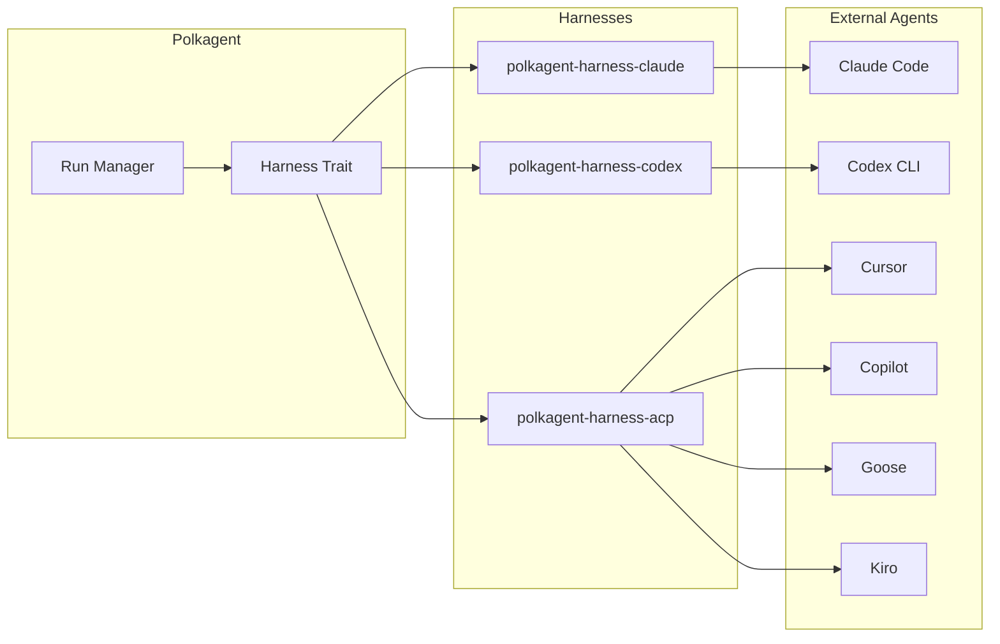
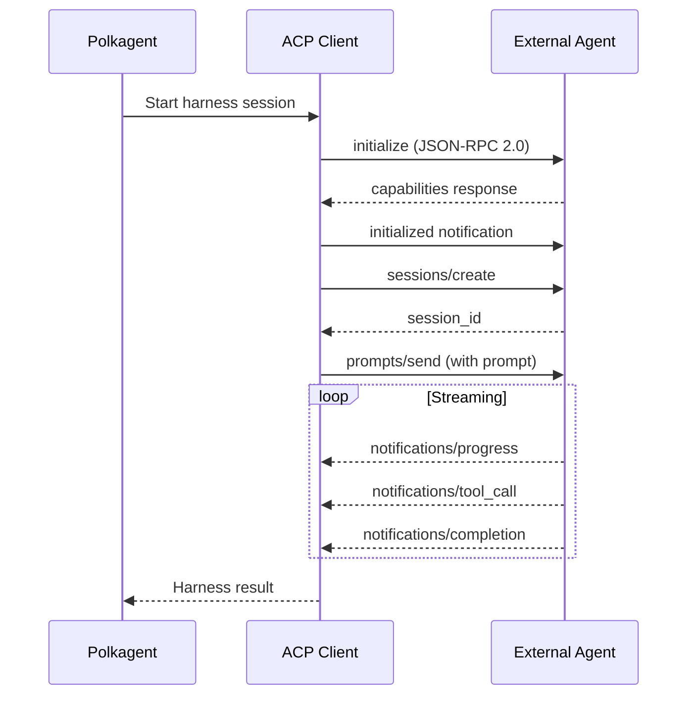
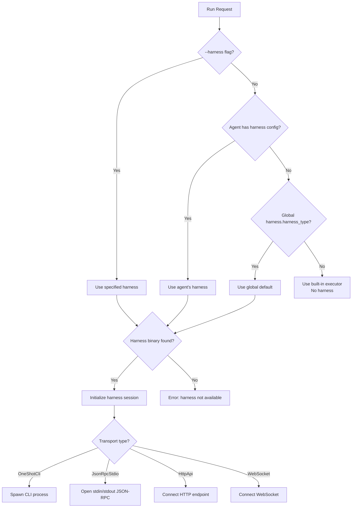

# Harnesses

Harnesses are abstractions for wrapping and orchestrating external coding agents. Polkagent can delegate execution to various coding agent tools through a unified harness interface defined in `polkagent-harness-trait`.



## Transport Types

Each harness communicates with its underlying agent via one of the following transport flavors, defined in the `TransportFlavor` enum:

- `HttpApi` — HTTP-based API communication.
- `OneShotCli` — One-shot CLI execution. Supports the following output formats:
  - `StreamJson` — One event per line.
  - `JsonEnvelope` — Single JSON wrapper.
  - `NdJson` — NDJSON.
  - `PlainText` — Unstructured plain text.
- `JsonRpcStdio` — JSON-RPC 2.0 over stdin/stdout. Used by ACP-compatible agents.
- `WebSocket` — WebSocket-based communication.
- `McpServer` — Model Context Protocol server.

## Harness Capabilities

Each harness declares a set of capabilities that describe how it can be used:

| Capability | Options |
|------------|---------|
| `SessionResumeMode` | `None`, `ById`, `ByReplay` |
| `McpMode` | `None`, `Configurable`, `Passthrough` |
| `ToolInjection` | `None`, `McpConfig`, `CliFlags`, `ConfigFile` |
| `CancelMode` | `None`, `Signal`, `Api` |

## Supported Harnesses

| Harness | Crate | ID | Transport | Description |
|---------|-------|----|-----------|-------------|
| Claude Code | `polkagent-harness-claude` | `claude-code` | One-shot CLI (JSON lines over stdin/stdout) | Anthropic's Claude Code CLI. Uses SIGTERM for graceful shutdown. |
| Codex | `polkagent-harness-codex` | `codex` | CLI | OpenAI Codex CLI. |
| Cursor | `polkagent-harness-cursor` | `cursor` | JSON-RPC stdio (via ACP) | Cursor agent. |
| Copilot | `polkagent-harness-copilot` | `copilot` | CLI | GitHub Copilot agent. |
| Goose | `polkagent-harness-goose` | `goose` | JSON-RPC stdio (via ACP) | Block Inc's Goose agent. |
| Kiro | `polkagent-harness-kiro` | `kiro` | JSON-RPC stdio (via ACP) | Kiro agent. |

## ACP (Agent Client Protocol)

The `polkagent-harness-acp` crate provides a shared JSON-RPC 2.0 over stdio client used by the Cursor, Goose, and Kiro harnesses. The protocol flow is:

1. Send `initialize` request, receive capabilities response.
2. Send `initialized` notification.
3. Create sessions.
4. Send prompts.
5. Receive streaming notifications.



## Configuration

### Global Harness Config

```toml
[harness]
harness_type = "claude"        # Default harness
timeout_secs = 300             # Per-operation timeout
max_concurrent = 1             # Max concurrent harness operations
```

### Per-Harness Configuration

```toml
[harness.harnesses.claude-code]
binary_path = "claude"
transport = "stdio"
approval_mode = "auto"         # auto | manual | policy

[harness.harnesses.codex]
binary_path = "codex"
transport = "stdio"

[harness.harnesses.cursor]
transport = "stdio"
approval_mode = "policy"
```

### Overriding Harness Per Run

Pass `--harness` to override the configured default for a single run:

```bash
polkagent run -a my-agent -p "Fix the bug" --harness codex
```

### Environment Variables

| Variable | Description |
|----------|-------------|
| `POLKAGENT_HARNESS_TYPE` | Default harness type. |
| `POLKAGENT_HARNESS_TIMEOUT_SECS` | Per-operation timeout in seconds. |
| `POLKAGENT_HARNESS_MAX_CONCURRENT` | Maximum number of concurrent harness operations. |

## Harness Selection


