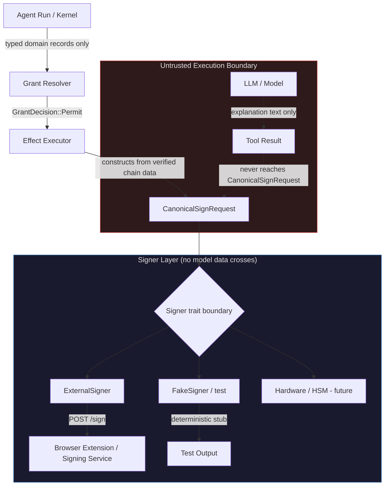
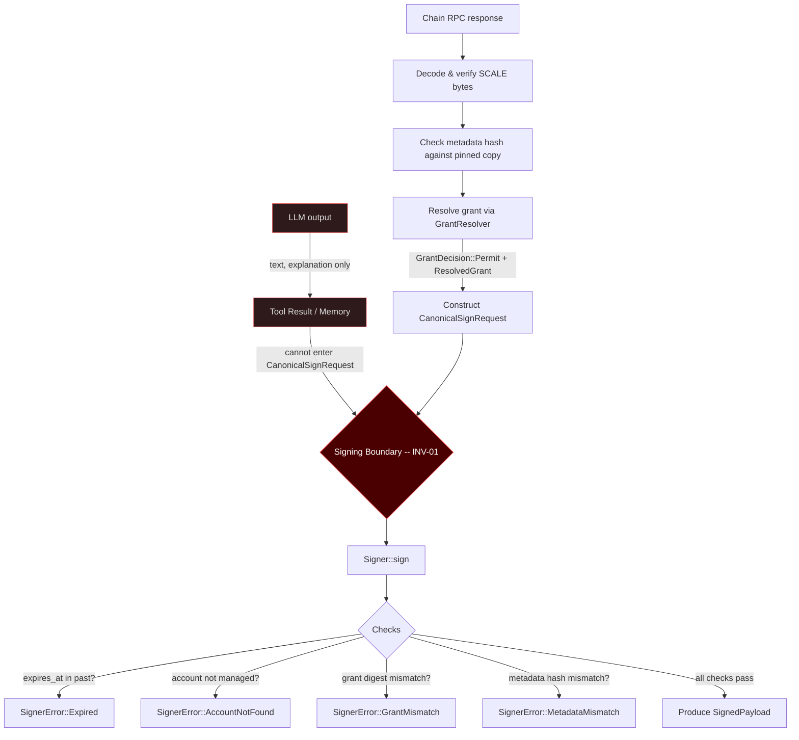
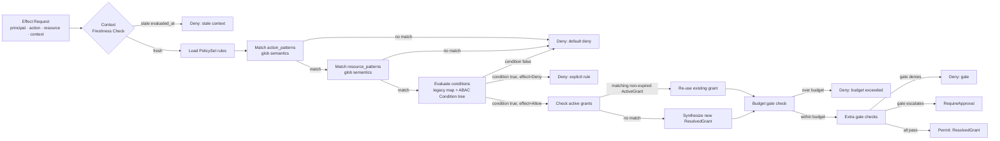

# Identity and Security (PRD-07)

This document describes the identity primitives, signing stack, signer isolation invariant, secret management, and policy engine that together implement PRD-07 in polkagent.

---

## Overview

PRD-07 governs how polkagent handles on-chain identity and authorizes the production of transaction signatures. The design is shaped by one non-negotiable constraint: **a language model must never be able to alter the bytes that are signed on-chain**. Every other security property in this document flows from that single invariant (INV-01; see [safety.md](safety.md)).

The four crates that implement PRD-07 are:

| Crate | Responsibility |
|-------|---------------|
| `polkagent-identity` | On-chain account types, SS58 encoding, agent identity cards |
| `polkagent-signer-trait` | The `Signer` port and `CanonicalSignRequest` boundary type |
| `polkagent-signer-external` | HTTP adapter for browser extensions and signing services |
| `polkagent-secret` | Secure storage and audit logging for credentials |
| `polkagent-grant` | Policy engine, grant resolution, ABAC conditions |

---

## Signing Stack Architecture

The full stack from agent run to on-chain signature spans five layers. The isolation boundary sits between the untrusted execution layer (where the model runs) and the signer layer (where key material lives).



The key structural rule: `CanonicalSignRequest` is constructed exclusively from typed domain records — decoded extrinsic fields, verified chain metadata, and resolved grant identifiers. The Rust type system enforces this because `CanonicalSignRequest` fields have no `From<String>` or freeform-text constructors.

---

## The `Signer` Trait and Implementations

### Trait definition (`polkagent-signer-trait`)

```rust
#[async_trait]
pub trait Signer: Send + Sync + 'static {
    async fn describe(&self) -> Result<SignerCapabilities, SignerError>;
    async fn sign(&self, request: CanonicalSignRequest) -> Result<SignedPayload, SignerError>;
    async fn health(&self) -> Result<(), SignerError>;
}
```

The kernel depends only on `dyn Signer`. No implementation detail — not the key format, not the transport, not the storage backend — leaks across the boundary.

### `CanonicalSignRequest`

This is the only input type accepted by `Signer::sign`. Its doc comment is a hard invariant:

```rust
/// **Invariant:** No field of this struct may be populated from LLM-generated
/// text, user free-form input, or memory content.
pub struct CanonicalSignRequest {
    pub request_id: String,
    pub payload: Vec<u8>,          // SCALE-encoded transaction bytes
    pub account: AccountRef,       // 32-byte AccountId32
    pub chain_profile: ChainProfileId,
    pub metadata_hash: MetadataDigest,
    pub grant_digest: GrantDigest, // digest of the ResolvedGrant that authorized this
    pub approval_id: ApprovalId,
    pub expires_at: Timestamp,     // signer must refuse expired requests
}
```

Supporting types:

- `AccountRef` — 32-byte `account_id` is authoritative for signing decisions; `ss58_display` is display-only and never used for routing.
- `ChainProfileId` — opaque string binding a genesis hash, runtime version, and RPC endpoints.
- `MetadataDigest` — BLAKE3 or SHA-256 hash of the runtime metadata used to build the payload. The signer verifies this matches its pinned copy.
- `GrantDigest` — digest of the `ResolvedGrant`; the signer verifies it matches the pre-authorized grant.
- `SignedPayload` — result type carrying `signed_extrinsic`, `public_key`, and `signature` bytes (audit evidence only; the signed extrinsic is what gets broadcast).

### `SignerError` variants

| Variant | Meaning |
|---------|---------|
| `AccountNotFound` | Account not managed by this signer |
| `InvalidApproval` | Approval ID does not authorize this request |
| `GrantMismatch` | Grant digest in request does not match authorized grant |
| `MetadataMismatch` | Payload was built with a different runtime version |
| `Expired` | Request received after `expires_at` |
| `UserRejected` | User explicitly declined |
| `Hardware` | HSM / hardware wallet error |
| `Timeout` | Signer did not respond in time |
| `WatchOnly` | Signer is watch-only |
| `Internal` | Unexpected internal error |

### `ExternalSigner` (`polkagent-signer-external`)

`ExternalSigner` is the production implementation for browser extensions (Polkadot.js, Talisman, SubWallet) and standalone signing services. It communicates over HTTP:

- `POST {endpoint_url}/sign` — submit a `SigningRequest` and receive a `SigningResponse`.
- `GET  {endpoint_url}/health` — reachability check.

Wire types:

```rust
pub struct SigningRequest {
    pub payload_hex: String,    // SCALE bytes, hex-encoded, no 0x prefix
    pub account: String,        // 32-byte account ID, hex-encoded
    pub chain_id: String,       // ChainProfileId string
    pub metadata_hash: String,  // MetadataDigest bytes, hex-encoded
}

pub struct SigningResponse {
    pub signature_hex: String,  // raw signature bytes, hex-encoded
    pub signed_payload: String, // full signed extrinsic, hex-encoded
}
```

`ExternalSignerConfig` controls the endpoint URL, request timeout (default 30 s), and an optional `allowed_accounts` allowlist. Requests for accounts not in the allowlist are rejected before the HTTP call is made.

An optional `ApprovalCallback` (`Arc<dyn Fn(&SigningRequest) -> bool + Send + Sync>`) may be attached. If it returns `false`, the signer returns `SignerError::UserRejected` without contacting the external service.

---

## Signer Isolation Invariant (INV-01)

INV-01 is the foundational security guarantee of the signing stack. It is stated in both `safety.md` and the `polkagent-signer-trait` crate doc:

> **Models NEVER see raw signing keys.** The signer receives only canonical payload bytes and binding references. It never receives conversation history, model output, tool results, or any other data from the untrusted execution boundary.

The data flow diagram below shows how this is enforced at runtime:



The `build_signing_request` function in `ExternalSigner` encodes INV-01 as code:

```rust
fn build_signing_request(canonical: &CanonicalSignRequest) -> SigningRequest {
    // INV-01: payload bytes are forwarded as-is, only hex-encoded for transport.
    // No bytes are added, removed, or modified.
    let payload_hex = hex_encode(&canonical.payload);
    let account = hex_encode(&canonical.account.account_id);
    let chain_id = canonical.chain_profile.0.clone();
    let metadata_hash = hex_encode(&canonical.metadata_hash.0);
    // ...
}
```

A `debug_assert` verifies that the hex round-trips back to the exact original bytes. The test suite includes `inv01_canonical_bytes_are_forwarded_unchanged` and `inv01_no_extra_fields_in_signing_request` to prevent regressions.

---

## Identity Primitives (`polkagent-identity`)

The `polkagent-identity` crate provides the on-chain account types used throughout the platform.

### Core types

| Type | Description |
|------|-------------|
| `AccountId32` | 32-byte account identifier, displayed and serialized as hex |
| `NetworkId` | Identifies a network by its SS58 prefix |
| `SS58Address` | SS58-encoded address string with checksum validation |
| `ChainAccount` | An account on a specific chain with an optional label |
| `AgentIdentity` | Links an agent to its on-chain accounts |
| `AgentCard` | Signed agent metadata for verification |

### Resolution

`IdentityResolver` (trait) and `CachedIdentityResolver` (implementation) resolve on-chain identity registration records. `IdentityResolution` carries `IdentityField` values and `RegistrarJudgment` records (via `JudgmentLevel`). `SubIdentity` represents sub-account relationships.

The `encode_ss58` / `decode_ss58` functions in the `ss58` module handle address encoding. Note that the current implementation uses BLAKE3 for checksums rather than canonical BLAKE2b-512 — production deployments requiring interoperability with standard Substrate tooling should use BLAKE2b-512.

---

## Secret Management (`polkagent-secret`)

The `polkagent-secret` crate stores credentials (API keys, keystore passwords, etc.) with zeroize-on-drop semantics and a mandatory audit trail.

### Storage backends

| Module | Type | Backend | Read | Write |
|--------|------|---------|------|-------|
| `env` | `EnvSecretStore` | Environment variables | Yes | No |
| `file` | `FileSecretStore` | `~/.polkagent/secrets/` at `0600` | Yes | Yes |
| `chain` | `ChainSecretStore` | Composite: env then file | Yes | Yes |

All access is recorded to a JSONL audit log by `SecretAuditLog`. `AuditEntry` records include `AuditOperation` (read/write/delete) and are written before the operation completes. Audit entries never contain the secret value itself.

### Key types

```rust
pub struct SecretId(/* opaque string key */);
pub struct SecretValue(/* zeroize-on-drop bytes */);
pub struct SecretMetadata { /* source, created_at, etc. */ }
pub enum SecretSource { Env, File, Injected }
```

`Display` and `Debug` on `SecretValue` always print `[REDACTED]` — the raw value is never written to logs, error messages, or debug output.

### Secret scanning

`detect_secrets(text) -> Vec<SecretDetection>` and `scrub_secrets(text) -> String` detect and redact common credential patterns (API keys, private keys, mnemonics) from arbitrary text before it is logged or returned in tool results. `SecretKind` enumerates the pattern categories.

---

## Policy Engine (`polkagent-grant`)

### Overview

`polkagent-grant` implements a deny-overrides policy engine. Every effect request must be authorized by the resolver before `CanonicalSignRequest` can be constructed. The default outcome when no rules match is `Deny`, consistent with INV-POLICY-03.

### Policy evaluation pipeline



### `PolicyRule`

```rust
pub struct PolicyRule {
    pub id: String,
    pub effect: Effect,                      // Allow or Deny
    pub action_patterns: Vec<String>,        // glob patterns
    pub resource_patterns: Vec<String>,      // glob patterns
    pub conditions: HashMap<String, String>, // legacy key=value
    pub abac_condition: Option<Condition>,   // structured ABAC tree
}
```

Pattern syntax: `*` matches any sequence that does not contain `/`; `**` matches any sequence including `/`. Examples: `"chain/**"`, `"account/5Grwva*"`, `"governance/**"`.

Deny-overrides: a single matching `Deny` rule produces an immediate `PolicyDecision::Deny` regardless of how many `Allow` rules also match.

### `PolicySet` and inheritance

A `PolicySet` is an ordered collection of `PolicyRule` values. A `Policy` may declare `extends: Some(parent_name)`. `resolve_policy_chain` merges a chain of policies by appending child rules after parent rules; deny-overrides applies globally across the merged set.

`PolicyTemplate` values use `{{param}}` placeholders. `instantiate_template` substitutes parameters to produce a concrete `Policy`.

### `EvaluationContext`

```rust
pub struct EvaluationContext {
    pub attributes: HashMap<String, String>,              // legacy string map
    pub typed_attributes: HashMap<String, ContextAttribute>, // typed ABAC values
    pub evaluated_at: Option<String>,                     // ISO-8601 freshness stamp
    // ...
}
```

`ContextAttribute` variants:

| Variant | Used by |
|---------|---------|
| `String(String)` | `Equals`, `Contains`, `In`, `Matches` |
| `Number(f64)` | `GreaterThan`, `LessThan` |
| `Bool(bool)` | future boolean guards |
| `List(Vec<String>)` | `Contains`, `In` |
| `Timestamp(String)` | temporal conditions |

---

## ABAC Conditions

The `Condition` enum defines a recursive expression tree that is evaluated against `EvaluationContext` by `evaluate_condition`:

| Variant | Semantics |
|---------|-----------|
| `Equals { attr, value }` | String equality (case-sensitive) |
| `Contains { attr, value }` | Substring check (String) or element membership (List) |
| `GreaterThan { attr, value }` | Numeric strict greater-than |
| `LessThan { attr, value }` | Numeric strict less-than |
| `In { attr, values }` | Attribute value is one of a set |
| `Matches { attr, pattern }` | Glob match using `pattern_matches` |
| `Not { inner }` | Logical negation |
| `And { conditions }` | All children must be true |
| `Or { conditions }` | At least one child must be true |

An absent attribute always evaluates to `false` for atomic conditions. This means a missing context attribute will never accidentally grant access.

Example ABAC condition requiring that the request comes from a known role and the amount is below a threshold:

```json
{
  "op": "and",
  "conditions": [
    { "op": "equals", "attr": "principal.role", "value": "operator" },
    { "op": "less_than", "attr": "request.amount_dot", "value": 1000000000 }
  ]
}
```

---

## Grant Types and Resolution

### `GrantDecision` (output of `GrantResolver::resolve`)

```rust
pub enum GrantDecision {
    Permit(ResolvedGrant),
    Deny(PolicyDenial),
    RequireApproval(ApprovalRequirement),
    Defer(DeferReason),
}
```

### `ResolvedGrant`

An immutable, time-bounded authorization record. Corresponds to `ResolvedGrant` in PRD-07 §8.2.

```rust
pub struct ResolvedGrant {
    pub grant_id: GrantId,
    pub principal: String,
    pub action: String,
    pub resource: String,
    pub allowed_effects: EffectSet,  // dot-separated effect names
    pub limits: GrantLimits,
    pub expires_at: DateTime<Utc>,
}
```

`GrantLimits` carries `max_requests: Option<u64>`, `max_spend: Option<u64>`, and `deadline: Option<DateTime<Utc>>`.

`EffectSet` is a `Vec<String>` of dot-separated effect names (e.g. `"chain.transfer"`, `"model.inference"`). `EffectSet::contains` checks for exact membership.

### `ActiveGrant` (pre-issued grants)

When an operator pre-issues a grant out of band (e.g. via an approval flow), it is stored as an `ActiveGrant` in the resolver's registry. If a matching, non-expired `ActiveGrant` exists when `resolve` is called, the resolver re-uses it rather than synthesizing a new one. Expired grants are silently ignored (REQ-POLICY-02: no grace period).

```rust
pub struct ActiveGrant {
    pub grant_id: GrantId,
    pub principal: String,
    pub action_pattern: String,    // glob
    pub resource_pattern: String,  // glob
    pub allowed_effects: EffectSet,
    pub limits: GrantLimits,
    pub expires_at: DateTime<Utc>,
}
```

`ActiveGrant::applies_to(principal, action, resource)` returns `false` immediately if the grant has expired.

### `GrantResolver`

`GrantResolver` is the entry point. It holds a `PolicySet` (behind a `RwLock` for live updates via `update_policy`), a registry of `ActiveGrant` values, an optional `BudgetTracker`, and a list of extra `Gate` implementations.

```rust
pub struct ResolverConfig {
    pub max_context_age: Option<Duration>, // default: 5 minutes
    pub default_grant_ttl: Duration,       // default: 1 hour
}
```

The resolver is constructed via `GrantResolver::new(policy_set, config)` and shared as `Arc<GrantResolver>`. `with_budget_tracker` attaches a `BudgetTracker` at build time.

Resolution algorithm (six steps):

1. **Context freshness.** If `ctx.evaluated_at` is set and the age exceeds `max_context_age`, return `Deny`.
2. **Policy evaluation.** Deny-overrides evaluation over the `PolicySet`.
3. **Active grant check.** Find the first matching, non-expired `ActiveGrant`.
4. **Synthesize grant.** If no active grant matches, build a fresh `ResolvedGrant` with TTL from `default_grant_ttl`.
5. **Budget check.** If a `BudgetTracker` is attached and an `amount` was supplied, verify and record the spend.
6. **Extra gates.** Each `Gate` may return `Allow`, `Deny`, or `Escalate`. A `Deny` produces `GrantDecision::Deny`; `Escalate` produces `GrantDecision::RequireApproval`.

---

## Cross-References

- **[safety.md](safety.md)** — INV-01 (signer isolation), INV-02 (effect intent before I/O), INV-03 (no silent duplicate effects), INV-04 (unknown stays unknown). The signing stack described here implements INV-01 directly.
- **chain.md** — Chain profile binding, SCALE encoding, metadata pinning, and extrinsic verification. `CanonicalSignRequest.payload` is the output of the chain layer; `CanonicalSignRequest.metadata_hash` verifies it was built from the pinned metadata.
- **architecture.md** — Hexagonal port/adapter layout. `Signer` is a port; `ExternalSigner` is the adapter.
