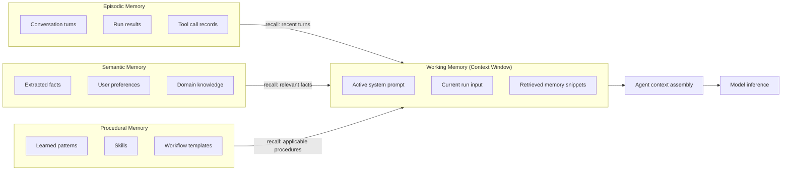
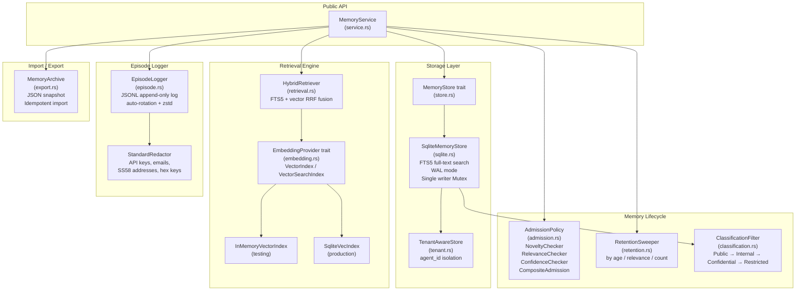
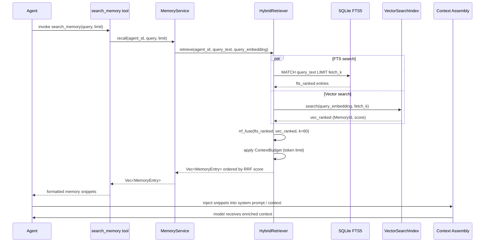
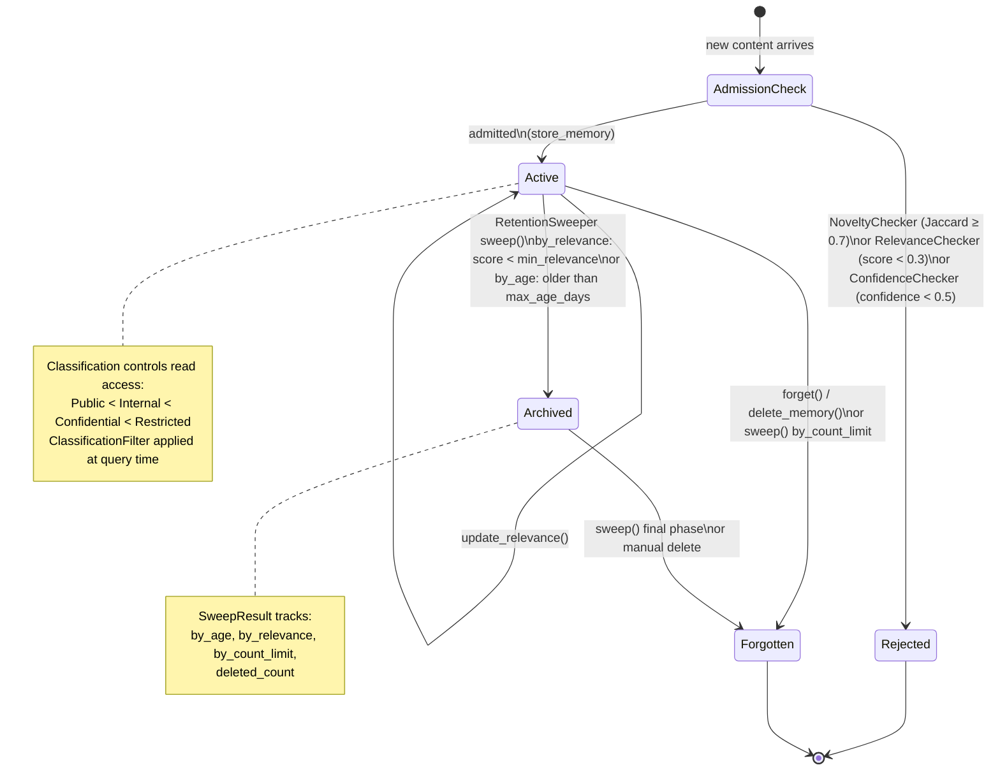

# Memory (PRD-09)

Polkagent provides a persistent, multi-type memory subsystem through the
`polkagent-memory` crate. Agents can store information across runs, recall it
through full-text and semantic search, and manage its lifecycle with a
retention sweep. The subsystem is agent-scoped: every entry is keyed to an
`AgentId` and tenant isolation is enforced at every query boundary.

---

## Overview

Most agents are stateless between runs by default. The memory subsystem adds
persistent recall so an agent can:

- Remember facts extracted from interactions and surface them in later runs.
- Log conversation turns and tool calls as an auditable episode journal.
- Learn procedural patterns that influence future behaviour.
- Export its full memory to a portable JSON archive and import it elsewhere.

The backing store is a SQLite database using an FTS5 virtual table for
full-text search. An optional vector index (backed by `EmbeddingProvider`
implementations) enables semantic similarity search on top of keyword
retrieval, with the two ranked lists fused using Reciprocal Rank Fusion (RRF).

---

## Memory Types

There are three distinct `MemoryType` variants. Every `MemoryEntry` carries
exactly one type, and searches can be filtered to one or more types.

| Type | Rust variant | Description |
|---|---|---|
| Episodic | `MemoryType::Episodic` | Conversation history and interaction records — who said what, in which turn, in which episode |
| Semantic | `MemoryType::Semantic` | Facts, knowledge, and declarative information extracted from interactions |
| Procedural | `MemoryType::Procedural` | Learned patterns, procedures, and skills that influence agent behaviour |

### Diagram 1 — Memory types and context assembly



---

## Module Architecture

The `polkagent-memory` crate is structured into focused modules that compose
cleanly at the `MemoryService` facade level.

### Diagram 2 — Module architecture



---

## Memory Store Backend: SQLite FTS5

`SqliteMemoryStore` is the concrete implementation of the `MemoryStore` trait.
It opens (or creates) a SQLite database file using WAL journal mode and a 5-second
busy timeout to support concurrent readers against a single serialised writer.

### Schema

```sql
-- Primary memory table
CREATE TABLE memories (
    id              TEXT PRIMARY KEY,          -- UUIDv7 MemoryId
    agent_id        TEXT NOT NULL,             -- owning AgentId
    episode_id      TEXT,                      -- optional EpisodeId FK
    memory_type     TEXT NOT NULL,             -- 'episodic' | 'semantic' | 'procedural'
    content         TEXT NOT NULL,             -- full text content
    embedding       BLOB,                      -- optional f32 vector
    metadata        TEXT NOT NULL DEFAULT '{}',
    provenance      TEXT,                      -- JSON-encoded MemoryProvenance
    created_at      TEXT NOT NULL,
    accessed_at     TEXT NOT NULL,
    access_count    INTEGER NOT NULL DEFAULT 0,
    relevance_score REAL    NOT NULL DEFAULT 1.0,
    confidence      REAL    NOT NULL DEFAULT 1.0,
    classification  TEXT    NOT NULL DEFAULT 'internal'
);

-- FTS5 virtual table (content mirror)
CREATE VIRTUAL TABLE memories_fts USING fts5(
    content,
    content='memories',
    content_rowid='rowid'
);

-- Episode table
CREATE TABLE episodes (
    id          TEXT PRIMARY KEY,
    agent_id    TEXT NOT NULL,
    title       TEXT NOT NULL,
    summary     TEXT,
    started_at  TEXT NOT NULL,
    ended_at    TEXT,
    turn_count  INTEGER NOT NULL DEFAULT 0,
    metadata    TEXT NOT NULL DEFAULT '{}'
);

-- Provenance side-table
CREATE TABLE memory_provenance (
    memory_id           TEXT PRIMARY KEY REFERENCES memories(id) ON DELETE CASCADE,
    source_run_id       TEXT,
    source_turn         INTEGER,
    extraction_method   TEXT NOT NULL,
    confidence          REAL NOT NULL DEFAULT 1.0,
    verified            INTEGER NOT NULL DEFAULT 0
);
```

FTS5 triggers (`memories_ai`, `memories_ad`, `memories_au`) keep the virtual
table in sync with the primary `memories` table automatically. Indexes on
`agent_id`, `episode_id`, `memory_type`, `relevance_score DESC`, and
`created_at` ensure efficient filtered scans.

### Key `MemoryStore` trait methods

| Method | Description |
|---|---|
| `store_memory(&MemoryEntry)` | Persist a new entry; returns its `MemoryId` |
| `get_memory(MemoryId)` | Fetch a single entry by ID |
| `search(&MemoryQuery)` | FTS5 query with optional type/episode/relevance filters |
| `search_with_classification(query, Classification)` | Search filtered to a maximum classification level |
| `list_entries(agent_id, limit, offset)` | Paginated full scan (used by export) |
| `update_relevance(MemoryId, f64)` | Update the relevance score for an entry |
| `delete_memory(MemoryId)` | Hard-delete an entry |
| `count_entries(&AgentId)` | Return total entry count for an agent |
| `delete_by_age(&AgentId, Duration)` | Bulk delete entries older than a duration |
| `create_episode`, `get_episode`, `end_episode`, `list_episodes` | Episode lifecycle |

---

## Retrieval and Search

### MemoryQuery

Search parameters are bundled in a `MemoryQuery` struct:

```rust
pub struct MemoryQuery {
    pub agent_id: AgentId,
    pub query_text: String,
    pub memory_types: Option<Vec<MemoryType>>,
    pub limit: usize,
    pub min_relevance: Option<f64>,
    pub since: Option<DateTime<Utc>>,
    pub episode_id: Option<EpisodeId>,
}
```

When `query_text` is non-empty the store runs an FTS5 `MATCH` query against the
`memories_fts` virtual table. Results are ranked by FTS5 BM25 relevance and
then filtered against any `min_relevance` and `since` predicates.

### Hybrid Retrieval (FTS5 + Vector)

`HybridRetriever` orchestrates two parallel search paths and merges them with
Reciprocal Rank Fusion (RRF):

1. **FTS5 text search** via `MemoryStore::search` — keyword match on the full
   content text.
2. **Vector similarity search** via a `VectorSearchIndex` implementation
   (`InMemoryVectorIndex` for tests, `SqliteVecIndex` for production) — cosine
   similarity on `f32` embedding vectors.
3. Both ranked lists are fused with `rrf_fuse` using configurable per-source
   weights (`fts_weight`, `vec_weight`) and an RRF constant `rrf_k` (default 60).
4. The fused list is trimmed to `RetrievalConfig::max_results`, then optionally
   truncated further by a `ContextBudget` expressed in tokens (heuristic: 1 token
   ≈ 4 characters).

An entry appearing in both the FTS and vector result lists receives a boosted
RRF score, making hybrid retrieval more accurate than either source alone.

### Diagram 3 — Memory retrieval sequence



### Semantic Search (Vector Only)

`MemoryService::semantic_search(query, k)` bypasses FTS5 entirely. The query
text is embedded with the configured `EmbeddingProvider`, then the `VectorIndex`
(a brute-force flat index) performs a linear cosine-similarity scan and returns
the top-`k` results as `SearchResult { id: MemoryId, score: f32 }`.

This path requires `MemoryService::with_embedding_index(provider)` to be
called at construction. Without an embedding provider the call returns
`MemoryError::InvalidOperation`.

Supported embedding models via `EmbeddingModel`:

| Variant | Dimensions |
|---|---|
| `Ada002` | 1536 (OpenAI text-embedding-ada-002) |
| `AllMiniLML6` | 384 (Sentence-Transformers all-MiniLM-L6-v2) |
| `BgeSmall` | 384 (BAAI bge-small-en-v1.5) |
| `Custom(n)` | Arbitrary |

---

## Memory Entry Lifecycle

### Core types

```rust
pub struct MemoryEntry {
    pub id: MemoryId,                          // UUIDv7
    pub agent_id: AgentId,
    pub episode_id: Option<EpisodeId>,
    pub memory_type: MemoryType,               // Episodic | Semantic | Procedural
    pub content: String,
    pub embedding: Option<Vec<f32>>,
    pub metadata: serde_json::Value,
    pub provenance: Option<MemoryProvenance>,
    pub created_at: DateTime<Utc>,
    pub accessed_at: DateTime<Utc>,
    pub access_count: u64,
    pub relevance_score: f64,                  // 0.0 – 1.0, higher = more relevant
    pub confidence: f64,                       // 0.0 – 1.0, default 1.0
    pub classification: Classification,        // Public | Internal | Confidential | Restricted
}
```

### Provenance tracking

```rust
pub struct MemoryProvenance {
    pub source_run_id: Option<String>,
    pub source_turn: Option<u32>,
    pub extraction_method: String,   // e.g. "user_input" | "llm_extraction" | "tool_output"
    pub confidence: f64,
    pub verified: bool,
}
```

### Diagram 4 — Memory entry lifecycle



### Retention sweep phases

`RetentionSweeper::sweep()` runs three ordered phases against all entries for
the configured `agent_id`:

1. **By age** — delete entries older than `RetentionPolicy::max_age_days`
   (default 90 days).
2. **By relevance** — delete entries whose `relevance_score` is below
   `RetentionPolicy::min_relevance` (default 0.1).
3. **By count limit** — if the remaining count still exceeds
   `RetentionPolicy::max_entries_per_agent` (default 10 000), delete the
   oldest entries until the limit is satisfied.

The sweep returns a `SweepResult` with per-phase counts (`by_age`,
`by_relevance`, `by_count_limit`, `deleted_count`). The sweeper does not
schedule itself; callers are responsible for scheduling via a timer or
background task. `RetentionPolicy::sweep_interval_secs` (default 3600) is an
informational hint for the scheduler.

---

## Admission Control

Before an entry reaches the store, optional `AdmissionPolicy` implementations
filter it:

| Policy | Default threshold | Behaviour |
|---|---|---|
| `NoveltyChecker` | 0.7 (Jaccard word overlap) | Rejects entries too similar to existing entries of the same type and agent |
| `RelevanceChecker` | 0.3 | Rejects entries with `relevance_score < min_relevance` |
| `ConfidenceChecker` | 0.5 | Rejects entries with `confidence < min_confidence` |
| `CompositeAdmission` | — | Chains multiple policies; first non-Accept wins |

`AdmissionDecision` can be `Accept`, `Reject(String)`, or
`AcceptWithMerge(MemoryId)` (signals the caller to merge with an existing
entry instead of creating a new record).

---

## Classification

`Classification` labels entries with a sensitivity tier. The ordering from
least to most sensitive is:

```
Public < Internal < Confidential < Restricted
```

`Classification::Internal` is the default for all new entries. At query time
`search_with_classification(query, max_classification)` silently excludes
entries above the caller's clearance level — no error is returned for
inaccessible entries, only an empty slot in the result list.

`ClassificationFilter::permits(classification)` implements the `<=` check.

---

## Episode Logger

Episodes are conversation sessions tracked at two levels:

1. **`Episode` / `EpisodeId`** — stored in the `episodes` table via
   `MemoryStore`. Holds a title, optional summary, `started_at` / `ended_at`
   timestamps, and a turn count.
2. **`EpisodeLogger`** — an append-only JSONL file writer for structured turn
   logs. Each call to `append(EpisodeEntry)` first passes the entry through
   `StandardRedactor` to strip secrets (Bearer tokens, API keys with `sk-` /
   `pk-` prefixes, hex private keys, email addresses, SS58 addresses), then
   writes a JSON line to the active file.

`EpisodeLoggerConfig` controls the log directory, rotation threshold (default
10 MB), and optional zstd compression of rotated files. Compressed rotated
files carry the `.jsonl.zst` extension and can be replayed via `replay(path)`.

`EpisodeEntry` carries `timestamp`, `role` (`System | User | Assistant | Tool`),
`content`, `tool_calls: Vec<ToolCallRecord>`, and `metadata`.

---

## Memory Management CLI Commands

The following commands are available under `polkagent memory`:

| Command | Description |
|---|---|
| `polkagent memory search <query>` | Full-text search for memories matching a query string |
| `polkagent memory list [--type episodic\|semantic\|procedural] [--limit N]` | List stored memories with optional type filter |
| `polkagent memory forget <memory-id>` | Permanently delete a single memory entry |
| `polkagent memory stats` | Show entry count, oldest entry, and last sweep time |
| `polkagent memory export <path>` | Write a `MemoryArchive` JSON snapshot to the given path |
| `polkagent memory import <path>` | Import a `MemoryArchive`; duplicate entries are skipped |
| `polkagent memory sweep` | Run a retention sweep immediately and print `SweepResult` |

For full flag documentation see [cli.md](cli.md).

---

## API Endpoints for Memory

The HTTP API exposes the following memory endpoints (full schema in
[api.md](api.md)):

| Method | Path | Description |
|---|---|---|
| `GET` | `/v1/agents/{agent_id}/memory` | List memory entries (paginated) |
| `POST` | `/v1/agents/{agent_id}/memory/search` | Full-text search with a `MemoryQuery` body |
| `POST` | `/v1/agents/{agent_id}/memory` | Store a new `MemoryEntry` |
| `GET` | `/v1/agents/{agent_id}/memory/{memory_id}` | Fetch a single entry by ID |
| `DELETE` | `/v1/agents/{agent_id}/memory/{memory_id}` | Delete (forget) a single entry |
| `GET` | `/v1/agents/{agent_id}/episodes` | List episodes for an agent |
| `POST` | `/v1/agents/{agent_id}/episodes` | Start a new episode |
| `PATCH` | `/v1/agents/{agent_id}/episodes/{episode_id}` | End an episode with a summary |
| `POST` | `/v1/agents/{agent_id}/memory/export` | Export full memory archive (returns JSON) |
| `POST` | `/v1/agents/{agent_id}/memory/import` | Import a memory archive |
| `POST` | `/v1/agents/{agent_id}/memory/sweep` | Trigger a retention sweep |

---

## Configuration Options

Memory configuration is nested under `[memory]` in the agent configuration
file. See [configuration.md](configuration.md) for the full schema.

```toml
[memory]
# Path to the SQLite database file. Default: <data_dir>/memory.db
db_path = "memory.db"

# Embedding provider for vector/semantic search.
# Options: "none" | "ada002" | "all-minilm-l6" | "bge-small" | "custom"
# Default: "none" (disables semantic search)
embedding_provider = "none"

# Directory for JSONL episode log files.
# Default: <data_dir>/episodes
episode_log_dir = "episodes"

# Maximum size of a single episode JSONL file before rotation (bytes).
# Default: 10485760 (10 MB)
episode_max_file_size = 10485760

# Whether to zstd-compress rotated episode log files.
# Default: true
episode_compress_rotated = true

[memory.retention]
# Maximum number of memory entries per agent before oldest are deleted.
# Default: 10000
max_entries_per_agent = 10000

# Maximum age of a memory entry in days before it is deleted by sweep.
# Default: 90
max_age_days = 90

# Minimum relevance score; entries below this are deleted by sweep.
# Default: 0.1
min_relevance = 0.1

# Hint for scheduling automatic sweeps (seconds).
# Default: 3600 (1 hour)
sweep_interval_secs = 3600

[memory.retrieval]
# Maximum number of results returned by a single search.
# Default: 10
max_results = 10

# RRF k constant — higher values compress rank differences.
# Default: 60
rrf_k = 60

# Weight for FTS5 results in hybrid RRF fusion.
# Default: 1.0
fts_weight = 1.0

# Weight for vector similarity results in hybrid RRF fusion.
# Default: 1.0
vec_weight = 1.0

# Token budget for context injection (heuristic: 1 token ≈ 4 chars).
# Default: 4096
context_budget_tokens = 4096

[memory.admission]
# Minimum novelty Jaccard threshold; entries more similar are rejected.
# Default: 0.7
novelty_threshold = 0.7

# Minimum relevance_score for admission.
# Default: 0.3
min_relevance = 0.3

# Minimum confidence for admission.
# Default: 0.5
min_confidence = 0.5
```

---

## Quickstart

```rust
use std::sync::Arc;
use polkagent_core::ids::AgentId;
use polkagent_memory::sqlite::SqliteMemoryStore;
use polkagent_memory::service::MemoryService;
use polkagent_memory::types::MemoryType;

let store = SqliteMemoryStore::open("memory.db")?;
let svc = MemoryService::new(Arc::new(store));

let agent = AgentId::new();

// Store a semantic memory.
let id = svc.remember(agent, "The user prefers dark mode", MemoryType::Semantic, None).await?;

// Recall memories matching a query.
let results = svc.recall(agent, "dark mode", 5).await?;

// Start an episode.
let ep = svc.start_episode(agent, "session-2026-08-03").await?;
svc.end_episode(ep, "Discussed UI preferences").await?;

// Forget a specific memory.
svc.forget(id).await?;

// Export and import.
svc.export_agent_memory(&agent, std::path::Path::new("backup.json")).await?;
let result = svc.import_agent_memory(std::path::Path::new("backup.json")).await?;
println!("imported: {}, skipped: {}", result.imported_count, result.skipped_count);
```

---

## Cross-References

- **`search_memory` tool** — agents invoke memory recall through this built-in
  tool. See [tools-and-skills.md](tools-and-skills.md) for the tool schema and
  invocation protocol.
- **Configuration** — full TOML schema for the `[memory]` section is
  documented in [configuration.md](configuration.md).
- **CLI** — `polkagent memory` subcommands are documented in [cli.md](cli.md).
- **API** — REST endpoint schemas and authentication are in [api.md](api.md).
- **Run lifecycle** — how episodes are opened and closed as part of a run is
  covered in [run-lifecycle.md](run-lifecycle.md).
