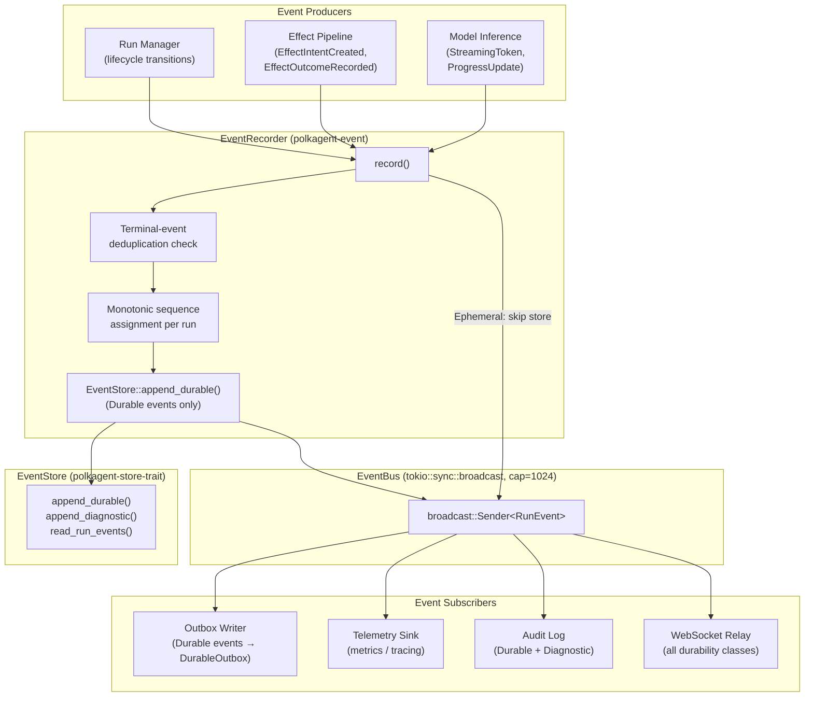
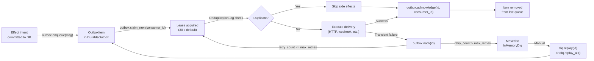
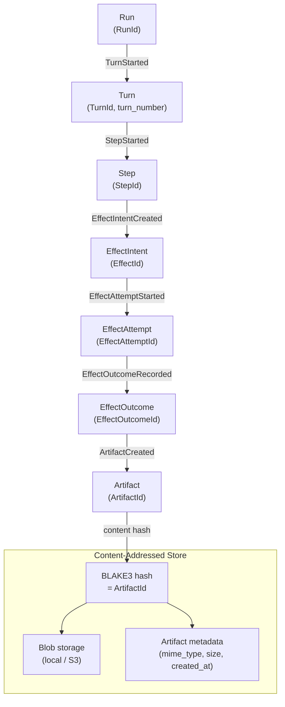
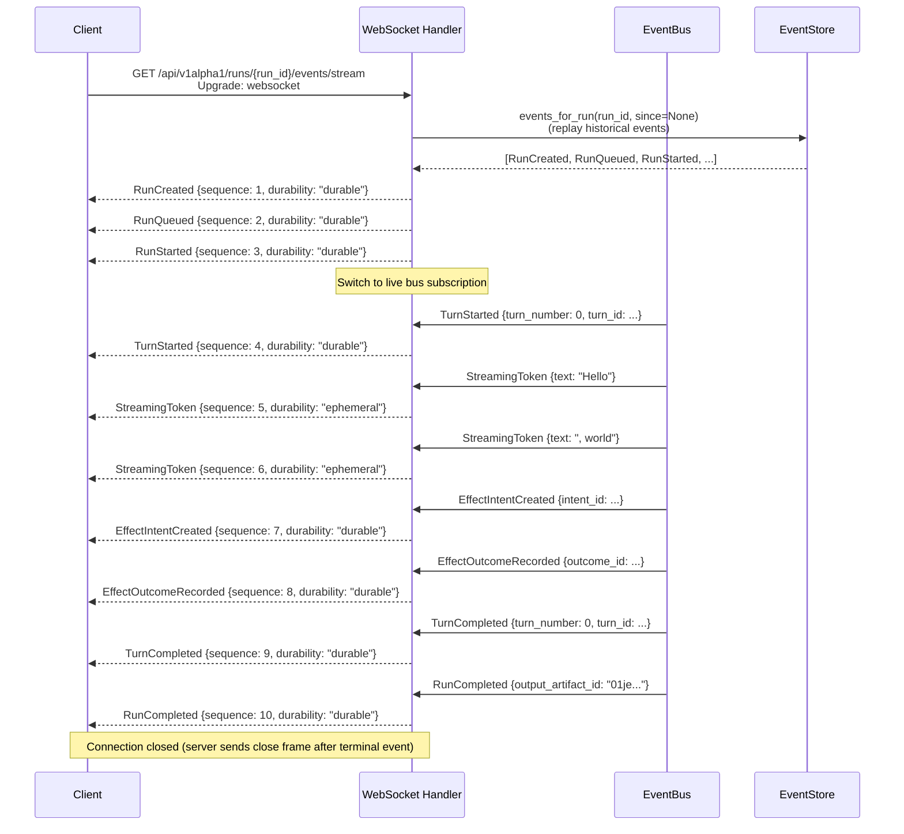

# Outbox and Event System

PRD-10 Event System — durable event recording, in-process fan-out, at-least-once outbox delivery, and real-time WebSocket streaming.

---

## Overview

Every observable state change in Polkagent is captured as a [`RunEvent`]. Events serve two purposes simultaneously:

1. **Durable audit trail** — lifecycle events (`RunCreated`, `RunCompleted`, …) are committed to the event store in the same database transaction as the state change they describe. This means the event log is the source of truth for run history, projection rebuilds, and audit queries.

2. **Real-time streaming** — the in-process [`EventBus`] broadcasts all events (durable and ephemeral) to any number of subscribers in the same process: the outbox writer, telemetry sinks, WebSocket relay, and audit log all receive the same event concurrently without coupling.

The system is built from three independent crates:

| Crate | Purpose |
|---|---|
| `polkagent-core` (`event` module) | Domain types: `RunEvent`, `EventKind`, `Durability`, `EventCorrelation` |
| `polkagent-event` | `EventBus`, `EventRecorder`, `Projection` framework, query helpers |
| `polkagent-outbox` | `DurableOutbox`, `DeduplicationLog`, `ExponentialBackoff`, DLQ |

---

## Event System Architecture



### Key invariants

- **EVENT-ORD-1:** Sequence numbers within a run are strictly monotonic. No gaps, no reordering. The store enforces `UNIQUE(run_id, sequence)`.
- **EVENT-ORD-2:** `Durable` events are committed to the store before they are published on the bus. Consumers reading from the store will always see the event if they read after the producer's call to `EventRecorder::record` returns.
- **EVENT-ORD-3:** `Ephemeral` events are published directly on the bus without a store write. Clients must tolerate gaps in the ephemeral stream.
- **REQ-EVT-004:** At most one terminal event (`RunCompleted`, `RunFailed`, `RunCancelled`, `RunTimedOut`) is allowed per run. The recorder checks before writing and returns `EventError::DuplicateTerminalEvent` on a violation.

---

## Event Types

All event types are defined in `polkagent-core/src/event.rs` as `EventKind` and catalogued in `polkagent-event/src/types.rs` as `EventType`.

### Lifecycle — Run (always `Durable`)

| `EventKind` variant | `EventType` string | Description |
|---|---|---|
| `RunCreated` | `run_created` | Run record was created |
| `RunQueued` | `run_queued` | Transitioned to `Queued` |
| `RunStarted` | `run_started` | Transitioned to `Running` |
| `ApprovalRequested { request_id }` | `approval_requested` | Run entered `AwaitingApproval` |
| `ApprovalGranted { approval_id }` | `approval_granted` | Approval was granted |
| `ApprovalDenied { reason }` | `approval_denied` | Approval was denied |
| `RunCompleting` | `run_completing` | Entered `Completing` state |
| `RunCompleted { output_artifact_id }` | `run_completed` | Terminal: success |
| `RunFailed { reason }` | `run_failed` | Terminal: failure |
| `RunCancelled { reason }` | `run_cancelled` | Terminal: cancellation |
| `RunTimedOut` | `run_timed_out` | Terminal: timeout |
| `RunRetryQueued` | `run_retry_queued` | Failed run re-queued |

The four terminal event type strings are also available as the constant `TERMINAL_EVENT_TYPES: &[&str]`.

### Lifecycle — Turn and Step (always `Durable`)

| `EventKind` variant | `EventType` string | Description |
|---|---|---|
| `TurnStarted { turn_number, turn_id }` | `turn_started` | A new turn began |
| `TurnCompleted { turn_number, turn_id }` | `turn_completed` | A turn finished |
| `StepStarted { step_id }` | *(not yet in EventType catalog)* | A step began |
| `StepCompleted { step_id }` | *(not yet in EventType catalog)* | A step completed |

### Lifecycle — Effects (always `Durable`)

| `EventKind` variant | `EventType` string | Description |
|---|---|---|
| `EffectIntentCreated { intent_id }` | `effect_intent_created` | An `EffectIntent` was committed to the outbox |
| `EffectAttemptStarted { attempt_id }` | `effect_attempt_started` | A worker started an `EffectAttempt` |
| `EffectOutcomeRecorded { outcome_id }` | `effect_outcome_recorded` | An `EffectOutcome` was recorded |
| `EffectsResolved` | *(not yet in EventType catalog)* | All pending effects for the turn resolved |

### Lifecycle — Artifacts (always `Durable`)

| `EventKind` variant | `EventType` string | Description |
|---|---|---|
| `ArtifactCreated { artifact_id }` | *(not yet in EventType catalog)* | An artifact was created |

### Streaming / Progress (`Ephemeral`)

| `EventKind` variant | `EventType` string | Description |
|---|---|---|
| `StreamingToken { text }` | `text_delta` | A fragment from model inference |
| `ProgressUpdate { message, percentage }` | `progress_update` | Progress from a long-running step |

### Tool Streaming (`Diagnostic`)

| `EventKind` variant | `EventType` string | Description |
|---|---|---|
| `ToolCallStarted { tool_name }` | `tool_call_started` | A tool call began |
| `ToolCallCompleted { tool_name }` | `tool_call_completed` | A tool call finished |

### Diagnostic (`Diagnostic`)

| `EventKind` variant | `EventType` string | Description |
|---|---|---|
| `DiagnosticLog { level, message }` | *(not yet in EventType catalog)* | Structured log entry (`LogLevel`: `Trace`, `Debug`, `Info`, `Warn`, `Error`) |

### Delivery and Budget (`Durable`)

| `EventKind` variant | `EventType` string | Description |
|---|---|---|
| `DeliveryStarted` | *(not yet in EventType catalog)* | Result delivery began |
| `DeliveryCompleted` | *(not yet in EventType catalog)* | Result delivery completed |
| `BudgetConsumed { resource, amount_str }` | *(not yet in EventType catalog)* | A budget resource was consumed |
| `BudgetWarning { resource, remaining_str }` | *(not yet in EventType catalog)* | A budget is running low |

### System (`Durable`)

These live in the `EventType` catalog but do not yet have corresponding `EventKind` variants:

`SystemStarted`, `SystemShutdown`, `BackupCompleted`, `RetentionEnforced`, `SchemasMigrated`, `ConfigurationChanged`

---

## Durability Classes

The `Durability` enum (in `polkagent-core::event`) and `DurabilityClass` (in `polkagent-core`) control how the `EventRecorder` treats each event.

```rust
pub enum Durability {
    Durable,      // Written to EventStore in the same transaction as the state change.
    Ephemeral,    // Bus-only; never written to the store.
    Diagnostic,   // Written to the store with a bounded retention window (default 7 days).
}
```

| Class | Store write | Bus publish | Retention | Use cases |
|---|---|---|---|---|
| `Durable` | Yes (synchronous, same txn) | Yes | Indefinite | Lifecycle, effects, artifacts, audit |
| `Diagnostic` | Yes (async, with expiry) | Yes | 7 days (configurable) | Tool calls, structured log entries |
| `Ephemeral` | No | Yes | None (ring-buffer only) | Streaming tokens, progress updates |

The `EventType::default_durability()` method returns the canonical class for each event type. The `EventRecorder::record()` method calls the internal `durability_of()` helper which overrides `Durability` based on the `EventKind` discriminant, so callers do not need to set durability manually.

**Backpressure on the bus:** the `EventBus` uses a `tokio::sync::broadcast` channel with a default capacity of 1024. When the channel is full, the oldest undelivered entry is overwritten (ring-buffer). Slow subscribers receive a `RecvError::Lagged(n)` error and must catch up or reconnect. This only affects `Diagnostic` and `Ephemeral` events — `Durable` events are already in the store before the bus publish, so no data is lost even if a subscriber lags.

---

## Event Bus Architecture

The `EventBus` struct (`polkagent-event::bus`) wraps a `tokio::sync::broadcast::Sender<RunEvent>`.

```rust
// Create (one per process)
let bus = EventBus::with_default_capacity(); // capacity = 1024

// Subscribe (one per consumer task)
let mut rx: EventReceiver = bus.subscribe();

// Publish (called by EventRecorder internally; direct use for ephemeral only)
let delivered: usize = bus.publish(event);

// Receive in a consumer loop
loop {
    match rx.recv().await {
        Ok(event) => { /* handle */ }
        Err(broadcast::error::RecvError::Lagged(n)) => { /* n events skipped */ }
        Err(broadcast::error::RecvError::Closed) => break,
    }
}
```

All clones of `EventBus` share the same underlying sender. `EventReceiver` is not `Clone` but can be re-subscribed with `resubscribe()` to discard any accumulated lag.

The `EventRecorder` is the primary path for recording events. It is `Clone` (backed by `Arc`) so it can be shared across Tokio tasks without wrapping in an additional `Arc`.

```rust
let recorder = EventRecorder::new(store, bus);
let recorded = recorder.record(event).await?; // persist + broadcast in one call
```

### Projection framework

The `ProjectionEngine` registers any number of `Projection` implementations and fans each event out to all of them. The built-in `RunStatusProjection` maintains a `HashMap<RunId, RunState>` that is updated by `RunStatusProjection::apply`.

```rust
let mut engine = ProjectionEngine::new();
engine.register(Box::new(RunStatusProjection::new()));

// Live feed:
engine.apply(&event)?;

// Full rebuild from store (resets all projections first):
engine.rebuild(&*store, batch_size).await?;

// Query:
let state: Option<&RunState> = proj.state(&run_id);
```

The `latest_state` and `events_for_run` query helpers provide one-shot access without maintaining a live projection.

---

## Outbox Pattern

The outbox pattern guarantees that a side-effectful message is persisted before it is considered sent. If the process crashes after persisting but before delivering, the message is still in the outbox and will be redelivered on restart.



### Core types

**`OutboxMessage`** — the envelope a producer submits:

```rust
pub struct OutboxMessage {
    pub partition_key: String,     // FIFO ordering key
    pub idempotency_key: String,   // used by DeduplicationLog
    pub payload: serde_json::Value,
    pub created_at: DateTime<Utc>,
    pub max_retries: u32,          // 0 = one attempt, no retries
    pub retry_count: u32,          // managed by outbox
}
```

**`OutboxItem`** — what the consumer receives after claim:

```rust
pub struct OutboxItem {
    pub id: OutboxId,              // UUID v7, time-ordered
    pub message: OutboxMessage,
    pub claimed_by: Option<String>,
    pub claimed_until: Option<DateTime<Utc>>,
    pub attempt_count: u32,
    pub dead_lettered: bool,
    pub(crate) sequence: u64,     // FIFO position within partition
}
```

**`DurableOutbox`** — the queue itself:

| Method | Description |
|---|---|
| `enqueue(msg)` | Persist message; returns `OutboxId` |
| `claim_next(consumer_id)` | Lease the next available item (FIFO within partition) |
| `acknowledge(id, consumer_id)` | Remove item after successful delivery |
| `nack(id)` | Release lease; increment `retry_count`; dead-letter if exhausted |
| `live_count()` | Number of active (non-dead-lettered) items |
| `dead_letter_items()` | Snapshot of the dead-letter set |

**`OutboxConfig`** — default lease duration is 30 seconds. An item whose lease has expired is reclaimable by any consumer, enabling worker failover without explicit release.

### Deduplication

`DeduplicationLog` tracks `(consumer_id, idempotency_key)` pairs within a configurable sliding window. Consumers call `is_duplicate` before executing side effects and `record_processed` after success:

```rust
let mut dedup = DeduplicationLog::with_default_window();
if !dedup.is_duplicate("worker-1", &item.message.idempotency_key) {
    // apply side effects
    dedup.record_processed("worker-1", &item.message.idempotency_key)?;
}
outbox.acknowledge(item.id, "worker-1")?;
```

### Retry policy

`ExponentialBackoff` uses full-jitter exponential backoff:

```
sleep = rand(0, min(cap, base * 2^attempt))
```

Default values: `base_delay = 1 s`, `max_delay = 300 s`, `max_attempts = 5`.

`ExponentialBackoff::should_dead_letter(attempt_count)` returns `true` when `attempt_count > max_attempts`.

### Dead-letter queue

`DeadLetterQueue` is an async trait. `InMemoryDlq` is the bundled implementation. `DlqPolicy` configures `max_retries`, `retention_period`, and `max_queue_size` (default 10 000). `DlqMonitor` fires a health alert when the queue grows beyond a configurable threshold.

---

## Artifact Provenance

Every artifact produced during execution carries a lineage that traces it back through the run hierarchy to the specific effect that generated it.



### Correlation

Every `RunEvent` carries an `EventCorrelation` struct that captures the chain of IDs from run down to effect attempt:

```rust
pub struct EventCorrelation {
    pub run_id: RunId,                              // always present
    pub turn_id: Option<TurnId>,
    pub step_id: Option<StepId>,
    pub effect_intent_id: Option<EffectId>,
    pub effect_attempt_id: Option<EffectAttemptId>,
}
```

Events also carry an optional `causation_id: Option<EventId>` that points to the parent event that directly caused this one (e.g. `EffectIntentCreated` caused by `TurnStarted`).

### Content-addressed storage

Artifact identity is derived from content: the `ArtifactId` is a BLAKE3 hash of the artifact bytes. Identical content produced by separate runs shares a single blob in storage. The metadata record (mime type, size, timestamps, provenance) is stored separately alongside the hash.

See [api.md](api.md) for the `/api/v1alpha1/artifacts` endpoints.

---

## WebSocket Event Stream

Clients connect to the run-scoped event stream to receive live events as they are published on the `EventBus`. The server relays all events — durable, diagnostic, and ephemeral — over the WebSocket connection.



### Wire format

Each message sent over the WebSocket is a JSON-serialised `RunEvent`:

```json
{
  "id": "01jeabcdef...",
  "run_id": "01je000000...",
  "sequence": 7,
  "kind": { "effect_intent_created": { "intent_id": "01je111111..." } },
  "durability": "durable",
  "correlation": {
    "run_id": "01je000000...",
    "turn_id": "01je222222...",
    "step_id": "01je333333...",
    "effect_intent_id": "01je111111...",
    "effect_attempt_id": null
  },
  "causation_id": "01je444444...",
  "timestamp": "2026-08-03T12:00:00.123456Z"
}
```

`EventKind` variants serialise with `serde(rename_all = "snake_case")`, so `StreamingToken` becomes `{"streaming_token": {"text": "Hello"}}`.

### Reconnection

Clients that disconnect can reconnect and provide a `?since=<sequence>` query parameter (or `?cursor=<global_sequence>`) to receive only events after the last-seen sequence number. The server replays durable events from the store and then resumes the live bus subscription. Ephemeral events that occurred during the disconnection window are permanently lost; clients must not rely on them for correctness.

---

## API Endpoints

### Event stream

| Method | Path | Description |
|---|---|---|
| `GET` | `/api/v1alpha1/runs/{run_id}/events/stream` | WebSocket upgrade; streams `RunEvent` JSON frames |
| `GET` | `/api/v1alpha1/runs/{run_id}/events` | REST: paginated list of durable events for a run |
| `GET` | `/api/v1alpha1/events` | REST: global event feed with cursor-based pagination |

Query parameters for the REST endpoints:

| Parameter | Type | Description |
|---|---|---|
| `since` | `u64` | Return events with `global_sequence > since` |
| `limit` | `usize` | Maximum number of events to return (default 100, max 1000) |
| `event_type` | `string` | Filter by `EventType` snake_case string |
| `durability` | `string` | Filter by `"durable"`, `"diagnostic"`, or `"ephemeral"` |

### Outbox management (internal / operator)

| Method | Path | Description |
|---|---|---|
| `GET` | `/api/v1alpha1/outbox/live` | List live outbox items |
| `GET` | `/api/v1alpha1/outbox/dlq` | List dead-letter queue entries (`DeadLetter`) |
| `POST` | `/api/v1alpha1/outbox/dlq/{id}/replay` | Re-enqueue a dead-letter entry |
| `DELETE` | `/api/v1alpha1/outbox/dlq/{id}` | Purge a single dead-letter entry |

See [api.md](api.md) and [api-diagnostics.md](api-diagnostics.md) for the full endpoint reference.

---

## Cross-References

| Topic | Document |
|---|---|
| Run lifecycle states (`RunState`, approval flow, retry) | [run-lifecycle.md](run-lifecycle.md) |
| Effect execution pipeline, `EffectIntent` / `EffectAttempt` / `EffectOutcome` | [safety.md](safety.md) |
| Artifact storage, BLAKE3 content addressing, blob backends | [architecture.md](architecture.md) |
| REST and WebSocket API reference | [api.md](api.md) |
| Diagnostic event endpoints, log levels | [api-diagnostics.md](api-diagnostics.md) |
| Storage backends (SQLite, S3) and retention policy | [architecture.md](architecture.md) |
| Identity and audit log access control | [identity-security.md](identity-security.md) |
