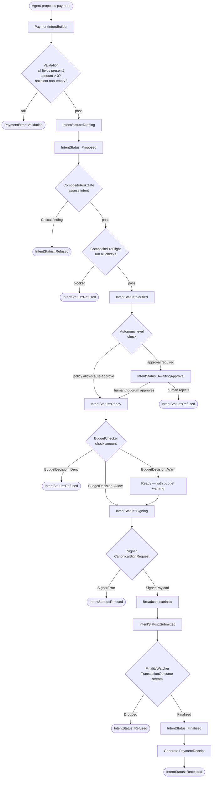
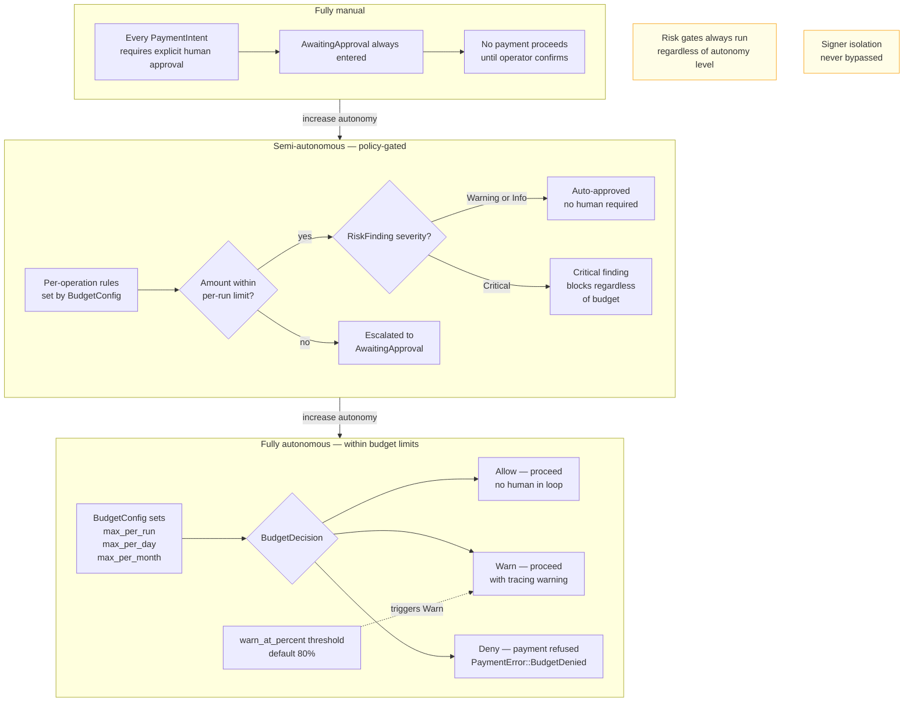
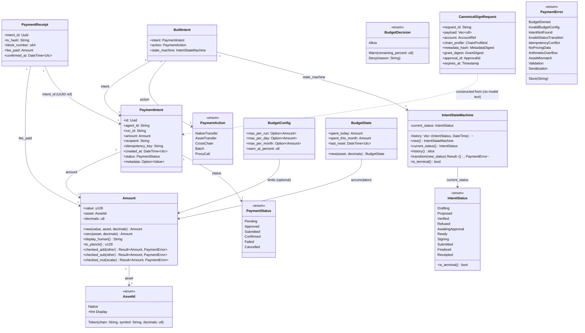

# Payments & Autonomy (PRD-08)

This document covers the payment pipeline implemented in `polkagent-payment`, the signer isolation boundary enforced by `polkagent-signer-trait`, and the autonomy model that governs how much authority an agent may exercise without human approval.

## Cross-references

- [safety.md](./safety.md) — INV-01 (model never touches keys), grant authorization, and the broader safety invariant system.
- [architecture.md](./architecture.md) — Kernel boundary, crate map, and execution model.

## Overview (PRD-08 context)

PRD-08 defines three interlocking concerns:

1. **On-chain payments** — An agent must be able to propose, validate, and (within policy limits) execute on-chain token transfers without requiring constant human attention.
2. **Autonomy levels** — The degree of human involvement must be configurable per-agent and per-operation, from fully manual to fully autonomous within budget limits.
3. **Safety invariants** — The model never generates signing keys, never sees raw key material, and never controls the payload bytes that reach the signer. The kernel enforces this unconditionally.

The `polkagent-payment` crate implements the domain types, budget enforcement, lifecycle state machine, pre-flight checks, and risk detection that together realise PRD-08.

---

## Diagram 1 — Payment intent lifecycle

The full lifecycle of a payment from model proposal to on-chain receipt. Each box is an `IntentStatus` variant; arrows show the only permitted transitions enforced by `IntentStateMachine::transition`.



### State machine rules

`IntentStateMachine` enforces a strict directed graph. Calling `transition` with an illegal `(from, to)` pair returns `PaymentError::InvalidStatusTransition`. Terminal states `Receipted` and `Refused` accept no further transitions.

| From | Allowed next states |
|---|---|
| `Drafting` | `Proposed`, `Refused` |
| `Proposed` | `Verified`, `Refused` |
| `Verified` | `AwaitingApproval`, `Refused` |
| `AwaitingApproval` | `Ready`, `Refused` |
| `Ready` | `Signing`, `Refused` |
| `Signing` | `Submitted`, `Refused` |
| `Submitted` | `Finalized`, `Refused` |
| `Finalized` | `Receipted` |
| `Receipted` | *(terminal)* |
| `Refused` | *(terminal)* |

---

## Diagram 2 — Signer isolation in payments (INV-01)

This diagram shows how the payment pipeline enforces the primary safety invariant: the model proposes, but only verified chain data enters the signing payload, and the signer never receives model output.

```mermaid
graph LR
    subgraph Untrusted["Untrusted boundary (model output)"]
        M[Model output\nproposed recipient\namount\naction type]
    end

    subgraph Kernel["Kernel — trusted execution"]
        B[PaymentIntentBuilder\nvalidates and normalises\nall fields]
        PF[CompositePreFlight\nchain-verified balance\nfee estimate\nnonce\nmetadata spec version]
        RG[CompositeRiskGate\nhomoglyph scan\nbatch-hiding detection\nhigh-value threshold]
        BC[BudgetChecker\nper-day / per-month\nspend limits]
        CSR["CanonicalSignRequest\nSCALE-encoded payload bytes\nAccountRef — raw 32-byte key\nChainProfileId\nMetadataDigest\nGrantDigest\nApprovalId\nexpires_at"]
    end

    subgraph Signer["Isolated signer (polkagent-signer-trait)"]
        S[Signer::sign\nverifies account managed\nverifies expires_at\nverifies grant digest\nverifies metadata hash]
        SP[SignedPayload\nsigned_extrinsic\npublic_key\nsignature]
    end

    subgraph Chain["Polkadot network"]
        BC2[Broadcast extrinsic]
        FW[FinalityWatcher\nTransactionOutcome stream]
        RC[PaymentReceipt\ntx_hash\nblock_number\nfee_paid]
    end

    M -->|typed fields only\nno raw text| B
    B --> PF
    PF --> RG
    RG --> BC
    BC -->|kernel constructs\nno model text| CSR
    CSR -->|only canonical bytes| S
    S --> SP
    SP --> BC2
    BC2 --> FW
    FW --> RC

    classDef untrusted fill:#ffeaea,stroke:#cc4444
    classDef trusted fill:#eaffea,stroke:#44aa44
    classDef signer fill:#eaeaff,stroke:#4444cc

    class M untrusted
    class B,PF,RG,BC,CSR trusted
    class S,SP signer
```



### Why this works

`CanonicalSignRequest` is `pub` but its fields are populated exclusively from typed domain records inside the kernel. The struct's own documentation states: "No field of this struct may be populated from LLM-generated text, user free-form input, or memory content." The Rust type system makes this enforced-by-construction: there is no `String`-typed free-text field in `CanonicalSignRequest` that could carry model output.

The `Signer` trait contract adds a second layer:

- `sign` must reject requests where `expires_at` is in the past (`SignerError::Expired`).
- `sign` must verify that `grant_digest` matches the pre-authorized grant (`SignerError::GrantMismatch`).
- `sign` must verify that `metadata_hash` matches pinned chain metadata (`SignerError::MetadataMismatch`).
- Hardware-backed implementations must display the canonical call summary to the user before signing.

---

## Diagram 3 — Autonomy levels

The autonomy spectrum from fully manual to fully autonomous within budget limits. The configuration is per-agent and may be changed at runtime without restarting the agent.



### Autonomy configuration

Autonomy level is expressed through `BudgetConfig` combined with the approval routing logic in the kernel. There is no single `autonomy_level` enum — the behaviour emerges from the combination of:

| Setting | Effect |
|---|---|
| `max_per_run: None` | No per-run cap; run-level limit unenforced |
| `max_per_run: Some(Amount)` | Deny any single payment exceeding this value |
| `max_per_day: Some(Amount)` | Deny if today's accumulated spend would exceed limit |
| `max_per_month: Some(Amount)` | Deny if this month's accumulated spend would exceed limit |
| `warn_at_percent: u8` | Emit `BudgetDecision::Warn` when projected spend reaches this percentage of the limit (default 80) |

Note that budget limits operate on top of the approval layer. Even if the budget allows a payment, the intent may still be routed through `AwaitingApproval` if the operator requires human sign-off for certain action types (e.g. `PaymentAction::CrossChain` or `PaymentAction::Batch`).

---

## Diagram 4 — Core types class diagram



---

## Payment intent lifecycle — detailed notes

### Step 1: Builder construction

`PaymentIntentBuilder` enforces the minimal set of required fields at compile time through `Option`-typed setters. Calling `build()` returns `PaymentError::Validation` if any required field is absent, the recipient is empty, or the amount is zero. The builder assigns a UUID v7 `id` and sets `status: PaymentStatus::Pending`.

```
PaymentIntentBuilder::new()
    .agent_id("agent-1")
    .run_id("run-42")
    .action(PaymentAction::NativeTransfer)
    .amount(Amount::new(1_000_000_000, AssetId::Native, 10))
    .recipient("5GrwvaEF...")
    .idempotency_key("transfer-001")
    .build()   // -> Result<BuiltIntent, PaymentError>
```

### Step 2: Risk assessment

`CompositeRiskGate::assess` runs all registered `RiskGate` implementations synchronously against the intent. The built-in detectors are:

| Detector | `RiskCode` | `RiskSeverity` | Trigger |
|---|---|---|---|
| `BatchHidingDetector` | `BatchHiding` | `Critical` | `metadata.calls` array contains non-transfer pallets |
| `HomoglyphDetector` | `HomoglyphAddress` | `Critical` | Recipient contains non-ASCII Unicode characters |
| `HighValueDetector` | `HighValue` | `Warning` | `amount.value` exceeds configured planck threshold |

A `Critical` finding causes the intent to be transitioned to `Refused` before pre-flight checks run.

### Step 3: Pre-flight checks

`CompositePreFlight::run` executes all registered `PreFlightCheck` implementations and merges `PreFlightResult` values. Blockers accumulate; the intent moves to `Refused` if `result.passed == false`. The built-in checks are:

| Check | Blocker code | What it verifies |
|---|---|---|
| `BalanceCheck` | `insufficient_balance` | Free balance >= transfer amount |
| `FeeCheck` | `insufficient_for_fee` | Free balance >= amount + estimated fee |
| `ExistentialDepositCheck` | `sender_below_ed`, `recipient_below_ed` | Neither account falls below existential deposit |
| `AddressCheck` | `invalid_address` | Recipient is valid Base58 and non-empty |
| `NonceCheck` | `stale_nonce` | Transaction nonce >= current account nonce |
| `MetadataFreshnessCheck` | `stale_metadata` | Transaction spec version matches chain spec version |

### Step 4: Approval routing

The kernel consults the agent's autonomy configuration. If the operation requires human approval (based on action type, amount, or explicit policy), the intent enters `AwaitingApproval`. An `ApprovalId` is created and presented to the operator. On rejection, the intent moves to `Refused`. On approval, it moves to `Ready`.

### Step 5: Budget check

`BudgetChecker::check` evaluates the proposed `Amount` against the agent's `BudgetConfig`. The check is stateful: `BudgetState` tracks `spent_today` and `spent_this_month`, which are automatically reset when the UTC calendar day or month rolls over. The result is one of:

- `BudgetDecision::Allow` — proceed.
- `BudgetDecision::Warn { remaining_percent }` — proceed but emit a tracing warning.
- `BudgetDecision::Deny { reason }` — transition to `Refused`.

### Step 6: Signing

The kernel constructs a `CanonicalSignRequest` from typed domain records only. No model output, conversation history, tool results, or user free-form text is included. The request carries:

- `payload` — SCALE-encoded extrinsic bytes derived from the `PaymentIntent` by the chain codec layer.
- `account` — `AccountRef` with a 32-byte `account_id`; the `ss58_display` field is for display only and is not used in signing decisions.
- `chain_profile` — `ChainProfileId` identifying the target network.
- `metadata_hash` — `MetadataDigest` of the runtime metadata used to encode the payload.
- `grant_digest` — `GrantDigest` of the `ResolvedGrant` that authorised this effect.
- `approval_id` — `ApprovalId` of the human or policy approval decision.
- `expires_at` — deadline after which the signer must refuse the request.

The `Signer::sign` implementation verifies all of these before producing a `SignedPayload`.

### Step 7: Broadcast and finality

The signed extrinsic bytes are broadcast to the Polkadot network. `FinalityWatcher::watch` subscribes to transaction status events and yields `TransactionOutcome` values:

| Outcome | Terminal? | Next intent state |
|---|---|---|
| `Pending` | No | stay `Submitted` |
| `Included { block }` | No | stay `Submitted` |
| `Finalized { block }` | Yes | -> `Finalized` |
| `Dropped { reason }` | Yes | -> `Refused` |
| `Unknown` | No | stay `Submitted` |

On `Finalized`, the kernel constructs a `PaymentReceipt` and transitions the intent to `Receipted`.

---

## Signer isolation in payments

### The `Signer` trait

```rust
#[async_trait]
pub trait Signer: Send + Sync + 'static {
    async fn describe(&self) -> Result<SignerCapabilities, SignerError>;
    async fn sign(&self, request: CanonicalSignRequest) -> Result<SignedPayload, SignerError>;
    async fn health(&self) -> Result<(), SignerError>;
}
```

Implementations are swapped at startup based on the configured signing mode. All implementations share the same contract enforced by `polkagent-signer-trait`:

- Raw key material is never returned from `sign`, surfaced in `SignerError` messages, or written to log output.
- `sign` rejects `CanonicalSignRequest` values where `expires_at` is in the past (returns `SignerError::Expired`).
- Hardware-backed implementations must display a canonical call summary to the user before producing a signature (returning `SignerError::UserRejected` on refusal).
- The `CanonicalSignRequest` struct is never extended with fields sourced from model output or conversation data.

### `SignerError` variants

| Variant | Meaning |
|---|---|
| `AccountNotFound` | The requested `AccountRef` is not managed by this signer |
| `InvalidApproval` | The `ApprovalId` does not authorise this request |
| `GrantMismatch` | `grant_digest` does not match the signer's pre-authorized grant |
| `MetadataMismatch` | `metadata_hash` does not match the signer's pinned chain metadata |
| `Expired` | `expires_at` is in the past |
| `UserRejected` | The user declined the signing request on the hardware wallet |
| `Hardware` | The HSM or hardware wallet returned an error |
| `Timeout` | The signer did not respond within the allowed time |
| `WatchOnly` | This signer can enumerate accounts but cannot produce signatures |
| `Internal` | An unexpected internal error |

### Key material invariants

The `AccountRef` type stores a 32-byte `account_id` as the authoritative identifier. The `ss58_display` field is annotated as "for display purposes only" and "not used for signing decisions". This prevents display-layer homoglyph attacks from influencing which account is actually signed for.

---

## Budget enforcement for payments

### `BudgetConfig`

```rust
pub struct BudgetConfig {
    pub max_per_run: Option<Amount>,
    pub max_per_day: Option<Amount>,
    pub max_per_month: Option<Amount>,
    pub warn_at_percent: u8,  // default: 80
}
```

`max_per_run` applies to a single `PaymentIntent`. `max_per_day` and `max_per_month` apply to the rolling UTC calendar period. If all three are `None`, the `BudgetChecker` returns `BudgetDecision::Allow` unconditionally (open by default; the policy layer is expected to gate whether budget checking is required).

### `BudgetState`

`BudgetState` tracks `spent_today` and `spent_this_month` as `Amount` values. The `BudgetChecker::check` method calls `maybe_reset_state` on every check, comparing `Utc::now()` against `BudgetState::last_reset`. If the UTC date has changed, `spent_today` is zeroed. If the UTC month or year has changed, `spent_this_month` is also zeroed.

### `BudgetDecision`

| Variant | Condition | Effect |
|---|---|---|
| `Allow` | `projected <= limit` and below `warn_at_percent` | Intent proceeds |
| `Warn { remaining_percent }` | `projected <= limit` but at or above `warn_at_percent` of limit | Intent proceeds; `tracing::warn!` emitted |
| `Deny { reason }` | `projected > limit` | Intent refused; `PaymentError::BudgetDenied` returned |

### LLM cost tracking

`CostEstimator` maintains a pricing table keyed by provider and model pattern. `CostEstimator::estimate` returns estimated USD cost from input and output token counts. The default pricing table covers:

| Provider | Model pattern | Input per 1M tokens | Output per 1M tokens |
|---|---|---|---|
| `anthropic` | `claude-sonnet-4` | $3.00 | $15.00 |
| `anthropic` | `claude-haiku-4-5` | $0.80 | $4.00 |
| `openai` | `gpt-4o` | $2.50 | $10.00 |
| `openai` | `gpt-4o-mini` | $0.15 | $0.60 |
| `local` | `local` | $0.00 | $0.00 |

Estimates are stored as `CostRecord` values and persisted via `PaymentStore::record_cost`. Aggregated statistics are available through `PaymentStore::get_usage` which returns a `UsageSummary`.

---

## API endpoints for payments

The following HTTP API paths are served by the Polkagent server and correspond to the domain operations in `polkagent-payment`.

### Intent management

| Method | Path | Description |
|---|---|---|
| `POST` | `/v1/payments/intents` | Create a new payment intent. The request body is validated by `PaymentIntentBuilder`. The response includes the `BuiltIntent.intent.id` UUID. |
| `GET` | `/v1/payments/intents/{id}` | Fetch a payment intent by UUID. Returns `PaymentIntent` with current `status` and `IntentStatus`. Returns 404 if not found (`PaymentError::IntentNotFound`). |
| `POST` | `/v1/payments/intents/{id}/approve` | Submit a human approval decision. Transitions the intent from `AwaitingApproval` to `Ready`. Requires an `ApprovalId` in the body. |
| `POST` | `/v1/payments/intents/{id}/cancel` | Cancel a pending intent. Transitions to `Refused` if the current state is not already terminal. |

### Receipt management

| Method | Path | Description |
|---|---|---|
| `GET` | `/v1/payments/receipts` | List all payment receipts ordered by `confirmed_at` descending. Returns `Vec<PaymentReceipt>`. |
| `GET` | `/v1/payments/receipts/{intent_id}` | Fetch the receipt for a specific intent UUID. Returns `PaymentReceipt`. |

### Budget and usage

| Method | Path | Description |
|---|---|---|
| `GET` | `/v1/payments/balance` | Returns `BalanceSummary`: available balance, total spent, budget configuration status and limit. |
| `GET` | `/v1/payments/usage?since=&until=` | Returns `UsageSummary` for the agent over the specified UTC time range: `total_runs`, `total_tokens`, `estimated_usd`. |
| `GET` | `/v1/payments/costs?run_id=` | Returns `Vec<CostRecord>` for the specified run. |

### Pre-flight simulation

| Method | Path | Description |
|---|---|---|
| `POST` | `/v1/payments/preflight` | Runs `CompositePreFlight` against a proposed intent without creating or committing anything. Returns `PreFlightResult` including all `blockers` and `warnings`. Useful for operator dashboards. |

---

## Key types quick reference

| Type | Crate | Purpose |
|---|---|---|
| `Amount` | `polkagent-payment::types` | Precise on-chain value in planck with asset tag and decimals |
| `AssetId` | `polkagent-payment::types` | `Native` or `Token { chain, symbol, decimals }` |
| `PaymentIntent` | `polkagent-payment::types` | A proposed payment awaiting validation and submission |
| `PaymentStatus` | `polkagent-payment::types` | Coarse lifecycle state stored on `PaymentIntent` |
| `PaymentReceipt` | `polkagent-payment::types` | On-chain confirmation proof with `tx_hash` and `block_number` |
| `CostRecord` | `polkagent-payment::types` | LLM token usage cost entry |
| `UsageSummary` | `polkagent-payment::types` | Aggregated usage statistics over a period |
| `IntentStatus` | `polkagent-payment::intent` | Fine-grained lifecycle state with validated transitions |
| `IntentStateMachine` | `polkagent-payment::intent` | State machine with timestamped history |
| `PaymentAction` | `polkagent-payment::action` | `NativeTransfer`, `AssetTransfer`, `CrossChain`, `Batch`, `ProxyCall` |
| `PaymentIntentBuilder` | `polkagent-payment::builder` | Fluent builder; `build()` returns `BuiltIntent` |
| `BuiltIntent` | `polkagent-payment::builder` | `intent` + `action` + `state_machine` |
| `BudgetConfig` | `polkagent-payment::budget` | Per-agent spend limits and warning threshold |
| `BudgetState` | `polkagent-payment::budget` | Per-agent accumulated spend with auto-reset |
| `BudgetDecision` | `polkagent-payment::budget` | `Allow`, `Warn`, or `Deny` |
| `BudgetChecker` | `polkagent-payment::budget` | Evaluates spend proposals and records completed spend |
| `PreFlightCheck` | `polkagent-payment::preflight` | Trait; implementations check balance, fee, ED, address, nonce, metadata |
| `PreFlightResult` | `polkagent-payment::preflight` | `passed` + `warnings` + `blockers` |
| `CompositePreFlight` | `polkagent-payment::preflight` | Runs and merges multiple `PreFlightCheck`s |
| `RiskGate` | `polkagent-payment::risk` | Trait; implementations detect batch hiding, homoglyphs, high value |
| `RiskFinding` | `polkagent-payment::risk` | `code` + `severity` + `message` + `evidence` |
| `CompositeRiskGate` | `polkagent-payment::risk` | Runs all registered `RiskGate`s |
| `TransactionOutcome` | `polkagent-payment::finality` | `Pending`, `Included`, `Finalized`, `Dropped`, `Unknown` |
| `FinalityWatcher` | `polkagent-payment::finality` | Trait; returns a `Stream<Item = TransactionOutcome>` |
| `PaymentStore` | `polkagent-payment::store` | Async persistence trait for intents, receipts, and cost records |
| `BalanceSummary` | `polkagent-payment::store` | Available balance + budget configuration summary |
| `PaymentError` | `polkagent-payment::error` | Unified error enum for all payment operations |
| `Signer` | `polkagent-signer-trait` | Isolated signing port; `sign(CanonicalSignRequest) -> SignedPayload` |
| `CanonicalSignRequest` | `polkagent-signer-trait` | Only input to the signer; no model text allowed |
| `SignedPayload` | `polkagent-signer-trait` | `signed_extrinsic` + `public_key` + `signature` |
| `SignerError` | `polkagent-signer-trait` | Signer-specific errors including `UserRejected` and `Expired` |
| `AccountRef` | `polkagent-signer-trait` | 32-byte `account_id`; `ss58_display` is display-only |

---

## Cross-references

- **safety.md** — INV-01 (model never touches keys), the grant authorization system (`ResolvedGrant`, `GrantDigest`), and the kernel safety invariants that the payment pipeline depends on.
- **architecture.md** — Crate map showing how `polkagent-payment` and `polkagent-signer-trait` fit into the broader system. The kernel boundary diagram shows where the untrusted/trusted split occurs.
