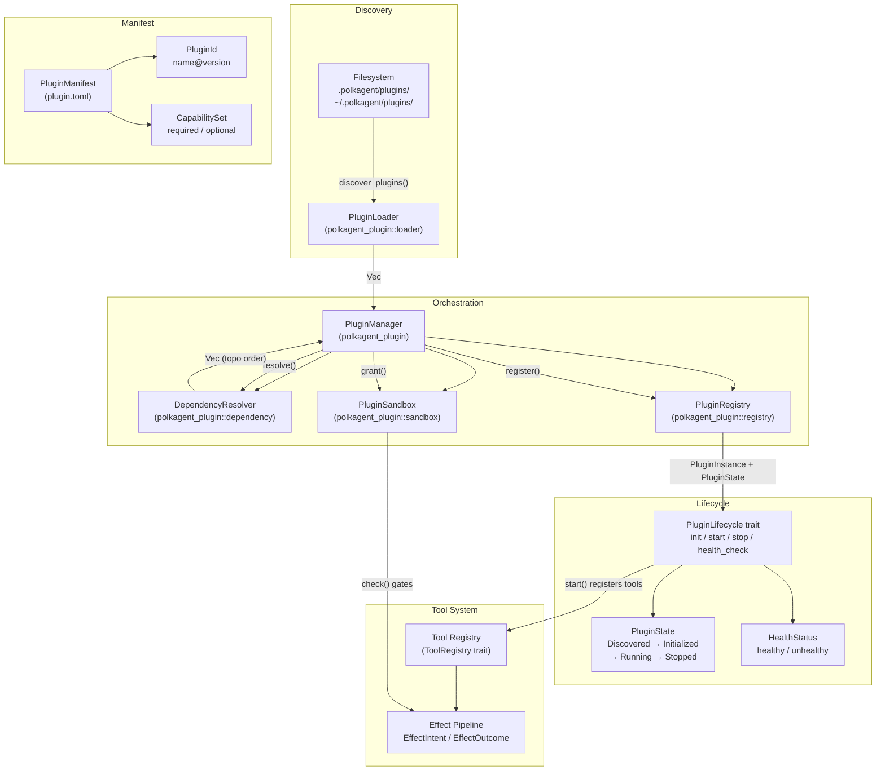
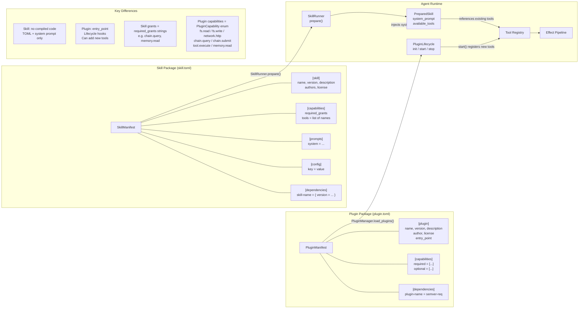
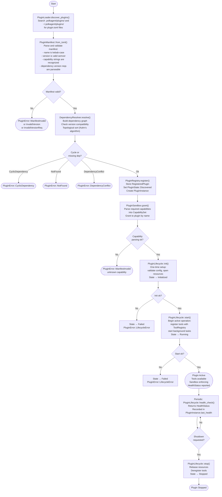

# Plugins and Skills (PRD-12: Marketplace & Extensions)

This document covers the plugin and skill extension systems: their architecture,
how each is structured, how capabilities are declared and enforced, and the full
lifecycle a plugin goes through from discovery to active use.

Related reading: [Tools and Skills](tools-and-skills.md)

> **Current implementation boundary:** `polkagent package` provides durable
> local install/list/get/update/rollback/uninstall management for plugins and
> product kits. Installed packages are not yet activated by `run` or the API;
> `PluginSandbox` is capability bookkeeping rather than an OS/WASM process
> boundary, and cryptographic signature verification is not implemented.
> Strict trust therefore fails closed, while development trust is an explicit
> local-risk opt-in. See the [package CLI](cli.md#package).

---

## Overview

Polkagent supports two distinct extension mechanisms, both implemented as
directory packages with a TOML manifest at their root:

| Mechanism | Manifest file | Runtime weight | Primary contribution |
|-----------|--------------|----------------|----------------------|
| **Skill** | `skill.toml` | Lightweight | System prompt + tool references |
| **Plugin** | `plugin.toml` | Heavier | Custom code, lifecycle hooks, new capabilities |

Skills are pure configuration — they bundle a system prompt, a list of
pre-existing tool names, and grant requirements. No compiled code is required.
Plugins are richer: they declare an `entry_point`, implement lifecycle hooks
via the `PluginLifecycle` trait, and can register entirely new tools that would
not otherwise exist.

Both mechanisms share the same search-path precedence model:

1. `.polkagent/{plugins,skills}/` (relative to the current working directory)
2. `~/.polkagent/{plugins,skills}/`

The first occurrence of any given name wins.

---

## Plugin Architecture



The `PluginManager` is the single entry point for the full orchestration
workflow. It holds a `PluginLoader` for filesystem discovery, a
`DependencyResolver` for topological sorting and semver compatibility checks, a
`PluginRegistry` as the central index of loaded plugins, and a `PluginSandbox`
that enforces capability grants at the operation boundary.

---

## Skill vs Plugin



### Summary of differences

| Dimension | Skill | Plugin |
|-----------|-------|--------|
| Manifest key | `[skill]` | `[plugin]` |
| Identity type | `SkillId` | `PluginId` |
| Error type | `SkillError` | `PluginError` |
| Loader | `SkillLoader` | `PluginLoader` |
| Dependency resolution | `polkagent_skill::resolver::resolve()` | `DependencyResolver::resolve()` |
| Compiled code | None | `entry_point` field required |
| System prompt | `[prompts] system = "..."` | None |
| Tool references | Names in `capabilities.tools` | Registered in `start()` hook |
| Capability model | String grants (`required_grants`) | `PluginCapability` enum + `CapabilitySet` |
| Sandbox | None (grant checking is external) | `PluginSandbox` per plugin |
| Lifecycle hooks | None | `init`, `start`, `stop`, `health_check` |
| Execution prep | `SkillRunner::prepare()` -> `PreparedSkill` | `PluginManager::load_plugins()` |

---

## Plugin Manifest Format

A plugin is a directory containing at minimum a `plugin.toml` file. The
`PluginLoader` searches immediate subdirectories of each configured search path
and expects this exact filename (`MANIFEST_FILENAME = "plugin.toml"`).

```toml
[plugin]
name        = "governance-tools"   # kebab-case, required
version     = "1.0.0"              # semver, required
description = "OpenGov governance research tools"
author      = "Polkagent Team"
license     = "Apache-2.0"
entry_point = "governance_tools::init"

[capabilities]
required = ["chain.query", "memory.read"]   # must be granted at load time
optional = ["network.http"]                  # used if available

[dependencies]
polkagent-identity = ">=0.1.0"              # semver version requirement
```

### Field reference

**`[plugin]` section** (`PluginSection`):

| Field | Type | Required | Notes |
|-------|------|----------|-------|
| `name` | string | yes | Kebab-case; only `[a-z0-9-]` allowed |
| `version` | string | yes | Must be valid semver (e.g. `"1.0.0"`) |
| `description` | string | no | Human-readable summary |
| `author` | string | no | Name or email |
| `license` | string | no | SPDX identifier (e.g. `"Apache-2.0"`) |
| `entry_point` | string | no | Module path or function name for initialization |

**`[capabilities]` section** (`CapabilitiesSection`):

| Field | Type | Notes |
|-------|------|-------|
| `required` | string array | Capabilities that must be granted. Unknown strings are rejected at parse time. |
| `optional` | string array | Capabilities used if present but not required for load. |

The full set of recognized capability strings maps to the `PluginCapability` enum:

| String | `PluginCapability` variant | Meaning |
|--------|---------------------------|---------|
| `fs.read` | `ReadFileSystem` | Read files from the filesystem |
| `fs.write` | `WriteFileSystem` | Write files to the filesystem |
| `network.http` | `NetworkAccess` | Make outbound HTTP requests |
| `chain.query` | `ChainQuery` | Query on-chain state (read-only) |
| `chain.submit` | `ChainSubmit` | Submit extrinsics to a chain |
| `tool.execute` | `ToolExecution` | Invoke registered tools |
| `memory.read` | `MemoryAccess` | Read from the agent memory store |

**`[dependencies]` section**:

A flat table mapping plugin names to semver version requirement strings:

```toml
[dependencies]
polkagent-identity = ">=0.1.0"
chain-utils        = "^2.0"
```

Parsed as `HashMap<String, String>` in `PluginManifest`. All version
requirements are validated with the `semver` crate at manifest parse time.

### Skill manifest format (for comparison)

```toml
[skill]
name        = "governance-researcher"
version     = "0.1.0"
description = "Research OpenGov proposals"
authors     = ["author@example.com"]
license     = "Apache-2.0"

[capabilities]
required_grants = ["chain.query", "memory.read"]
tools           = ["search_memory", "chain_query"]

[prompts]
system = "You are a governance research assistant..."

[config]
default_chain = "polkadot"

[dependencies]
chain-utils = { version = ">=0.2.0" }
```

Note that skill dependencies use the inline table form
`{ version = "..." }` (`DependencySpec`), while plugin dependencies use bare
strings.

---

## Plugin Lifecycle



### State machine

`PluginState` transitions tracked by `PluginInstance` (inside `PluginRegistry`):

```
Discovered -> Initialized -> Running -> Stopped
     \              \           \
      \              \           +-> Failed
       \              +---------> Failed
        +-----------------------> Failed
```

`PluginRegistry::set_state()` records the current state and timestamp.
`PluginRegistry::find_by_state()` returns all plugins in a given state.

---

## Security Model

### Capability-based access control

The `PluginSandbox` acts as an enforcement layer between a plugin and any
operation it attempts. It is not a process boundary or WASM sandbox; it is a
capability checker implemented in safe Rust.

At load time, `PluginManager::load_plugins()` parses the `required` capability
list from each manifest into a `CapabilitySet` (a `BTreeSet<PluginCapability>`)
and calls `PluginSandbox::grant(plugin_name, caps)`. The grant replaces any
previous grant for that plugin name.

Before dispatching any operation, the caller must invoke:

```rust
manager.check_capability("my-plugin", PluginCapability::ChainQuery)?;
// or directly:
sandbox.check("my-plugin", PluginCapability::NetworkAccess)?;
```

`PluginSandbox::check()` returns `Ok(())` if the plugin's granted set contains
the capability, or `Err(PluginError::CapabilityDenied)` if not. Unknown plugin
names also return `CapabilityDenied` (fail-closed).

`PluginSandbox::check_all()` verifies an entire `CapabilitySet` at once,
returning the first missing capability as an error.

Capabilities can be revoked at runtime:

```rust
sandbox.revoke("my-plugin"); // removes all grants
```

### Isolation model

This is a **WASM-free** system: plugins run in the same process as the agent
runtime. The isolation guarantees are:

- **No unsafe code**: both `polkagent-plugin` and `polkagent-skill` forbid
  `unsafe_code` at the crate level.
- **Manifest validation at load time**: unknown capabilities, invalid semver,
  and bad dependency requirements are rejected before a plugin is registered.
- **Capability checking at dispatch time**: every privileged operation passes
  through `PluginSandbox::check()` before being dispatched.
- **No ambient authority**: a plugin name that was never granted any capability
  cannot perform any sandboxed operation.

### Dependency integrity

`DependencyResolver::resolve()` enforces two properties:

1. **Version compatibility**: every dependency's semver requirement
   (`VersionReq`) is checked against the available plugin version. A mismatch
   returns `PluginError::DependencyConflict`.
2. **Acyclicity**: Kahn's algorithm detects cycles and returns
   `PluginError::CyclicDependency` with a human-readable path description
   (e.g. `"a -> b -> a"`).

Resolution output is a `Vec<PluginId>` in dependency-first (topological) order,
ensuring that a plugin's dependencies are always initialized before the plugin
itself.

### Search-path precedence and name shadowing

When multiple search paths contain a plugin with the same name, `PluginLoader`
takes the **first occurrence** and silently skips later ones. This means a
local project plugin in `.polkagent/plugins/` will shadow a user-level plugin
with the same name in `~/.polkagent/plugins/`. Operators deploying Polkagent
should audit both locations if unexpected behavior is observed.

---

## Cross-references

- [Tools and Skills](tools-and-skills.md) — how tools are registered, how the
  grant system works, and how skills reference tools at runtime.
- `polkagent_plugin::PluginManager` — top-level orchestrator; see
  `crates/polkagent-plugin/src/lib.rs`.
- `polkagent_plugin::PluginLifecycle` — lifecycle hook trait; see
  `crates/polkagent-plugin/src/lifecycle.rs`.
- `polkagent_plugin::PluginSandbox` — capability enforcement; see
  `crates/polkagent-plugin/src/sandbox.rs`.
- `polkagent_plugin::PluginRegistry` — central plugin index; see
  `crates/polkagent-plugin/src/registry.rs`.
- `polkagent_skill::SkillRunner` — skill execution preparation; see
  `crates/polkagent-skill/src/runner.rs`.
- `polkagent_skill::resolver` — skill dependency resolution; see
  `crates/polkagent-skill/src/resolver.rs`.
