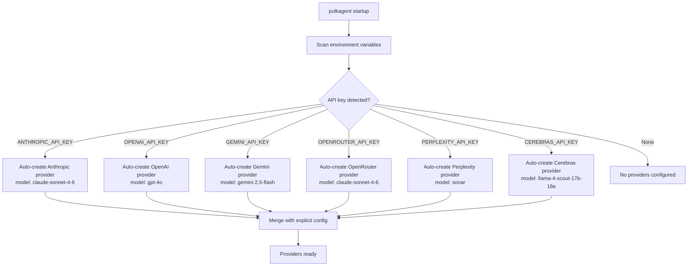
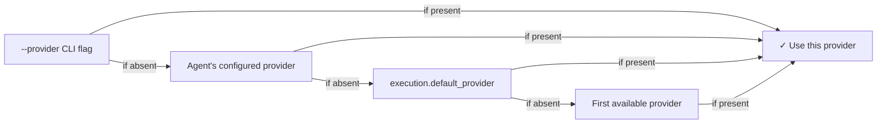
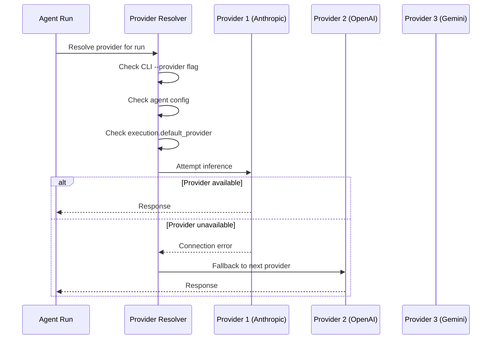

# Providers Reference

Polkagent supports multiple LLM providers through a unified interface. This document describes all supported providers, their configuration options, and the built-in model catalog.

## Supported Providers

The `ProviderKind` enum defines all supported provider types:

| Kind | Description |
|------|-------------|
| `AnthropicApi` | Anthropic Messages API |
| `OpenaiCompat` | Any OpenAI-compatible `/v1/chat/completions` endpoint |
| `GeminiApi` | Google Gemini native API |
| `Local` | Locally-hosted models (llama.cpp, Ollama, etc.) |
| `Openrouter` | OpenRouter aggregation gateway |
| `Bedrock` | AWS Bedrock |
| `AzureOpenai` | Azure OpenAI Service |
| `PerplexityApi` | Perplexity Sonar API |
| `CerebrasApi` | Cerebras inference API |

The following adapter crates have active implementations:

- `polkagent-executor-anthropic`
- `polkagent-executor-openai`
- `polkagent-executor-gemini`
- `polkagent-executor-local`
- `polkagent-executor-openrouter`
- `polkagent-executor-fake` (testing only)

## Zero-Config Auto-Synthesis

When polkagent detects a provider API key in the environment at startup, it automatically synthesizes a provider configuration. No explicit `[[providers]]` block is required in that case.

| Environment Variable | Provider ID | Kind | Base URL | Default Model |
|---------------------|-------------|------|----------|---------------|
| `ANTHROPIC_API_KEY` | `anthropic` | `AnthropicApi` | `https://api.anthropic.com` | `claude-sonnet-4-6` |
| `OPENAI_API_KEY` | `openai` | `OpenaiCompat` | `https://api.openai.com/v1` | `gpt-4o` |
| `GEMINI_API_KEY` | `gemini` | `GeminiApi` | `https://generativelanguage.googleapis.com` | `gemini-2.5-flash` |
| `OPENROUTER_API_KEY` | `openrouter` | `Openrouter` | `https://openrouter.ai/api/v1` | `claude-sonnet-4-6` |
| `PERPLEXITY_API_KEY` | `perplexity` | `PerplexityApi` | `https://api.perplexity.ai` | `sonar` |
| `CEREBRAS_API_KEY` | `cerebras` | `CerebrasApi` | `https://api.cerebras.ai/v1` | `llama-4-scout-17b-16e` |



Auto-synthesized configs use the default timeout and retry values. To override any field, define an explicit `[[providers]]` block with the same `id`.

## Provider Configuration

### Config Fields

All fields of `ProviderConfig`:

| Field | Type | Required | Default | Description |
|-------|------|----------|---------|-------------|
| `id` | string | yes | — | Unique identifier for this provider instance |
| `provider_type` | string | yes | — | Provider type string (e.g. `"anthropic"`, `"openai"`) |
| `kind` | enum | no | inferred | Optional explicit `ProviderKind` override |
| `api_key_env` | string | yes | — | Environment variable name containing the API key; set to `""` for unauthenticated local endpoints |
| `base_url` | string | yes | — | Base URL for the provider API |
| `default_model` | string | yes | — | Default model slug used when no model is specified |
| `timeout_secs` | integer | no | `120` | Total request timeout in seconds |
| `max_retries` | integer | no | `3` | Maximum number of retry attempts on transient failures |
| `ttft_timeout_secs` | integer | no | `15` | Time-to-first-token timeout in seconds |
| `connect_timeout_secs` | integer | no | `5` | TCP connection timeout in seconds |
| `max_concurrent` | integer | no | `10` | Maximum number of concurrent in-flight requests |
| `extra_headers` | map | no | — | Additional HTTP headers sent with every request |
| `extra` | JSON object | no | — | Arbitrary provider-specific configuration |

### Configuration Examples

#### Anthropic

```toml
[[providers]]
id = "anthropic"
provider_type = "anthropic"
api_key_env = "ANTHROPIC_API_KEY"
base_url = "https://api.anthropic.com"
default_model = "claude-sonnet-4-6"
timeout_secs = 120
max_retries = 3
```

#### OpenAI

```toml
[[providers]]
id = "openai"
provider_type = "openai"
api_key_env = "OPENAI_API_KEY"
base_url = "https://api.openai.com/v1"
default_model = "gpt-4o"
```

#### Google Gemini

```toml
[[providers]]
id = "gemini"
provider_type = "gemini"
api_key_env = "GEMINI_API_KEY"
base_url = "https://generativelanguage.googleapis.com"
default_model = "gemini-2.5-flash"
```

#### OpenRouter

```toml
[[providers]]
id = "openrouter"
provider_type = "openrouter"
api_key_env = "OPENROUTER_API_KEY"
base_url = "https://openrouter.ai/api/v1"
default_model = "claude-sonnet-4-6"
```

#### Local (Ollama)

```toml
[[providers]]
id = "local"
provider_type = "local"
api_key_env = ""
base_url = "http://localhost:11434"
default_model = "llama3"
```

Set `api_key_env = ""` for local endpoints that do not require authentication.

#### Perplexity

```toml
[[providers]]
id = "perplexity"
provider_type = "perplexity"
api_key_env = "PERPLEXITY_API_KEY"
base_url = "https://api.perplexity.ai"
default_model = "sonar"
```

#### Cerebras

```toml
[[providers]]
id = "cerebras"
provider_type = "cerebras"
api_key_env = "CEREBRAS_API_KEY"
base_url = "https://api.cerebras.ai/v1"
default_model = "llama-4-scout-17b-16e"
```

## Built-In Model Catalog

Polkagent ships with 13 pre-registered models. These are available without any `[[models]]` configuration.

| Slug | Provider | Context Window | Max Output | Tools | Thinking | Vision |
|------|----------|---------------|------------|-------|----------|--------|
| `claude-opus-4-6` | anthropic | 200k | 32k | yes | yes | yes |
| `claude-sonnet-4-6` | anthropic | 200k | 16k | yes | yes | yes |
| `claude-haiku-4-5` | anthropic | 200k | 8k | yes | no | yes |
| `gpt-5.5` | openai | 200k | 32k | yes | no | yes |
| `gpt-5.4-mini` | openai | 128k | 16k | yes | no | yes |
| `o3` | openai | 200k | 100k | yes | yes | yes |
| `o4-mini` | openai | 200k | 100k | yes | yes | yes |
| `gpt-4o` | openai | 128k | 16k | yes | no | yes |
| `codex-mini` | openai | 200k | 100k | yes | yes | no |
| `gemini-2.5-pro` | gemini | 1M | 65k | yes | yes | yes |
| `gemini-2.5-flash` | gemini | 1M | 65k | yes | yes | yes |
| `sonar-pro` | perplexity | 200k | 8k | no | no | no |
| `sonar` | perplexity | 128k | 8k | no | no | no |

## Custom Models

Register models not in the built-in catalog using `[[models]]` sections in your config file:

```toml
[[models]]
slug = "my-custom-model"
provider = "openai"
context_window = 128000
max_output = 16384
supports_tools = true
supports_thinking = false
tool_format = "openai"
cost_input_per_m = 5.0
cost_output_per_m = 15.0
```

Custom models are merged with the built-in catalog at startup. If a custom model slug matches a built-in entry, the custom definition takes precedence.

## Provider Resolution Order

When an agent run begins, polkagent resolves which provider to use in the following order:

1. `--provider` CLI flag (per-run override)
2. The provider configured on the agent itself
3. `execution.default_provider` in the config file
4. The first available provider from explicit config or auto-synthesis

The first match wins. Later entries in the list are only consulted if the earlier ones are absent or unresolvable.





---

> For a complete multi-provider setup walkthrough, see [Examples: Agent Configuration](examples.md#agent-configuration).
