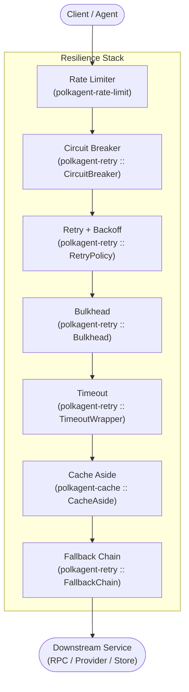
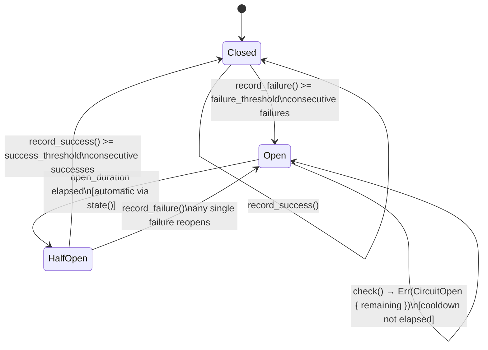
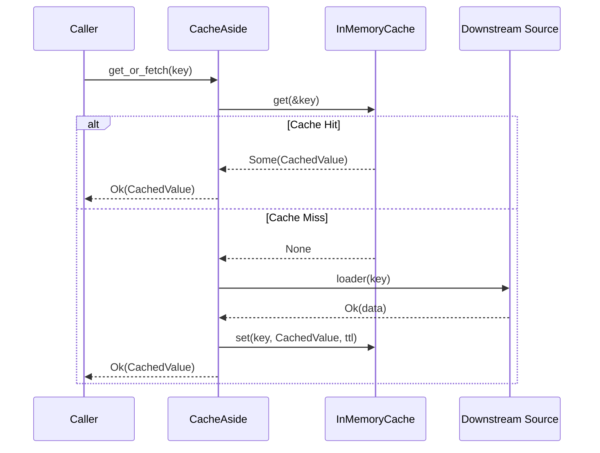
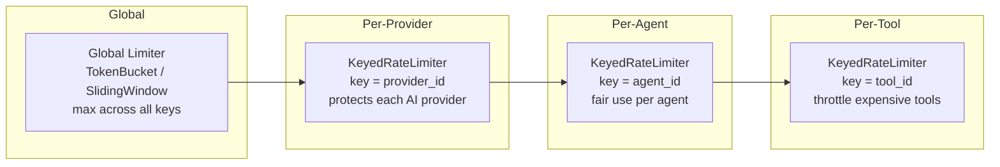
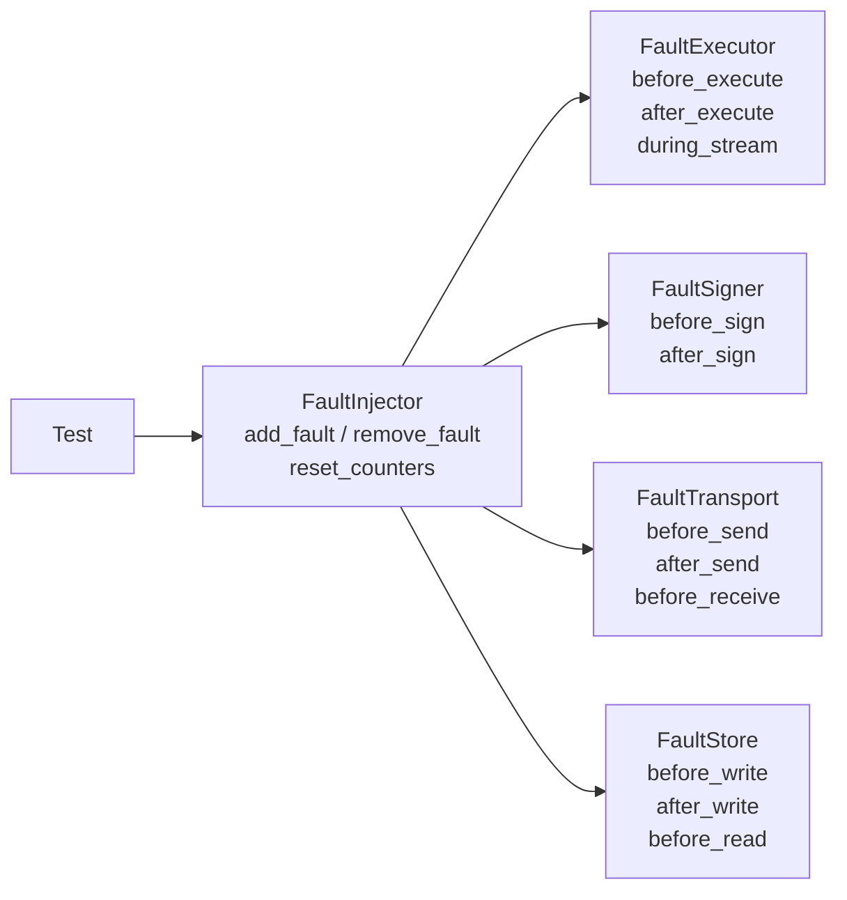

# Resilience (PRD-15)

Polkagent is built for operation in adversarial, high-latency environments: RPC nodes go
offline, AI providers rate-limit or return transient 5xx errors, storage I/O stalls, and
network links partition without warning. This document describes the layered resilience
stack that keeps agents running correctly under those conditions.

---

## Overview

Resilience in Polkagent is a concern of depth, not a single component. Every outbound call
passes through several independently configurable guards before it reaches a downstream
service, and the same guards wrap the path back. The ordering matters: each outer layer
protects the layers inside it.



Each layer is independently tunable and observable. Disabling or relaxing one does not
affect the others.

---

## Circuit Breaker (`polkagent-retry`)

The circuit breaker is the primary mechanism for fail-fast behaviour. It tracks consecutive
failures against a downstream service and, when the failure count exceeds a threshold,
opens the circuit so that subsequent calls are rejected immediately without incurring the
cost and delay of a real attempt.

### State Machine



### Key Types

| Type | Location | Role |
|---|---|---|
| `CircuitBreaker` | `polkagent_retry::circuit_breaker` | Thread-safe state machine |
| `CircuitState` | `polkagent_retry::circuit_breaker` | `Closed`, `Open { until }`, `HalfOpen` |
| `CircuitBreakerConfig` | `polkagent_retry::circuit_breaker` | Serializable configuration |
| `CircuitOpen` | `polkagent_retry::error` | Error returned when circuit is open |

`CircuitBreaker` is re-exported at the crate root:

```rust
pub use circuit_breaker::{CircuitBreaker, CircuitState};
pub use error::CircuitOpen;
```

### Construction

```rust
use polkagent_retry::CircuitBreaker;
use std::time::Duration;

// failure_threshold=5, success_threshold=3, open_duration=30s
let cb = CircuitBreaker::new(5, 3, Duration::from_secs(30));

// Or from a serialisable config:
use polkagent_retry::circuit_breaker::CircuitBreakerConfig;
let config = CircuitBreakerConfig {
    failure_threshold: 10,
    success_threshold: 5,
    open_duration: Duration::from_secs(60),
};
let cb = CircuitBreaker::from_config(config);
```

### Usage

```rust
match cb.check() {
    Ok(()) => {
        match do_work().await {
            Ok(result) => { cb.record_success(); result }
            Err(e)     => { cb.record_failure(); return Err(e); }
        }
    }
    Err(CircuitOpen { remaining }) => {
        // Fast-fail; do not attempt the downstream call
        return Err(format!("circuit open for {remaining:?}"));
    }
}
```

`check()` automatically transitions an `Open` circuit to `HalfOpen` once
`open_duration` has elapsed; callers do not need to manage that transition.

A circuit can be reset manually (for tests or operator intervention) via
`cb.reset()`.

### Configuration Reference

| Field | Type | Default | Description |
|---|---|---|---|
| `failure_threshold` | `u32` | — | Consecutive failures before opening |
| `success_threshold` | `u32` | — | Consecutive successes in `HalfOpen` before closing |
| `open_duration` | `Duration` (serialised as seconds) | — | How long to stay open before probing |

---

## Retry with Backoff (`polkagent-retry`)

Retries are driven by a `RetryPolicy` paired with an optional `ErrorClassifier`. The
executor calls the fallible closure up to `max_retries + 1` times, sleeping between
attempts according to the `BackoffStrategy`.

### Key Types

| Type | Location | Role |
|---|---|---|
| `RetryPolicy` | `polkagent_retry::policy` | Max retries + backoff strategy + per-attempt timeout |
| `BackoffStrategy` | `polkagent_retry::backoff` | `Fixed`, `Exponential { base, max, jitter }`, `Linear { step, max }` |
| `ErrorClassifier` | `polkagent_retry::classifier` | Trait: classifies errors as `Retryable`, `NonRetryable`, or `CircuitBreak` |
| `ErrorClass` | `polkagent_retry::classifier` | Classification result |
| `RetryExhausted<E>` | `polkagent_retry::error` | Error after all retries are consumed |
| `RetryError<E>` | `polkagent_retry::error` | Enum: `Exhausted`, `Timeout`, `CircuitOpen`, `BulkheadFull` |

All are re-exported at the crate root:

```rust
pub use backoff::BackoffStrategy;
pub use classifier::{ErrorClass, ErrorClassifier};
pub use error::{RetryError, RetryExhausted};
pub use policy::RetryPolicy;
pub use executor::{retry_with_policy, retry_with_policy_and_classifier};
```

### Backoff Strategies

**Fixed**: constant inter-retry delay.

```rust
let policy = RetryPolicy::fixed(5, Duration::from_millis(200));
```

**Exponential**: delay doubles each attempt, capped at `max`. Optional jitter
randomises the delay into `[delay/2, delay]` to prevent thundering-herd.

```rust
// Without jitter
let policy = RetryPolicy::exponential(3, Duration::from_millis(100));
// delay(0) = 100ms, delay(1) = 200ms, delay(2) = 400ms

// With jitter (use BackoffStrategy directly)
use polkagent_retry::BackoffStrategy;
BackoffStrategy::Exponential {
    base: Duration::from_millis(100),
    max: Duration::from_secs(10),
    jitter: true,
};
```

**Linear**: delay increases by `step` each attempt, capped at `max`.

```rust
let policy = RetryPolicy::linear(
    4,
    Duration::from_millis(100),
    Duration::from_millis(500),
);
// delay(0) = 100ms, delay(1) = 200ms, delay(2) = 300ms, delay(3) = 400ms
```

### Error Classification

The `ErrorClassifier` trait controls which errors are retried:

| `ErrorClass` | Behaviour |
|---|---|
| `Retryable` | Retry up to `max_retries` with backoff |
| `NonRetryable` | Stop immediately; do not retry |
| `CircuitBreak` | Stop immediately; notify circuit breaker |

Built-in classifiers: `AlwaysRetry`, `NeverRetry`, `PatternClassifier`,
`FnClassifier`. The provider-specific classifier is available via
`classify_provider_error` (re-exported as `RetryClass` variants).

```rust
use polkagent_retry::{retry_with_policy_and_classifier, RetryPolicy};
use polkagent_retry::classifier::PatternClassifier;

let policy = RetryPolicy::exponential(3, Duration::from_millis(100));
let classifier = PatternClassifier::new(
    vec!["connection refused".into(), "timeout".into()], // retryable patterns
    vec!["out of memory".into()],                        // circuit-break patterns
);
let result = retry_with_policy_and_classifier(&policy, &classifier, &mut || async {
    call_provider().await
}).await;
```

### Per-Attempt Timeout

A per-attempt timeout can be layered on top of the retry policy. If a single
attempt takes longer than the timeout it is abandoned and treated as a failure,
allowing the next retry to start.

```rust
let policy = RetryPolicy::exponential(3, Duration::from_millis(100))
    .with_per_attempt_timeout(Duration::from_secs(5));
```

---

## Caching (`polkagent-cache`)

The cache layer prevents redundant downstream calls by storing responses for a
configurable time-to-live (TTL). The primary pattern is cache-aside (lazy population):
requests check the cache first, and only fetch from the source on a miss.

### Cache-Aside Pattern



### Key Types

| Type | Location | Role |
|---|---|---|
| `CacheAside` | `polkagent_cache::aside` | Orchestrates cache-aside pattern |
| `LoaderFn` | `polkagent_cache::aside` | `Arc<dyn Fn(CacheKey) -> BoxFuture<CacheResult<Value>>>` |
| `InMemoryCache` | `polkagent_cache::memory` | LRU store; implements `CacheStore` |
| `CacheStore` | `polkagent_cache::store` | Trait: `get`, `set`, `remove`, `clear` |
| `CachedValue` | `polkagent_cache::store` | Wrapper around `serde_json::Value` with metadata |
| `CacheKey` | `polkagent_cache::key` | Namespaced key; long keys are BLAKE3-hashed automatically |
| `CacheConfig` | `polkagent_cache` | Top-level configuration; builds an `InMemoryCache` |
| `TtlPolicy` | `polkagent_cache::ttl` | `None`, `Fixed(Duration)`, or per-entry |
| `CacheStats` | `polkagent_cache::stats` | Atomic hit/miss/eviction counters |
| `CacheError` | `polkagent_cache::error` | Error type; `CacheResult<T>` alias |

All are re-exported at the crate root.

### Construction

```rust
use std::sync::Arc;
use polkagent_cache::{CacheConfig, CacheAside, CacheKey, LoaderFn};
use serde_json::json;

let config = CacheConfig::new(1000)
    .with_default_ttl(Duration::from_secs(300));
let store = Arc::new(config.build_in_memory());

let loader: LoaderFn = Arc::new(|key: CacheKey| {
    Box::pin(async move {
        // fetch from RPC or provider
        Ok(json!({"result": "..."}))
    })
});

let aside = CacheAside::new(store, loader);
let value = aside.get_or_fetch(CacheKey::new("metadata", "polkadot")).await?;
```

### TTL Policies

| Variant | Behaviour |
|---|---|
| `TtlPolicy::None` | Entries do not expire (evicted only when capacity is full) |
| `TtlPolicy::Fixed(Duration)` | All entries share a single TTL |
| Per-entry TTL | Pass `Some(Duration)` to `CacheStore::set` |

The `CacheConfig::with_default_ttl` sets the TTL applied when no per-entry
override is supplied.

---

## Rate Limiting (`polkagent-rate-limit`)

Rate limiting is applied at four levels, from coarsest to finest. Each level uses a
`RateLimiter` implementation that can be queried and composed independently.

### Rate Limiting Layers



### Key Types

| Type | Location | Role |
|---|---|---|
| `RateLimiter` | `polkagent_rate_limit` | Trait: `try_acquire`, `remaining`, `reset_at` |
| `QuotaResult` | `polkagent_rate_limit::quota` | `{ allowed, remaining, retry_after, reset_at }` |
| `Quota` | `polkagent_rate_limit::quota` | `{ limit, window, burst }` |
| `TokenBucket` | `polkagent_rate_limit::token_bucket` | Allows bursts; refills at steady rate |
| `SlidingWindowCounter` | `polkagent_rate_limit::sliding_window` | Accurate O(1) window counting |
| `LeakyBucket` | `polkagent_rate_limit::leaky_bucket` | Strict average-rate enforcement |
| `KeyedRateLimiter` | `polkagent_rate_limit::keyed` | Per-key limiting via `DashMap` |
| `CompositeRateLimiter` | `polkagent_rate_limit::composite` | AND-combines multiple limiters |
| `RateLimitConfig` | `polkagent_rate_limit::config` | Tier-based configuration |
| `Tier` | `polkagent_rate_limit::config` | `Free`, `Basic`, `Premium` |
| `TierLimits` | `polkagent_rate_limit::config` | `requests_per_second/minute/hour`, `burst` |
| `Strategy` | `polkagent_rate_limit::config` | `TokenBucket`, `SlidingWindow`, `LeakyBucket` |
| `RateLimitLayer` | `polkagent_rate_limit::middleware` | Tower `Layer` integration |
| `RateLimitError` | `polkagent_rate_limit::error` | Error variants for limit violations |

All are re-exported at the crate root.

### Algorithms

**Token bucket** is the default for most use cases. It allows short bursts (up to the
`burst` capacity) while enforcing a steady-state average rate. Suitable for interactive
API calls where occasional spikes are acceptable.

**Sliding window counter** provides accurate request counting over a rolling window with
O(1) memory. Use this when you need strict per-window limits without burst allowance.

**Leaky bucket** enforces a smooth output rate regardless of arrival pattern. Use this
to protect downstream services that cannot absorb bursts even temporarily.

**Composite limiter** enforces multiple quotas simultaneously (e.g., per-second AND
per-minute). A request is allowed only when all constituent limiters permit it.

### Configuration

```toml
strategy = "token_bucket"

[tiers.free]
requests_per_second = 5
requests_per_minute = 100
requests_per_hour   = 1000
burst               = 10

[tiers.basic]
requests_per_second = 50
requests_per_minute = 1000
requests_per_hour   = 20000
burst               = 100

[tiers.premium]
requests_per_second = 200
requests_per_minute = 5000
requests_per_hour   = 100000
burst               = 500

[[endpoint_overrides]]
endpoint = "/api/v1/execute"
exempt   = false
[endpoint_overrides.limits]
requests_per_second = 2
requests_per_minute = 50
requests_per_hour   = 500
burst               = 5
```

`RateLimitConfig::development()` provides permissive defaults for local development.

---

## Timeout Enforcement (`polkagent-retry`)

`TimeoutWrapper` wraps any async operation with a wall-clock deadline. It is separate
from the per-attempt timeout in `RetryPolicy` and can be used independently.

### Key Types

| Type | Location | Role |
|---|---|---|
| `TimeoutWrapper` | `polkagent_retry::timeout` | Wraps an async closure with a deadline |
| `timeout::TimeoutError<E>` | `polkagent_retry::timeout` | Inner error or timeout indicator |
| `RetryError::Timeout` | `polkagent_retry::error` | Surfaced by `TimeoutWrapper::execute` |

```rust
use polkagent_retry::TimeoutWrapper;
use std::time::Duration;

let tw = TimeoutWrapper::new(Duration::from_secs(10));

// execute returns Err(RetryError::Timeout(_)) on deadline expiry
let result = tw.execute(|| async { call_rpc().await }).await;

// run returns Err(TimeoutError) with is_timeout() / into_inner()
let result = tw.run(|| async { call_rpc().await }).await;
```

Timeouts are enforced via `tokio::time::timeout`. Elapsed time is recorded in
`RetryExhausted::total_elapsed` when retries also apply.

---

## Bulkhead (`polkagent-retry`)

The bulkhead limits the number of concurrent in-flight requests to a downstream service.
Excess requests are queued for up to a configurable wait duration; if no slot becomes
available in time, the request is rejected with `BulkheadFull`.

```rust
use polkagent_retry::Bulkhead;
use std::time::Duration;

// Allow at most 10 concurrent calls; wait up to 500ms for a slot
let bh = Bulkhead::new(10, Duration::from_millis(500));

let result = bh.execute(|| async { call_service().await }).await;
// Err(BulkheadFull { waited: Duration::from_millis(500) }) if no slot available
```

The bulkhead is primarily useful for protecting downstream services from resource
exhaustion when retry storms or traffic spikes occur. It is distinct from rate limiting:
the bulkhead limits *concurrency*, not *request rate*.

---

## Fallback Chain (`polkagent-retry`)

When a primary AI provider fails with an error classified as `RetryClass::Fallback`, the
`FallbackChain` automatically routes the request to the next configured provider.

### Safety Constraint

Fallback is only permitted **before** any side effect has been committed. Once a tool
call, on-chain signature, or chain effect has begun execution, the orchestrator must call
`chain.mark_side_effect()` to prevent routing the same step to a different provider.

```rust
use polkagent_retry::{FallbackChain, FallbackEntry, ModelRoute};

let chain = FallbackChain::new(
    ModelRoute::new("anthropic/claude-opus-4-6"),
    vec![
        FallbackEntry::new(ModelRoute::new("openai/gpt-4o")),
        FallbackEntry::new(ModelRoute::new("anthropic/claude-sonnet-4-6"))
            .with_max_uses(3),
    ],
);

// Before any side effect:
use polkagent_retry::RetryClass;
let next = chain.next_route(0, &RetryClass::Fallback);
// → Some(&ModelRoute("openai/gpt-4o"))

// After committing a side effect:
chain.mark_side_effect();
let next = chain.next_route(0, &RetryClass::Fallback);
// → None  (fallback blocked)
```

---

## Fault Injection for Testing (`polkagent-fault`)

`polkagent-fault` provides a controlled fault injection framework for verifying that the
resilience stack behaves correctly under adverse conditions. It is intended exclusively for
testing; it must never be enabled in production.

### Architecture

A `FaultInjector` is a thread-safe registry of named `FaultPoint`s. Each wrapper type
(`FaultExecutor`, `FaultSigner`, `FaultTransport`, `FaultStore`) accepts an
`Arc<FaultInjector>` and checks it at named injection points inside each operation.



### Key Types

| Type | Location | Role |
|---|---|---|
| `FaultInjector` | `polkagent_fault::injector` | Thread-safe fault point registry |
| `Fault` | `polkagent_fault::types` | Fault variant to inject |
| `FaultSchedule` | `polkagent_fault::types` | When the fault fires |
| `FaultPoint` | `polkagent_fault::types` | `Fault` + `FaultSchedule` + atomic counter |
| `Corruption` | `polkagent_fault::types` | Data corruption strategy for `Fault::CorruptData` |
| `FaultExecutor<E>` | `polkagent_fault::executor` | Wraps any `ModelExecutor` |
| `FaultSigner<S>` | `polkagent_fault::signer` | Wraps any `Signer` |
| `FaultTransport<T>` | `polkagent_fault::transport` | Wraps any `Transport` |
| `FaultStore` | `polkagent_fault::store` | Wraps any `EffectStore` (dynamic dispatch) |

All four wrappers and `FaultInjector` are re-exported at the crate root:

```rust
pub use injector::FaultInjector;
pub use types::{Corruption, Fault, FaultPoint, FaultSchedule};
```

### Fault Variants

| Variant | Effect |
|---|---|
| `Fault::Crash` | `panic!` — simulates a process crash |
| `Fault::Timeout { ms }` | Sleep `ms` milliseconds, then return a timeout error |
| `Fault::Error { message }` | Return an error with the given message |
| `Fault::CorruptData { corruption }` | Apply a `Corruption` to the data in flight |
| `Fault::SlowDown { ms }` | Sleep `ms` milliseconds, then continue normally |
| `Fault::PartialWrite` | Truncate output to half its length |

`Corruption` variants: `FlipBit(usize)`, `Truncate(usize)`, `PrependGarbage(usize)`,
`SwapFields`.

### Schedule Variants

| Variant | Fires when |
|---|---|
| `FaultSchedule::Always` | Every evaluation |
| `FaultSchedule::Once` | Exactly the first evaluation |
| `FaultSchedule::AfterN(n)` | Evaluations `n`, `n+1`, `n+2`, ... |
| `FaultSchedule::Probability(p)` | Randomly, with probability `p ∈ [0.0, 1.0]` |
| `FaultSchedule::Pattern(Vec<bool>)` | Cyclically according to the boolean pattern |

### Injection Points

| Wrapper | Injection Points |
|---|---|
| `FaultExecutor` | `before_execute`, `after_execute`, `during_stream` |
| `FaultSigner` | `before_sign`, `after_sign` |
| `FaultTransport` | `before_send`, `after_send`, `before_receive` |
| `FaultStore` | `before_write`, `after_write`, `before_read` |

### Example Test

```rust
use std::sync::Arc;
use polkagent_fault::{FaultInjector, Fault, FaultSchedule};
use polkagent_fault::executor::FaultExecutor;

let injector = Arc::new(FaultInjector::new());

// Inject a one-shot error before the first execute call
injector.add_fault(
    "before_execute",
    Fault::Error { message: "injected network failure".into() },
    FaultSchedule::Once,
);

let executor = FaultExecutor::new(real_executor, Arc::clone(&injector));

// First call fails; retry logic in the layer above should recover
let result = executor.complete(request.clone()).await;
assert!(result.is_err());

// Second call succeeds because the Once schedule is exhausted
let result = executor.complete(request).await;
assert!(result.is_ok());

// Reset all counters between test cases without re-registering faults
injector.reset_counters();
```

---

## Configuration Summary

### `RetryPolicy` fields

| Field | Type | Default | Description |
|---|---|---|---|
| `max_retries` | `u32` | — | Number of retries after the initial attempt |
| `backoff` | `BackoffStrategy` | — | Delay strategy between attempts |
| `per_attempt_timeout` | `Option<Duration>` | `None` | Timeout applied to each attempt |

### `CircuitBreakerConfig` fields

| Field | Type | Description |
|---|---|---|
| `failure_threshold` | `u32` | Consecutive failures before opening |
| `success_threshold` | `u32` | Consecutive successes in `HalfOpen` before closing |
| `open_duration` | `Duration` | Cooldown period (serialised as seconds) |

### `CacheConfig` fields

| Field | Type | Default | Description |
|---|---|---|---|
| `max_entries` | `usize` | `1024` | LRU capacity |
| `default_ttl` | `Option<Duration>` | `None` | Applied when no per-entry TTL is given |
| `ttl_policy` | `TtlPolicy` | `TtlPolicy::None` | Global TTL policy |

### `RateLimitConfig` fields

| Field | Type | Default | Description |
|---|---|---|---|
| `strategy` | `Strategy` | `TokenBucket` | Algorithm: `TokenBucket`, `SlidingWindow`, `LeakyBucket` |
| `tiers` | `HashMap<Tier, TierLimits>` | — | Per-tier limits |
| `endpoint_overrides` | `Vec<EndpointOverride>` | `[]` | Per-endpoint limit overrides |
| `enabled` | `bool` | `true` | Global kill-switch |

---

## See Also

- [safety.md](safety.md) — how the safety supervisor interacts with resilience
  controls, and why side-effect tracking blocks fallback routing.
- [deployment.md](deployment.md) — environment-variable overrides for
  `failure_threshold`, `open_duration`, rate-limit tiers, cache capacity, and
  bulkhead concurrency limits; health-check endpoints that expose circuit breaker
  state.
