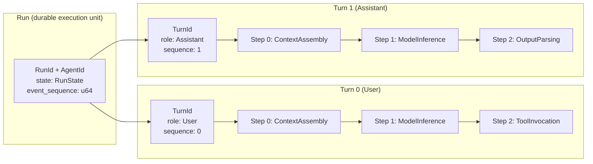
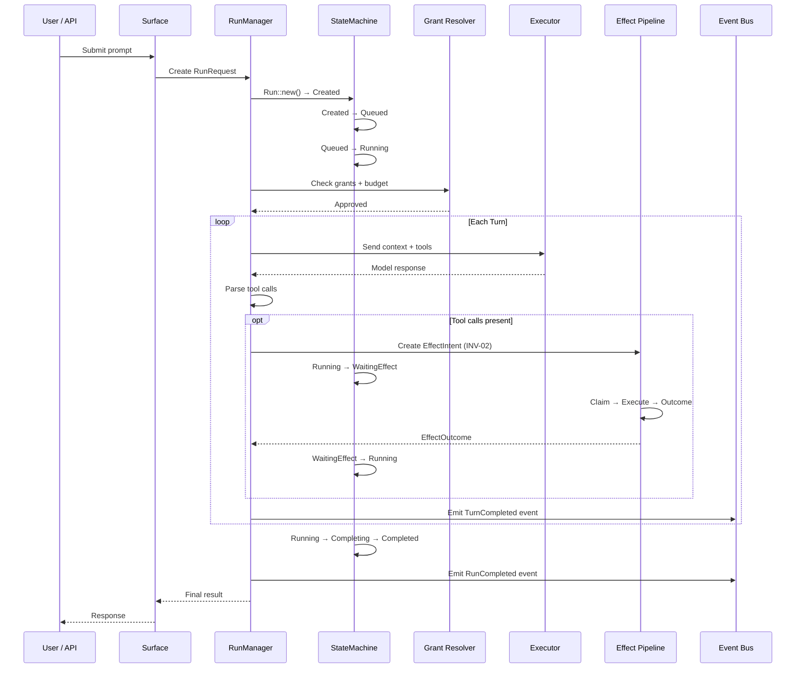
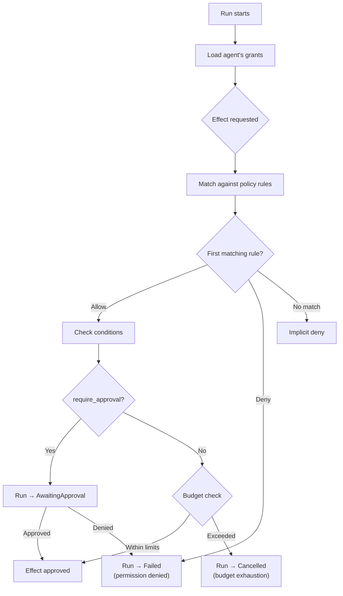
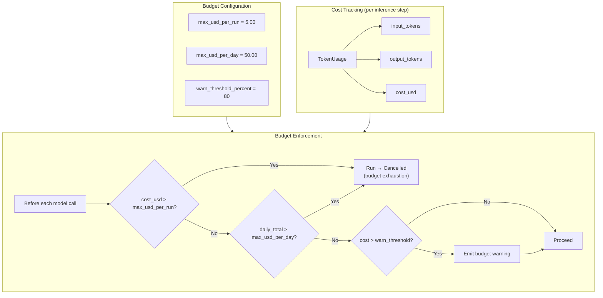

# Run Lifecycle (PRD-03: Execution Model)

This document describes the execution model for Polkagent runs as specified in PRD-03. It covers the `RunState` state machine, the `Run`/`Turn`/`Step` hierarchy, the full execution lifecycle, grant resolution, budget enforcement, and the semantics of terminal states.

**Cross-references:** [safety.md](./safety.md) | [api.md](./api.md) | [architecture.md](./architecture.md)

---

## Overview

A `Run` is the fundamental unit of durable execution in Polkagent. Every piece of work — from a simple model call to a multi-step chain action — is a run. Runs are owned by a single agent, optionally belong to a conversation, and progress through a strictly enforced state machine managed by `RunStateMachine` in `polkagent-run`.

Every state transition is:

1. **Validated** by `RunStateMachine::transition`, which enforces the transition table from PRD-03 §3.3.
2. **Persisted** atomically to the `RunStore`.
3. **Recorded** as a `RunEvent` via the `EventRecorder` so that the full lifecycle is reconstructable from the event log.

The `RunManager` (in `crates/polkagent-run/src/manager.rs`) is the single entry-point for all lifecycle operations. No state changes bypass it.

---

## RunState State Machine

### State Diagram

```mermaid
stateDiagram-v2
    [*] --> Created : Run::new()
    Created --> Queued : validated
    Queued --> Running : scheduling slot available
    Running --> AwaitingApproval : policy gate requires approval
    AwaitingApproval --> Running : approval granted
    Running --> WaitingEffect : effects dispatched
    WaitingEffect --> Running : all effects resolved
    Running --> Completing : final turn done
    Completing --> Completed : artifacts finalized
    Running --> Failed : unrecoverable error
    Running --> Cancelled : user / policy / timeout / budget
    Running --> TimedOut : deadline exceeded, outcome indeterminate

    state terminal <<choice>>
    Completed --> terminal
    Failed --> terminal
    Cancelled --> terminal
    TimedOut --> terminal
    terminal --> [*]

    note right of AwaitingApproval : Paused: human/quorum/external\napproval required
    note right of WaitingEffect : Paused: pending_intent_ids\nmust all resolve
    note right of TimedOut : Never auto-collapsed.\nRequires manual resolution.
```

### Full Transition Table

The `RunStateMachine` enforces the following authoritative table (PRD-03 §3.3):

| From State | Event (RunTransition) | To State |
|---|---|---|
| `Created` | `Start` | `Queued` |
| `Queued` | `WorkerClaimed` | `Running` |
| `Queued` | `Cancel(reason)` | `Cancelled { reason }` |
| `Queued` | `Timeout` | `TimedOut` |
| `Running` | `RequestApproval` | `AwaitingApproval { request_id }` |
| `Running` | `DispatchEffects` | `WaitingEffect { pending_intent_ids }` |
| `Running` | `CompleteStep` | `Running` (no state change) |
| `Running` | `Complete` | `Completing` |
| `Running` | `Fail(reason)` | `Failed { reason }` |
| `Running` | `Cancel(reason)` | `Cancelled { reason }` |
| `Running` | `Timeout` | `TimedOut` |
| `AwaitingApproval` | `GrantApproval` | `Running` |
| `AwaitingApproval` | `DenyApproval(reason)` | `Cancelled { reason }` |
| `AwaitingApproval` | `Cancel(reason)` | `Cancelled { reason }` |
| `AwaitingApproval` | `Fail(reason)` | `Failed { reason }` |
| `AwaitingApproval` | `Timeout` | `TimedOut` |
| `WaitingEffect` | `EffectsResolved` | `Running` |
| `WaitingEffect` | `Fail(reason)` | `Failed { reason }` |
| `WaitingEffect` | `Cancel(reason)` | `Cancelled { reason }` |
| `WaitingEffect` | `Timeout` | `TimedOut` |
| `Completing` | `Complete` | `Completed` |
| `Completing` | `Fail(reason)` | `Failed { reason }` |
| `Completing` | `Cancel(reason)` | `Cancelled { reason }` |
| `Completing` | `Timeout` | `TimedOut` |
| Any terminal | Any | `Err(TransitionError)` |

### State Descriptions

**`Created`**
The run record exists with a unique `RunId` and is owned by an `AgentId`. No execution has begun. `Run::new()` always enters this state. The `event_sequence` is `0` and `started_at` is `None`.

**`Queued`**
The run has been validated and accepted for execution. It is waiting for a scheduling slot. An operator or user can cancel from this state before any work starts.

**`Running`**
The turn actor owns the run and is actively executing turns. This is the primary execution state. `started_at` is set on entry. The run remains in `Running` between turns (the `CompleteStep` transition is a no-op that preserves `Running`).

**`AwaitingApproval { request_id: String }`**
Execution is paused. A policy gate determined that the next action requires human, quorum, or external approval before proceeding. The `request_id` identifies the pending approval request. The run resumes to `Running` on `GrantApproval`, or terminates to `Cancelled` on `DenyApproval` or `Cancel`.

**`WaitingEffect { pending_intent_ids: Vec<EffectId> }`**
Execution is paused while one or more `EffectIntent`s are being performed by workers. The `pending_intent_ids` list contains every effect that must resolve before the run can continue. When all intents have resolved, `EffectsResolved` drives the run back to `Running`. See [safety.md §Effect Pipeline](./safety.md) and INV-02 for the durability contract.

**`Completing`**
The final turn has finished. The run is transitioning from the last turn to a terminal state. Artifacts are being finalized and written. This is a brief transient state between the last model response and `Completed`.

**`Completed`**
Terminal. All turns finished successfully. `completed_at` is set. The run is immutable.

**`Failed { reason: String }`**
Terminal. Execution encountered an unrecoverable error. The `reason` field contains a human-readable description of the failure cause (e.g., `"provider timeout"`, `"policy denial"`). `completed_at` is set.

**`Cancelled { reason: String }`**
Terminal. Execution was stopped intentionally by user request, operator action, policy denial, or budget exhaustion. The `reason` field identifies the cause. `completed_at` is set.

**`TimedOut`**
Terminal (pending manual resolution). The outcome is genuinely indeterminate — for example, a chain broadcast succeeded but finality observation timed out before confirmation. **Invariant:** `TimedOut` is never silently converted to `Completed` or `Failed` without fresh, independent evidence. This state is never auto-collapsed and requires explicit operator resolution. See [safety.md §INV-04](./safety.md) for the unknown-outcome guarantee.

### State Predicate Methods

```rust
// polkagent-core/src/run.rs

impl RunState {
    pub fn is_terminal(&self) -> bool { ... }   // Completed | Failed | Cancelled | TimedOut
    pub fn is_executing(&self) -> bool { ... }  // Running | Completing
    pub fn is_waiting(&self) -> bool { ... }    // AwaitingApproval | WaitingEffect
}
```

---

## Run / Turn / Step Hierarchy

Every run is decomposed into an ordered sequence of turns. Each turn is decomposed into an ordered sequence of steps. This three-level hierarchy provides granular observability and reproducibility.

### Hierarchy Diagram



### Run Struct

```rust
// polkagent-core/src/run.rs
pub struct Run {
    pub id: RunId,
    pub agent_id: AgentId,
    pub conversation_id: Option<ConversationId>,
    pub state: RunState,
    pub event_sequence: u64,        // monotonically increasing; incremented on every transition
    pub turns_count: u32,
    pub token_usage: TokenUsage,    // aggregate across all inference steps
    pub created_at: DateTime<Utc>,
    pub updated_at: DateTime<Utc>,
    pub started_at: Option<DateTime<Utc>>,    // set on transition to Running
    pub completed_at: Option<DateTime<Utc>>,  // set on transition to any terminal state
    pub deadline: Option<DateTime<Utc>>,      // None means no timeout enforced
}
```

**Invariants:**

- `token_usage` is monotonically non-decreasing.
- Once `state` is terminal, the run is immutable (except for operator manual resolution of `TimedOut`).
- `state` transitions are atomic with their associated `RunEvent`.

### Turn Struct

```rust
// polkagent-core/src/turn.rs
pub struct Turn {
    pub id: TurnId,
    pub run_id: RunId,
    pub sequence: u32,          // 0-indexed, monotonically increasing within a run
    pub role: MessageRole,      // User | Assistant | System
    pub steps: Vec<Step>,
    pub token_usage: TokenUsage,
    pub started_at: DateTime<Utc>,
    pub completed_at: Option<DateTime<Utc>>,
}
```

Turns are strictly sequential: turn N+1 cannot begin until turn N completes. The first turn typically has `role: User`; subsequent turns driven by effect outcomes have `role: Assistant`.

### Step Struct

```rust
// polkagent-core/src/turn.rs
pub struct Step {
    pub id: StepId,
    pub run_id: RunId,
    pub turn_id: TurnId,
    pub step_number: u32,               // 0-indexed within the turn
    pub kind: StepKind,
    pub effect_intent_id: Option<EffectId>,  // set when this step dispatches an effect
    pub artifacts_produced: Vec<ArtifactId>,
    pub started_at: DateTime<Utc>,
    pub completed_at: Option<DateTime<Utc>>,
}
```

### StepKind Values

| Kind | Description |
|---|---|
| `ContextAssembly` | Pure context assembly: deterministic, no I/O |
| `ModelInference` | Calls the provider API (an effect via `EffectKind::ModelInference`) |
| `ToolInvocation` | Calls a registered tool (an effect via `EffectKind::ToolInvocation`) |
| `PolicyEvaluation` | Deterministic gate check against the policy engine |
| `ApprovalCheck` | Determines whether human or quorum approval is needed |
| `OutputParsing` | Pure transformation of raw model output |
| `ChainAction` | One phase of a chain action saga (decode, simulate, sign, broadcast) |
| `Delivery` | Delivery of a result to an external transport |

Steps with `kind: ModelInference` or `kind: ToolInvocation` set `effect_intent_id` to the ID of the dispatched `EffectIntent`, linking the step to the effect pipeline.

### TokenUsage Struct

```rust
// polkagent-core/src/turn.rs
pub struct TokenUsage {
    pub input_tokens: u32,
    pub output_tokens: u32,
    pub total_tokens: u32,
    pub cache_read_tokens: u32,
    pub cache_write_tokens: u32,
    pub cost_usd: Option<f64>,   // None if pricing data is unavailable
}
```

`TokenUsage` is tracked per inference step and accumulated to the turn level and then to the run level via `TokenUsage::accumulate`. The `total_tokens` field is the authoritative sum used for budget enforcement. Accumulation uses saturating arithmetic to avoid panics on overflow.

---

## Full Lifecycle Walkthrough

The sequence below is the target lifecycle for effect work that can suspend
for approval or asynchronous workers. The current in-process registered-tool
slice is narrower: it advertises and executes only exact agent-allowlisted,
grantless registry tools while the run remains `Running`. Grant-bearing tools
stay unadvertised until the `WaitingEffect`/approval resume path is implemented
end to end. See [Tools and Skills](tools-and-skills.md#current-registered-tool-execution-boundary).

### Sequence Diagram



### Step-by-Step Walkthrough

#### 1. Creation (`Created`)

`RunManager::create_run(agent_id)` calls `Run::new(RunId::new(), agent_id)`. The run starts in `Created` with `event_sequence = 0`, `turns_count = 0`, and zero `token_usage`. A `RunCreated` event is emitted.

#### 2. Enqueue (`Created -> Queued`)

`RunManager::enqueue_run(run_id)` applies the `Start` transition. Validation and budget pre-checks occur here. A `RunQueued` event is emitted. The run is now visible to the scheduler.

#### 3. Start (`Queued -> Running`)

A scheduler slot becomes available. `RunManager::start_run(run_id)` applies the `WorkerClaimed` transition. `started_at` is set. A `RunStarted` event is emitted. The turn actor takes ownership.

#### 4. Turn execution loop

For each turn:

- **ContextAssembly step:** The reducer assembles the full context — system prompt, conversation history, tool definitions, and any injected context packs — into the model request. Deterministic; no I/O.
- **PolicyEvaluation / ApprovalCheck steps:** The grant resolver evaluates whether the proposed action is permitted (see [Grant Resolution](#grant-resolution) below). If approval is required, `RequestApproval` drives the run to `AwaitingApproval`.
- **ModelInference step:** The executor calls the provider API. This is an effect: an `EffectIntent` with `kind: ModelInference` is persisted before the call (INV-02). The run transitions to `WaitingEffect` until the inference result arrives.
- **OutputParsing step:** The raw model response is parsed. Tool call requests are extracted.
- **ToolInvocation step (optional):** For each accepted grantless registered tool call, the current orchestrator persists a normalized step, a `ToolCall` intent, its claim and attempt, then a success/error outcome around registry dispatch. It feeds the exact typed result into the next model request without a synthetic completion. The target `WaitingEffect` transition and durable resume remain required for grant-bearing and asynchronously resumed tools.
- **TurnCompleted event** is emitted; `turns_count` is incremented; `token_usage` is accumulated.

#### 5. Completing (`Running -> Completing`)

When the executor determines the final turn has produced terminal output (no pending tool calls, no further turns required), `RunManager::completing_run(run_id)` applies the `Complete` transition. Artifacts are finalized and written to the artifact store. A `RunCompleting` event is emitted.

**6. Completed (`Completing -> Completed`)**

`RunManager::complete_run(run_id, output_artifact_id)` applies the second `Complete` transition. `completed_at` is set. A `RunCompleted` event is emitted. The run is now immutable.

### Event Sequence for a Successful Run

The event log for a minimal successful run contains:

```
run_created
run_queued
run_started
run_completing
run_completed
```

Each event carries a monotonically increasing per-run `sequence` number. The event log is the authoritative source of truth for reconstructing the full lifecycle.

---

## Grant Resolution

Before any effect is executed, the grant resolver evaluates the proposed action against the agent's configured policy rules. This is implemented via the `Gate` trait in `polkagent-grant`.

### Grant Resolution Flowchart



### GateResult Values

The policy engine returns one of three outcomes for every evaluated action:

| Result | Effect |
|---|---|
| `Allow` | Effect proceeds; budget is checked next |
| `Deny { reason }` | Run transitions to `Failed` with the denial reason |
| `Escalate { reason }` | Run transitions to `AwaitingApproval`; execution pauses |

### Gate Composition

Gates are composable via `ComposedGate`:

- `And` — all children must return `Allow`; the first non-`Allow` short-circuits.
- `Or` — the first `Allow` wins; escalates or denies only if all children return non-`Allow`.
- `Sequential` — evaluated left-to-right; the first `Deny` or `Escalate` short-circuits.

The built-in gates are:

| Gate | Behavior |
|---|---|
| `BudgetGate` | Denies when cumulative spend would exceed the configured ceiling |
| `AllowlistGate` | Permits only principals or resources in a static allowlist |
| `RateLimitGate` | Token-bucket rate limiter; denies when the bucket is exhausted |

### AutonomyLevel

The `AutonomyLevel` configured on an agent is an input to grant resolution, not an override of it. It cannot bypass explicit policy denials or approval requirements.

| Level | Behavior |
|---|---|
| `FullySupervised` | Every effect requires explicit human approval |
| `Supervised` (default) | Read/query effects are autonomous; write and chain effects require approval |
| `AssistedAutonomous` | Routine effects execute autonomously; high-risk effects still require approval |
| `FullyAutonomous` | All declared effects execute without per-call approval, subject to grant limits and budgets |

### AwaitingApproval Semantics

When a gate returns `Escalate`, `RunManager::request_approval(run_id, request_id)` drives the run to `AwaitingApproval { request_id }`. The run is paused until one of:

- `RunManager::grant_approval(run_id, approval_id)` — resumes to `Running`.
- `RunManager::deny_approval(run_id, reason)` — terminates to `Cancelled { reason }`.
- A deadline fires — terminates to `TimedOut`.
- An operator cancels — terminates to `Cancelled { reason }`.

---

## Budget Enforcement

Budget enforcement prevents runaway spending by placing per-run and per-day USD ceilings on inference cost.

### Budget Configuration

Budget limits are set in `polkagent.toml` under `[execution.budget]`:

```toml
[execution.budget]
max_usd_per_run = 5.00
max_usd_per_day = 50.00
warn_threshold_percent = 80
```

These correspond to the `BudgetConfig` struct in `polkagent-config`:

```rust
// polkagent-config/src/schema.rs
pub struct BudgetConfig {
    pub max_usd_per_run: f64,           // default: 5.00
    pub max_usd_per_day: f64,           // default: 50.00
    pub warn_threshold_percent: u8,     // default: 80
}
```

### Budget Enforcement Diagram



### BudgetTracker

The `BudgetTracker` in `polkagent-grant` maintains in-memory spend records per agent and per run:

```rust
// polkagent-grant/src/budget.rs
pub struct BudgetEntry {
    pub max_spend: u64,   // ceiling in asset's smallest unit (e.g. planck for DOT)
    pub spent: u64,
}
```

The tracker is shared via `Arc<BudgetTracker>` across async tasks. Concurrent writes are serialized by a `tokio::sync::RwLock`. Spend state is in-memory only in Phase 1 and resets on process restart.

**`check_budget`** returns `Ok(true)` if within budget, `Ok(false)` if the ceiling would be exceeded, or `Err(BudgetError)` when no budget is configured or arithmetic would overflow.

**`record_spend`** performs an atomic check-and-update: if the new total would exceed `max_spend`, the totals are not updated and `BudgetError::BudgetExceeded` is returned. On budget exhaustion, the run transitions to `Cancelled { reason: "budget exhaustion" }`.

### Warning Threshold

When the accumulated cost exceeds `warn_threshold_percent` of the applicable ceiling, a budget warning event is emitted to the event bus. This allows operators and dashboards to observe approaching limits without stopping the run.

---

## Terminal States and Their Semantics

A run in a terminal state cannot transition further. Attempting any `RunTransition` against a terminal state returns `Err(TransitionError)` from the state machine.

```rust
impl RunState {
    pub fn is_terminal(&self) -> bool {
        matches!(self, Self::Completed | Self::Failed { .. } | Self::Cancelled { .. } | Self::TimedOut)
    }
}
```

### Completed

The run finished all turns successfully. `completed_at` is set. Output artifacts are available via the artifact store. This state is fully immutable.

**Caused by:** `RunTransition::Complete` from `Completing`.

### Failed { reason }

The run encountered an unrecoverable error. `completed_at` is set. The `reason` string describes the failure cause and is surfaced in the API, TUI, and event log.

**Caused by:** `RunTransition::Fail(reason)` from `Running`, `WaitingEffect`, or `Completing`.

**Common causes:** provider timeout, malformed model response, policy engine error, signer failure, store write failure.

### Cancelled { reason }

The run was stopped intentionally. `completed_at` is set. The `reason` string identifies who or what triggered the cancellation.

**Caused by:** `RunTransition::Cancel(reason)` from `Queued`, `Running`, `AwaitingApproval`, `WaitingEffect`, or `Completing`; also `DenyApproval(reason)` from `AwaitingApproval`.

**Common causes:** user request, operator intervention, approval denial, budget exhaustion.

### TimedOut

The outcome is genuinely indeterminate. `completed_at` is set. This state is distinct from `Failed` because the system cannot determine whether the last action succeeded or failed — for example, a chain broadcast was submitted but finality confirmation timed out.

**Caused by:** `RunTransition::Timeout` from any non-terminal state.

**Key invariants (from [safety.md](./safety.md)):**

- `TimedOut` is never silently converted to `Completed` or `Failed` (INV-04).
- Resolution requires manual operator action or an automated reconciliation process with fresh, independent evidence.
- `TimedOut` runs remain visible in all projections, the API, and the TUI until explicitly resolved.

**Resolution procedure:** An operator inspects the event log and effect outcomes, determines the actual result, and either re-queues the run (if retriable) or marks it resolved with the confirmed outcome.

---

## Timeout Enforcement

The `TimeoutEnforcer` in `polkagent-run` detects deadline violations without cancelling runs itself. Detection triggers `RunManager::timeout_run`, which applies `RunTransition::Timeout`.

Two limits are enforced:

**Per-run deadline:** Set on `Run::deadline: Option<DateTime<Utc>>`. If `now >= deadline`, `DeadlineExceeded` is returned.

**Global max duration:** Configured via `TimeoutConfig::global_max_duration`. Measured from `Run::started_at`. Default is 600 seconds (10 minutes).

The effective deadline is the earlier of the per-run deadline and the global-max-derived deadline.

```rust
// polkagent-run/src/timeout.rs
pub struct TimeoutConfig {
    pub global_max_duration: Option<Duration>,  // default: Some(Duration::from_secs(600))
}
```

---

## Cross-References

| Topic | Document |
|---|---|
| Effect pipeline invariants (INV-01 through INV-04) | [safety.md](./safety.md) |
| Effect intent lifecycle (Pending → Claimed → Executing → Resolved) | [safety.md §Effect Pipeline](./safety.md) |
| API endpoints for run operations (`GET /runs`, `POST /runs/{id}/cancel`) | [api.md](./api.md) |
| System architecture, crate map, and hexagonal dependency rules | [architecture.md](./architecture.md) |
| `RunManager`, `RunStateMachine`, `BudgetTracker` crate locations | [architecture.md §Crate Map](./architecture.md) |
| Agent autonomy level configuration | [configuration.md](./configuration.md) |
