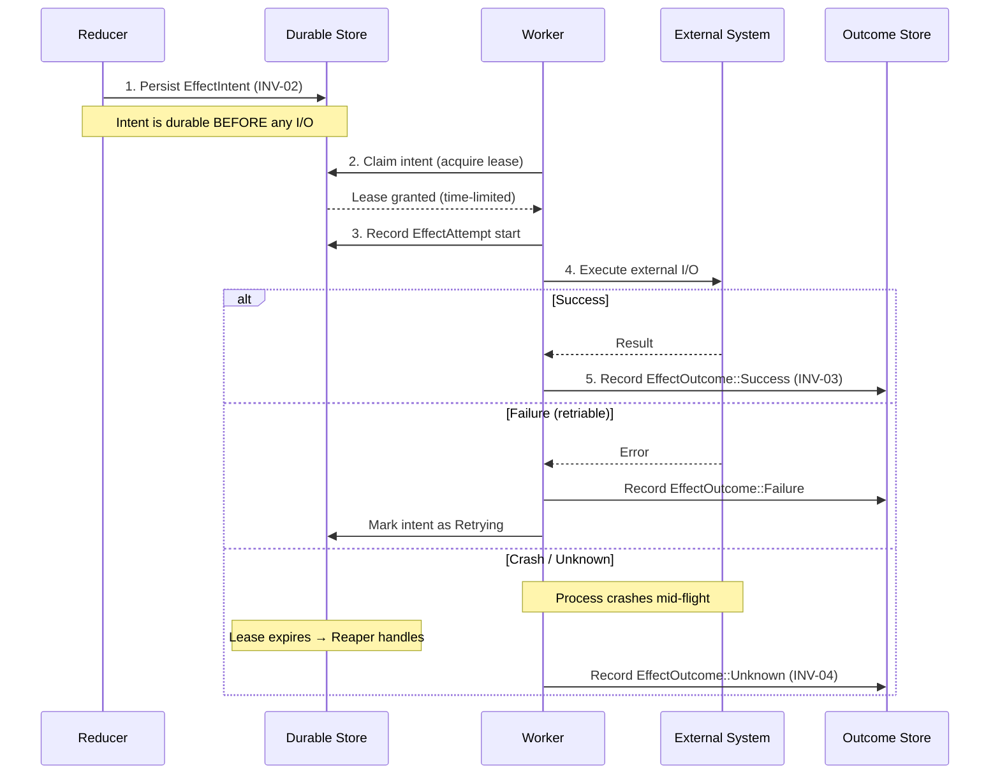
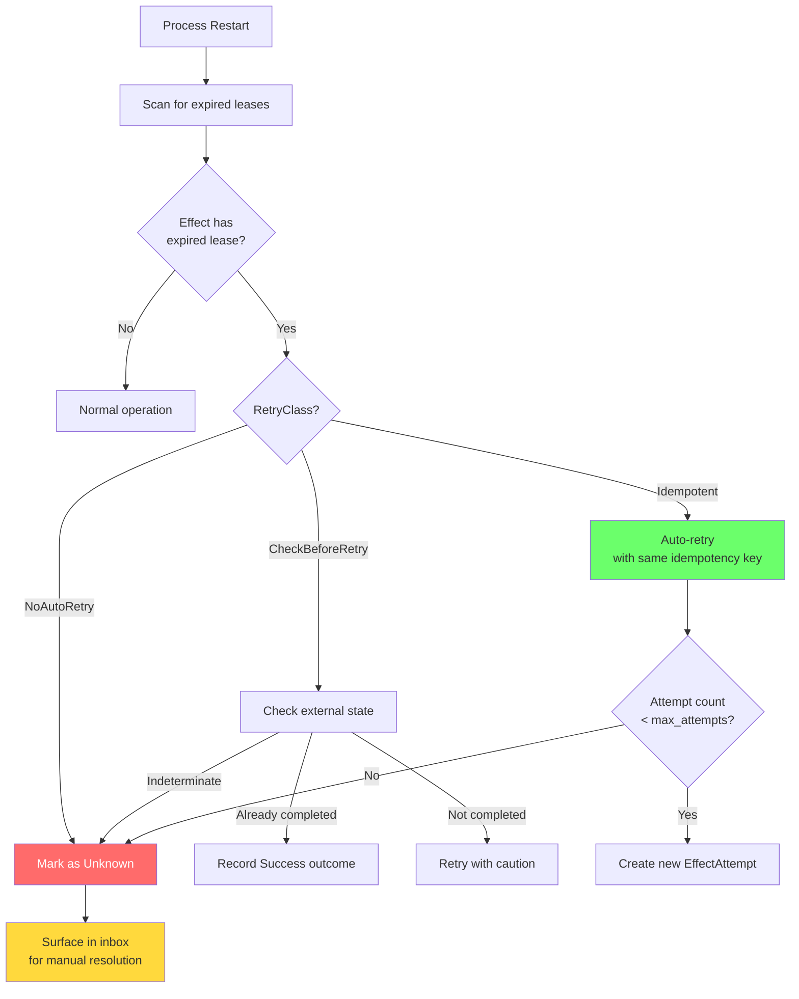
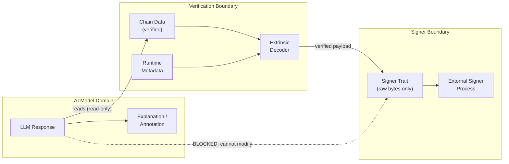

# Safety

This document describes the safety guarantees, invariants, and operational properties of polkagent.

---

## The Four Invariants

Polkagent's safety model is defined by four invariants that must hold at all times, including across process crashes and restarts.

### INV-01: Signer Isolation

The signer never sees model-modified data. Only user-approved, integrity-checked bytes reach the signing boundary. The model may explain, annotate, and summarize, but the canonical payload that enters the signer is constructed from verified chain data (decoded extrinsic, metadata-checked fields). This prevents a compromised or hallucinating model from altering transaction semantics.

### INV-02: Effect Intent Before I/O

An `EffectIntent` is durably persisted before any corresponding I/O is attempted. If the process crashes between persisting the intent and completing the I/O, recovery can detect the incomplete intent and decide whether to retry or mark it as unknown — but it will never silently skip or duplicate the operation.

### INV-03: No Silent Duplicate Effects

A crash never silently repeats an irreversible external action. The effect pipeline uses idempotency keys, claim/lease semantics, and outcome recording to ensure that each effect is attempted at most once per attempt record. If a crash occurs mid-flight, the outcome is recorded as `Unknown` and requires explicit resolution.

### INV-04: Unknown Stays Unknown

An `EffectOutcome::Unknown` is never automatically collapsed to `Success` or `Failure`. It remains visibly unknown in all projections, APIs, and UIs until a human or automated reconciliation process explicitly resolves it. This prevents optimistic assumptions about the state of irreversible operations.

---

## Effect Pipeline

### Effect Kinds

Each effect kind has a defined lease duration, retry class, and maximum attempt count.

| Kind | Lease Duration | Retry Class | Max Attempts |
|------|---------------|-------------|--------------|
| `ModelCall` | 60s | Idempotent | 3 |
| `ToolCall` | 60s | CheckBeforeRetry | 2 |
| `SignatureRequest` | 120s | NoAutoRetry | 1 |
| `Broadcast` | 120s | NoAutoRetry | 1 |
| `FinalityWatch` | 120s | NoAutoRetry | 1 |
| `Delivery` | 60s | CheckBeforeRetry | 2 |
| `ChainRead` | 30s | Idempotent | 3 |
| `Simulation` | 30s | Idempotent | 3 |
| `HarnessOperation` | 60s | CheckBeforeRetry | 2 |

### Effect Lifecycle

Effects move through a state machine from creation to terminal resolution.

```mermaid
stateDiagram-v2
    [*] --> Pending : Intent persisted
    Pending --> Claimed : Worker acquires lease
    Claimed --> Executing : I/O begins
    Executing --> Resolved : Outcome recorded
    Claimed --> Retrying : Lease expired (Idempotent)
    Executing --> Retrying : Transient failure
    Retrying --> Claimed : Backoff elapsed
    Pending --> Superseded : Run cancelled
    Claimed --> Superseded : Replaced / MaxAttempts

    Resolved --> [*]
    Superseded --> [*]

    note right of Resolved : Terminal: immutable outcome
    note right of Superseded : Terminal: cancelled or replaced
```

| State | Description |
|-------|-------------|
| `Pending` | Intent persisted, not yet claimed |
| `Claimed { worker_id, lease_expires }` | Worker has a time-limited lease |
| `Executing { worker_id, started_at }` | I/O is in progress |
| `Resolved { outcome_id }` | Terminal: outcome has been recorded |
| `Retrying { next_attempt_after, last_error }` | Waiting before next attempt |
| `Superseded { reason }` | Cancelled or replaced |

Supersession reasons: `RunCancelled`, `Replaced`, `MaxAttemptsExceeded`, `DeadlineExceeded`.

### Pipeline Stages

1. **Propose** — Persist `EffectIntent` to the durable store before any I/O. This enforces INV-02.
2. **Claim** — Acquire a time-limited lease on the effect.
3. **Record attempt** — Record the start of I/O execution.
4. **Record outcome** — Write an immutable outcome record. This enforces INV-03. Duplicate writes return an `OutcomeAlreadyRecorded` error.



### Outcome Types

`OutcomeResult` variants:

| Variant | Description |
|---------|-------------|
| `Success { data }` | Operation completed successfully |
| `Failure { error_class, message, retriable }` | Operation failed with a known error |
| `Timeout { waited_secs, partial_work_possible }` | Operation timed out |
| `Cancelled { partial_work_possible, reason }` | Operation was cancelled |
| `Unknown { context, resolution_hint }` | Ambiguous outcome requiring resolution (INV-04) |

Error classes: `ClientError`, `ServerError`, `NetworkError`, `AuthorizationError`, `ResourceExhaustion`, `ChainError`.

Resolution hints for `Unknown` outcomes: `CheckChain`, `RetryOperation`, `ManualInvestigation`, `SafeToAbandon`.

### Effect Priority

Effects are prioritized for dispatch: `Low (0)`, `Normal (1)`, `High (2)`, `Critical (3)`.

---

## Crash Recovery

When polkagent restarts after a crash, it performs the following steps:

1. Scans for effects in `Claimed` or `Executing` state with expired leases.
2. For `Idempotent` effects: automatically retries up to the configured maximum attempt count.
3. For `CheckBeforeRetry` effects: checks external state before deciding whether to retry.
4. For `NoAutoRetry` effects: marks the outcome as `Unknown` for manual resolution.
5. Unknown outcomes remain visible in the inbox until explicitly resolved.

This procedure upholds INV-02 (no silent skips), INV-03 (no silent duplicates), and INV-04 (unknown stays unknown).



---

## Budget Enforcement

The budget resolver checks spending limits before each model call. Exceeding either limit causes the run to fail immediately.

```toml
[execution.budget]
max_usd_per_run = 5.00          # Hard limit per run
max_usd_per_day = 50.00         # Hard limit per day
warn_threshold_percent = 80     # Warning at 80% of budget
```

---

## Signer Isolation

The signer boundary is enforced architecturally, not by policy:

- The signer trait (`polkagent-signer-trait`) accepts only raw bytes. It has no knowledge of model output.
- Transaction payloads are constructed from verified chain data, never from model output.
- The model can read and explain transactions but cannot modify the signing payload.
- `polkagent-signer-external` delegates to an external signing process, keeping keys out of the main process.
- `polkagent-signer-fake` is used only in tests and must never be configured in production.

This architecture means that even if the model is compromised or produces incorrect output, the bytes submitted for signing are always derived from chain-verified sources.



---

## Managing Effects

Pending and historical effects are managed through the `polkagent inbox` subcommand.

```bash
# List pending effects
polkagent inbox list

# Show effect details
polkagent inbox show <EFFECT_ID>

# Approve a pending effect
polkagent inbox approve <EFFECT_ID>

# Deny with reason
polkagent inbox deny <EFFECT_ID> --reason "Not authorized"

# View history
polkagent inbox history --limit 20
```

Unknown outcomes that require resolution will appear in `polkagent inbox list` until they are explicitly approved, denied, or resolved by a reconciliation process.

---

## Security Configuration

```toml
[security]
sandbox_enabled = false
max_file_size_bytes = 10485760     # 10 MiB
allowed_paths = []
denied_paths = ["/etc/shadow", "/etc/passwd", "/etc/sudoers", "/root", "/proc", "/sys"]
max_memory_mb = 512
max_cpu_seconds = 300
```

For reporting security vulnerabilities, see [SECURITY.md](../SECURITY.md).

---

> For annotated policy configuration examples, see [Examples: Policy Examples](examples.md#policy-examples).
