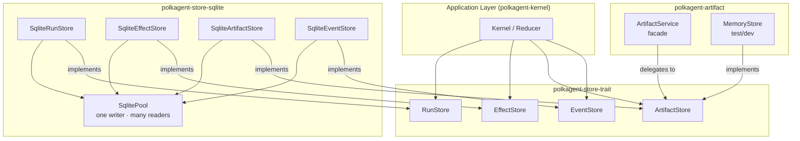
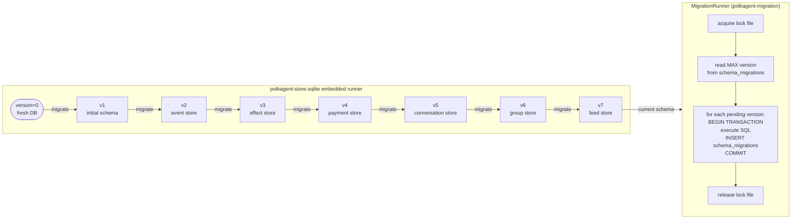
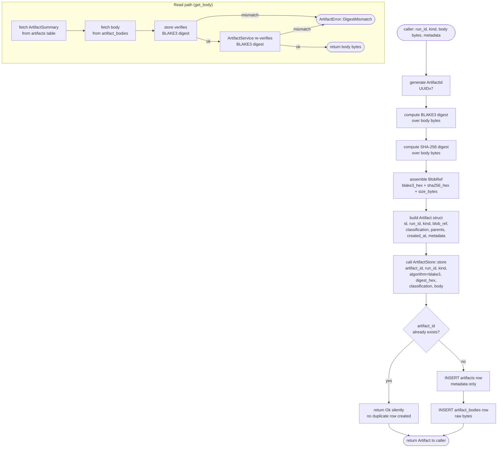

# Storage (PRD-10: Data Layer)

This document covers the Polkagent data layer: the store trait abstractions, the SQLite adapter, the migration system, and content-addressed artifact storage.

---

## Overview

Polkagent's persistence layer follows a hexagonal (ports-and-adapters) architecture. Storage contracts are defined as Rust traits in `polkagent-store-trait`; concrete adapters live in separate crates (`polkagent-store-sqlite`, future PostgreSQL adapter). The application kernel depends only on the trait interfaces, never on a specific database engine.

Four distinct store traits capture the four persistence domains:

| Trait | Crate | Entities |
|---|---|---|
| `RunStore` | `polkagent-store-trait` | Runs, agents |
| `EffectStore` | `polkagent-store-trait` | Effect intents, attempts, outcomes |
| `ArtifactStore` | `polkagent-store-trait` | Content-addressed artifact blobs |
| `EventStore` | `polkagent-store-trait::event` | Ordered durable run events |

SQLite implementations (`SqliteRunStore`, `SqliteEffectStore`, `SqliteArtifactStore`, `SqliteEventStore`) all share a single `SqlitePool`, which enforces the single-writer / multiple-reader model that maps cleanly to WAL mode.

---

## Diagram 1: Store Architecture



The kernel holds references to `Arc<dyn RunStore>`, `Arc<dyn EffectStore>`, `Arc<dyn ArtifactStore>`, and `Arc<dyn EventStore>`. The concrete types are injected at startup and never referenced directly in business logic.

---

## Store Traits and Contract Tests

### RunStore

`RunStore` owns the run lifecycle records.

```rust
pub trait RunStore: Send + Sync + 'static {
    async fn create(&self, run_id: RunId, agent_id: &str, status: RunStatus) -> Result<(), StoreError>;
    async fn get(&self, run_id: RunId) -> Result<RunSummary, StoreError>;
    async fn update_state(&self, run_id: RunId, new_status: RunStatus) -> Result<(), StoreError>;
    async fn list_by_agent(&self, agent_id: &str, limit: u32, offset: u32) -> Result<Vec<RunSummary>, StoreError>;
    async fn list_by_state(&self, status: RunStatus, limit: u32, offset: u32) -> Result<Vec<RunSummary>, StoreError>;
}
```

Key contracts:

- `create` returns `StoreError::Conflict` when the `run_id` already exists.
- `get` returns `StoreError::NotFound` when no matching record exists.
- `update_state` must be atomic — partial updates are not permitted.
- Transitioning to a terminal status (`"completed"`, `"failed"`, `"cancelled"`, `"timed_out"`) sets `completed_at` in the returned `RunSummary`.

`RunStatus` is an opaque `String` wrapper. The store layer does not interpret or validate the value; state machine logic lives in the kernel.

### EffectStore

`EffectStore` drives the effect pipeline (intents, attempts, outcomes).

Key invariants (EFF-INV-1 through EFF-INV-3):

1. `propose_intent` persists the intent before any external I/O occurs.
2. `claim_intent` is atomic — exactly one caller wins when multiple workers race.
3. `record_outcome` is idempotent with respect to uniqueness: a second call with the same `outcome_id` returns `StoreError::Conflict`, not a silent overwrite.
4. `release_claim` is a no-op when the intent is already resolved or the claim belongs to a different worker.

Intent lifecycle states: `"pending"` → `"claimed"` → `"resolved"` (or `"approved"` / `"denied"` via the approval subsystem).

### ArtifactStore

`ArtifactStore` enforces content-addressed, classification-enforcing persistence:

```rust
pub trait ArtifactStore: Send + Sync + 'static {
    async fn store(&self, artifact_id: ArtifactId, run_id: Option<RunId>, kind: &str,
                   algorithm: &str, digest_hex: &str, classification: &str, body: &[u8])
                   -> Result<(), StoreError>;
    async fn get(&self, id: ArtifactId) -> Result<ArtifactSummary, StoreError>;
    async fn get_body(&self, id: ArtifactId) -> Result<Vec<u8>, StoreError>;
    async fn verify(&self, id: ArtifactId) -> Result<bool, StoreError>;
    async fn list_for_run(&self, run_id: RunId) -> Result<Vec<ArtifactSummary>, StoreError>;
}
```

Key contracts:

- `store` is idempotent: storing the same artifact twice (same `artifact_id` and matching digest) must succeed on the second call without error or duplication.
- `get_body` **must** verify the BLAKE3 digest of the returned bytes. A mismatch returns `StoreError::IntegrityError`.
- `verify` checks the stored body without returning it (cheaper than `get_body` for large blobs). Returns `false` (not an error) when no body is stored.

### EventStore

`EventStore` provides an append-only ordered event log enforcing three invariants:

1. Per-run `sequence` numbers are monotonically increasing (REQ-EVT-001). Violations return `EventStoreError::NonMonotonicSequence`.
2. At most one terminal event per run (REQ-EVT-004). A second terminal event returns `EventStoreError::DuplicateTerminalEvent`.
3. `global_sequence` is assigned by the store and is strictly increasing across all runs (REQ-EVT-002).

### StoreError

All four store traits share a unified `StoreError` type:

| Variant | Meaning | Retryable? |
|---|---|---|
| `NotFound` | Record does not exist | No |
| `Conflict` | Uniqueness constraint violated | No |
| `SequenceConflict` | Duplicate event sequence for a run | No |
| `IntegrityError` | Digest mismatch on artifact retrieval | No |
| `ConnectionError` | Backend unavailable | Yes (`is_retryable() == true`) |
| `InvalidTransition` | Invalid state transition attempted | No |
| `Serialisation` | Serde failure | No |
| `Internal` | Unexpected backend error | No |

### Conformance Test Suite

The `polkagent-store-trait` crate ships a shared conformance suite (enabled via the `test-contracts` feature) in `polkagent_store_trait::conformance`. Every adapter must pass this suite.

The conformance functions are plain `async fn`s (not macros). Adapters call them from their own `tests/` directory, after providing a pre-configured store and any prerequisite records (e.g., agent rows to satisfy FK constraints):

```rust
// Example from an adapter's integration test
conformance::test_run_store_crud(&store, "agent-a").await;
conformance::test_run_store_duplicate_conflict(&store, "agent-a").await;
conformance::test_run_store_get_not_found(&store).await;
conformance::test_run_store_terminal_state_sets_completed_at(&store, "agent-a").await;

conformance::test_effect_store_crud(&effect_store, run_id, step_id).await;
conformance::test_artifact_store_crud(&artifact_store).await;
conformance::test_event_store_append_and_query(&event_store).await;
```

---

## SQLite Implementation

### Connection Model

`SqlitePool` holds one exclusive writer connection (behind a `parking_lot::Mutex`) and opens independent read-only connections on demand.

```rust
pub struct SqlitePool {
    inner: Arc<PoolInner>,
}

struct PoolInner {
    db_path: PathBuf,
    writer: Mutex<Connection>,
}
```

- `pool.writer()` — acquire the exclusive writer guard. Callers block until the previous holder drops the guard.
- `pool.reader()` — open a fresh read-only connection. In WAL mode, readers and the single writer proceed concurrently without blocking each other.
- `SqlitePool::open_in_memory()` — for tests. WAL mode is not supported for in-memory databases; the default `DELETE` journal is used instead.

### PRAGMA Settings

Every connection applies the following PRAGMAs on open:

| PRAGMA | Value | Reason |
|---|---|---|
| `journal_mode` | `WAL` | Concurrent reads and writes; readers never block writers |
| `busy_timeout` | `5000` ms | Wait up to 5 s on `SQLITE_BUSY` before returning an error |
| `synchronous` | `NORMAL` | Durable on power-loss with WAL; faster than `FULL` |
| `foreign_keys` | `ON` | Enforce FK constraints at the database level |
| `cache_size` | `-65536` | 64 MiB page cache per connection |
| `mmap_size` | `268435456` | 256 MiB memory-mapped I/O |

WAL is activated on the writer connection at pool open time; all subsequent reader connections inherit it.

### Quickstart

```rust
use polkagent_store_sqlite::{SqlitePool, migrations};
use polkagent_store_sqlite::store::{
    SqliteRunStore, SqliteEffectStore, SqliteArtifactStore, SqliteEventStore,
};

// 1. Open (or create) the database.
let pool = SqlitePool::open("/var/lib/polkagent/store.db").expect("open db");

// 2. Apply any pending migrations (idempotent).
{
    let writer = pool.writer();
    migrations::migrate(&writer).expect("migrate");
}

// 3. Construct stores.
let run_store      = SqliteRunStore::new(pool.clone());
let effect_store   = SqliteEffectStore::new(pool.clone());
let artifact_store = SqliteArtifactStore::new(pool.clone());
let event_store    = SqliteEventStore::new(pool.clone());
```

### Row Types

Each store exposes lightweight row types mirroring the schema columns, used by internal query logic. These types are also re-exported at the crate root for consumers that need low-level access:

| Row Type | Table |
|---|---|
| `AgentRow` | `agents` |
| `RunRow` | `runs` |
| `TurnRow` | `turns` |
| `StepRow` | `steps` |
| `EffectIntentRow` | `effect_intents` |
| `EffectAttemptRow` | `effect_attempts` |
| `EffectOutcomeRow` | `effect_outcomes` |
| `ArtifactRow` | `artifacts` |
| `RunEventRow` | `run_events` |

### Write Isolation

Effect-store write paths open transactions with `BEGIN IMMEDIATE` (SQLite) or `SELECT ... FOR UPDATE` (PostgreSQL) to serialize concurrent writers. The single-writer Tokio task pattern from PRD-03 §13.4 reinforces this at the application layer.

### WAL Checkpoint

SQLite WAL files grow until a checkpoint is triggered. Polkagent does not explicitly schedule checkpoints; SQLite's default automatic checkpoint threshold (1000 pages) applies. For production deployments with high write throughput, consider configuring `PRAGMA wal_autocheckpoint` or running periodic `PRAGMA wal_checkpoint(TRUNCATE)` via a maintenance task. See [deployment.md](deployment.md) for operational guidance.

The currently verified container backup procedure is deliberately offline: it
stops and drains the sole writer, snapshots the complete data volume including
any WAL/SHM sidecars, verifies the archive and an extracted SQLite copy, and
restores into a fresh volume before API comparison. Copying only the main
database while the service is live is not supported evidence. See the offline
runbook in [deployment.md](deployment.md#offline-sqlite-backuprestore-runbook).

---

## PostgreSQL Support

PostgreSQL support is planned as a future adapter crate (`polkagent-store-postgres`). The trait interfaces are designed to be backend-agnostic:

- All timestamps use `chrono::DateTime<Utc>` (mapped to `TIMESTAMPTZ` in PostgreSQL).
- JSON payloads use `serde_json::Value` (mapped to `JSONB`).
- IDs are `uuid::Uuid` (mapped to `UUID`).
- Effect-store write paths use `SELECT ... FOR UPDATE` on PostgreSQL instead of `BEGIN IMMEDIATE`.

No application-layer changes are required to switch backends; only the injected `Arc<dyn Store>` changes.

---

## Migration System

### polkagent-store-sqlite (Embedded Migrations)

The `polkagent-store-sqlite` crate includes a lightweight embedded migration runner in `polkagent_store_sqlite::migrations`. Migrations are SQL files compiled into the binary at build time via `include_str!`.

Current schema versions:

| Version | Description |
|---|---|
| 1 | Initial schema (`agents`, `runs`, `turns`, `steps`, `artifacts`, `artifact_bodies`, `artifact_lineage`, `effect_intents`, `effect_attempts`, `effect_outcomes`) |
| 2 | Event store tables (`durable_events`, `diagnostic_events`, global counter) |
| 3 | Effect store trait columns (`state`, `retry_class`, `worker_id`, `payload_json`, `attempt_id`, `run_id`, `consumed`) |
| 4 | Payment store tables (`payment_intents`, `payment_receipts`, `cost_records`) |
| 5 | Conversation store tables (`conversations`, `conversation_messages`) |
| 6 | Group store tables (`groups`, `group_members`) |
| 7 | Feed store tables (`feeds`, `feed_triggers`, `feed_recipes`, `feed_items`) |
| 8–15 | Skill storage, intent priority, run lifecycle columns, unique agent names, durable interactions, and complete artifact projections |
| 16 | NULL-safe immutability for effect-outcome `attempt_id` and `run_id` lineage |

The `schema_migrations` table tracks applied versions:

```sql
CREATE TABLE IF NOT EXISTS schema_migrations (
    version     INTEGER PRIMARY KEY,
    description TEXT    NOT NULL,
    applied_at  TEXT    NOT NULL,
    checksum    TEXT    NOT NULL
);
```

`migrations::migrate(&writer_conn)` is idempotent: already-applied versions are skipped based on `MAX(version)`.

### polkagent-migration (Standalone CLI)

The `polkagent-migration` crate provides a richer, standalone migration tool for use outside the main application binary (e.g., in CI, deployment pipelines, or manual administration).

Key types:

```rust
pub struct Migration {
    pub version: u32,        // 1-based monotonic
    pub name: String,        // human-readable description
    pub sql: String,         // forward (up) SQL
    pub down_sql: Option<String>,  // reverse SQL; None = forward-only
    pub applied_at: Option<DateTime<Utc>>,
    pub checksum: String,    // BLAKE3 hex of sql
}

pub enum MigrationState {
    Pending,
    Applied,
    Tampered,  // checksum mismatch after initial apply
}

pub struct MigrationRunner {
    lock_path: Option<PathBuf>,
}
```

`MigrationRunner` supports:

- `apply_pending(&conn, &migrations, dry_run)` — apply pending migrations, each in its own transaction. With `dry_run = true`, SQL is not executed and no state changes.
- `rollback_last(&conn, &migrations, dry_run)` — rollback the most recently applied migration, if `down_sql` is present. Forward-only migrations return `MigrationError::RollbackUnavailable`.
- Lock file (`lock_dir/.migration.lock`) prevents concurrent migration processes.
- `MigrationState::Tampered` is detected by comparing the stored checksum against a recomputed BLAKE3 hash of the current SQL.

---

## Diagram 2: Migration Chain



---

## Artifact Storage (Content-Addressed, BLAKE3)

### ArtifactService

`ArtifactService<S>` in `polkagent-artifact` is the application-layer facade over any `ArtifactStore` implementation. It owns the digest computation, integrity verification, and lineage recording logic.

```rust
pub struct ArtifactService<S> {
    store: Arc<S>,
}

impl<S: ArtifactStore> ArtifactService<S> {
    pub fn new(store: Arc<S>) -> Self { ... }

    pub async fn create(
        &self,
        run_id: Option<RunId>,
        kind: ArtifactKind,
        body: &[u8],
        metadata: HashMap<String, String>,
    ) -> Result<Artifact, ArtifactError>;

    pub async fn get(&self, artifact_id: ArtifactId) -> Result<Artifact, ArtifactError>;
    pub async fn get_body(&self, artifact_id: ArtifactId) -> Result<Vec<u8>, ArtifactError>;
    pub async fn verify(&self, artifact_id: ArtifactId) -> Result<bool, ArtifactError>;
    pub async fn list_for_run(&self, run_id: RunId) -> Result<Vec<Artifact>, ArtifactError>;
    pub async fn add_lineage(&self, child_id: ArtifactId, parent_id: ArtifactId) -> Result<(), ArtifactError>;
    pub async fn get_lineage(&self, artifact_id: ArtifactId) -> Result<Vec<ArtifactId>, ArtifactError>;
}
```

### Dual-Digest Design

Artifacts carry two digests computed at creation time:

- **BLAKE3** (`blake3_hex`) — fast internal digest used as the primary storage key, deduplication check, and integrity guard. Stored in `BlobRef.blake3_hex` as a lowercase 64-character hex string.
- **SHA-256** (`sha256_hex`) — canonical external digest for interoperability with Sigstore, IPFS, and on-chain anchoring. Stored in `BlobRef.sha256_hex` (optional field).

`compute_digest(data)` produces a `BlobRef` with only `blake3_hex` populated. `compute_dual_digest(data)` returns `(Blake3Digest, Sha256Digest)` without double-hashing.

`ArtifactService::create` always populates both fields:

```rust
let mut blob_ref = compute_digest(body);          // BLAKE3 only
blob_ref.sha256_hex = Some(compute_sha256_digest(body));  // add SHA-256
```

### Integrity on Read

`get_body` performs a defensive double-verification:

1. The store's `get_body` implementation verifies the digest internally (returning `StoreError::IntegrityError` on mismatch).
2. `ArtifactService` re-verifies using `verify_digest` regardless of what the store reported, so that a misbehaving or untrusted backend cannot bypass the guarantee.

A digest mismatch returns `ArtifactError::DigestMismatch`, indicating storage corruption or tampering.

### LineageGraph

`LineageGraph` is an in-memory DAG for tracking artifact provenance (parent→child relationships). It is populated from the `artifact_lineage` table on startup and updated via `ArtifactService::add_lineage`. `get_lineage` returns ancestors in breadth-first order (direct parents first).

---

## Diagram 3: Core Schema

```mermaid
erDiagram
    agents {
        string id PK
        string name
        string description
        string state
        string spec_json
        string created_at
        string updated_at
    }

    runs {
        string id PK
        string agent_id FK
        string conversation_id
        string state
        string params_json
        string created_at
        string updated_at
        string completed_at
    }

    turns {
        string id PK
        string run_id FK
        int sequence
        string role
        string started_at
        string completed_at
        int input_tokens
        int output_tokens
    }

    steps {
        string id PK
        string turn_id FK
        int sequence
        string kind
        string started_at
        string completed_at
    }

    effect_intents {
        string id PK
        string run_id FK
        string turn_id
        string step_id FK
        string kind
        string params_json
        string idempotency_key
        string state
        string claimed_by
        string claimed_until
        string created_at
    }

    effect_attempts {
        string id PK
        string intent_id FK
        string worker_id
        string payload_json
        string started_at
    }

    effect_outcomes {
        string id PK
        string intent_id FK
        string attempt_id FK
        string run_id FK
        bool consumed
        string payload_json
        string observed_at
    }

    artifacts {
        string id PK
        string run_id FK
        string kind
        string algorithm
        string digest_hex
        string classification
        string created_at
    }

    artifact_bodies {
        string artifact_id PK_FK
        blob body
    }

    artifact_lineage {
        string child_id FK
        string parent_id FK
    }

    run_events {
        string id PK
        string run_id FK
        string event_type
        int sequence
        int global_sequence
        string conversation_id
        string correlation_id
        string causation_id
        string scope_id
        string timestamp
        string durability
        string payload_json
        string trace_id
        string span_id
        int schema_version
    }

    agents ||--o{ runs : "has"
    runs ||--o{ turns : "contains"
    turns ||--o{ steps : "contains"
    runs ||--o{ effect_intents : "produces"
    steps ||--o{ effect_intents : "creates"
    effect_intents ||--o{ effect_attempts : "has"
    effect_attempts ||--o{ effect_outcomes : "produces"
    runs ||--o{ artifacts : "produces"
    artifacts ||--o| artifact_bodies : "body stored in"
    artifacts ||--o{ artifact_lineage : "child"
    artifacts ||--o{ artifact_lineage : "parent"
    runs ||--o{ run_events : "emits"
```

---

## Diagram 4: Content-Addressed Artifact Storage Flow



---

## Schema Overview

### Core Tables (v1)

The initial migration creates the following tables:

- `agents` — agent registry; `spec_json` holds the full agent specification.
- `runs` — run instances; `state` is an opaque string; `params_json` holds invocation parameters.
- `turns` — conversation turns within a run; `sequence` is per-run monotonic; token counts are accumulated.
- `steps` — discrete steps within a turn (tool calls, LLM completions, etc.); `kind` identifies the step type.
- `effect_intents` — outbox for side-effectful operations; `idempotency_key` prevents duplicate execution.
- `effect_attempts` — individual execution attempts for an intent; linked to a worker.
- `effect_outcomes` — immutable results with exact attempt/run lineage;
  `consumed` is the sole mutable field and tracks reducer processing. V16
  recreates the update trigger with NULL-safe checks so existing databases
  cannot mutate either lineage ID.
- `artifacts` — artifact metadata; body stored separately.
- `artifact_bodies` — raw artifact bytes keyed by `artifact_id`.
- `artifact_lineage` — provenance edges (child → parent).

### Event Tables (v2)

- `run_events` (durable events) — append-only; enforces monotonic `sequence` per run and single terminal event per run.
- `diagnostic_events` — lower-retention diagnostic events; `expires_at` column for TTL-based deletion.
- A global sequence counter table ensures `global_sequence` is strictly increasing across all events.

### Extended Tables (v3–v7)

| Version | Tables Added |
|---|---|
| v3 | Columns added to `effect_intents` and `effect_outcomes` |
| v4 | `payment_intents`, `payment_receipts`, `cost_records` |
| v5 | `conversations`, `conversation_messages` |
| v6 | `groups`, `group_members` |
| v7 | `feeds`, `feed_triggers`, `feed_recipes`, `feed_items` |

> Note: `group_store_impl` and `feed_store_impl` in `polkagent-store-sqlite` are temporarily disabled. Their serde type graphs exceed `rustc`'s trait-solver recursion limit (`#![recursion_limit = "2048"]`) when compiled alongside the other store modules. They will be moved to dedicated crates (`polkagent-store-sqlite-group`, `polkagent-store-sqlite-feed`) to isolate trait resolution. The in-memory stores in `polkagent-group` and `polkagent-feed` remain fully functional.

---

## Configuration Options

Storage configuration is covered in detail in [configuration.md](configuration.md). Relevant parameters:

| Parameter | Default | Description |
|---|---|---|
| `store.sqlite.path` | `/var/lib/polkagent/store.db` | Filesystem path for the SQLite database file |
| `store.sqlite.busy_timeout_ms` | `5000` | `SQLITE_BUSY` wait timeout (ms) |
| `store.sqlite.cache_size_kb` | `65536` | Page cache size per connection (KiB, negative = KiB) |
| `store.sqlite.mmap_size_bytes` | `268435456` | Memory-mapped I/O window size (bytes) |
| `store.sqlite.wal_autocheckpoint` | `1000` | WAL checkpoint threshold (pages); 0 = disable |

For in-memory operation (e.g., tests or ephemeral single-request invocations), pass `":memory:"` as the database path. Note that in-memory databases do not support WAL mode or concurrent reader connections.

---

## Cross-References

- [configuration.md](configuration.md) — full configuration reference including storage parameters.
- [deployment.md](deployment.md) — production deployment guidance, WAL checkpoint scheduling, backup strategies, and database file placement.
- [run-lifecycle.md](run-lifecycle.md) — how runs, turns, steps, effects, and events relate to each other at the application layer.
- [architecture.md](architecture.md) — hexagonal architecture overview and crate dependency graph.
