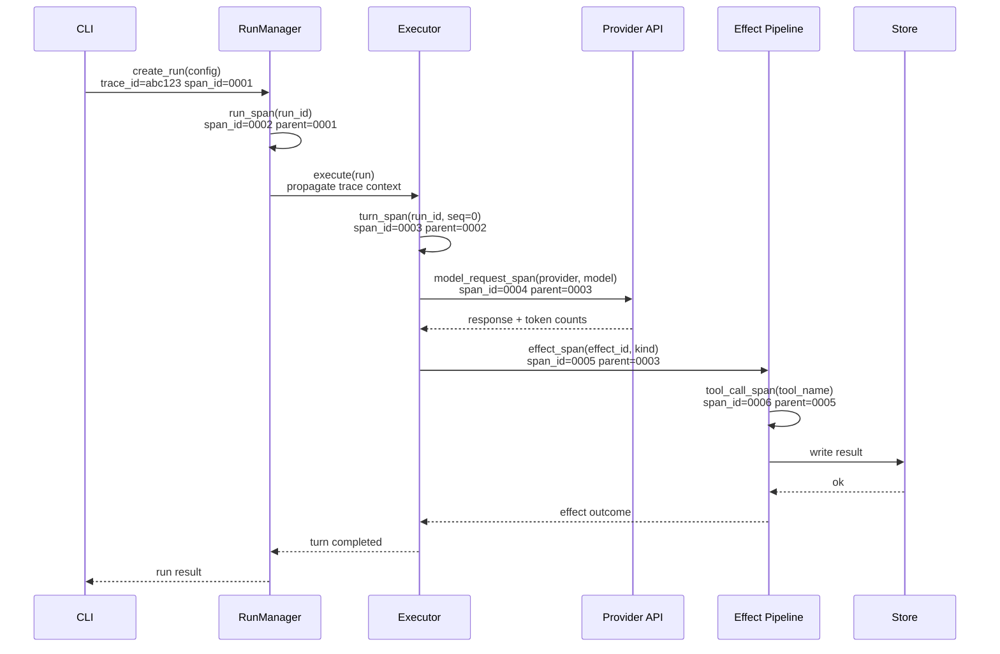

# Observability (PRD-10/11)

This document covers the full observability stack for Polkagent: OpenTelemetry
integration, Prometheus metrics, distributed tracing, structured logging, the
`polkagent-audit` tamper-evident audit trail, and `polkagent-health` checks.

Related documents:
- [Deployment](deployment.md) — running a collector sidecar, environment wiring
- [Configuration](configuration.md) — environment variables and config files
- [API](api.md) — `/metrics` and `/health` HTTP endpoints

---

## Overview

Polkagent ships three purpose-built crates that together provide a complete
observability layer:

| Crate | Purpose |
|---|---|
| `polkagent-telemetry` | OTLP trace export, structured logging, `MetricRecorder`, `PrometheusRegistry`, secret redaction, JSONL event files |
| `polkagent-audit` | Tamper-evident hash-chained audit trail for every security-relevant action |
| `polkagent-health` | Liveness / readiness probes with concurrent checks and a background `HealthReporter` |

All three crates are zero-`unsafe` (`#![forbid(unsafe_code)]`) and designed
to compose cleanly: telemetry initialisation is a single call at process start,
audit logging wraps any `AuditStore` backend, and health checks register
against a shared `HealthAggregator`.

---

## Observability Pipeline

```mermaid
graph LR
    A[Application Code] --> B[Structured Logs\ntracing events]
    A --> C[Metrics\nMetricRecorder /\nPrometheusRegistry]
    A --> D[Traces\nrun_span / turn_span /\neffect_span / model_request_span /\ntool_call_span]

    B --> E[tracing-subscriber\nEnvFilter layer]
    C --> F[/metrics endpoint\nPrometheus text format]
    D --> G[OTLP gRPC Exporter\nopentelemetry-otlp / tonic]

    E --> H[stdout / file\npretty or JSON]
    G --> I[OpenTelemetry Collector]

    I --> J[Jaeger\nDistributed Traces]
    I --> K[Prometheus\nMetrics Scrape]
    I --> L[Grafana\nDashboards]

    F --> K
```

The application emits all three signal types simultaneously. Logs go directly
to stdout (pretty or JSON). Traces are batched and exported over OTLP/gRPC to a
collector. Metrics are exposed on a `/metrics` HTTP endpoint in Prometheus text
format and can also flow through the collector to a remote-write backend.

---

## OpenTelemetry Integration

### Initialisation

Telemetry is initialised once at process start using `init_telemetry` or the
convenience wrapper `init_from_env`. The returned `TelemetryGuard` must be held
for the entire lifetime of the process — dropping it flushes pending OTLP spans
and shuts down the tracer provider.

```rust
use polkagent_telemetry::{init_from_env, TelemetryGuard};

fn main() {
    let _guard: TelemetryGuard = init_from_env().expect("telemetry init");
    // _guard is held until main() returns
}
```

Or with explicit configuration:

```rust
use polkagent_telemetry::{init_telemetry, TelemetryConfig, LogFormat};

let _guard = init_telemetry(TelemetryConfig {
    log_level: "polkagent=debug,info".to_owned(),
    log_format: LogFormat::Json,
    otlp_endpoint: Some("http://localhost:4317".to_owned()),
    service_name: "polkagent".to_owned(),
}).expect("telemetry init");
```

### Configuration Types

**`TelemetryConfig`**

| Field | Type | Default | Description |
|---|---|---|---|
| `log_level` | `String` | `"info"` | `tracing` filter directive (e.g. `"polkagent=debug,warn"`) |
| `log_format` | `LogFormat` | `LogFormat::Pretty` | `Pretty` (coloured) or `Json` (JSONL to stdout) |
| `otlp_endpoint` | `Option<String>` | `None` | OTLP/gRPC endpoint; omit to disable trace export |
| `service_name` | `String` | `"polkagent"` | `service.name` resource attribute |

**`LogFormat`** variants: `Pretty`, `Json`

### Environment Variables

`init_from_env` reads the following variables:

| Variable | Default | Meaning |
|---|---|---|
| `POLKAGENT_LOG_LEVEL` | `info` | tracing filter directive |
| `POLKAGENT_LOG_FORMAT` | `pretty` | `pretty` or `json` |
| `OTEL_EXPORTER_OTLP_ENDPOINT` | *(none)* | OTLP gRPC endpoint; export disabled if unset |

### OTLP Transport

The exporter uses **gRPC / tonic** (`opentelemetry_otlp::SpanExporter` with
`.with_tonic()`). Point `OTEL_EXPORTER_OTLP_ENDPOINT` at an OpenTelemetry
Collector, Jaeger all-in-one OTLP endpoint, or any compatible receiver.

Example collector configuration (see [Deployment](deployment.md) for a full
Docker Compose setup):

```yaml
receivers:
  otlp:
    protocols:
      grpc:
        endpoint: 0.0.0.0:4317
exporters:
  jaeger:
    endpoint: jaeger:14250
  prometheus:
    endpoint: 0.0.0.0:8889
```

---

## Metrics

### Metric Taxonomy

```mermaid
graph TB
    ROOT[Polkagent Metrics]

    ROOT --> RM[Run Metrics]
    RM --> RM1[polkagent_runs_total\ncounter / agent + status labels]
    RM --> RM2[polkagent_run_duration_seconds\nhistogram]
    RM --> RM3[polkagent_active_runs\ngauge]
    RM --> RM4[runs.started / runs.completed /\nruns.failed\nvia MetricRecorder]

    ROOT --> EM[Effect Metrics]
    EM --> EM1[polkagent_effects_total\ncounter]
    EM --> EM2[polkagent_effect_latency_seconds\nhistogram]
    EM --> EM3[polkagent_approval_pending\ngauge]
    EM --> EM4[effects.approved / effects.denied\nvia MetricRecorder]

    ROOT --> PM[Provider / Model Metrics]
    PM --> PM1[polkagent_model_tokens_total\ncounter]
    PM --> PM2[polkagent_model_latency_seconds\nhistogram]
    PM --> PM3[model.tokens\nvia MetricRecorder\n tokens.input + tokens.output]

    ROOT --> SM[System Metrics]
    SM --> SM1[polkagent_memory_entries_total\ngauge / per-agent]
    SM --> SM2[polkagent_store_operations_total\ncounter]
    SM --> SM3[run.duration_ms / effect.kind\nvia MetricRecorder tracing events]
```



### PrometheusRegistry

`PrometheusRegistry` owns metric families and renders them in Prometheus text
exposition format for scraping. It is cheaply cloneable (all clones share the
same underlying `Arc<RwLock<Vec<MetricFamily>>>`).

```rust
use polkagent_telemetry::PrometheusRegistry;

// Pre-loaded with all standard Polkagent metrics:
let registry = PrometheusRegistry::with_default_metrics();

// Increment a counter with labels:
registry.increment(
    "polkagent_runs_total",
    &[Label::new("agent", "alpha"), Label::new("status", "completed")],
    1.0,
);

// Set a gauge:
registry.set_gauge("polkagent_active_runs", &[], 3.0);

// Observe a histogram value:
registry.observe("polkagent_run_duration_seconds", &[], 1.42);

// Render for /metrics:
let text = registry.render();
```

**Default metrics registered by `PrometheusRegistry::with_default_metrics()`:**

| Name | Type | Description |
|---|---|---|
| `polkagent_runs_total` | Counter | Total agent runs (labels: `agent`, `status`) |
| `polkagent_effects_total` | Counter | Total effects executed |
| `polkagent_model_tokens_total` | Counter | Total tokens consumed by model calls |
| `polkagent_store_operations_total` | Counter | Total store operations |
| `polkagent_run_duration_seconds` | Histogram | Duration of agent runs |
| `polkagent_effect_latency_seconds` | Histogram | Latency of individual effects |
| `polkagent_model_latency_seconds` | Histogram | Model inference latency |
| `polkagent_active_runs` | Gauge | Currently active runs |
| `polkagent_memory_entries_total` | Gauge | Memory entries per agent |
| `polkagent_approval_pending` | Gauge | Effects awaiting operator approval |

**Metric primitives** (`polkagent_telemetry::prometheus`):

- `Counter` — monotonically increasing; `increment(&[Label], delta)`, ignores negative delta
- `Gauge` — can go up and down; `set`, `inc`, `dec`
- `Histogram` — distribution of observations; default buckets: `0.005, 0.01, 0.025, 0.05, 0.1, 0.25, 0.5, 1.0, 2.5, 5.0, 10.0` (`DEFAULT_BUCKETS`)
- `Label` — key-value pair with Prometheus-compliant escaping

### MetricRecorder

`MetricRecorder` is a companion to `PrometheusRegistry` that emits metrics as
structured `tracing` events at `info` level. This provides a migration path:
log processors can extract metrics from the event stream, and call sites need
not change when switching to native OTEL metrics.

```rust
use polkagent_telemetry::MetricRecorder;
use std::time::Duration;

let recorder = MetricRecorder::new();

recorder.increment_active_runs();                          // metric = "runs.active"
recorder.runs_started();                                   // metric = "runs.started"
recorder.record_run_duration(Duration::from_secs(5), "completed"); // metric = "run.duration"
recorder.record_model_tokens(1024, 512, "anthropic");     // metric = "model.tokens"
recorder.record_effect_attempt("chain_submit", true);     // metric = "effect.attempt"
recorder.effects_approved();                               // metric = "effects.approved"
recorder.decrement_active_runs();
```

---

## Distributed Tracing

### Span Constructors

`polkagent-telemetry` provides standard span constructors in the `spans` module.
All spans carry a `service.name = "polkagent"` attribute for backend filtering.

| Function | Span Name | Key Attributes |
|---|---|---|
| `run_span(run_id)` | `"run"` | `run.id` |
| `turn_span(run_id, turn_seq)` | `"turn"` | `run.id`, `turn.seq` |
| `effect_span(effect_id, kind)` | `"effect"` | `effect.id`, `effect.kind` |
| `model_request_span(provider, model)` | `"model_request"` | `model.provider`, `model.name` |
| `tool_call_span(tool_name)` | `"tool_call"` | `tool.name` |

Usage follows standard `tracing` span patterns:

```rust
use polkagent_telemetry::{run_span, turn_span, effect_span};

let span = run_span(&run_id);
let _guard = span.enter();

// Nested child span for a turn:
let turn = turn_span(&run_id, 0);
let _tguard = turn.enter();
```

### Distributed Trace Flow



All spans share `trace_id=abc123`. Parent/child relationships are established
via the `tracing-opentelemetry` bridge layer, which attaches W3C TraceContext
headers when crossing process boundaries.

### Structured Logging

The same `tracing` subscriber that routes spans to OTLP also captures log
events. Key structured fields used throughout the codebase:

| Field | Description |
|---|---|
| `run.id` | UUID of the current run |
| `effect.id` | UUID of the effect |
| `effect.kind` | Effect type string (e.g. `"chain_submit"`) |
| `model.provider` | Provider name (e.g. `"anthropic"`) |
| `model.name` | Model identifier |
| `tool.name` | Tool name |
| `metric` | Metric name (for `MetricRecorder` events) |
| `action` | Audit action label (for `AuditLogger` events) |
| `actor` | Actor identity (for `AuditLogger` events) |

Log format is controlled by `POLKAGENT_LOG_FORMAT` (`pretty` for development,
`json` for production). JSON format emits newline-delimited JSON compatible
with structured log aggregators (Loki, Elasticsearch, CloudWatch Logs).

---

## JSONL Event Files

`JsonlWriter` provides durable run-event recording independent of the telemetry
pipeline. Every `RunEvent` is serialised as a single JSON line and flushed
immediately to a `.jsonl` file.

```rust
use polkagent_telemetry::JsonlWriter;

let mut writer = JsonlWriter::new("/var/log/polkagent/runs.jsonl")?;
writer.write_event(&run_event)?;
```

Each line has the envelope structure:

```json
{
  "timestamp": "2026-08-03T12:00:00.000Z",
  "event_type": "run_started",
  "run_id": "018f...",
  "data": { ... }
}
```

Supported `event_type` values (from `EventKind`): `run_created`, `run_queued`,
`run_started`, `approval_requested`, `approval_granted`, `approval_denied`,
`run_completing`, `run_completed`, `run_failed`, `run_cancelled`,
`run_timed_out`, `run_retry_queued`, `turn_started`, `turn_completed`,
`step_started`, `step_completed`, `effect_intent_created`,
`effect_attempt_started`, `effect_outcome_recorded`, `effects_resolved`,
`artifact_created`, `streaming_token`, `progress_update`, `tool_call_started`,
`tool_call_completed`, `delivery_started`, `delivery_completed`,
`diagnostic_log`, `budget_consumed`, `budget_warning`.

Files are opened in append mode so a restart picks up where it left off.

---

## Secret Redaction

Before any string value reaches a log line, pass it through `redact_string` to
remove accidental credential leaks. The `Redacted<T>` newtype prevents any
wrapped value from appearing in `Display`, `Debug`, or `Serialize` output; the
inner value is zeroized on drop.

```rust
use polkagent_telemetry::{Redacted, redact_string};

// Newtype — inner value inaccessible via fmt or serde:
let key: Redacted<String> = Redacted::new(api_key);
// format!("{key}") => "[REDACTED]"

// Pattern-based scrubbing of arbitrary strings:
let clean = redact_string(&log_line);
```

Patterns automatically redacted by `redact_string`:
- API keys: `sk-***REDACTED***` / `pk-***REDACTED***` (8+ chars after prefix)
- Hex seeds: `0x` followed by exactly 64 hex chars
- BIP-39 mnemonics: sequences of 12 or 24 lowercase words

---

## Audit Trail

`polkagent-audit` maintains a tamper-evident, append-only record of every
security-relevant action in the system.

### Architecture

```
caller
  |
  v
AuditLogger      (facade — main entry point)
  |
  v
AuditStore       (trait — pluggable storage backend)
  |
  v
InMemoryAuditStore | (future) SqliteAuditStore | ...
```

### Audit Trail Integrity

```mermaid
flowchart TD
    A[Event occurs\ne.g. EffectExecuted] --> B[AuditLogger.log called\nactor, action, resource, outcome, context]
    B --> C[AuditEntry constructed\nid: AuditId UUID-v7\ntimestamp: UTC now]
    C --> D{Is first entry?}
    D -- Yes --> E[prev_hash = GENESIS_HASH\n'000...000' 64 zeros]
    D -- No --> F[prev_hash = last entry's\nintegrity_hash]
    E --> G[Compute BLAKE3 hash\nBLAKE3 prev_hash || entry_json]
    F --> G
    G --> H[Set entry.integrity_hash\nstore entry via AuditStore.append]
    H --> I[Audit chain\nentry_0 -> entry_1 -> entry_N]
    I --> J{Verify integrity?\nverify_chain called}
    J -- OK --> K[Chain valid\nno tampering detected]
    J -- Mismatch --> L[AuditError::IntegrityViolation\nhash mismatch at index N]
```

The integrity mechanism is `BLAKE3(prev_hash_bytes || canonical_entry_json_bytes)`.
The genesis hash constant `GENESIS_HASH` is `"000...000"` (64 zeros). Any
deletion, modification, or reordering of entries is detectable by calling
`verify_chain`.

### Core Types

**`AuditLogger`** — cheaply cloneable facade (holds `Arc<dyn AuditStore>`):

```rust
use polkagent_audit::{
    AuditLogger, InMemoryAuditStore,
    AuditAction, ActorInfo, ResourceInfo, ActionOutcome,
};
use std::sync::Arc;

let store = Arc::new(InMemoryAuditStore::new());
let logger = AuditLogger::new(store);

logger.log(
    ActorInfo::agent("agent-1"),
    AuditAction::EffectExecuted,
    ResourceInfo::new("effect", "eff-42").with_description("chain_submit"),
    ActionOutcome::Success,
    serde_json::json!({"tx_hash": "0xdeadbeef"}),
).await?;
```

**`AuditEntry`** fields:

| Field | Type | Description |
|---|---|---|
| `id` | `AuditId` (UUID v7) | Time-ordered unique identifier |
| `timestamp` | `DateTime<Utc>` | When the event occurred |
| `actor` | `ActorInfo` | Who performed the action |
| `action` | `AuditAction` | What action was performed |
| `resource` | `ResourceInfo` | What resource was targeted |
| `outcome` | `ActionOutcome` | Result of the action |
| `context` | `serde_json::Value` | Arbitrary structured context |
| `integrity_hash` | `String` | BLAKE3 hash chain link |

**`ActorInfo`** — built with `ActorInfo::agent(id)`, `ActorInfo::user(id)`,
or `ActorInfo::system(id)`. Optional `.with_name(name)` and `.with_ip(ip)`.

**`ActorType`** variants: `Agent`, `User`, `System`

**`AuditAction`** variants:

| Variant | Security Sensitive |
|---|---|
| `RunStarted` | No |
| `RunCompleted` | No |
| `ToolInvoked` | No |
| `EffectRequested` | No |
| `EffectAttempted` | No |
| `EffectExecuted` | No |
| `EffectCompleted` | No |
| `EffectFailed` | No |
| `ApprovalGranted` | No |
| `GrantEvaluated` | No |
| `SecretAccessed` | **Yes** |
| `PolicyDecision` | **Yes** |
| `ApprovalDenied` | **Yes** |
| `ChainSubmitted` | **Yes** |
| `ConfigChanged` | **Yes** |

Security-sensitive actions (those where `AuditAction::is_security_sensitive()`
returns `true`) should trigger elevated alerting in the monitoring pipeline.

**`ActionOutcome`** variants: `Success`, `Failure`, `Denied`, `Error`

**`ResourceInfo`** — built with `ResourceInfo::new(resource_type, resource_id)`
and optional `.with_description(desc)`.

### Querying the Audit Trail

```rust
use polkagent_audit::{AuditQuery, AuditAction};

// Filter by actor and action:
let query = AuditQuery::new()
    .actor("agent-1")
    .action(AuditAction::EffectExecuted)
    .build();

let entries = logger.query(&query).await?;
```

### Output Formats

`OutputFormat` variants: `JsonLines`, `Text`, `Csv`

```rust
use polkagent_audit::{formatter, OutputFormat};

let entries = store.snapshot();
let jsonl = formatter::format_entries(&entries, OutputFormat::JsonLines)?;
let text  = formatter::format_entries(&entries, OutputFormat::Text)?;
let csv   = formatter::format_entries(&entries, OutputFormat::Csv)?;
```

### Integrity Verification

```rust
use polkagent_audit::{verify_chain, InMemoryAuditStore};

// Direct store verification:
store.verify_integrity()?;

// Or verify a slice of entries:
verify_chain(&entries)?;
```

---

## Health Checks

`polkagent-health` provides liveness, readiness, and dependency health
monitoring with concurrent check execution and configurable timeouts.

### Key Types

| Type | Description |
|---|---|
| `HealthAggregator` | Registers checks and runs them all concurrently |
| `HealthCheck` (trait) | Implement for any dependency to monitor |
| `LivenessProbe` | Simple "is the process alive" signal; `mark_dead()` to signal shutdown |
| `ReadinessProbe` | Runs critical dependency checks before declaring ready |
| `TcpCheck` | Verifies a TCP port is reachable |
| `HttpCheck` | Verifies an HTTP endpoint returns a successful response |
| `SqliteCheck` | Verifies a SQLite database file exists |
| `HealthReporter` | Runs checks periodically in a background task; caches `OverallHealth` |
| `ReporterConfig` | Configures `interval` and `check_on_start` |
| `OverallHealth` | Aggregated result: `status`, `checks`, `uptime_seconds`, `version` |
| `HealthStatus` | Per-check result: `name`, `status`, `latency_ms`, `details`, `checked_at` |
| `Status` | `Up`, `Down`, `Degraded` |
| `CheckSeverity` | `Critical` (affects overall status) or `Advisory` (informational) |

### Setup

```rust
use std::sync::Arc;
use polkagent_health::{
    HealthAggregator, LivenessProbe, ReadinessProbe,
    TcpCheck, SqliteCheck, CheckSeverity,
    HealthReporter, ReporterConfig,
};
use std::time::Duration;

let aggregator = Arc::new(HealthAggregator::new("polkagent-0.1.0"));

// Liveness: always up unless explicitly killed.
aggregator.register(Arc::new(LivenessProbe::new()));

// Database check (critical — failure sets overall status to Down).
aggregator.register(Arc::new(SqliteCheck::new(
    "sqlite", "/data/polkagent.db", CheckSeverity::Critical,
)));

// Chain node connectivity (advisory — does not affect Up/Down).
aggregator.register(Arc::new(TcpCheck::new(
    "chain-node", "127.0.0.1", 9944, CheckSeverity::Advisory,
)));

// Background reporter — runs every 30s, caches latest result.
let reporter = HealthReporter::new(
    Arc::clone(&aggregator),
    ReporterConfig::default()
        .with_interval(Duration::from_secs(30))
        .with_check_on_start(true),
);
let _handle = reporter.start()?;

// Serve from HTTP handler:
let health: OverallHealth = reporter.latest().unwrap_or_else(|| aggregator.check_all_sync());
let json = serde_json::to_string_pretty(&health)?;
```

### Overall Status Rules

- `Status::Down` if any `Critical` check returns `Down`.
- `Status::Degraded` if any check (any severity) returns `Degraded`.
- `Status::Up` otherwise.

### HTTP Endpoint Convention

Expose `OverallHealth` as JSON at `GET /health`. Return HTTP 200 when
`status == Up`, 503 when `status == Down`, and 200 with degraded details
when `status == Degraded`. See [API](api.md) for the full endpoint spec.

---

## Configuration Reference

All environment variables relevant to observability:

| Variable | Default | Description |
|---|---|---|
| `POLKAGENT_LOG_LEVEL` | `info` | `tracing` filter directive |
| `POLKAGENT_LOG_FORMAT` | `pretty` | `pretty` or `json` |
| `OTEL_EXPORTER_OTLP_ENDPOINT` | *(none)* | OTLP gRPC endpoint; export disabled if unset |
| `POLKAGENT_METRICS_PORT` | `9090` | Port for the Prometheus `/metrics` endpoint |
| `POLKAGENT_HEALTH_INTERVAL_SECS` | `30` | `HealthReporter` check interval |

See [Configuration](configuration.md) for the full configuration reference
including `TelemetryConfig` options and audit store settings.

---

## Cross-References

- [Deployment](deployment.md) — Docker Compose with OTel Collector, Jaeger, and
  Prometheus; `polkagent_metrics_port` and health check wiring for container
  orchestrators
- [Configuration](configuration.md) — `POLKAGENT_LOG_LEVEL`,
  `OTEL_EXPORTER_OTLP_ENDPOINT`, and all other environment variables
- [API](api.md) — `/metrics` (Prometheus scrape), `/health` (liveness /
  readiness), and `/v1/audit` (audit query endpoint)
