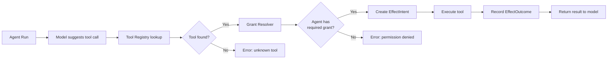
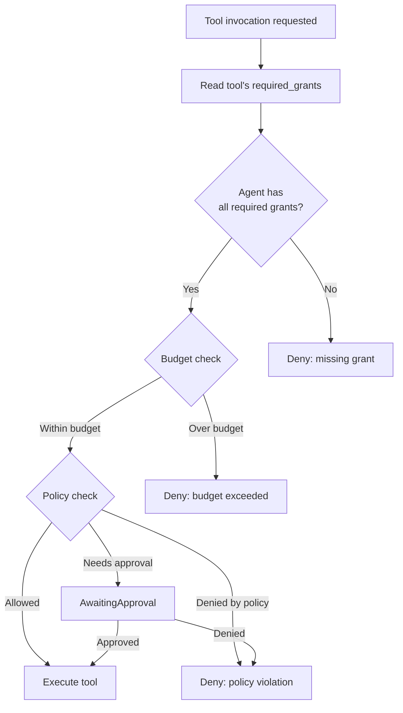
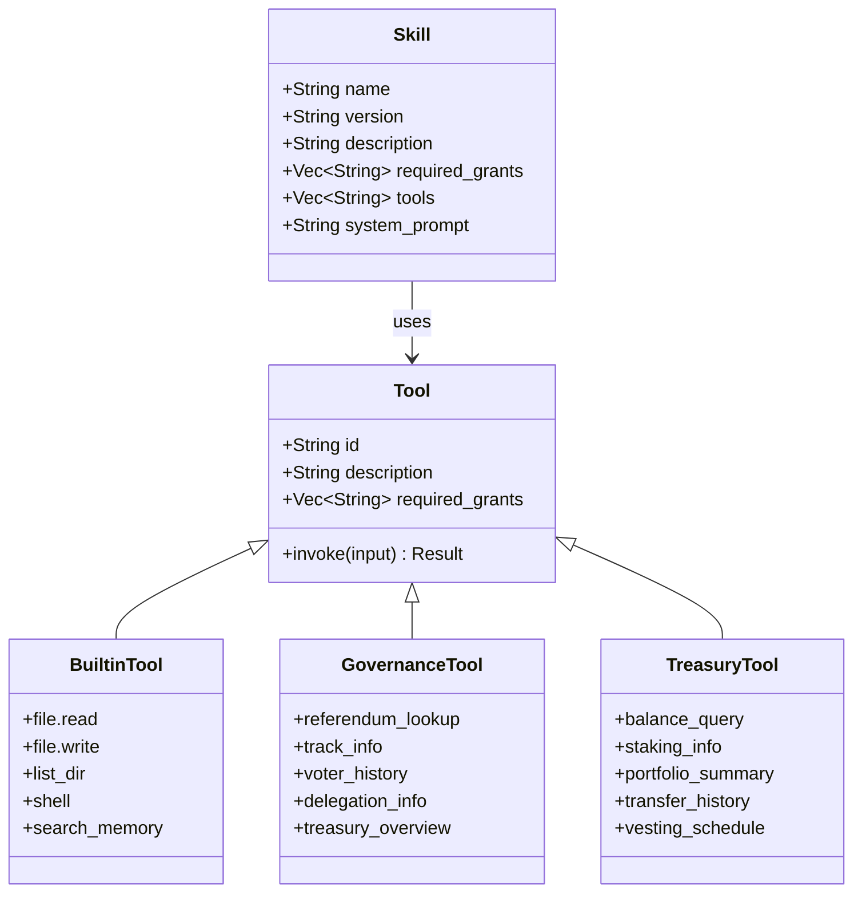

# Tools and Skills



## Built-in Tools

Provided by the `polkagent-tool` crate (`crates/polkagent-tool/src/builtin/mod.rs`).

| Tool | Description |
|------|-------------|
| `file.read` | Read file contents |
| `file.write` | Write file contents |
| `list_dir` | List directory entries |
| `shell` | Execute shell commands (with timeout) |
| `search_memory` | Search agent episodic memory |

## Governance Tools

Provided by the `polkagent-tool-governance` crate. All tools require the `chain.query` grant.

| Tool | Description |
|------|-------------|
| `polkagent.governance.referendum_lookup` | Look up an OpenGov referendum by index. Returns status, track, tally, proposer, and timeline. |
| `polkagent.governance.track_info` | List governance tracks with their parameters. |
| `polkagent.governance.voter_history` | Query voting history for an account. |
| `polkagent.governance.delegation_info` | Query the delegation graph for an account. |
| `polkagent.governance.treasury_overview` | Query treasury balance and proposals. |

### Governance Types

**ReferendumStatus**: `Preparing`, `Deciding`, `Confirming`, `Approved`, `Rejected`, `Cancelled`, `TimedOut`, `Killed`

**VoteDirection**: `Aye`, `Nay`, `Abstain`, `Split`

**Conviction**: `None`, `Locked1X`, `Locked2X`, `Locked3X`, `Locked4X`, `Locked5X`, `Locked6X`

> For practical governance workflow examples, see [Examples: Governance Workflows](examples.md#governance-workflows).

## Treasury Tools

Provided by the `polkagent-tool-treasury` crate. All tools require the `chain.query` grant. Output classification: `Internal`.

| Tool | Description |
|------|-------------|
| `polkagent.treasury.balance_query` | Free, reserved, frozen, and total balance for an SS58 account. |
| `polkagent.treasury.staking_info` | Validator/nominator status, bonded amounts, and rewards. |
| `polkagent.treasury.portfolio_summary` | Aggregated view of all asset positions. |
| `polkagent.treasury.transfer_history` | Recent transfers in/out with timestamps (default 20, max 100). |
| `polkagent.treasury.vesting_schedule` | Vesting schedules, unlocked amount, and next unlock. |

> For practical treasury workflow examples, see [Examples: Treasury Workflows](examples.md#treasury-workflows).

## Tool Grants

Tools declare the grants they require. The intended approval lifecycle resolves those grants before allowing tool execution. An agent without the required grant cannot invoke the tool.

### Current registered-tool execution boundary

The in-process run orchestrator currently executes only the safety-bounded
intersection of:

1. exact names in `AgentSpec.tools`;
2. handlers registered in the runtime `ToolRegistry`; and
3. `ToolSpec` definitions whose `required_grant` is `None`.

Only those exact registry definitions are advertised to the model. A service
that combines an executable registry with a model executor must also configure
a real `EffectStore`; composition fails instead of routing tool work through a
no-op store.

For each accepted call, the orchestrator durably persists the parent turn and
a normalized `tool_call` step, then proposes and claims a `ToolCall` intent and
records its attempt before invoking the handler. It records a success or error
outcome before returning the exact serialized `ToolResult` (or a typed tool
error) to the model. Correlated `ToolCallStarted` and `ToolCallCompleted` events
carry the run, turn, step, intent, and attempt IDs.

Unknown, unallowlisted, malformed, and grant-bearing calls do not invoke a
handler. They are returned to the model as typed errors; they are never
promoted to synthetic success. Grant-bearing tools are not advertised yet,
because durable approval-to-resume wiring is not complete.

Remaining execution gaps are explicit:

- approval/grant decisions do not yet resume a suspended tool call;
- crash recovery does not yet consume a recorded outcome back into a resumed
  model turn;
- a crash after handler I/O but before outcome persistence remains a
  `CheckBeforeRetry` investigation/recovery case; and
- tool calls run sequentially, and semantic input validation remains the
  handler's responsibility after JSON parsing.

Example: all governance and treasury tools require `chain.query`. An agent must have this grant in its permission set to use them.



### Tool API Endpoints

```
GET    /api/v1alpha1/tools                       List available tools
GET    /api/v1alpha1/tools/:tool_id              Get tool details
GET    /api/v1alpha1/tools/:tool_id/grants       Get required grants for a tool
```

## Skills

Skills are packaged extensions defined by a `skill.toml` manifest. They bundle a system prompt, tool requirements, and configuration into a reusable unit. Skills are provided by the `polkagent-skill` crate (`crates/polkagent-skill/src/manifest.rs`).

Skills are identified by `name@version` (e.g., `governance-researcher@0.1.0`).



### Skill Manifest Format

```toml
[skill]
name = "governance-researcher"
version = "0.1.0"
description = "Research Polkadot governance proposals"
authors = ["Author Name"]
license = "Apache-2.0"

[capabilities]
required_grants = ["chain.query", "memory.read"]
tools = ["search_memory", "chain_query"]

[prompts]
system = "You are a governance research assistant..."

[config]
default_chain = "polkadot"
```

### Managing Skills

```bash
# List installed skills
polkagent skill list

# Install a skill from a local path
polkagent skill install ./my-skill/

# Show details for an installed skill
polkagent skill show governance-researcher

# Update an installed skill
polkagent skill update governance-researcher

# Remove an installed skill
polkagent skill remove governance-researcher
```

### Skill Configuration

Skills directories and loading behavior are configured in the agent config file:

```toml
[skills]
directories = ["./skills", "~/.config/polkagent/skills"]
auto_load = true
# registry_url = "https://..."
# cache_dir = "~/.cache/polkagent/skills"
```

### Skill API Endpoints

```
GET    /api/v1alpha1/skills                          List installed skills
GET    /api/v1alpha1/skills/:skill_id                Get skill details
POST   /api/v1alpha1/skills/install                  Install a skill
POST   /api/v1alpha1/skills/:skill_id/uninstall      Uninstall a skill
PUT    /api/v1alpha1/skills/:skill_id/config         Update skill configuration
```
