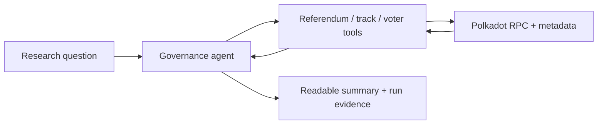
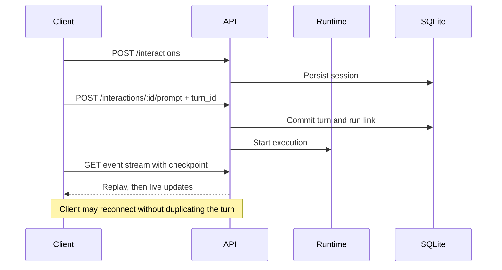

# Use cases

This guide starts with the problem you are trying to solve. Each use case
explains why Polkagent may fit, how to explore it, and which current limits
matter before you commit to an architecture.

## Fit at a glance

| Use case | Fit today | Recommended surface | Main caveat |
|---|---|---|---|
| Governance and treasury research | Good for local evaluation | CLI, chat, TUI | Live chain behavior still needs broader external validation |
| Durable internal assistant | Good for bounded local use | Chat, TUI, ACP | Rich content and all configuration controls are not shared across surfaces |
| Agent control-plane API | Promising, partial | REST + SSE/WebSocket | Some optional and principal-bound routes are deliberately unavailable |
| Approval-gated tool workflow | Bounded local path exists | Chat, TUI, ACP | Local authority tuple is not multi-user authentication |
| Agent behavior regression testing | Good at component level | `eval` CLI | Evals do not prove a production deployment or live chain action |
| Extension/package development | Good for lifecycle evaluation | `package` and `skill` CLI | Installed packages are not automatically activated at runtime |
| Autonomous value-moving agent | Not yet a fit | — | Real signing, submission, matching, finality, and recovery are not E2E proven |
| Multi-tenant, highly available cloud service | Not yet a fit | — | Tenant isolation, HA, production Postgres, and worker recovery remain open |

## Governance research assistant

### The problem

You want a repeatable way to investigate referenda, governance tracks, voting
history, delegations, and treasury state without teaching a generic agent the
Polkadot data model from scratch.

### Why Polkagent

Polkagent has Polkadot-specific domain types and governance/treasury tool
schemas. The intended flow keeps raw chain queries, model interpretation, and
durable execution evidence separate.



### Explore it

```bash
polkagent agent create gov-researcher \
  --model anthropic/claude-sonnet-4-6 \
  --description "Polkadot OpenGov research assistant"

polkagent run --agent-id gov-researcher --no-harness \
  --prompt "Explain the status, track, tally, and decision timeline for referendum 1234. Separate observed facts from interpretation."
```

Useful follow-ups in durable chat:

```text
Which facts came directly from chain state?
What assumptions did you make?
Compare the turnout with the last five referenda on the same track.
List the account addresses that should be independently verified.
```

### Caveats

Treat the result as research assistance, not authoritative chain state, until
you have confirmed the exact runtime, endpoint, block, and metadata used. Live
network coverage and end-to-end tool behavior are still being expanded.

## Treasury or staking operations dashboard

### The problem

An operator wants one terminal view of agents, runs, events, memory, audit
records, and pending approvals while asking questions about balances, staking,
vesting, transfers, or portfolio state.

### Why Polkagent

The ROSEDUST TUI combines monitoring tabs with a durable Console. The terminal
UI is useful in development and operator work where opening a web application
would add more machinery than value.

### Explore it

```bash
./scripts/demo.sh
```

The script seeds visibly synthetic records in an isolated demo database and
opens the TUI. See [the TUI demo](demo.md#demo-3-explore-the-tui-with-sample-data)
before using `--reset`.

For real prompts:

```bash
polkagent tui --tab console
```

Select an active agent, press `p` to compose, and use `x` to cancel the exact
active turn. The F6 approvals view is scoped to the conversation selected in
F9. With explicit local authority, F9 derives exact `/approve` and `/deny`
commands from that same ready F6 queue; it does not create a second approval
projection.

### Caveats

The TUI is not a remote operations console. Explicit approval authority is
process-scoped, and a bare/default TUI remains authority-unbound. Production
identity, pagination, and some cancellation boundaries remain open.

## Durable team or personal assistant

### The problem

You want conversations to survive process restarts, with stable agent/model
selection and links back to the runs that produced each answer.

### Why Polkagent

Durable chat stores the interaction, transcript, turn/run correlation, and
supported per-conversation settings in SQLite. The same interaction model is
used by terminal chat, TUI, HTTP, and ACP.

### Explore it

```bash
polkagent chat --agent researcher --title "Weekly governance review"
```

Within chat:

```text
/help
/status
/runs
/model
```

Copy the printed conversation ID, exit, and resume later:

```bash
polkagent chat --agent researcher --resume <CONVERSATION_ID>
```

### Caveats

Executor-backed context uses a bounded window of completed typed
user/assistant pairs. Contextual multi-turn history for string-only harnesses
is explicitly unsupported. Rich attachments and every provider/harness setting
are not yet available in all interaction surfaces.

## Editor-integrated assistant

### The problem

You want Zed or another ACP client to start and resume Polkagent sessions while
keeping ACP JSON-RPC separate from diagnostics.

### Why Polkagent

`polkagent acp` is an inbound ACP v1 stdio server. It maps each ACP session to a
durable Polkagent interaction, supports state-aware commands and selectors,
and keeps protocol stdout JSON-only.

### Explore it

Follow [ACP and Zed integration](acp-zed.md). The included example config is at
[`docs/examples/polkagent-zed-agent-server.json`](examples/polkagent-zed-agent-server.json).

### Caveats

Official SDK subprocess coverage is stronger than the current manual Zed
evidence. Session list/import, rich plans, MCP passthrough, shared identity, and
some editor UX remain open.

## Agent control-plane API

### The problem

Another service needs to create agents, start durable work, observe progress,
cancel it, and reconnect after a network interruption.

### Why Polkagent

The API provides resource-oriented agent/run endpoints and a newer durable
interaction surface. Interaction prompts accept caller-supplied turn IDs for
idempotency, and event consumers can replay from checkpoints.



Start with the [HTTP demo](demo.md#demo-4-call-polkagent-over-http), then use
the checked-in [OpenAPI 3.1 contract](../openapi.yaml) as the schema source.

### Caveats

Nine optional skill-mutation, audit, and registry routes plus authority-bound
approval routes can return `501` in the ordinary runtime composition. API keys
protect requests but do not yet provide the stable multi-principal approval
identity required for remote approval decisions.

## Human-approved tool execution

### The problem

An agent may propose external work, but a human must inspect and approve the
exact pending request before handler I/O begins.

### Why Polkagent

The approval coordinator persists scope, policy/tool/checkpoint digests, effect
identity, decision, attempt, and outcome. Local chat, TUI, and ACP can opt into
one explicit process-scoped authority.

### Explore it safely

1. Use a non-value-moving tool and a strict test policy.
2. Use a dedicated demo database.
3. Supply all three approval authority fields to an explicitly invoked local
   surface.
4. Inspect exact IDs and redacted arguments before approving.
5. Restart and verify the durable outcome from the same database.

See [Durable chat](chat.md) and [Safety](safety.md). Do not infer that the
approval path makes real on-chain writes production-ready.

### Caveats

The local tuple is an assertion by the process owner. It does not authenticate
multiple remote users. The full crash-boundary matrix, handler-I/O
cancellation, and broader security/observability closure remain active work.

## Evaluation and regression testing

### The problem

You need repeatable checks for refusal behavior, tool selection, or answer
quality as prompts, models, tools, and policies change.

### Why Polkagent

Eval suites are JSON fixtures with cases, assertions, optional judges, and
saved reports that can be compared for regressions.

```bash
polkagent eval run fixtures/evals/safety/suite.json \
  --output baseline-safety.json --details

# After a change:
polkagent eval run fixtures/evals/safety/suite.json \
  --output current-safety.json --details

polkagent eval compare baseline-safety.json current-safety.json
```

### Caveats

A passing fake-executor suite proves fixture and scoring behavior, not model
quality. A passing model suite proves only the cases, model, provider, and
configuration that were actually run.

## Local extension development

### The problem

You want versioned local installation, updates, history, rollback, and removal
for a plugin or product kit while the extension format evolves.

### Why Polkagent

The package CLI retains content and version history in a local store and has an
explicit development trust mode for unsigned local packages.

```bash
polkagent package --trust-policy development install ./my-plugin
polkagent package list
polkagent package get my-plugin
```

### Caveats

Development trust mode is a deliberate local-risk opt-in. Cryptographic
verification, sandbox enforcement, remote registry behavior, and install-to-
run activation are incomplete.

## Poor fits today

Polkagent should not currently be presented as:

- a proven autonomous wallet or signing service;
- a production-ready cross-chain transaction executor;
- a multi-tenant approval service with authenticated human identity;
- a highly available distributed agent cloud;
- a completed commercial extension marketplace;
- a substitute for independent verification of governance or financial data.

Those are roadmap directions with relevant building blocks, not current
end-to-end guarantees.

## Decide with evidence

Before adopting Polkagent for a consequential workflow, write down:

1. The exact surface you will use.
2. Whether every required component is composed on that surface.
3. Which external provider, harness, chain, signer, and store will be real.
4. The failure cases you need to recover from.
5. The identity and authorization model for every human decision.
6. The tests or artifacts that prove your intended path.

Compare that list with [`prd/STATUS.md`](../prd/STATUS.md) and the relevant
topic guide. This prevents a broad crate inventory from being mistaken for a
production guarantee.
